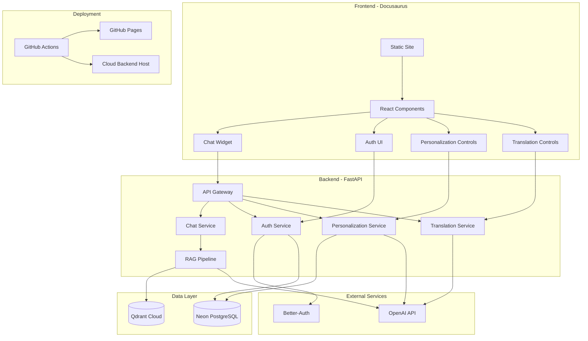
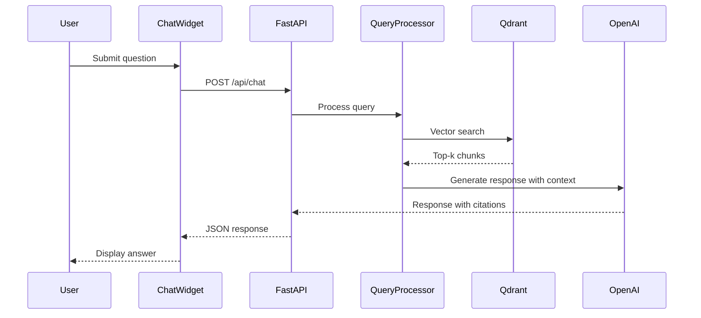

# Design Document

## Overview

This design document outlines the architecture and implementation approach for a Physical AI & Humanoid Robotics textbook platform. The system consists of a Docusaurus-based static site deployed to GitHub Pages, integrated with a RAG chatbot powered by OpenAI Agents SDK, FastAPI backend, Neon PostgreSQL for user data, and Qdrant Cloud for vector search. Bonus features include Better-Auth authentication, AI-powered content personalization, and Urdu translation.

## Architecture

The system follows a modern JAMstack architecture with serverless backend components:



## Components and Interfaces

### 1. Docusaurus Frontend

**Purpose:** Serve the textbook content as a static site with interactive features.

**Key Components:**
- `DocusaurusConfig`: Site configuration including theme, plugins, and navigation
- `ChatWidget`: React component for the embedded RAG chatbot
- `AuthProvider`: Context provider for authentication state
- `PersonalizeButton`: Component to trigger content personalization
- `TranslateButton`: Component to trigger Urdu translation
- `TextSelector`: Utility for capturing user-selected text for contextual questions

**Interfaces:**
```typescript
interface ChatWidgetProps {
  apiEndpoint: string;
  userId?: string;
  selectedText?: string;
}

interface AuthContextValue {
  user: User | null;
  isAuthenticated: boolean;
  login: (email: string, password: string) => Promise<void>;
  logout: () => Promise<void>;
  register: (data: RegistrationData) => Promise<void>;
}

interface PersonalizationProps {
  chapterId: string;
  userId: string;
  onPersonalize: (content: string) => void;
}

interface TranslationProps {
  chapterId: string;
  content: string;
  onTranslate: (translatedContent: string) => void;
}
```

### 2. FastAPI Backend

**Purpose:** Handle API requests for chat, authentication, personalization, and translation.

**Key Modules:**
- `main.py`: Application entry point with CORS and middleware configuration
- `routers/chat.py`: Chat endpoint handlers
- `routers/auth.py`: Authentication endpoint handlers
- `routers/personalize.py`: Personalization endpoint handlers
- `routers/translate.py`: Translation endpoint handlers
- `services/rag_service.py`: RAG pipeline implementation
- `services/embedding_service.py`: Text embedding generation
- `services/llm_service.py`: LLM interaction wrapper

**API Endpoints:**
```
POST /api/chat
  Request: { query: string, selectedText?: string, userId?: string }
  Response: { response: string, sources: Source[] }

POST /api/auth/register
  Request: { email: string, password: string, background: UserBackground }
  Response: { user: User, token: string }

POST /api/auth/login
  Request: { email: string, password: string }
  Response: { user: User, token: string }

POST /api/auth/logout
  Request: { token: string }
  Response: { success: boolean }

POST /api/personalize
  Request: { chapterId: string, userId: string }
  Response: { personalizedContent: string }

POST /api/translate
  Request: { chapterId: string, content: string }
  Response: { translatedContent: string }
```

### 3. RAG Pipeline

**Purpose:** Retrieve relevant content and generate contextual responses.

**Components:**
- `QueryProcessor`: Preprocesses user queries for embedding
- `VectorRetriever`: Searches Qdrant for similar content chunks
- `ContextBuilder`: Assembles retrieved chunks into coherent context
- `ResponseGenerator`: Uses OpenAI to generate responses with citations

**Flow:**


### 4. Content Indexing System

**Purpose:** Process and index book content for vector search.

**Components:**
- `ContentParser`: Extracts text from Markdown/MDX files
- `ChunkSplitter`: Splits content into semantic chunks with overlap
- `EmbeddingGenerator`: Creates vector embeddings using OpenAI
- `QdrantIndexer`: Uploads embeddings to Qdrant Cloud

**Indexing Strategy:**
- Chunk size: 500 tokens with 50 token overlap
- Metadata: chapter_id, section_title, page_url
- Re-indexing: Triggered on content changes via CI/CD

### 5. Authentication System (Better-Auth)

**Purpose:** Manage user registration, login, and session management.

**Components:**
- `BetterAuthProvider`: Server-side auth configuration
- `SessionManager`: JWT token handling
- `UserRepository`: Database operations for user data

**User Background Schema:**
```typescript
interface UserBackground {
  softwareExperience: 'beginner' | 'intermediate' | 'advanced';
  hardwareExperience: 'beginner' | 'intermediate' | 'advanced';
  programmingLanguages: string[];
  roboticsExperience: boolean;
  aiExperience: boolean;
}
```

### 6. Personalization Engine

**Purpose:** Adapt content complexity based on user background.

**Components:**
- `ProfileAnalyzer`: Evaluates user background for content adaptation
- `ContentAdapter`: Modifies explanations and examples based on experience level
- `CacheManager`: Stores personalized content for reuse

**Personalization Rules:**
- Beginner: Detailed explanations, basic examples, more analogies
- Intermediate: Standard explanations, practical examples
- Advanced: Concise explanations, complex examples, advanced topics highlighted

### 7. Translation Service

**Purpose:** Translate chapter content to Urdu.

**Components:**
- `TranslationEngine`: Interfaces with OpenAI for translation
- `TechnicalTermHandler`: Preserves and transliterates technical terms
- `RTLFormatter`: Applies right-to-left formatting
- `TranslationCache`: Stores translated content

## Data Models

### User Model
```typescript
interface User {
  id: string;
  email: string;
  passwordHash: string;
  background: UserBackground;
  createdAt: Date;
  updatedAt: Date;
}
```

### Chat Message Model
```typescript
interface ChatMessage {
  id: string;
  userId?: string;
  query: string;
  response: string;
  sources: Source[];
  selectedText?: string;
  timestamp: Date;
}

interface Source {
  chapterId: string;
  sectionTitle: string;
  pageUrl: string;
  relevanceScore: number;
}
```

### Content Chunk Model
```typescript
interface ContentChunk {
  id: string;
  chapterId: string;
  sectionTitle: string;
  content: string;
  embedding: number[];
  metadata: {
    pageUrl: string;
    position: number;
  };
}
```

### Personalized Content Model
```typescript
interface PersonalizedContent {
  id: string;
  userId: string;
  chapterId: string;
  originalContent: string;
  personalizedContent: string;
  experienceLevel: string;
  createdAt: Date;
}
```

### Translated Content Model
```typescript
interface TranslatedContent {
  id: string visibleChapterId: string;
  originalContent: string;
  translatedContent: string;
  language: 'ur';
  createdAt: Date;
}
```

## Database Schema (Neon PostgreSQL)

```sql
-- Users table
CREATE TABLE users (
  id UUID PRIMARY KEY DEFAULT gen_random_uuid(),
  email VARCHAR(255) UNIQUE NOT NULL,
  password_hash VARCHAR(255) NOT NULL,
  software_experience VARCHAR(20),
  hardware_experience VARCHAR(20),
  programming_languages TEXT[],
  robotics_experience BOOLEAN DEFAULT FALSE,
  ai_experience BOOLEAN DEFAULT FALSE,
  created_at TIMESTAMP DEFAULT NOW(),
  updated_at TIMESTAMP DEFAULT NOW()
);

-- Sessions table (for Better-Auth)
CREATE TABLE sessions (
  id UUID PRIMARY KEY DEFAULT gen_random_uuid(),
  user_id UUID REFERENCES users(id),
  token VARCHAR(255) UNIQUE NOT NULL,
  expires_at TIMESTAMP NOT NULL,
  created_at TIMESTAMP DEFAULT NOW()
);

-- Chat history table
CREATE TABLE chat_messages (
  id UUID PRIMARY KEY DEFAULT gen_random_uuid(),
  user_id UUID REFERENCES users(id),
  query TEXT NOT NULL,
  response TEXT NOT NULL,
  sources JSONB,
  selected_text TEXT,
  created_at TIMESTAMP DEFAULT NOW()
);

-- Personalized content cache
CREATE TABLE personalized_content (
  id UUID PRIMARY KEY DEFAULT gen_random_uuid(),
  user_id UUID REFERENCES users(id),
  chapter_id VARCHAR(100) NOT NULL,
  personalized_content TEXT NOT NULL,
  experience_level VARCHAR(20),
  created_at TIMESTAMP DEFAULT NOW(),
  UNIQUE(user_id, chapter_id)
);

-- Translated content cache
CREATE TABLE translated_content (
  id UUID PRIMARY KEY DEFAULT gen_random_uuid(),
  chapter_id VARCHAR(100) NOT NULL,
  translated_content TEXT NOT NULL,
  language VARCHAR(10) DEFAULT 'ur',
  created_at TIMESTAMP DEFAULT NOW(),
  UNIQUE(chapter_id, language)
);
```

## Correctness Properties

*A property is a characteristic or behavior that should hold true across all valid executions of a system-essentially, a formal statement about what the system should do. Properties serve as the bridge between human-readable specifications and machine-verifiable correctness guarantees.*

### Property 1: Navigation Consistency Across Pages
*For any* chapter page in the textbook, the page SHALL contain consistent navigation elements including sidebar, header, and footer components.
**Validates: Requirements 1.3**

### Property 2: Chapter Content Completeness
*For any* chapter in the textbook, the rendered content SHALL contain at least one of: text content, code examples, or diagrams.
**Validates: Requirements 2.2**

### Property 3: Sequential Chapter Navigation
*For any* chapter that is not the last chapter, the page SHALL contain a "next" navigation link pointing to the subsequent chapter in the defined order.
**Validates: Requirements 2.3**

### Property 4: Markdown Rendering Fidelity
*For any* markdown content with formatting (headers, lists, code blocks, links), the rendered HTML SHALL preserve the semantic structure of the original markdown.
**Validates: Requirements 2.4**

### Property 5: RAG Response Relevance with Citations
*For any* user query about book content, the chatbot response SHALL include at least one source citation referencing a chapter or section from the indexed content.
**Validates: Requirements 3.1, 3.3**

### Property 6: Selected Text Context Influence
*For any* query with user-selected text, the chatbot response SHALL demonstrate contextual relevance to the selected text by referencing concepts or terms from the selection.
**Validates: Requirements 3.2**

### Property 7: Content Indexing with Consistent Embeddings
*For any* published chapter content, the indexing system SHALL produce embeddings with consistent dimensions (1536 for OpenAI ada-002) stored in Qdrant.
**Validates: Requirements 4.1, 4.4**

### Property 8: Semantic Search Relevance
*For any* search query, the top-k returned chunks SHALL have similarity scores above a minimum threshold (0.7) indicating semantic relevance.
**Validates: Requirements 4.2**

### Property 9: API Response Format Validity
*For any* valid API request to the FastAPI backend, the response SHALL be valid JSON conforming to the defined response schema.
**Validates: Requirements 5.1**

### Property 10: Input Validation and Error Handling
*For any* API request with invalid or missing required parameters, the backend SHALL return an appropriate HTTP 4xx status code with a descriptive error message.
**Validates: Requirements 5.2, 5.3**

### Property 11: User Registration Data Persistence
*For any* successful user registration with background information, querying the database SHALL return the same email and background data that was submitted.
**Validates: Requirements 6.1, 6.5**

### Property 12: Authentication Token Lifecycle
*For any* user login followed by logout, the session token SHALL be valid after login and invalid after logout.
**Validates: Requirements 6.2, 6.3**

### Property 13: Secure Authentication Error Messages
*For any* failed authentication attempt (wrong password, non-existent user), the error message SHALL be generic and not reveal whether the email exists or the specific failure reason.
**Validates: Requirements 6.4**

### Property 14: Personalization Content Adaptation
*For any* user with defined background (beginner/intermediate/advanced) requesting personalization, the personalized content SHALL differ from the original while preserving all technical terms and core concepts.
**Validates: Requirements 7.1, 7.2**

### Property 15: Content Caching Round-Trip
*For any* personalized or translated content that is cached, retrieving the cached content SHALL return content equivalent to the originally generated content.
**Validates: Requirements 7.4, 8.4**

### Property 16: Urdu Translation Output Validity
*For any* chapter content submitted for translation, the output SHALL contain Urdu script characters (Unicode range 0600-06FF) and preserve technical terms in their original form or with transliteration.
**Validates: Requirements 8.1, 8.2**

### Property 17: RTL Formatting Application
*For any* translated Urdu content displayed in the UI, the container element SHALL have CSS direction property set to 'rtl'.
**Validates: Requirements 8.3**

## Error Handling

### Frontend Error Handling
- **Network Errors**: Display user-friendly message with retry option
- **Authentication Errors**: Redirect to login with preserved return URL
- **API Errors**: Show error message from backend with fallback generic message
- **Rendering Errors**: Error boundary components catch and display fallback UI

### Backend Error Handling
- **Validation Errors (400)**: Return field-specific error messages
- **Authentication Errors (401)**: Generic "Invalid credentials" message
- **Authorization Errors (403)**: "Access denied" with no detail leakage
- **Not Found Errors (404)**: Resource-specific not found messages
- **Server Errors (500)**: Log full error, return generic message to client

### Database Error Handling
- **Connection Failures**: Retry with exponential backoff, fail gracefully
- **Query Errors**: Log and return appropriate HTTP error
- **Constraint Violations**: Map to user-friendly validation messages

### External Service Error Handling
- **OpenAI API Errors**: Retry transient errors, fallback message for persistent failures
- **Qdrant Errors**: Return cached results if available, error message otherwise

## Testing Strategy

### Unit Testing Framework
- **Frontend**: Jest with React Testing Library
- **Backend**: pytest with pytest-asyncio for async tests
- **Coverage Target**: 80% for core business logic

### Property-Based Testing Framework
- **Backend**: Hypothesis (Python) for property-based tests
- **Configuration**: Minimum 100 iterations per property test
- **Annotation Format**: Each test annotated with `**Feature: physical-ai-textbook, Property {number}: {property_text}**`

### Unit Test Coverage
- Component rendering tests for React components
- API endpoint tests for all FastAPI routes
- Service layer tests for business logic
- Database repository tests with test database

### Property-Based Test Coverage
Each correctness property will have a corresponding property-based test:
- Property 1-4: Frontend rendering properties (Jest + custom matchers)
- Property 5-8: RAG pipeline properties (Hypothesis)
- Property 9-10: API validation properties (Hypothesis)
- Property 11-13: Authentication properties (Hypothesis)
- Property 14-17: Personalization/Translation properties (Hypothesis)

### Integration Testing
- End-to-end chat flow testing
- Authentication flow testing
- Content indexing pipeline testing

### Test Data Generation
- Hypothesis strategies for generating:
  - Valid/invalid user registration data
  - Various query types and lengths
  - Markdown content with different formatting
  - User background combinations

