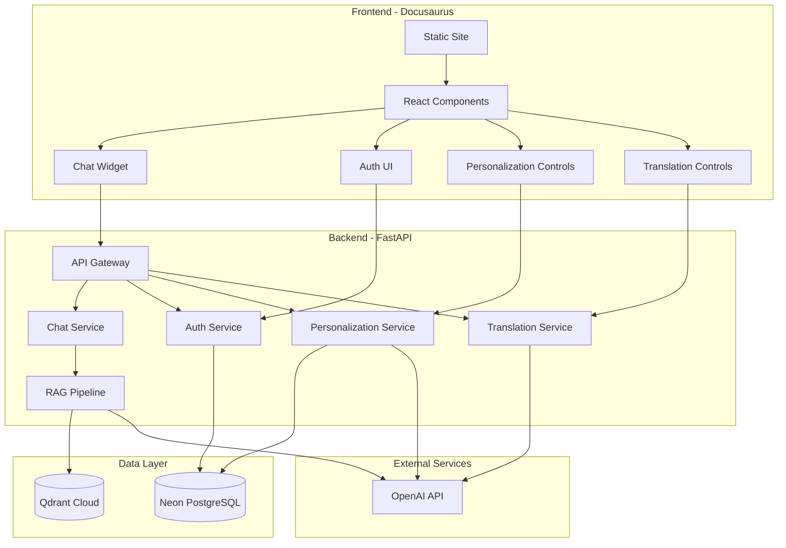
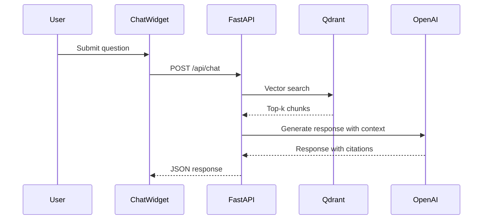

# Design Document

## Overview

This design document outlines the architecture for a Physical AI & Humanoid Robotics textbook platform. The system delivers a 13-week capstone curriculum covering six modules: Introduction to Physical AI, ROS 2, Digital Twin (Gazebo/Unity), NVIDIA Isaac, Humanoid Robot Development, and Vision-Language-Action. Built with Docusaurus for GitHub Pages, integrated with a RAG chatbot (FastAPI + Qdrant + OpenAI), Neon PostgreSQL for user data, and bonus features for authentication, personalization, and Urdu translation.

## Architecture



## Content Structure

### Module Organization (13 Weeks)

| Module | Weeks | Focus | Key Topics |
|--------|-------|-------|------------|
| 0 | 1-2 | Introduction to Physical AI | Embodied intelligence, humanoid landscape, sensors (LiDAR, cameras, IMUs, force/torque) |
| 1 | 3-5 | ROS 2 (Robotic Nervous System) | Nodes, topics, services, actions, rclpy, URDF, launch files |
| 2 | 6-7 | Digital Twin (Gazebo & Unity) | Physics simulation, URDF/SDF, sensor simulation, Unity visualization |
| 3 | 8-10 | NVIDIA Isaac (AI-Robot Brain) | Isaac Sim, synthetic data, VSLAM, Nav2, reinforcement learning, sim-to-real |
| 4 | 11-12 | Humanoid Robot Development | Kinematics, bipedal locomotion, manipulation, grasping, HRI design |
| 5 | 13 | VLA & Conversational Robotics | Whisper, GPT integration, LLM-to-ROS2 actions, multi-modal interaction |

### Capstone Project: Autonomous Humanoid
A simulated robot that: receives voice commands → plans path → navigates obstacles → identifies objects → manipulates objects.

## Components and Interfaces

### 1. Docusaurus Frontend

**Key Components:**
- `DocusaurusConfig`: Site configuration with theme, plugins, navigation
- `ChatWidget`: RAG chatbot React component
- `AuthProvider`: Authentication state context
- `PersonalizeButton`: Content personalization trigger
- `TranslateButton`: Urdu translation trigger

```typescript
interface ChatWidgetProps {
  apiEndpoint: string;
  userId?: string;
  selectedText?: string;
}

interface AuthContextValue {
  user: User | null;
  isAuthenticated: boolean;
  login: (email: string, password: string) => Promise<void>;
  logout: () => Promise<void>;
  register: (data: RegistrationData) => Promise<void>;
}
```

### 2. FastAPI Backend

**API Endpoints:**
```
POST /api/chat          - RAG chatbot queries
POST /api/auth/register - User registration with background
POST /api/auth/login    - User login
POST /api/auth/logout   - Session invalidation
POST /api/personalize   - Content personalization
POST /api/translate     - Urdu translation
```

### 3. RAG Pipeline



### 4. Content Indexing
- Chunk size: 500 tokens with 50 token overlap
- Metadata: chapter_id, section_title, page_url, module_number
- Embedding: OpenAI ada-002 (1536 dimensions)

## Data Models

```typescript
interface User {
  id: string;
  email: string;
  passwordHash: string;
  background: UserBackground;
  createdAt: Date;
}

interface UserBackground {
  softwareExperience: 'beginner' | 'intermediate' | 'advanced';
  hardwareExperience: 'beginner' | 'intermediate' | 'advanced';
  programmingLanguages: string[];
  roboticsExperience: boolean;
}

interface ContentChunk {
  id: string;
  chapterId: string;
  moduleNumber: number;
  content: string;
  embedding: number[];
  metadata: { pageUrl: string; position: number; };
}
```

## Database Schema (Neon PostgreSQL)

```sql
CREATE TABLE users (
  id UUID PRIMARY KEY DEFAULT gen_random_uuid(),
  email VARCHAR(255) UNIQUE NOT NULL,
  password_hash VARCHAR(255) NOT NULL,
  software_experience VARCHAR(20),
  hardware_experience VARCHAR(20),
  programming_languages TEXT[],
  robotics_experience BOOLEAN DEFAULT FALSE,
  created_at TIMESTAMP DEFAULT NOW()
);

CREATE TABLE sessions (
  id UUID PRIMARY KEY DEFAULT gen_random_uuid(),
  user_id UUID REFERENCES users(id),
  token VARCHAR(255) UNIQUE NOT NULL,
  expires_at TIMESTAMP NOT NULL
);

CREATE TABLE chat_messages (
  id UUID PRIMARY KEY DEFAULT gen_random_uuid(),
  user_id UUID REFERENCES users(id),
  query TEXT NOT NULL,
  response TEXT NOT NULL,
  sources JSONB,
  created_at TIMESTAMP DEFAULT NOW()
);

CREATE TABLE personalized_content (
  id UUID PRIMARY KEY DEFAULT gen_random_uuid(),
  user_id UUID REFERENCES users(id),
  chapter_id VARCHAR(100) NOT NULL,
  personalized_content TEXT NOT NULL,
  UNIQUE(user_id, chapter_id)
);

CREATE TABLE translated_content (
  id UUID PRIMARY KEY DEFAULT gen_random_uuid(),
  chapter_id VARCHAR(100) NOT NULL,
  translated_content TEXT NOT NULL,
  language VARCHAR(10) DEFAULT 'ur',
  UNIQUE(chapter_id, language)
);
```

## Correctness Properties

*A property is a characteristic or behavior that should hold true across all valid executions of a system-essentially, a formal statement about what the system should do. Properties serve as the bridge between human-readable specifications and machine-verifiable correctness guarantees.*

### Property 1: Navigation Consistency Across Pages
*For any* chapter page in the textbook, the page SHALL contain consistent navigation elements including sidebar, header, and footer components.
**Validates: Requirements 1.3**

### Property 2: Chapter Content Completeness
*For any* chapter in the textbook, the rendered content SHALL contain at least one of: text content, code examples, or diagrams.
**Validates: Requirements 2.2**

### Property 3: Sequential Chapter Navigation
*For any* chapter that is not the last chapter, the page SHALL contain a "next" navigation link pointing to the subsequent chapter.
**Validates: Requirements 2.3**

### Property 4: Markdown Rendering Fidelity
*For any* markdown content with formatting (headers, lists, code blocks, links), the rendered HTML SHALL preserve the semantic structure.
**Validates: Requirements 2.4**

### Property 5: RAG Response Relevance with Citations
*For any* user query about book content, the chatbot response SHALL include at least one source citation referencing a chapter or section.
**Validates: Requirements 13.1, 13.3**

### Property 6: Selected Text Context Influence
*For any* query with user-selected text, the chatbot response SHALL demonstrate contextual relevance to the selected text.
**Validates: Requirements 13.2**

### Property 7: Content Indexing with Consistent Embeddings
*For any* published chapter content, the indexing system SHALL produce embeddings with consistent dimensions (1536).
**Validates: Requirements 14.1, 14.4**

### Property 8: Semantic Search Relevance
*For any* search query, the top-k returned chunks SHALL have similarity scores above minimum threshold (0.7).
**Validates: Requirements 14.2**

### Property 9: API Response Format Validity
*For any* valid API request to the FastAPI backend, the response SHALL be valid JSON conforming to the defined schema.
**Validates: Requirements 15.1**

### Property 10: Input Validation and Error Handling
*For any* API request with invalid or missing required parameters, the backend SHALL return appropriate HTTP 4xx status code.
**Validates: Requirements 15.2, 15.3**

### Property 11: User Registration Data Persistence
*For any* successful user registration, querying the database SHALL return the same email and background data submitted.
**Validates: Requirements 16.1, 16.5**

### Property 12: Authentication Token Lifecycle
*For any* user login followed by logout, the session token SHALL be valid after login and invalid after logout.
**Validates: Requirements 16.2, 16.3**

### Property 13: Secure Authentication Error Messages
*For any* failed authentication attempt, the error message SHALL be generic and not reveal security details.
**Validates: Requirements 16.4**

### Property 14: Personalization Content Adaptation
*For any* user with defined background requesting personalization, the personalized content SHALL differ from original while preserving technical terms.
**Validates: Requirements 17.1, 17.2**

### Property 15: Content Caching Round-Trip
*For any* personalized or translated content that is cached, retrieving the cached content SHALL return equivalent content.
**Validates: Requirements 17.4, 18.4**

### Property 16: Urdu Translation Output Validity
*For any* chapter content submitted for translation, the output SHALL contain Urdu script characters (Unicode 0600-06FF).
**Validates: Requirements 18.1, 18.2**

### Property 17: RTL Formatting Application
*For any* translated Urdu content displayed in the UI, the container element SHALL have CSS direction property set to 'rtl'.
**Validates: Requirements 18.3**

## Error Handling

- **Frontend**: Network errors show retry option, auth errors redirect to login
- **Backend**: 400 for validation, 401 for auth, 403 for authorization, 500 logged with generic message
- **External Services**: Retry transient errors, fallback messages for persistent failures

## Testing Strategy

### Frameworks
- **Frontend**: Jest with React Testing Library
- **Backend**: pytest with pytest-asyncio, Hypothesis for property-based tests
- **Configuration**: Minimum 100 iterations per property test
- **Annotation**: `**Feature: physical-ai-textbook, Property {number}: {property_text}**`

### Coverage
- Property 1-4: Frontend rendering (Jest)
- Property 5-8: RAG pipeline (Hypothesis)
- Property 9-10: API validation (Hypothesis)
- Property 11-13: Authentication (Hypothesis)
- Property 14-17: Personalization/Translation (Hypothesis)
