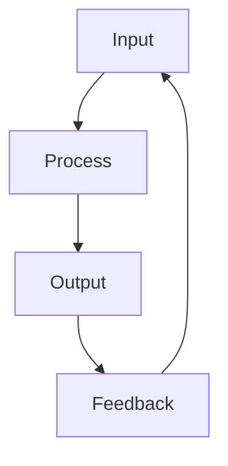
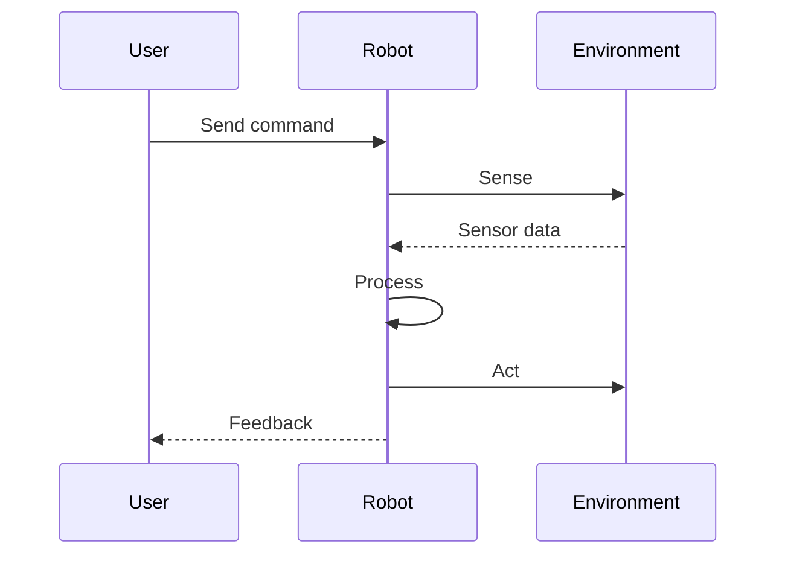

# Chapter Title

Brief introduction to the chapter topic and what readers will learn.

## Learning Objectives

By the end of this chapter, you will be able to:
- Objective 1
- Objective 2
- Objective 3

## Section 1: Main Concept

Explanation of the main concept with supporting details.

### Subsection with Diagram



### Subsection with Table

| Column 1 | Column 2 | Column 3 |
|----------|----------|----------|
| Data 1   | Data 2   | Data 3   |
| Data 4   | Data 5   | Data 6   |

## Section 2: Code Examples

### Python Example

```python
class ExampleClass:
    """Example class demonstrating code syntax highlighting."""

    def __init__(self, value: int):
        self.value = value

    def process(self) -> int:
        """Process the value and return result."""
        return self.value * 2

# Usage example
example = ExampleClass(42)
result = example.process()
print(f"Result: {result}")
```

### Bash Example

```bash
# Example shell commands
echo "Hello, Physical AI!"
python -m robot_project.main
```

### JSON Configuration Example

```json
{
  "robot": {
    "name": "example-bot",
    "sensors": ["camera", "lidar", "imu"],
    "enabled": true
  }
}
```

## Section 3: Sequence Diagram



## Section 4: Key Concepts

:::tip Key Takeaway
Important concept that readers should remember from this chapter.
:::

:::note
Additional information or clarification about a topic.
:::

:::caution
Warning about common mistakes or important considerations.
:::

## Summary

- Key point 1 from this chapter
- Key point 2 from this chapter
- Key point 3 from this chapter

## Further Reading

- [Resource 1](https://example.com)
- [Resource 2](https://example.com)

---

**Next Chapter:** [Next Chapter Title](/path/to/next-chapter)
