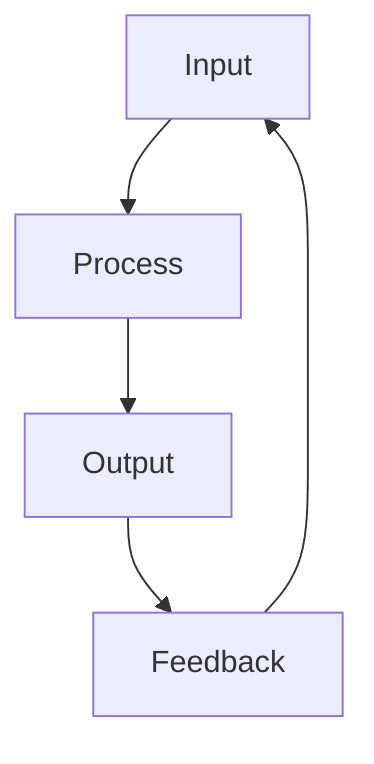

import { ChapterPersonalizeButton } from '@site/src/components/PersonalizationControls';
import { ChapterTranslateButton } from '@site/src/components/TranslationControls';

<div style={{display: 'flex', gap: '10px', marginBottom: '20px'}}>
  <ChapterPersonalizeButton chapterId="chapter-id" />
  <ChapterTranslateButton chapterId="chapter-id" />
</div>

# Chapter Title

> **Estimated Time:** XX minutes | **Difficulty:** Beginner/Intermediate/Advanced

Brief introduction to the chapter topic and what readers will learn.

:::info What You'll Build
By the end of this chapter, you'll have [specific outcome or project].
:::

## Learning Objectives

By the end of this chapter, you will be able to:
- Objective 1 (use action verbs: explain, implement, design, analyze)
- Objective 2
- Objective 3

## Section 1: Main Concept

Explanation of the main concept with supporting details.

### Subsection with Diagram



### Subsection with Table

| Column 1 | Column 2 | Column 3 |
|----------|----------|----------|
| Data 1   | Data 2   | Data 3   |
| Data 4   | Data 5   | Data 6   |

## Section 2: Code Examples

### Python Example

```python
class ExampleClass:
    """Example class demonstrating code syntax highlighting."""

    def __init__(self, value: int):
        self.value = value

    def process(self) -> int:
        """Process the value and return result."""
        return self.value * 2

# Usage example
example = ExampleClass(42)
result = example.process()
print(f"Result: {result}")
```

## Section 3: Key Concepts

<div className="key-takeaway">

Important concept that readers should remember from this chapter. This styled box highlights critical insights using the Educative-style blue box format.

</div>

:::note
Additional information or clarification about a topic.
:::

:::caution
Warning about common mistakes or important considerations.
:::

<div className="hands-on-exercise">

#### Exercise: Hands-on Practice

In this exercise, you'll apply what you learned.

**Step 1:** Do the first thing
```bash
example command
```

**Step 2:** Do the second thing

**Step 3:** Verify the result

<div className="expected-output">
Expected output goes here
</div>

</div>

<div className="knowledge-check">

<div className="question">
<span className="question-number">Q1.</span> Sample question about the chapter content?
<div className="options">

- A) Wrong answer
- B) Correct answer ✓
- C) Wrong answer
- D) Wrong answer

</div>
</div>

<div className="question">
<span className="question-number">Q2.</span> Another question?
<div className="options">

- A) Option A
- B) Option B ✓
- C) Option C

</div>
</div>

</div>

<div className="chapter-summary">

**What you learned:**
- Key point 1 from this chapter
- Key point 2 from this chapter
- Key point 3 from this chapter

<a href="/path/to/next-chapter" className="next-chapter">
  Next: Next Chapter Title →
</a>

</div>

## Further Reading

- [Resource 1](https://example.com)
- [Resource 2](https://example.com)
