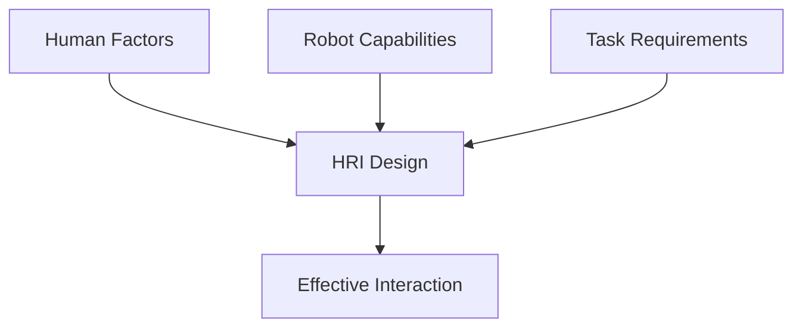
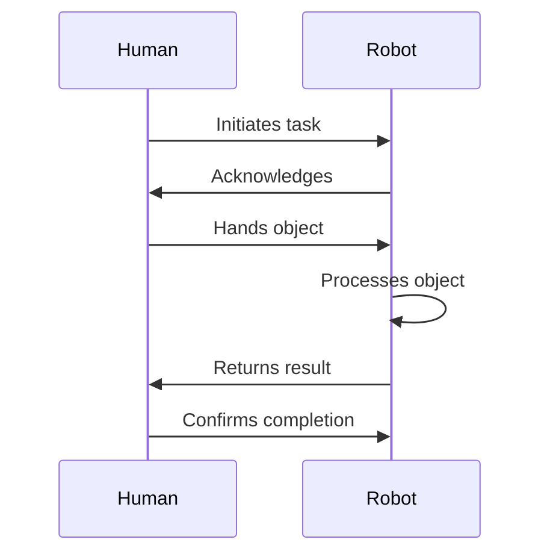
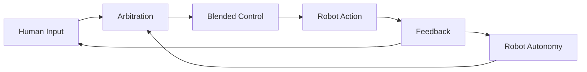

# Human-Robot Interaction

Human-Robot Interaction (HRI) studies how humans and robots communicate, collaborate, and coexist effectively.

## Learning Objectives

By the end of this chapter, you will be able to:
- Apply key HRI design principles for effective interaction
- Implement verbal and non-verbal communication modalities
- Design collaborative human-robot workflows
- Measure and build trust in human-robot systems
- Evaluate HRI systems using appropriate metrics

## Principles of HRI

### Design Considerations



### Key Principles
1. **Safety First**: Physical and psychological safety
2. **Transparency**: Clear robot intentions
3. **Predictability**: Consistent behavior
4. **Adaptability**: Adjusting to user needs

## Communication Modalities

### Verbal Communication
- Speech recognition and synthesis
- Natural language understanding
- Conversational agents

### Non-Verbal Communication

#### Gestures
```python
class GestureController:
    def __init__(self, robot_arm):
        self.arm = robot_arm
        self.gestures = {
            'wave': self._wave_motion,
            'point': self._point_motion,
            'nod': self._nod_motion
        }

    def perform_gesture(self, gesture_name: str, target=None):
        """Execute a predefined gesture."""
        if gesture_name in self.gestures:
            return self.gestures[gesture_name](target)
        raise ValueError(f"Unknown gesture: {gesture_name}")

    def _wave_motion(self, target=None):
        # Wave hand side to side
        pass

    def _point_motion(self, target):
        # Point toward target location
        pass
```

#### Gaze and Attention
- Eye contact for engagement
- Gaze direction for reference
- Attention cues

#### Facial Expressions
- Emotional display
- Social signals
- Feedback mechanisms

## Collaboration Patterns

### Shared Workspace



### Role Distribution
- Leader-follower dynamics
- Peer collaboration
- Supervisory control

## Trust and Acceptance

### Building Trust
- Consistent performance
- Transparent decision-making
- Graceful error handling

### Factors Affecting Acceptance
| Factor | Impact |
|--------|--------|
| Reliability | High |
| Appearance | Medium |
| Autonomy level | Variable |
| Prior experience | High |

## Social Robotics

### Emotional Intelligence
- Recognizing human emotions
- Appropriate emotional responses
- Empathetic behavior

### Cultural Considerations
- Personal space norms
- Communication styles
- Social expectations

## Evaluation Methods

### Metrics
- Task completion rate
- User satisfaction
- Cognitive load
- Trust measures

### Study Design
- Wizard-of-Oz studies
- Controlled experiments
- Field deployments

## Intent Recognition

Understanding human intentions for proactive assistance:

```python
class IntentPredictor:
    """Predict human intent from observations."""

    def __init__(self, action_vocabulary: list):
        self.actions = action_vocabulary
        self.history_length = 10
        self.observation_history = []

    def update(self, observation: dict):
        """Add new observation to history."""
        self.observation_history.append(observation)
        if len(self.observation_history) > self.history_length:
            self.observation_history.pop(0)

    def predict_intent(self) -> dict:
        """
        Predict likely human intent from observation history.

        Returns:
            Dictionary with intent probabilities
        """
        if len(self.observation_history) < 3:
            return {'unknown': 1.0}

        # Extract features from history
        features = self._extract_features()

        # Simple rule-based prediction (use ML in practice)
        intents = {}

        # Check for reaching motion
        if self._is_reaching_motion(features):
            intents['pick_object'] = 0.7
            intents['point'] = 0.2

        # Check for walking toward robot
        if self._is_approaching(features):
            intents['request_help'] = 0.6
            intents['handover'] = 0.3

        return intents if intents else {'unknown': 1.0}

    def _extract_features(self) -> dict:
        """Extract motion features from history."""
        positions = [obs.get('hand_position')
                    for obs in self.observation_history]
        velocities = np.diff(positions, axis=0)

        return {
            'mean_velocity': np.mean(velocities, axis=0),
            'direction': velocities[-1] if len(velocities) > 0 else None
        }
```

## Shared Autonomy

Blending human and robot control:



### Control Blending

```python
class SharedAutonomyController:
    """Blend human teleoperation with robot autonomy."""

    def __init__(self, autonomy_weight: float = 0.5):
        self.alpha = autonomy_weight  # 0 = full human, 1 = full autonomy

    def blend_commands(self, human_cmd: np.ndarray,
                       robot_cmd: np.ndarray,
                       confidence: float = None) -> np.ndarray:
        """
        Blend human and robot commands.

        Args:
            human_cmd: Human teleoperation command
            robot_cmd: Robot's autonomous suggestion
            confidence: Robot's confidence in its suggestion

        Returns:
            Blended command
        """
        # Adjust weight based on robot confidence
        if confidence is not None:
            alpha = self.alpha * confidence
        else:
            alpha = self.alpha

        # Linear blending
        blended = (1 - alpha) * human_cmd + alpha * robot_cmd

        return blended

    def adaptive_assistance(self, human_cmd: np.ndarray,
                           goal: np.ndarray,
                           current_state: np.ndarray) -> np.ndarray:
        """
        Provide adaptive assistance toward inferred goal.
        """
        # Compute direction to goal
        goal_direction = goal - current_state
        goal_direction = goal_direction / (np.linalg.norm(goal_direction) + 1e-6)

        # Check if human is moving toward goal
        human_direction = human_cmd / (np.linalg.norm(human_cmd) + 1e-6)
        alignment = np.dot(human_direction, goal_direction)

        # Assist more when aligned with goal
        assistance_level = max(0, alignment) * self.alpha

        return human_cmd + assistance_level * goal_direction
```

## Legibility and Predictability

Making robot behavior understandable:

| Concept | Definition | Example |
|---------|------------|---------|
| Legibility | Actions reveal intent | Exaggerated reaching motion |
| Predictability | Actions match expectations | Consistent movement patterns |
| Transparency | Explain decisions | "I'm avoiding the obstacle" |

### Legible Motion Planning

```python
class LegiblePlanner:
    """Generate legible robot motions that reveal intent."""

    def __init__(self, goals: list):
        self.possible_goals = goals

    def plan_legible_path(self, start: np.ndarray,
                          true_goal: np.ndarray) -> list:
        """
        Plan a path that clearly indicates the true goal.

        The path should be distinguishable from paths to other goals.
        """
        # Standard path to true goal
        direct_path = self._plan_direct(start, true_goal)

        # Paths to alternative goals
        alt_paths = [self._plan_direct(start, g)
                    for g in self.possible_goals if not np.allclose(g, true_goal)]

        # Modify path to maximize distinguishability early
        legible_path = self._optimize_legibility(
            direct_path, alt_paths, true_goal
        )

        return legible_path
```

## Affective Computing

Recognizing and responding to emotions:

```python
class EmotionRecognizer:
    """Recognize human emotions for adaptive interaction."""

    def __init__(self):
        self.emotion_labels = [
            'neutral', 'happy', 'sad', 'angry',
            'surprised', 'fearful', 'disgusted'
        ]

    def recognize_from_face(self, face_image: np.ndarray) -> dict:
        """
        Recognize emotion from facial expression.

        Returns:
            Dictionary of emotion probabilities
        """
        # In practice, use a trained CNN model
        # This is a placeholder structure
        features = self._extract_facial_features(face_image)
        probabilities = self._classify_emotion(features)

        return dict(zip(self.emotion_labels, probabilities))

    def adapt_behavior(self, emotion: str) -> dict:
        """
        Suggest behavior adaptations based on detected emotion.
        """
        adaptations = {
            'angry': {'speed': 0.5, 'distance': 1.5, 'tone': 'calm'},
            'fearful': {'speed': 0.3, 'distance': 2.0, 'tone': 'reassuring'},
            'happy': {'speed': 1.0, 'distance': 1.0, 'tone': 'friendly'},
            'sad': {'speed': 0.7, 'distance': 1.2, 'tone': 'gentle'},
        }
        return adaptations.get(emotion, {'speed': 1.0, 'distance': 1.0, 'tone': 'neutral'})
```

## Summary

Effective human-robot interaction requires careful attention to communication, safety, and social dynamics. Key points:

- HRI design must consider safety, transparency, and adaptability
- Multiple communication modalities enhance interaction richness
- Trust is built through consistent, reliable robot behavior
- Shared autonomy blends human and robot capabilities
- Evaluation requires both objective metrics and subjective measures

:::tip Key Takeaway
Successful HRI is not just about robot capability—it's about designing interactions that feel natural, safe, and trustworthy to humans.
:::

## Further Reading

- Goodrich, M. A., & Schultz, A. C. (2007). Human-Robot Interaction: A Survey
- Bartneck, C., et al. (2020). Human-Robot Interaction: An Introduction

---

**Next Chapter:** [Safety and Ethics in Physical AI](/advanced/safety-ethics)
