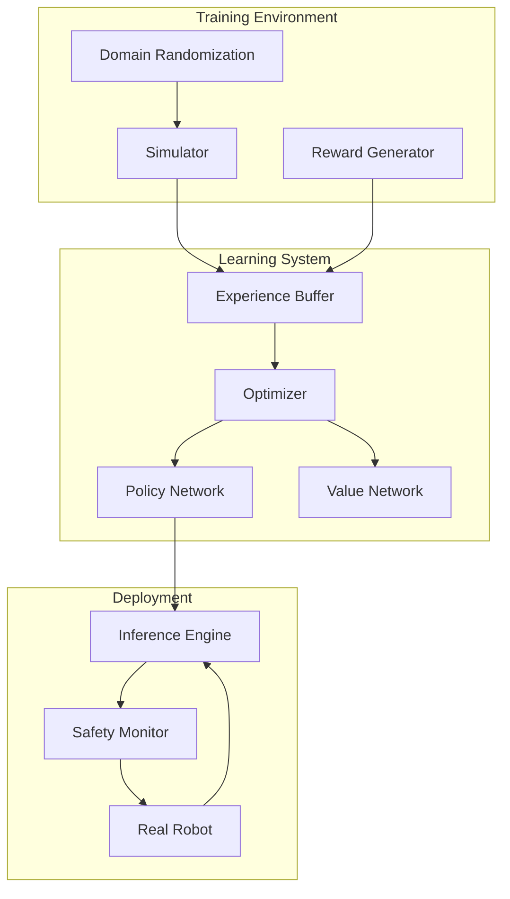
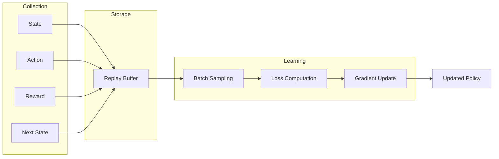
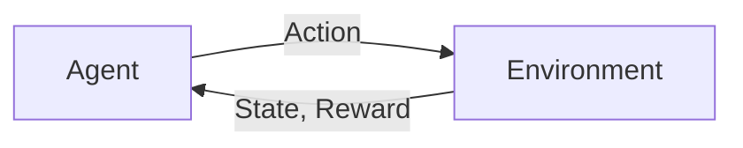
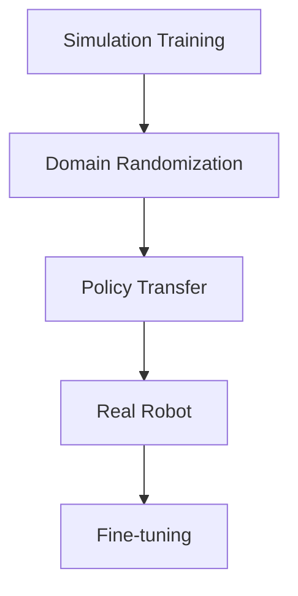
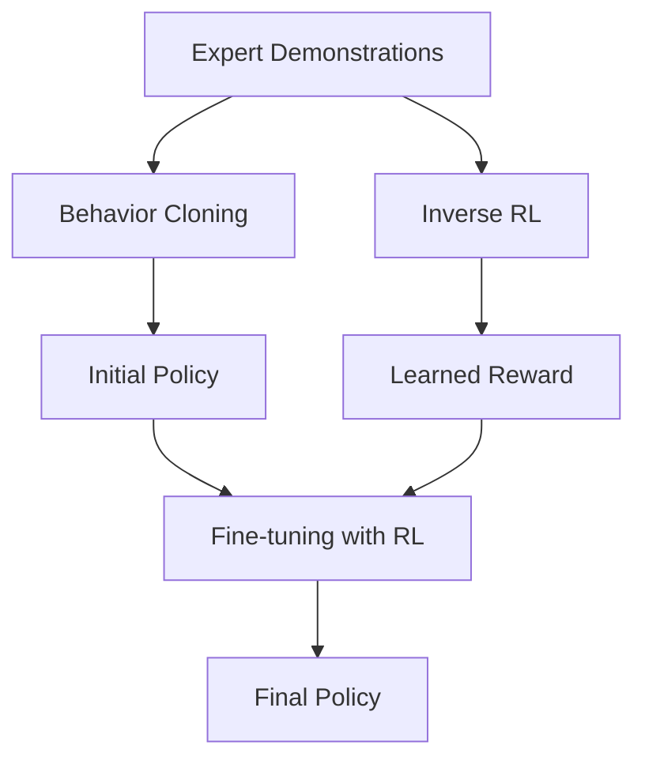

import { ChapterPersonalizeButton } from '@site/src/components/PersonalizationControls';
import { ChapterTranslateButton } from '@site/src/components/TranslationControls';

<div style={{display: 'flex', gap: '10px', marginBottom: '20px'}}>
  <ChapterPersonalizeButton chapterId="advanced-reinforcement-learning" />
  <ChapterTranslateButton chapterId="advanced-reinforcement-learning" />
</div>

# Reinforcement Learning for Robotics

Reinforcement Learning (RL) enables robots to learn behaviors through trial and error, discovering optimal actions through interaction with their environment.

## Learning Objectives

By the end of this chapter, you will be able to:
- Formulate robotics problems as Markov Decision Processes
- Implement value-based methods like Q-learning
- Understand policy gradient and actor-critic methods
- Apply deep RL algorithms (DQN, PPO) to robotics tasks
- Address sim-to-real transfer challenges

## RL System Architecture for Robotics

A complete RL system for robotics integrates simulation, training, and deployment:



### RL Training Data Flow



## RL Fundamentals



### Key Components
- **State (s)**: Current situation
- **Action (a)**: What the robot does
- **Reward (r)**: Feedback signal
- **Policy (π)**: Action selection strategy

## Markov Decision Processes

The mathematical framework for RL:

### Bellman Equation
```
V(s) = max_a [R(s,a) + γ Σ P(s'|s,a) V(s')]
```

Where:
- V(s): Value of state s
- R(s,a): Immediate reward
- γ: Discount factor
- P(s'|s,a): Transition probability

## Policy Learning Methods

### Value-Based Methods

#### Q-Learning
```python
class QLearning:
    def __init__(self, states: int, actions: int,
                 learning_rate: float = 0.1,
                 discount: float = 0.99):
        self.q_table = np.zeros((states, actions))
        self.lr = learning_rate
        self.gamma = discount

    def update(self, state: int, action: int,
               reward: float, next_state: int):
        """Update Q-value using Bellman equation."""
        best_next = np.max(self.q_table[next_state])
        td_target = reward + self.gamma * best_next
        td_error = td_target - self.q_table[state, action]
        self.q_table[state, action] += self.lr * td_error

    def select_action(self, state: int, epsilon: float = 0.1) -> int:
        """Epsilon-greedy action selection."""
        if np.random.random() < epsilon:
            return np.random.randint(self.q_table.shape[1])
        return np.argmax(self.q_table[state])
```

### Policy Gradient Methods

#### REINFORCE Algorithm
Direct policy optimization using gradient ascent.

#### Actor-Critic
Combines value estimation with policy learning.

## Deep Reinforcement Learning

### Deep Q-Networks (DQN)
- Neural network approximates Q-function
- Experience replay for stability
- Target networks for training

### Proximal Policy Optimization (PPO)
- State-of-the-art policy gradient method
- Stable training with clipped objectives
- Widely used in robotics

## Sim-to-Real Transfer

Training in simulation and deploying to real robots:



### Challenges
- Reality gap
- Sensor differences
- Physical dynamics mismatch

### Solutions
- Domain randomization
- System identification
- Progressive training

## Applications in Robotics

| Task | RL Approach |
|------|-------------|
| Locomotion | PPO, SAC |
| Manipulation | DDPG, TD3 |
| Navigation | DQN, A3C |

## Reward Engineering

Designing effective reward functions is critical:

```python
class ManipulationReward:
    """Reward function for robotic manipulation tasks."""

    def __init__(self, target_position: np.ndarray):
        self.target = target_position
        self.success_threshold = 0.05  # 5cm

    def compute(self, state: dict) -> tuple:
        """
        Compute reward for current state.

        Returns:
            (reward, done) tuple
        """
        gripper_pos = state['gripper_position']
        object_pos = state['object_position']

        # Distance-based shaping reward
        dist_to_object = np.linalg.norm(gripper_pos - object_pos)
        dist_to_target = np.linalg.norm(object_pos - self.target)

        # Reward components
        reaching_reward = -0.1 * dist_to_object
        placement_reward = -0.5 * dist_to_target

        # Success bonus
        success = dist_to_target < self.success_threshold
        success_reward = 10.0 if success else 0.0

        # Penalties
        action_penalty = -0.01 * np.linalg.norm(state['action'])

        total_reward = (reaching_reward + placement_reward +
                       success_reward + action_penalty)

        return total_reward, success
```

### Common Reward Pitfalls

| Pitfall | Problem | Solution |
|---------|---------|----------|
| Sparse rewards | Slow learning | Reward shaping |
| Reward hacking | Unintended behavior | Careful design |
| Local optima | Suboptimal policy | Exploration bonus |

## Exploration Strategies

Balancing exploration and exploitation:

```python
class ExplorationStrategy:
    """Different exploration strategies for RL."""

    @staticmethod
    def epsilon_greedy(q_values: np.ndarray,
                       epsilon: float) -> int:
        """Epsilon-greedy action selection."""
        if np.random.random() < epsilon:
            return np.random.randint(len(q_values))
        return np.argmax(q_values)

    @staticmethod
    def boltzmann(q_values: np.ndarray,
                  temperature: float) -> int:
        """Softmax/Boltzmann exploration."""
        exp_q = np.exp(q_values / temperature)
        probs = exp_q / np.sum(exp_q)
        return np.random.choice(len(q_values), p=probs)

    @staticmethod
    def ucb(q_values: np.ndarray,
            visit_counts: np.ndarray,
            c: float = 2.0) -> int:
        """Upper Confidence Bound exploration."""
        total_visits = np.sum(visit_counts)
        ucb_values = q_values + c * np.sqrt(
            np.log(total_visits + 1) / (visit_counts + 1)
        )
        return np.argmax(ucb_values)
```

## Imitation Learning

Learning from demonstrations:



### Behavior Cloning

```python
class BehaviorCloning:
    """Learn policy from expert demonstrations."""

    def __init__(self, state_dim: int, action_dim: int):
        self.model = self._build_network(state_dim, action_dim)

    def train(self, demonstrations: list, epochs: int = 100):
        """
        Train policy to mimic expert actions.

        Args:
            demonstrations: List of (state, action) pairs
        """
        states = np.array([d[0] for d in demonstrations])
        actions = np.array([d[1] for d in demonstrations])

        self.model.fit(states, actions, epochs=epochs,
                      validation_split=0.1)

    def predict(self, state: np.ndarray) -> np.ndarray:
        """Predict action for given state."""
        return self.model.predict(state[np.newaxis])[0]
```

## Safe Reinforcement Learning

Ensuring safety during learning:

### Constrained RL
- Define safety constraints
- Optimize reward subject to constraints
- Lagrangian methods

### Safe Exploration
```python
class SafeExplorer:
    """Safe exploration with constraint checking."""

    def __init__(self, safety_model, constraint_threshold: float):
        self.safety_model = safety_model
        self.threshold = constraint_threshold

    def is_safe_action(self, state: np.ndarray,
                       action: np.ndarray) -> bool:
        """Check if action is safe from current state."""
        # Predict safety score
        safety_score = self.safety_model.predict(state, action)
        return safety_score > self.threshold

    def get_safe_action(self, state: np.ndarray,
                        policy, num_samples: int = 10) -> np.ndarray:
        """Sample actions until a safe one is found."""
        for _ in range(num_samples):
            action = policy.sample(state)
            if self.is_safe_action(state, action):
                return action

        # Fallback to safe default action
        return self.get_default_safe_action(state)
```

:::caution Important
Real robot learning requires safety mechanisms. Never deploy untested RL policies on physical hardware without proper safeguards.
:::

## Summary

Reinforcement learning provides a powerful framework for robots to learn complex behaviors through experience. Key points:

- MDPs formalize the RL problem for robotics
- Value-based and policy gradient methods offer different tradeoffs
- Deep RL enables learning from high-dimensional observations
- Sim-to-real transfer bridges the gap between simulation and reality
- Safety considerations are critical for real-world deployment

<div className="key-takeaway">

RL is powerful but sample-inefficient. Combine simulation training, imitation learning, and careful reward design for practical robotics applications.

</div>

## Further Reading

- Sutton, R. S., & Barto, A. G. (2018). Reinforcement Learning: An Introduction
- Kober, J., et al. (2013). Reinforcement Learning in Robotics: A Survey

---

**Next Chapter:** [Human-Robot Interaction](/advanced/human-robot-interaction)
