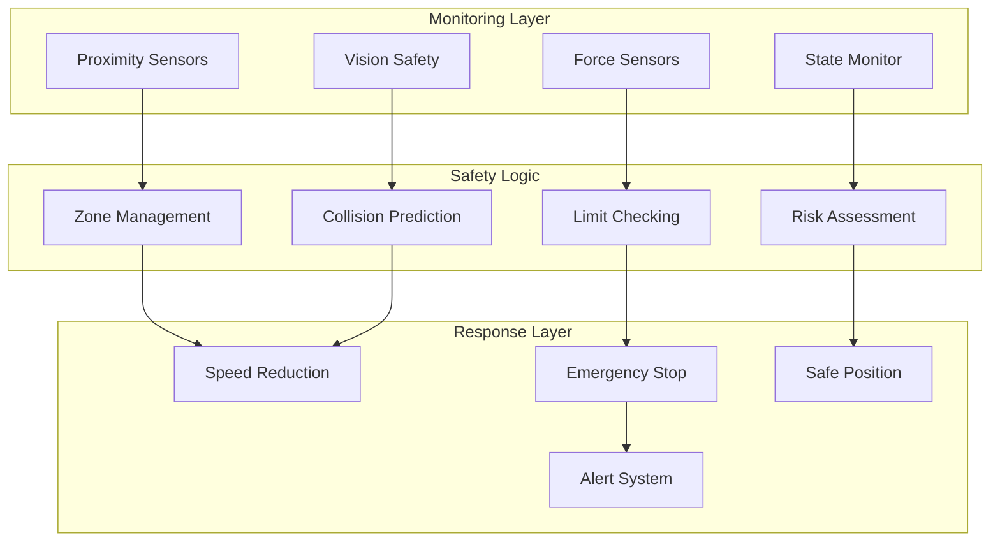
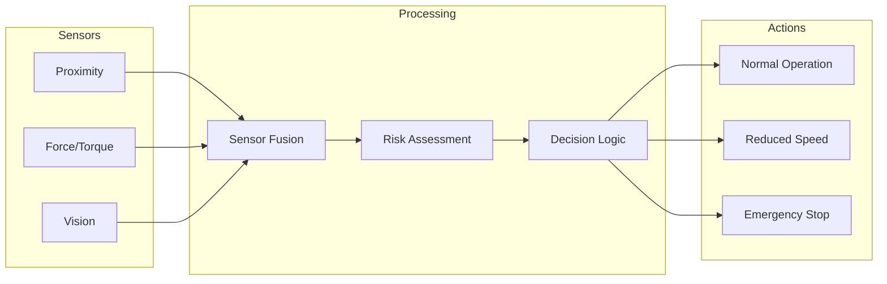
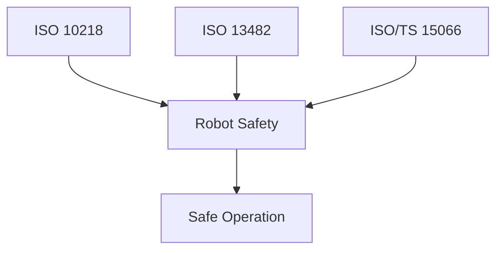
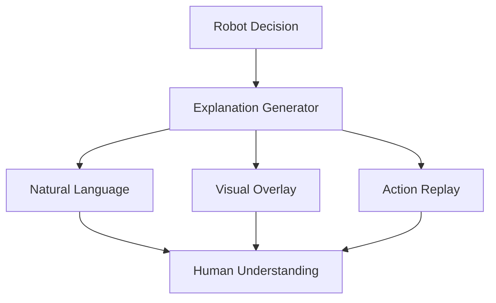

import { ChapterPersonalizeButton } from '@site/src/components/PersonalizationControls';
import { ChapterTranslateButton } from '@site/src/components/TranslationControls';

<div style={{display: 'flex', gap: '10px', marginBottom: '20px'}}>
  <ChapterPersonalizeButton chapterId="advanced-safety-ethics" />
  <ChapterTranslateButton chapterId="advanced-safety-ethics" />
</div>

# Safety and Ethics in Physical AI

As robots become more capable and autonomous, ensuring their safe and ethical operation becomes increasingly critical.

## Learning Objectives

By the end of this chapter, you will be able to:
- Apply ISO safety standards to robot system design
- Implement collision avoidance and fail-safe mechanisms
- Analyze ethical considerations in autonomous systems
- Design privacy-preserving robot systems
- Navigate the regulatory landscape for robotics

## Safety System Architecture

A comprehensive robot safety system operates at multiple levels:



### Safety Data Flow



## Safety Principles

### ISO Safety Standards



Key standards:
- **ISO 10218**: Industrial robot safety
- **ISO 13482**: Personal care robots
- **ISO/TS 15066**: Collaborative robots

### Safety Hierarchy
1. **Elimination**: Remove hazards by design
2. **Substitution**: Replace with safer alternatives
3. **Engineering Controls**: Physical safeguards
4. **Administrative Controls**: Procedures and training
5. **PPE**: Personal protective equipment

## Collision Avoidance

### Sensor-Based Safety

```python
class SafetyMonitor:
    def __init__(self, distance_threshold: float = 0.5):
        self.threshold = distance_threshold
        self.emergency_stop = False

    def check_proximity(self, sensor_readings: list) -> bool:
        """Check if any object is too close."""
        min_distance = min(sensor_readings)
        if min_distance < self.threshold:
            self.trigger_safety_response(min_distance)
            return False
        return True

    def trigger_safety_response(self, distance: float):
        """Respond to proximity violation."""
        if distance < self.threshold * 0.5:
            self.emergency_stop = True
            self.stop_all_motion()
        else:
            self.reduce_speed()
```

### Speed and Separation Monitoring
- Dynamic safety zones
- Speed reduction near humans
- Complete stop when necessary

## Fail-Safe Design

### Redundancy
- Duplicate critical systems
- Independent safety circuits
- Watchdog timers

### Graceful Degradation
- Reduced functionality on failure
- Safe state defaults
- Clear failure indication

## Ethical Considerations

### Autonomy and Responsibility

| Autonomy Level | Human Role | Robot Role |
|----------------|------------|------------|
| Manual | Full control | Execution only |
| Assisted | Decision maker | Suggestions |
| Supervised | Oversight | Primary action |
| Autonomous | Emergency only | Full control |

### Key Ethical Questions
1. **Accountability**: Who is responsible for robot actions?
2. **Privacy**: How is sensor data handled?
3. **Transparency**: Can decisions be explained?
4. **Fairness**: Are all users treated equally?

## Privacy and Data Protection

### Data Collection
- Cameras and microphones
- Location tracking
- Interaction logs

### Protection Measures
- Data minimization
- Encryption
- Access controls
- Retention policies

## Bias and Fairness

### Sources of Bias
- Training data imbalances
- Algorithm design choices
- Deployment context

### Mitigation Strategies
- Diverse training data
- Fairness metrics
- Regular auditing
- Inclusive design teams

## Regulatory Landscape

### Current Regulations
- EU AI Act
- NIST AI Risk Management Framework
- Industry-specific requirements

### Future Directions
- Certification requirements
- Liability frameworks
- International standards

## Risk Assessment

Systematic evaluation of robot hazards:

```python
from dataclasses import dataclass
from enum import Enum

class Severity(Enum):
    NEGLIGIBLE = 1
    MINOR = 2
    MODERATE = 3
    SERIOUS = 4
    CATASTROPHIC = 5

class Probability(Enum):
    RARE = 1
    UNLIKELY = 2
    POSSIBLE = 3
    LIKELY = 4
    CERTAIN = 5

@dataclass
class Hazard:
    """Identified hazard in robot system."""
    name: str
    description: str
    severity: Severity
    probability: Probability
    mitigation: str = ""

    @property
    def risk_score(self) -> int:
        """Calculate risk score (severity × probability)."""
        return self.severity.value * self.probability.value

    @property
    def risk_level(self) -> str:
        """Categorize risk level."""
        score = self.risk_score
        if score <= 4:
            return "LOW"
        elif score <= 9:
            return "MEDIUM"
        elif score <= 16:
            return "HIGH"
        else:
            return "CRITICAL"

class RiskAssessment:
    """Conduct risk assessment for robot system."""

    def __init__(self, system_name: str):
        self.system_name = system_name
        self.hazards = []

    def add_hazard(self, hazard: Hazard):
        """Add identified hazard to assessment."""
        self.hazards.append(hazard)

    def get_critical_hazards(self) -> list:
        """Return hazards requiring immediate attention."""
        return [h for h in self.hazards
                if h.risk_level in ["HIGH", "CRITICAL"]]

    def generate_report(self) -> str:
        """Generate risk assessment report."""
        report = f"Risk Assessment: {self.system_name}\n"
        report += "=" * 50 + "\n\n"

        for hazard in sorted(self.hazards,
                            key=lambda h: h.risk_score,
                            reverse=True):
            report += f"Hazard: {hazard.name}\n"
            report += f"  Risk Level: {hazard.risk_level}\n"
            report += f"  Description: {hazard.description}\n"
            report += f"  Mitigation: {hazard.mitigation}\n\n"

        return report

# Example usage
assessment = RiskAssessment("Mobile Service Robot")
assessment.add_hazard(Hazard(
    name="Collision with human",
    description="Robot collides with person during navigation",
    severity=Severity.SERIOUS,
    probability=Probability.POSSIBLE,
    mitigation="Implement proximity sensors and speed limiting"
))
```

## Explainable AI for Robotics

Making robot decisions understandable:



### Decision Explanation

```python
class ExplainableController:
    """Controller that can explain its decisions."""

    def __init__(self):
        self.decision_log = []

    def make_decision(self, state: dict) -> tuple:
        """
        Make a decision and generate explanation.

        Returns:
            (action, explanation) tuple
        """
        # Evaluate options
        options = self._generate_options(state)
        scores = {}
        reasons = {}

        for option in options:
            score, reason = self._evaluate_option(option, state)
            scores[option] = score
            reasons[option] = reason

        # Select best option
        best_option = max(scores, key=scores.get)

        # Generate explanation
        explanation = self._generate_explanation(
            best_option, scores, reasons, state
        )

        self.decision_log.append({
            'state': state,
            'decision': best_option,
            'explanation': explanation
        })

        return best_option, explanation

    def _generate_explanation(self, decision: str,
                             scores: dict,
                             reasons: dict,
                             state: dict) -> str:
        """Generate human-readable explanation."""
        explanation = f"I chose to {decision} because:\n"
        explanation += f"- {reasons[decision]}\n"

        # Explain why alternatives were rejected
        for option, score in scores.items():
            if option != decision:
                explanation += f"- I didn't {option} because {reasons[option]}\n"

        return explanation
```

## Accountability Frameworks

Determining responsibility in autonomous systems:

| Level | Human Role | Robot Role | Accountability |
|-------|------------|------------|----------------|
| Teleoperation | Full control | None | Human operator |
| Assisted | Primary | Suggestions | Human operator |
| Supervised | Oversight | Primary | Shared |
| Autonomous | Emergency only | Full | Manufacturer/Deployer |

## Ethical Decision Making

Handling ethical dilemmas in autonomous systems:

```python
class EthicalFramework:
    """Framework for ethical decision making."""

    def __init__(self):
        self.principles = {
            'harm_prevention': 1.0,    # Highest priority
            'human_autonomy': 0.8,
            'fairness': 0.7,
            'transparency': 0.6,
            'privacy': 0.5
        }

    def evaluate_action(self, action: dict,
                        context: dict) -> dict:
        """
        Evaluate action against ethical principles.

        Returns:
            Ethical assessment with scores and concerns
        """
        assessment = {
            'scores': {},
            'concerns': [],
            'recommendation': None
        }

        # Evaluate each principle
        for principle, weight in self.principles.items():
            score = self._evaluate_principle(action, context, principle)
            assessment['scores'][principle] = score * weight

            if score < 0.5:
                assessment['concerns'].append(
                    f"Action may violate {principle}"
                )

        # Overall recommendation
        total_score = sum(assessment['scores'].values())
        max_score = sum(self.principles.values())

        if total_score / max_score > 0.7:
            assessment['recommendation'] = 'PROCEED'
        elif total_score / max_score > 0.4:
            assessment['recommendation'] = 'PROCEED_WITH_CAUTION'
        else:
            assessment['recommendation'] = 'DO_NOT_PROCEED'

        return assessment
```

:::caution Important
Ethical frameworks are guides, not absolute rules. Complex situations require human judgment and oversight.
:::

## Summary

Safety and ethics must be integrated into every stage of robot development, from design through deployment and operation. Key points:

- ISO standards provide frameworks for robot safety
- Risk assessment identifies and prioritizes hazards
- Fail-safe design ensures safe behavior during failures
- Ethical considerations include accountability, privacy, and fairness
- Explainability builds trust and enables oversight

<div className="key-takeaway">

Safety and ethics are not afterthoughts—they must be designed into robot systems from the beginning and continuously evaluated throughout the system lifecycle.

</div>

## Further Reading

- IEEE Global Initiative on Ethics of Autonomous and Intelligent Systems
- ISO 10218-1:2011 - Robots and robotic devices — Safety requirements
- Asimov, I. (1950). I, Robot (for historical perspective on robot ethics)

---

**Next Chapter:** [Building Your First Robot Project](/practical/first-robot-project)
