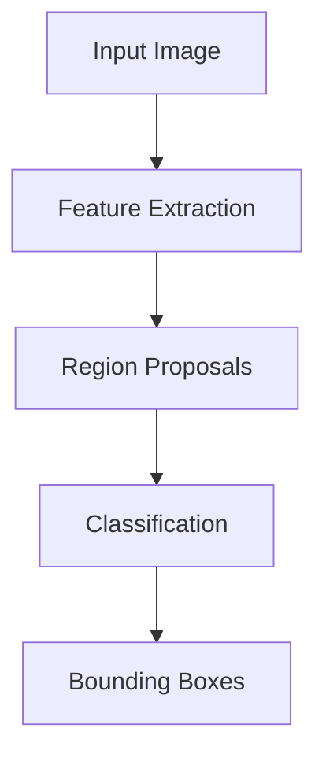
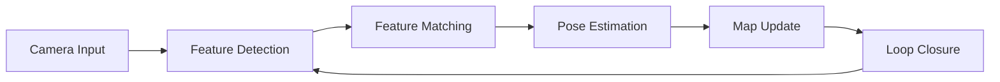
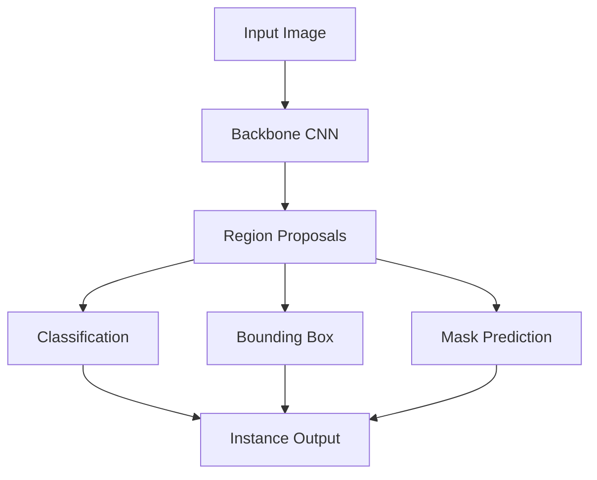

import { ChapterPersonalizeButton } from '@site/src/components/PersonalizationControls';
import { ChapterTranslateButton } from '@site/src/components/TranslationControls';

<div style={{display: 'flex', gap: '10px', marginBottom: '20px'}}>
  <ChapterPersonalizeButton chapterId="core-computer-vision" />
  <ChapterTranslateButton chapterId="core-computer-vision" />
</div>

# Computer Vision for Robotics

Computer vision enables robots to understand visual information from cameras and other imaging sensors.

## Learning Objectives

By the end of this chapter, you will be able to:
- Apply fundamental image processing operations
- Understand object detection architectures (YOLO, Faster R-CNN)
- Implement depth perception using stereo vision
- Explain Visual SLAM components and workflow
- Apply pose estimation for objects and humans

## Image Processing Fundamentals

### Image Representation
- Pixels and color spaces (RGB, HSV, grayscale)
- Resolution and aspect ratio
- Image formats and compression

### Basic Operations

```python
import numpy as np

def apply_gaussian_blur(image: np.ndarray, kernel_size: int = 5) -> np.ndarray:
    """Apply Gaussian blur for noise reduction."""
    # Simplified example - use cv2.GaussianBlur in practice
    kernel = create_gaussian_kernel(kernel_size)
    return convolve(image, kernel)

def edge_detection(image: np.ndarray) -> np.ndarray:
    """Detect edges using Sobel operator."""
    sobel_x = np.array([[-1, 0, 1], [-2, 0, 2], [-1, 0, 1]])
    sobel_y = np.array([[-1, -2, -1], [0, 0, 0], [1, 2, 1]])

    grad_x = convolve(image, sobel_x)
    grad_y = convolve(image, sobel_y)

    return np.sqrt(grad_x**2 + grad_y**2)
```

## Object Detection



### Deep Learning Approaches

#### YOLO (You Only Look Once)
- Real-time object detection
- Single forward pass
- Good for robotics applications

#### Faster R-CNN
- Two-stage detector
- Higher accuracy
- More computationally intensive

## Depth Perception

### Stereo Vision
Computing depth from two camera views:

1. **Rectification**: Align image planes
2. **Matching**: Find corresponding points
3. **Triangulation**: Compute 3D position

### Depth from RGB-D Sensors
- Direct depth measurements
- Intel RealSense, Azure Kinect
- Structured light or ToF technology

## Visual SLAM

Simultaneous Localization and Mapping using vision:



### Key Components
- Feature detection (ORB, SIFT)
- Bundle adjustment
- Loop closure detection

## Pose Estimation

Determining object or human pose:

### 6-DoF Object Pose
- Position (x, y, z)
- Orientation (roll, pitch, yaw)

### Human Pose Estimation
- Skeleton detection
- Joint positions
- Action recognition

## Image Segmentation

Dividing images into meaningful regions:

### Semantic Segmentation
Classify each pixel into a category:

```python
class SemanticSegmenter:
    """Semantic segmentation for robot perception."""

    def __init__(self, model_path: str, classes: list):
        self.classes = classes
        # In practice, load a pre-trained model like DeepLabV3
        self.model = self._load_model(model_path)

    def segment(self, image: np.ndarray) -> np.ndarray:
        """
        Segment image into semantic classes.

        Returns:
            Segmentation mask with class IDs per pixel
        """
        # Preprocess
        input_tensor = self._preprocess(image)

        # Run inference
        output = self.model.predict(input_tensor)

        # Get class predictions
        mask = np.argmax(output, axis=-1)
        return mask

    def get_navigable_area(self, mask: np.ndarray) -> np.ndarray:
        """Extract navigable floor area from segmentation."""
        floor_class_id = self.classes.index('floor')
        return (mask == floor_class_id).astype(np.uint8)
```

### Instance Segmentation
Distinguish individual objects of the same class:



## Camera Calibration

Essential for accurate 3D perception:

### Intrinsic Parameters
```python
class CameraIntrinsics:
    """Camera intrinsic parameters."""

    def __init__(self, fx: float, fy: float,
                 cx: float, cy: float,
                 distortion: np.ndarray = None):
        self.fx = fx  # Focal length x
        self.fy = fy  # Focal length y
        self.cx = cx  # Principal point x
        self.cy = cy  # Principal point y
        self.distortion = distortion

        # Camera matrix
        self.K = np.array([
            [fx, 0, cx],
            [0, fy, cy],
            [0, 0, 1]
        ])

    def project_point(self, point_3d: np.ndarray) -> np.ndarray:
        """Project 3D point to 2D image coordinates."""
        x, y, z = point_3d
        u = self.fx * (x / z) + self.cx
        v = self.fy * (y / z) + self.cy
        return np.array([u, v])

    def unproject_point(self, pixel: np.ndarray,
                        depth: float) -> np.ndarray:
        """Unproject 2D pixel to 3D point given depth."""
        u, v = pixel
        x = (u - self.cx) * depth / self.fx
        y = (v - self.cy) * depth / self.fy
        z = depth
        return np.array([x, y, z])
```

## Object Tracking

Following objects across video frames:

| Algorithm | Speed | Accuracy | Use Case |
|-----------|-------|----------|----------|
| SORT | Fast | Medium | Real-time |
| DeepSORT | Medium | High | Re-identification |
| ByteTrack | Fast | High | Crowded scenes |

### Simple Tracking Example

```python
class SimpleTracker:
    """Track objects using IoU matching."""

    def __init__(self, iou_threshold: float = 0.3):
        self.tracks = {}
        self.next_id = 0
        self.iou_threshold = iou_threshold

    def update(self, detections: list) -> dict:
        """
        Update tracks with new detections.

        Args:
            detections: List of bounding boxes [x1, y1, x2, y2]

        Returns:
            Dictionary mapping track_id to bounding box
        """
        if not self.tracks:
            # Initialize tracks
            for det in detections:
                self.tracks[self.next_id] = det
                self.next_id += 1
            return self.tracks.copy()

        # Match detections to existing tracks
        matched = self._match_detections(detections)

        # Update matched tracks
        for track_id, det_idx in matched.items():
            self.tracks[track_id] = detections[det_idx]

        return self.tracks.copy()

    def _compute_iou(self, box1, box2) -> float:
        """Compute Intersection over Union."""
        x1 = max(box1[0], box2[0])
        y1 = max(box1[1], box2[1])
        x2 = min(box1[2], box2[2])
        y2 = min(box1[3], box2[3])

        intersection = max(0, x2 - x1) * max(0, y2 - y1)
        area1 = (box1[2] - box1[0]) * (box1[3] - box1[1])
        area2 = (box2[2] - box2[0]) * (box2[3] - box2[1])
        union = area1 + area2 - intersection

        return intersection / union if union > 0 else 0
```

## Summary

Computer vision provides robots with the ability to understand their visual environment, enabling navigation, manipulation, and interaction. Key points:

- Image processing forms the foundation for higher-level vision tasks
- Deep learning has revolutionized object detection and segmentation
- Depth perception enables 3D understanding of the environment
- Visual SLAM combines vision with localization and mapping

:::tip Key Takeaway
Modern robotics vision systems combine classical computer vision techniques with deep learning to achieve robust perception in real-world environments.
:::

## Further Reading

- Szeliski, R. (2022). Computer Vision: Algorithms and Applications
- Goodfellow, I., et al. (2016). Deep Learning

---

**Next Chapter:** [Natural Language Interaction](/core/natural-language)
