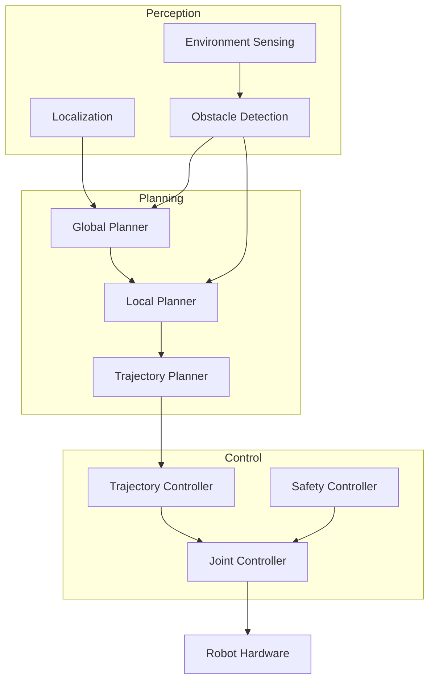
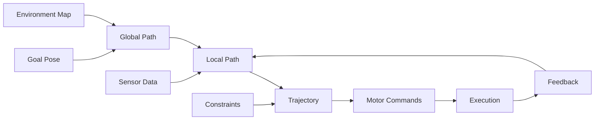
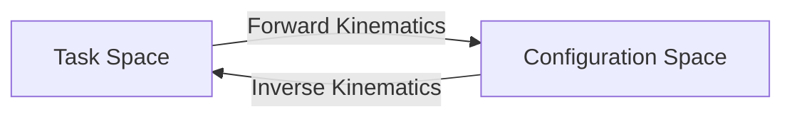

import { ChapterPersonalizeButton } from '@site/src/components/PersonalizationControls';
import { ChapterTranslateButton } from '@site/src/components/TranslationControls';

<div style={{display: 'flex', gap: '10px', marginBottom: '20px'}}>
  <ChapterPersonalizeButton chapterId="core-motion-planning" />
  <ChapterTranslateButton chapterId="core-motion-planning" />
</div>

# Motion Planning and Control

Motion planning determines how a robot moves from one configuration to another while avoiding obstacles and respecting physical constraints.

## Learning Objectives

By the end of this chapter, you will be able to:
- Understand configuration space and its role in motion planning
- Implement basic sampling-based planning algorithms (RRT, PRM)
- Apply graph-based search methods like A* for pathfinding
- Design trajectory profiles with velocity and acceleration constraints
- Implement PID and understand Model Predictive Control concepts

## Motion Planning System Architecture

The motion planning system integrates perception, planning, and control:



### Motion Planning Data Flow



## Configuration Space

The configuration space (C-space) represents all possible robot configurations:



### Degrees of Freedom
- Each joint adds a dimension to C-space
- A 6-DoF arm has a 6-dimensional C-space

## Path Planning Algorithms

### Sampling-Based Methods

#### RRT (Rapidly-exploring Random Trees)
```python
def rrt(start, goal, obstacles, max_iterations=1000):
    """Basic RRT algorithm."""
    tree = [start]

    for _ in range(max_iterations):
        # Sample random point
        random_point = sample_random()

        # Find nearest node in tree
        nearest = find_nearest(tree, random_point)

        # Extend toward random point
        new_node = extend(nearest, random_point)

        # Check collision
        if not collides(nearest, new_node, obstacles):
            tree.append(new_node)

            # Check if goal reached
            if distance(new_node, goal) < threshold:
                return extract_path(tree, start, goal)

    return None  # No path found
```

#### PRM (Probabilistic Roadmap)
- Pre-computes a roadmap of the environment
- Good for multiple queries in static environments

### Graph-Based Methods

#### A* Algorithm
Optimal pathfinding with heuristics:
- Guarantees shortest path
- Uses admissible heuristic

## Trajectory Planning

Converting a path to a time-parameterized trajectory:

### Velocity Profiles
- Trapezoidal velocity profile
- S-curve (smooth acceleration)

### Constraints
- Maximum velocity limits
- Acceleration limits
- Jerk limits for smooth motion

## Control Systems

### PID Control
The fundamental feedback controller:

```python
class PIDController:
    def __init__(self, kp: float, ki: float, kd: float):
        self.kp = kp
        self.ki = ki
        self.kd = kd
        self.integral = 0.0
        self.prev_error = 0.0

    def compute(self, setpoint: float, measured: float, dt: float) -> float:
        error = setpoint - measured
        self.integral += error * dt
        derivative = (error - self.prev_error) / dt
        self.prev_error = error

        return self.kp * error + self.ki * self.integral + self.kd * derivative
```

### Model Predictive Control (MPC)
- Optimizes over a prediction horizon
- Handles constraints explicitly
- Widely used in advanced robotics

## Inverse Kinematics

Computing joint angles to reach a desired end-effector pose:

```python
import numpy as np

class IKSolver:
    """Iterative inverse kinematics solver using Jacobian."""

    def __init__(self, robot_model, max_iterations: int = 100):
        self.robot = robot_model
        self.max_iterations = max_iterations
        self.tolerance = 1e-4

    def solve(self, target_pose: np.ndarray,
              initial_joints: np.ndarray) -> np.ndarray:
        """
        Solve IK using damped least squares (Levenberg-Marquardt).

        Args:
            target_pose: Desired end-effector pose [x, y, z, rx, ry, rz]
            initial_joints: Starting joint configuration

        Returns:
            Joint angles that achieve the target pose
        """
        joints = initial_joints.copy()
        damping = 0.1

        for _ in range(self.max_iterations):
            # Current end-effector pose
            current_pose = self.robot.forward_kinematics(joints)

            # Error between current and target
            error = target_pose - current_pose

            if np.linalg.norm(error) < self.tolerance:
                break

            # Compute Jacobian
            J = self.robot.compute_jacobian(joints)

            # Damped least squares solution
            JtJ = J.T @ J
            delta_joints = np.linalg.solve(
                JtJ + damping * np.eye(JtJ.shape[0]),
                J.T @ error
            )

            joints += delta_joints

        return joints
```

## Motion Primitives

Pre-computed motion segments for efficient planning:


### Common Primitives
| Primitive | Description | Use Case |
|-----------|-------------|----------|
| Straight line | Direct point-to-point | Open space |
| Arc | Curved path | Turning |
| Spline | Smooth trajectory | Complex paths |
| Dubins | Minimum curvature | Car-like robots |

## Obstacle Representation

How obstacles are represented affects planning efficiency:

### Geometric Primitives
- Spheres, boxes, cylinders
- Fast collision checking
- Conservative approximations

### Occupancy Grids
```python
class OccupancyGrid:
    """2D occupancy grid for obstacle representation."""

    def __init__(self, width: int, height: int, resolution: float):
        self.width = width
        self.height = height
        self.resolution = resolution
        self.grid = np.zeros((height, width), dtype=np.uint8)

    def world_to_grid(self, x: float, y: float) -> tuple:
        """Convert world coordinates to grid indices."""
        gx = int(x / self.resolution)
        gy = int(y / self.resolution)
        return (gx, gy)

    def is_occupied(self, x: float, y: float) -> bool:
        """Check if a world position is occupied."""
        gx, gy = self.world_to_grid(x, y)
        if 0 <= gx < self.width and 0 <= gy < self.height:
            return self.grid[gy, gx] > 0
        return True  # Out of bounds is occupied

    def set_obstacle(self, x: float, y: float):
        """Mark a position as occupied."""
        gx,gy = self.world_to_grid(x, y)
        if 0 <= gx < self.width and 0 <= gy < self.height:
            self.grid[gy, gx] = 255
```

## Real-Time Planning

Planning under time constraints:

### Anytime Algorithms
- Return best solution found so far
- Improve solution quality with more time
- Examples: Anytime RRT*, ARA*

### Reactive Planning
- Local obstacle avoidance
- Potential fields
- Dynamic window approach

:::caution Important
Real robots require real-time planning. Always consider computational constraints when selecting algorithms.
:::

## Summary

Motion planning and control form the foundation for robot movement, combining geometric reasoning with dynamic control. Key points:

- Configuration space transforms planning into a search problem
- Sampling-based methods (RRT, PRM) handle high-dimensional spaces
- Trajectory planning adds time and dynamics to paths
- PID control is fundamental; MPC handles constraints explicitly

<div className="key-takeaway">

The choice of planning algorithm depends on the problem: use A* for low-dimensional discrete spaces, RRT for high-dimensional continuous spaces, and MPC when dynamics and constraints matter.

</div>

## Further Reading

- LaValle, S. M. (2006). Planning Algorithms
- Choset, H., et al. (2005). Principles of Robot Motion

---

**Next Chapter:** [Computer Vision for Robotics](/core/computer-vision)
