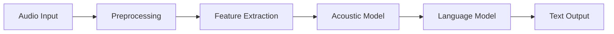
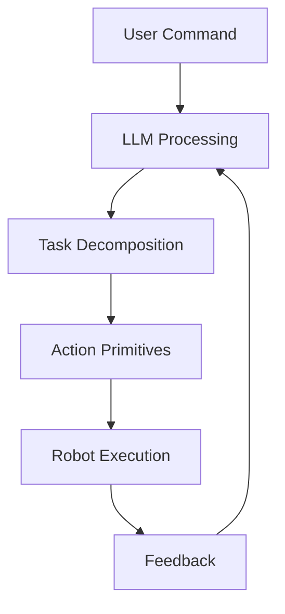
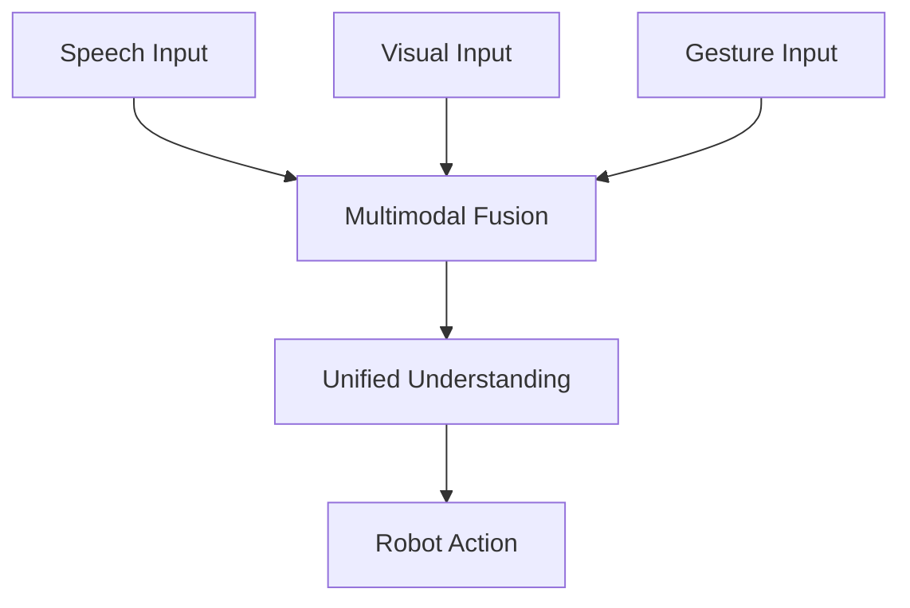

import { ChapterPersonalizeButton } from '@site/src/components/PersonalizationControls';
import { ChapterTranslateButton } from '@site/src/components/TranslationControls';

<div style={{display: 'flex', gap: '10px', marginBottom: '20px'}}>
  <ChapterPersonalizeButton chapterId="core-natural-language" />
  <ChapterTranslateButton chapterId="core-natural-language" />
</div>

# Natural Language Interaction

Natural language interaction enables humans to communicate with robots using speech and text, making robots more accessible and intuitive to use.

## Learning Objectives

By the end of this chapter, you will be able to:
- Understand the speech recognition pipeline
- Implement intent classification and entity extraction
- Design dialogue management systems
- Integrate Large Language Models with robot control
- Ground natural language in physical robot actions

## Speech Recognition

Converting spoken language to text:



### Key Technologies
- Automatic Speech Recognition (ASR)
- Speaker identification
- Noise cancellation

## Natural Language Understanding

### Intent Recognition
Determining what the user wants:

```python
class IntentClassifier:
    def __init__(self):
        self.intents = {
            'move': ['go', 'move', 'walk', 'navigate'],
            'pick': ['pick', 'grab', 'take', 'get'],
            'place': ['put', 'place', 'drop', 'set'],
            'stop': ['stop', 'halt', 'pause', 'wait']
        }

    def classify(self, text: str) -> str:
        """Classify user intent from text."""
        text_lower = text.lower()
        for intent, keywords in self.intents.items():
            if any(kw in text_lower for kw in keywords):
                return intent
        return 'unknown'
```

### Entity Extraction
Identifying key information:
- Objects: "Pick up the **red cup**"
- Locations: "Go to the **kitchen**"
- Actions: "**Slowly** move forward"

### Semantic Parsing
Converting natural language to robot commands:

| Natural Language | Robot Command |
|-----------------|---------------|
| "Go to the kitchen" | `navigate(location="kitchen")` |
| "Pick up the cup" | `grasp(object="cup")` |
| "Turn left 90 degrees" | `rotate(angle=-90)` |

## Dialogue Management

### State Tracking
Maintaining conversation context:

```python
class DialogueState:
    def __init__(self):
        self.context = {}
        self.history = []

    def update(self, user_input: str, system_response: str):
        self.history.append({
            'user': user_input,
            'system': system_response
        })

    def get_context(self, key: str, default=None):
        return self.context.get(key, default)
```

### Clarification and Confirmation
- Handling ambiguous commands
- Confirming critical actions
- Asking for missing information

## Speech Synthesis

Converting text to natural speech:

### Text-to-Speech (TTS)
- Neural TTS models
- Prosody and emotion
- Voice customization

## Large Language Models in Robotics

### LLM Integration
Modern robots can leverage LLMs for:
- Complex instruction understanding
- Task planning
- Explanation generation

### Grounding Language in Action
Connecting language to physical capabilities:



## Command Parsing

Converting natural language to structured robot commands:

```python
from dataclasses import dataclass
from typing import Optional, List

@dataclass
class RobotCommand:
    """Structured robot command from natural language."""
    action: str
    target: Optional[str] = None
    location: Optional[str] = None
    parameters: Optional[dict] = None

class CommandParser:
    """Parse natural language into robot commands."""

    def __init__(self):
        self.action_patterns = {
            'navigate': ['go to', 'move to', 'navigate to', 'walk to'],
            'pick': ['pick up', 'grab', 'take', 'get'],
            'place': ['put', 'place', 'set down', 'drop'],
            'look': ['look at', 'find', 'locate', 'search for'],
        }

    def parse(self, text: str) -> RobotCommand:
        """
        Parse natural language text into a RobotCommand.

        Args:
            text: Natural language command

        Returns:
            Structured RobotCommand
        """
        text_lower = text.lower()

        # Identify action
        action = self._extract_action(text_lower)

        # Extract target object
        target = self._extract_target(text_lower)

        # Extract location
        location = self._extract_location(text_lower)

        return RobotCommand(
            action=action,
            target=target,
            location=location
        )

    def _extract_action(self, text: str) -> str:
        for action, patterns in self.action_patterns.items():
            if any(p in text for p in patterns):
                return action
        return 'unknown'

    def _extract_target(self, text: str) -> Optional[str]:
        # Simple noun extraction - use NLP library in practice
        objects = ['cup', 'bottle', 'box', 'ball', 'book']
        for obj in objects:
            if obj in text:
                return obj
        return None

    def _extract_location(self, text: str) -> Optional[str]:
        locations = ['kitchen', 'table', 'desk', 'shelf', 'floor']
        for loc in locations:
            if loc in text:
                return loc
        return None

# Example usage
parser = CommandParser()
cmd = parser.parse("Pick up the red cup from the table")
print(f"Action: {cmd.action}, Target: {cmd.target}, Location: {cmd.location}")
```

## Multimodal Understanding

Combining language with visual context:



### Visual Grounding
Connecting language references to visual objects:

```python
class VisualGrounder:
    """Ground language references in visual scene."""

    def __init__(self, object_detector, language_model):
        self.detector = object_detector
        self.language_model = language_model

    def ground_reference(self, text: str,
                         image: np.ndarray) -> Optional[dict]:
        """
        Find the object in the image that matches the text description.

        Args:
            text: Natural language reference (e.g., "the red cup")
            image: RGB image of the scene

        Returns:
            Detected object with bounding box, or None
        """
        # Detect all objects in scene
        detections = self.detector.detect(image)

        # Score each detection against the text
        best_match = None
        best_score = 0

        for det in detections:
            # Extract visual features
            crop = self._crop_detection(image, det['bbox'])

            # Compute text-image similarity
            score = self.language_model.similarity(text, crop)

            if score > best_score:
                best_score = score
                best_match = det

        return best_match if best_score > 0.5 else None
```

## Error Recovery in Dialogue

Handling misunderstandings gracefully:

| Error Type | Detection | Recovery Strategy |
|------------|-----------|-------------------|
| ASR Error | Low confidence | "I didn't catch that, could you repeat?" |
| Ambiguity | Multiple interpretations | "Did you mean X or Y?" |
| Missing Info | Incomplete command | "Where should I put it?" |
| Impossible | Physical constraint | "I can't reach that location" |

```python
class DialogueRecovery:
    """Handle errors and ambiguities in dialogue."""

    def __init__(self):
        self.clarification_templates = {
            'ambiguous_object': "I see multiple {object}s. Which one - {options}?",
            'missing_location': "Where should I {action} the {object}?",
            'unknown_object': "I don't see a {object}. Can you point to it?",
            'confirmation': "Just to confirm, you want me to {action}?"
        }

    def generate_clarification(self, error_type: str,
                               context: dict) -> str:
        """Generate appropriate clarification question."""
        template = self.clarification_templates.get(error_type)
        if template:
            return template.format(**context)
        return "I'm not sure I understood. Could you rephrase?"
```

## Summary

Natural language interaction makes robots more accessible by allowing intuitive communication through speech and text. Key points:

- Speech recognition converts audio to text for processing
- Intent classification and entity extraction structure user commands
- Dialogue management maintains conversation context
- LLMs enable complex instruction understanding and task planning
- Grounding connects language to physical robot capabilities

<div className="key-takeaway">

Effective natural language interaction requires not just understanding words, but grounding them in the robot's physical capabilities and the current environmental context.

</div>

## Further Reading

- Jurafsky, D., & Martin, J. H. (2023). Speech and Language Processing
- Tellex, S., et al. (2020). Robots That Use Language

---

**Next Chapter:** [Reinforcement Learning for Robotics](/advanced/reinforcement-learning)
