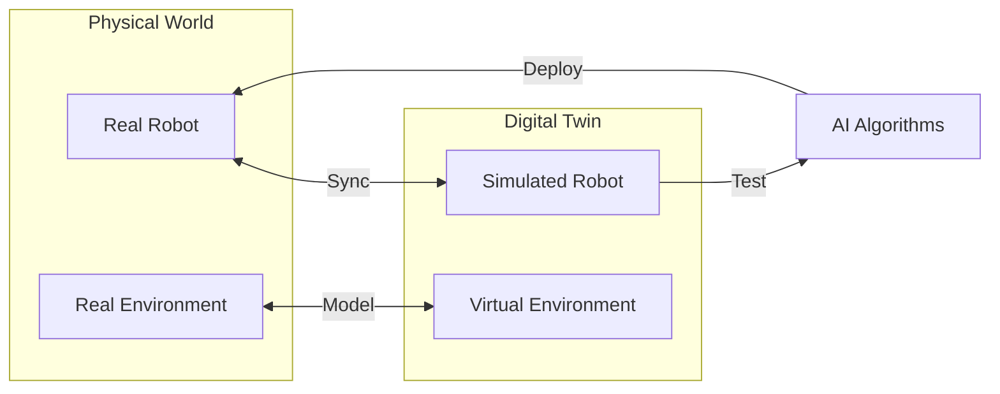
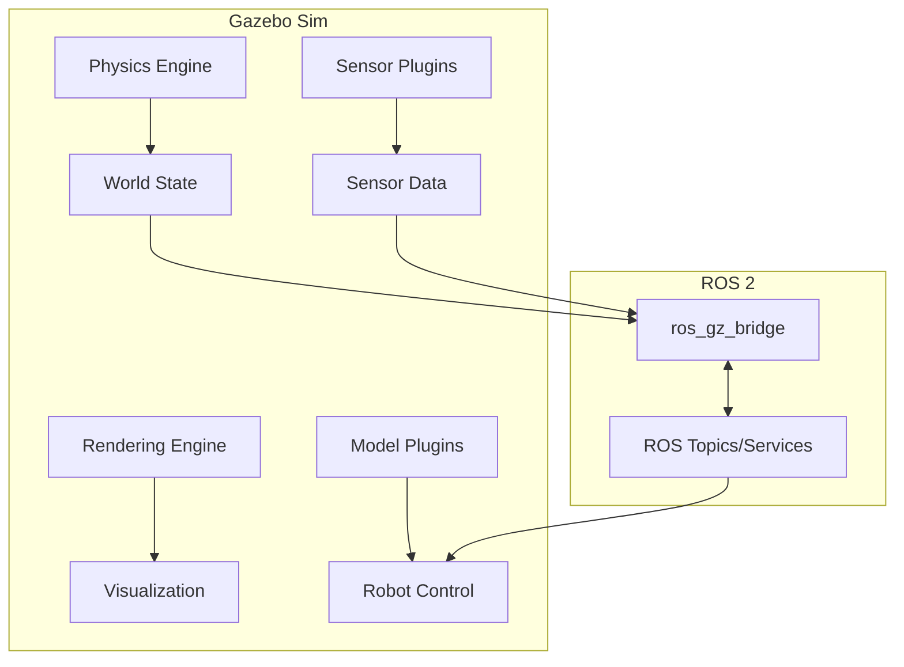
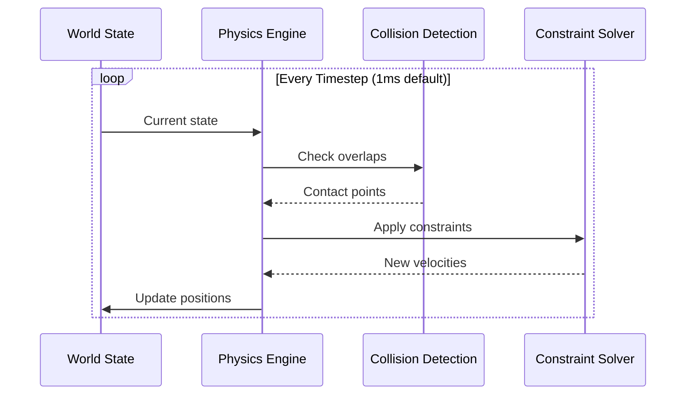
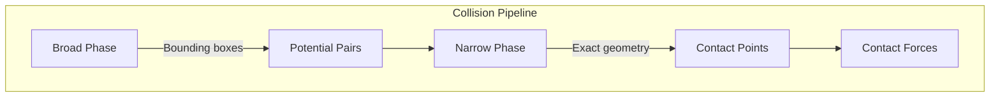
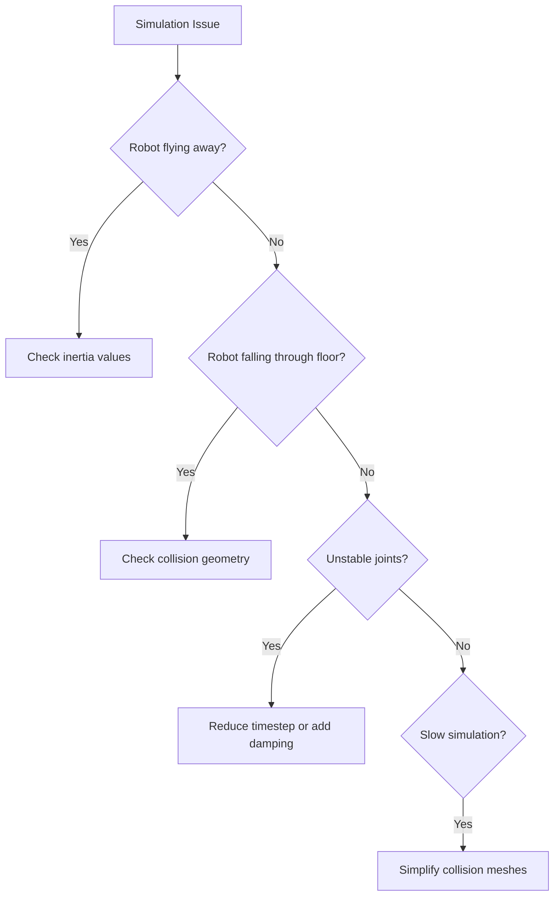

import { ChapterPersonalizeButton } from '@site/src/components/PersonalizationControls';
import { ChapterTranslateButton } from '@site/src/components/TranslationControls';

<div style={{display: 'flex', gap: '10px', marginBottom: '20px'}}>
  <ChapterPersonalizeButton chapterId="digital-twin-gazebo-simulation" />
  <ChapterTranslateButton chapterId="digital-twin-gazebo-simulation" />
</div>

# Gazebo Simulation Environment

Welcome to the world of robot simulation! Gazebo is a powerful physics simulation environment that allows you to test robot behaviors in a virtual world before deploying to real hardware. In this chapter, you'll learn how to set up Gazebo, understand its physics engine, and create realistic simulation environments for humanoid robots.

## Learning Objectives

By the end of this chapter, you will be able to:
- Install and configure Gazebo for ROS 2 development
- Understand how Gazebo simulates physics, gravity, and collisions
- Create and customize simulation worlds
- Spawn robots and objects in the simulation
- Configure physics parameters for realistic behavior
- Debug and visualize simulation data

## Why Simulation Matters

Before we dive into Gazebo, let's understand why simulation is critical for Physical AI development.

### The Digital Twin Concept




| Benefit | Description |
|---------|-------------|
| **Safety** | Test dangerous scenarios without risking hardware |
| **Speed** | Run thousands of tests faster than real-time |
| **Cost** | No wear and tear on expensive robot hardware |
| **Reproducibility** | Exact same conditions for every test |
| **Accessibility** | Develop without physical robot access |

:::tip Why Humanoids Need Simulation
Humanoid robots are expensive and can be damaged by falls. Simulation lets you test balance algorithms, walking gaits, and manipulation tasks safely before real-world deployment.
:::

## Gazebo Overview

Gazebo (now called Gazebo Sim, formerly Ignition Gazebo) is the standard simulation tool in the ROS ecosystem.

### Gazebo Architecture



### Gazebo vs Gazebo Classic

| Feature | Gazebo Classic | Gazebo Sim (Ignition) |
|---------|---------------|----------------------|
| **Physics** | ODE, Bullet, DART | DART, TPE, Bullet |
| **Rendering** | OGRE 1.x | OGRE 2.x (modern) |
| **Architecture** | Monolithic | Modular/Plugin-based |
| **ROS 2 Support** | Limited | Native |
| **Performance** | Good | Better |
| **Future** | Deprecated | Active development |

## Installing Gazebo

### Prerequisites

```bash
# Ensure ROS 2 Humble is installed
source /opt/ros/humble/setup.bash

# Install Gazebo Fortress (LTS) or Harmonic
sudo apt update
sudo apt install ros-humble-ros-gz
```

### Verify Installation

```bash
# Launch empty Gazebo world
gz sim empty.sdf

# Or with ROS 2 integration
ros2 launch ros_gz_sim gz_sim.launch.py
```


## Understanding Physics Simulation

Gazebo's physics engine simulates how objects interact in the real world—gravity pulls things down, objects collide and bounce, and forces cause motion.

### The Physics Loop



### Key Physics Concepts

#### Gravity

Gravity is the constant downward force that affects all objects:

```xml
<!-- In your world SDF file -->
<world name="humanoid_world">
  <physics name="default_physics" type="dart">
    <gravity>0 0 -9.81</gravity>  <!-- Earth gravity in m/s² -->
    <max_step_size>0.001</max_step_size>  <!-- 1ms timestep -->
    <real_time_factor>1.0</real_time_factor>
  </physics>
</world>
```

:::note Gravity Direction
In Gazebo, the Z-axis points up by default. Gravity is negative Z (-9.81 m/s²). Some simulators use Y-up convention—always check!
:::

#### Collisions

Collision detection determines when objects touch:



```xml
<!-- Collision geometry for a robot link -->
<collision name="torso_collision">
  <geometry>
    <box>
      <size>0.4 0.3 0.6</size>  <!-- width, depth, height -->
    </box>
  </geometry>
  <surface>
    <friction>
      <ode>
        <mu>0.8</mu>      <!-- Friction coefficient -->
        <mu2>0.8</mu2>
      </ode>
    </friction>
    <bounce>
      <restitution_coefficient>0.1</restitution_coefficient>
    </bounce>
  </surface>
</collision>
```

#### Mass and Inertia

Every physical object needs mass properties:

```xml
<inertial>
  <mass>10.0</mass>  <!-- kg -->
  <inertia>
    <!-- Inertia tensor for a box: I = (1/12) * m * (h² + d²) -->
    <ixx>0.5</ixx>
    <ixy>0</ixy>
    <ixz>0</ixz>
    <iyy>0.4</iyy>
    <iyz>0</iyz>
    <izz>0.3</izz>
  </inertia>
</inertial>
```

:::caution Inertia Matters
Incorrect inertia values cause unstable simulation. Use CAD software or the parallel axis theorem to calculate accurate values for complex shapes.
:::


## Creating Simulation Worlds

A Gazebo world defines the environment where your robot operates.

### World File Structure (SDF)

```xml
<?xml version="1.0" ?>
<sdf version="1.8">
  <world name="humanoid_lab">

    <!-- Physics configuration -->
    <physics name="1ms" type="dart">
      <max_step_size>0.001</max_step_size>
      <real_time_factor>1.0</real_time_factor>
      <gravity>0 0 -9.81</gravity>
    </physics>

    <!-- Lighting -->
    <light type="directional" name="sun">
      <cast_shadows>true</cast_shadows>
      <pose>0 0 10 0 0 0</pose>
      <diffuse>0.8 0.8 0.8 1</diffuse>
      <specular>0.2 0.2 0.2 1</specular>
      <direction>-0.5 0.1 -0.9</direction>
    </light>

    <!-- Ground plane -->
    <model name="ground_plane">
      <static>true</static>
      <link name="link">
        <collision name="collision">
          <geometry>
            <plane>
              <normal>0 0 1</normal>
              <size>100 100</size>
            </plane>
          </geometry>
          <surface>
            <friction>
              <ode>
                <mu>1.0</mu>
                <mu2>1.0</mu2>
              </ode>
            </friction>
          </surface>
        </collision>
        <visual name="visual">
          <geometry>
            <plane>
              <normal>0 0 1</normal>
              <size>100 100</size>
            </plane>
          </geometry>
          <material>
            <ambient>0.8 0.8 0.8 1</ambient>
          </material>
        </visual>
      </link>
    </model>

  </world>
</sdf>
```

### Adding Objects to the World

```xml
<!-- A table for manipulation tasks -->
<model name="table">
  <static>true</static>
  <pose>1.5 0 0 0 0 0</pose>
  <link name="table_link">
    <!-- Table top -->
    <collision name="top_collision">
      <pose>0 0 0.75 0 0 0</pose>
      <geometry>
        <box><size>1.2 0.8 0.05</size></box>
      </geometry>
    </collision>
    <visual name="top_visual">
      <pose>0 0 0.75 0 0 0</pose>
      <geometry>
        <box><size>1.2 0.8 0.05</size></box>
      </geometry>
      <material>
        <ambient>0.6 0.4 0.2 1</ambient>
      </material>
    </visual>
    <!-- Table legs (simplified) -->
    <collision name="leg1">
      <pose>0.5 0.3 0.375 0 0 0</pose>
      <geometry>
        <cylinder><radius>0.03</radius><length>0.75</length></cylinder>
      </geometry>
    </collision>
    <!-- Add more legs... -->
  </link>
</model>

<!-- A graspable object -->
<model name="red_cube">
  <pose>1.5 0 0.85 0 0 0</pose>
  <link name="cube_link">
    <inertial>
      <mass>0.1</mass>
      <inertia>
        <ixx>0.000017</ixx>
        <iyy>0.000017</iyy>
        <izz>0.000017</izz>
      </inertia>
    </inertial>
    <collision name="collision">
      <geometry>
        <box><size>0.05 0.05 0.05</size></box>
      </geometry>
    </collision>
    <visual name="visual">
      <geometry>
        <box><size>0.05 0.05 0.05</size></box>
      </geometry>
      <material>
        <ambient>1 0 0 1</ambient>
      </material>
    </visual>
  </link>
</model>
```


## Spawning Robots in Gazebo

### Using ROS 2 to Spawn Models

```python
#!/usr/bin/env python3
"""Spawn a robot model in Gazebo using ROS 2."""

import rclpy
from rclpy.node import Node
from gazebo_msgs.srv import SpawnEntity
from ament_index_python.packages import get_package_share_directory
import os


class RobotSpawner(Node):
    """Node to spawn robots in Gazebo."""

    def __init__(self):
        super().__init__('robot_spawner')

        # Create service client
        self.spawn_client = self.create_client(
            SpawnEntity,
            '/spawn_entity'
        )

        while not self.spawn_client.wait_for_service(timeout_sec=1.0):
            self.get_logger().info('Waiting for spawn service...')

        self.get_logger().info('Spawn service available')

    def spawn_robot(self, name: str, urdf_path: str,
                    x: float = 0.0, y: float = 0.0, z: float = 0.0):
        """Spawn a robot from URDF file."""

        # Read URDF file
        with open(urdf_path, 'r') as f:
            robot_description = f.read()

        # Create spawn request
        request = SpawnEntity.Request()
        request.name = name
        request.xml = robot_description
        request.robot_namespace = name
        request.initial_pose.position.x = x
        request.initial_pose.position.y = y
        request.initial_pose.position.z = z

        # Call service
        future = self.spawn_client.call_async(request)
        rclpy.spin_until_future_complete(self, future)

        response = future.result()
        if response.success:
            self.get_logger().info(f'Successfully spawned {name}')
        else:
            self.get_logger().error(f'Failed to spawn: {response.status_message}')

        return response.success


def main():
    rclpy.init()
    spawner = RobotSpawner()

    # Get URDF path
    pkg_path = get_package_share_directory('my_humanoid_description')
    urdf_path = os.path.join(pkg_path, 'urdf', 'humanoid.urdf')

    # Spawn robot at origin, slightly above ground
    spawner.spawn_robot('humanoid_1', urdf_path, z=1.0)

    spawner.destroy_node()
    rclpy.shutdown()


if __name__ == '__main__':
    main()
```

### Launch File for Gazebo + Robot

```python
# launch/gazebo_humanoid.launch.py
from launch import LaunchDescription
from launch.actions import IncludeLaunchDescription, DeclareLaunchArgument
from launch.launch_description_sources import PythonLaunchDescriptionSource
from launch.substitutions import LaunchConfiguration, PathJoinSubstitution
from launch_ros.actions import Node
from launch_ros.substitutions import FindPackageShare


def generate_launch_description():
    # Package paths
    pkg_ros_gz_sim = FindPackageShare('ros_gz_sim')
    pkg_humanoid = FindPackageShare('my_humanoid_description')

    # World file
    world_file = PathJoinSubstitution([
        pkg_humanoid, 'worlds', 'humanoid_lab.sdf'
    ])

    # URDF file
    urdf_file = PathJoinSubstitution([
        pkg_humanoid, 'urdf', 'humanoid.urdf'
    ])

    return LaunchDescription([
        # Launch Gazebo
        IncludeLaunchDescription(
            PythonLaunchDescriptionSource([
                PathJoinSubstitution([
                    pkg_ros_gz_sim, 'launch', 'gz_sim.launch.py'
                ])
            ]),
            launch_arguments={
                'gz_args': ['-r ', world_file]
            }.items()
        ),

        # Spawn robot
        Node(
            package='ros_gz_sim',
            executable='create',
            arguments=[
                '-name', 'humanoid',
                '-file', urdf_file,
                '-z', '1.0'
            ],
            output='screen'
        ),

        # Bridge ROS 2 and Gazebo topics
        Node(
            package='ros_gz_bridge',
            executable='parameter_bridge',
            arguments=[
                '/clock@rosgraph_msgs/msg/Clock[gz.msgs.Clock',
                '/joint_states@sensor_msgs/msg/JointState[gz.msgs.Model',
            ],
            output='screen'
        ),
    ])
```


## Physics Engine Configuration

### Choosing a Physics Engine

Gazebo supports multiple physics engines:

| Engine | Strengths | Best For |
|--------|-----------|----------|
| **DART** | Accurate, stable | Humanoids, manipulation |
| **Bullet** | Fast, game-proven | Mobile robots, many objects |
| **TPE** | Very fast | Simple scenarios, testing |
| **ODE** | Classic, well-tested | Legacy compatibility |

```xml
<!-- Select physics engine in world file -->
<physics name="dart_physics" type="dart">
  <max_step_size>0.001</max_step_size>
  <real_time_factor>1.0</real_time_factor>

  <!-- DART-specific settings -->
  <dart>
    <collision_detector>bullet</collision_detector>
    <solver>
      <solver_type>dantzig</solver_type>
    </solver>
  </dart>
</physics>
```

### Tuning Physics Parameters

```xml
<physics name="tuned_physics" type="dart">
  <!-- Simulation timestep (smaller = more accurate, slower) -->
  <max_step_size>0.001</max_step_size>

  <!-- Real-time factor (1.0 = real-time, 0 = as fast as possible) -->
  <real_time_factor>1.0</real_time_factor>

  <!-- Maximum contacts per collision pair -->
  <max_contacts>20</max_contacts>

  <dart>
    <solver>
      <!-- Constraint solver iterations -->
      <solver_type>pgs</solver_type>
      <pgs_iterations>50</pgs_iterations>
    </solver>
  </dart>
</physics>
```

:::tip Performance vs Accuracy
- For development: Use larger timesteps (0.002-0.004s) for faster simulation
- For final testing: Use smaller timesteps (0.001s or less) for accuracy
- For training RL: Disable rendering, maximize speed
:::

### Contact and Friction Parameters

```xml
<surface>
  <friction>
    <ode>
      <!-- Coulomb friction coefficients -->
      <mu>0.8</mu>   <!-- Primary direction -->
      <mu2>0.8</mu2> <!-- Secondary direction -->
      <fdir1>0 0 1</fdir1> <!-- Friction direction -->
    </ode>
    <torsional>
      <coefficient>0.1</coefficient>
    </torsional>
  </friction>

  <contact>
    <ode>
      <!-- Contact stiffness and damping -->
      <kp>1e6</kp>  <!-- Stiffness -->
      <kd>100</kd>  <!-- Damping -->
      <max_vel>0.1</max_vel>
      <min_depth>0.001</min_depth>
    </ode>
  </contact>

  <bounce>
    <restitution_coefficient>0.0</restitution_coefficient>
    <threshold>0.01</threshold>
  </bounce>
</surface>
```

## ROS 2 - Gazebo Bridge

The `ros_gz_bridge` connects ROS 2 topics to Gazebo topics.

### Common Bridge Configurations

```bash
# Bridge clock (essential for time sync)
ros2 run ros_gz_bridge parameter_bridge \
  /clock@rosgraph_msgs/msg/Clock[gz.msgs.Clock

# Bridge joint states
ros2 run ros_gz_bridge parameter_bridge \
  /joint_states@sensor_msgs/msg/JointState[gz.msgs.Model

# Bridge velocity commands
ros2 run ros_gz_bridge parameter_bridge \
  /cmd_vel@geometry_msgs/msg/Twist]gz.msgs.Twist

# Bridge camera image
ros2 run ros_gz_bridge parameter_bridge \
  /camera/image@sensor_msgs/msg/Image[gz.msgs.Image
```

### Bridge Direction Syntax

| Syntax | Direction | Example |
|--------|-----------|---------|
| `[` | Gazebo → ROS 2 | Sensor data |
| `]` | ROS 2 → Gazebo | Commands |
| `@` | Bidirectional | State sync |


## Debugging Simulation Issues

### Common Problems and Solutions



### Visualization Tools

```bash
# View collision geometry
gz sim -v 4 --render-engine ogre2

# Enable physics debugging
gz sim --physics-engine dart --verbose

# View TF frames in RViz
ros2 run rviz2 rviz2 -d humanoid_config.rviz
```

### Logging and Playback

```bash
# Record simulation state
gz log record --path /tmp/sim_log

# Playback recorded simulation
gz log playback --path /tmp/sim_log

# Export to ROS 2 bag
ros2 bag record -a -o simulation_data
```

## Practical Exercise: Humanoid Lab Setup

Let's create a complete simulation environment for humanoid robot testing.

### Step 1: Create the World File

```xml
<?xml version="1.0" ?>
<sdf version="1.8">
  <world name="humanoid_lab">

    <!-- Physics -->
    <physics name="1ms" type="dart">
      <max_step_size>0.001</max_step_size>
      <real_time_factor>1.0</real_time_factor>
      <gravity>0 0 -9.81</gravity>
    </physics>

    <!-- Scene settings -->
    <scene>
      <ambient>0.4 0.4 0.4 1</ambient>
      <background>0.7 0.7 0.7 1</background>
      <shadows>true</shadows>
    </scene>

    <!-- Sun light -->
    <light type="directional" name="sun">
      <cast_shadows>true</cast_shadows>
      <pose>0 0 10 0 0 0</pose>
      <diffuse>0.8 0.8 0.8 1</diffuse>
      <specular>0.2 0.2 0.2 1</specular>
      <direction>-0.5 0.1 -0.9</direction>
    </light>

    <!-- Ground with grid texture -->
    <model name="ground">
      <static>true</static>
      <link name="link">
        <collision name="collision">
          <geometry>
            <plane>
              <normal>0 0 1</normal>
              <size>20 20</size>
            </plane>
          </geometry>
          <surface>
            <friction>
              <ode><mu>1.0</mu><mu2>1.0</mu2></ode>
            </friction>
          </surface>
        </collision>
        <visual name="visual">
          <geometry>
            <plane>
              <normal>0 0 1</normal>
              <size>20 20</size>
            </plane>
          </geometry>
          <material>
            <ambient>0.8 0.8 0.8 1</ambient>
          </material>
        </visual>
      </link>
    </model>

    <!-- Walls for enclosed space -->
    <model name="walls">
      <static>true</static>
      <link name="wall_north">
        <pose>0 5 1 0 0 0</pose>
        <collision name="collision">
          <geometry><box><size>10 0.1 2</size></box></geometry>
        </collision>
        <visual name="visual">
          <geometry><box><size>10 0.1 2</size></box></geometry>
          <material><ambient>0.9 0.9 0.9 1</ambient></material>
        </visual>
      </link>
    </model>

    <!-- Manipulation table -->
    <include>
      <uri>model://table</uri>
      <pose>2 0 0 0 0 0</pose>
    </include>

    <!-- Test objects -->
    <model name="test_cube">
      <pose>2 0 0.85 0 0 0</pose>
      <link name="link">
        <inertial>
          <mass>0.1</mass>
          <inertia>
            <ixx>0.000017</ixx><iyy>0.000017</iyy><izz>0.000017</izz>
          </inertia>
        </inertial>
        <collision name="collision">
          <geometry><box><size>0.05 0.05 0.05</size></box></geometry>
        </collision>
        <visual name="visual">
          <geometry><box><size>0.05 0.05 0.05</size></box></geometry>
          <material><ambient>1 0 0 1</ambient></material>
        </visual>
      </link>
    </model>

  </world>
</sdf>
```


### Step 2: Launch Script

```python
# launch/humanoid_lab.launch.py
from launch import LaunchDescription
from launch.actions import IncludeLaunchDescription, ExecuteProcess
from launch.launch_description_sources import PythonLaunchDescriptionSource
from launch.substitutions import PathJoinSubstitution
from launch_ros.substitutions import FindPackageShare


def generate_launch_description():
    pkg_ros_gz = FindPackageShare('ros_gz_sim')
    pkg_humanoid = FindPackageShare('humanoid_simulation')

    world_file = PathJoinSubstitution([
        pkg_humanoid, 'worlds', 'humanoid_lab.sdf'
    ])

    return LaunchDescription([
        # Start Gazebo with our world
        IncludeLaunchDescription(
            PythonLaunchDescriptionSource([
                PathJoinSubstitution([
                    pkg_ros_gz, 'launch', 'gz_sim.launch.py'
                ])
            ]),
            launch_arguments={
                'gz_args': ['-r -v 4 ', world_file]
            }.items()
        ),
    ])
```

### Step 3: Run the Simulation

```bash
# Build the package
cd ~/ros2_ws
colcon build --packages-select humanoid_simulation

# Source the workspace
source install/setup.bash

# Launch the simulation
ros2 launch humanoid_simulation humanoid_lab.launch.py
```

## Summary

In this chapter, you learned the fundamentals of Gazebo simulation:

- **Physics Simulation**: How Gazebo models gravity, collisions, and forces
- **World Creation**: Building simulation environments with SDF files
- **Robot Spawning**: Loading robots into Gazebo via ROS 2
- **Physics Tuning**: Configuring engines for accuracy vs performance
- **ROS 2 Bridge**: Connecting Gazebo and ROS 2 topics

:::tip Key Takeaway
Simulation is essential for safe, fast, and cost-effective robot development. Master Gazebo to iterate quickly on your humanoid robot algorithms before real-world deployment.
:::

:::note Looking Ahead
In the next chapter, we'll dive deeper into robot description formats—URDF and SDF—learning how to model complex humanoid robots with joints, sensors, and visual elements.
:::

## Further Reading

- [Gazebo Sim Documentation](https://gazebosim.org/docs)
- [ROS 2 Gazebo Integration](https://github.com/gazebosim/ros_gz)
- [SDF Specification](http://sdformat.org/spec)
- [DART Physics Engine](https://dartsim.github.io/)

---

**Next Chapter:** [Robot Description Formats (URDF & SDF)](/digital-twin/robot-description-formats)
