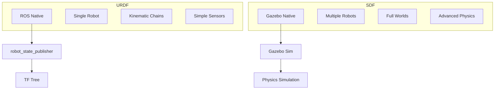
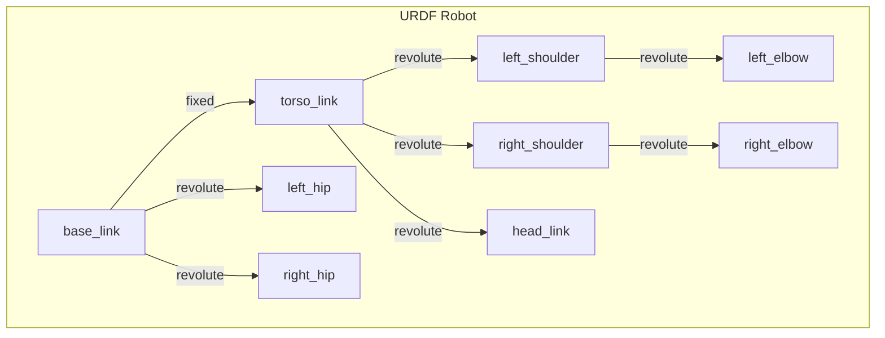
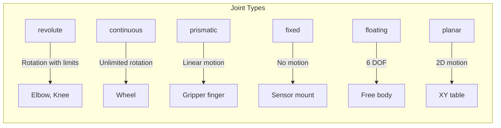
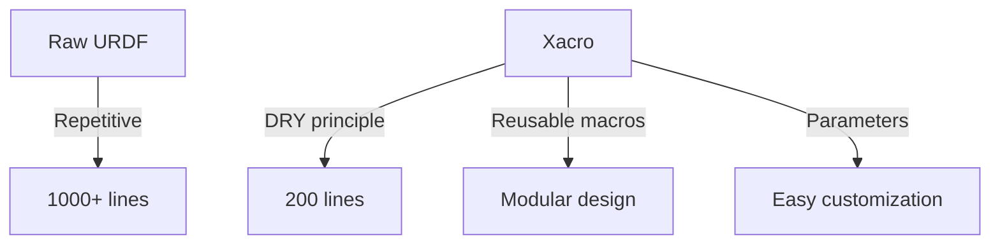

import { ChapterPersonalizeButton } from '@site/src/components/PersonalizationControls';
import { ChapterTranslateButton } from '@site/src/components/TranslationControls';

<div style={{display: 'flex', gap: '10px', marginBottom: '20px'}}>
  <ChapterPersonalizeButton chapterId="digital-twin-robot-description-formats" />
  <ChapterTranslateButton chapterId="digital-twin-robot-description-formats" />
</div>

# Robot Description Formats: URDF & SDF

Every robot in simulation needs a precise description of its physical structure—links, joints, sensors, and visual appearance. This chapter covers the two primary formats used in robotics: URDF (Unified Robot Description Format) for ROS and SDF (Simulation Description Format) for Gazebo. Understanding both is essential for creating accurate digital twins of humanoid robots.

## Learning Objectives

By the end of this chapter, you will be able to:
- Create URDF files describing robot kinematics and dynamics
- Write SDF files for Gazebo simulation
- Convert between URDF and SDF formats
- Model complex humanoid robot structures
- Add visual meshes and collision geometry
- Configure joint properties and limits

## URDF vs SDF: When to Use Each




| Feature | URDF | SDF |
|---------|------|-----|
| **Primary Use** | ROS robot description | Gazebo simulation |
| **Scope** | Single robot | Worlds + multiple robots |
| **Loops** | Not supported | Supported |
| **Sensors** | Basic | Comprehensive |
| **Physics** | Limited | Full configuration |
| **File Extension** | `.urdf`, `.xacro` | `.sdf`, `.world` |

:::tip Best Practice
Use URDF with Xacro for your robot model (ROS compatibility), then let Gazebo automatically convert it to SDF for simulation. This gives you the best of both worlds.
:::

## URDF Fundamentals

URDF (Unified Robot Description Format) is an XML format that describes a robot as a tree of links connected by joints.

### URDF Structure



### Basic URDF Template

```xml
<?xml version="1.0"?>
<robot name="simple_humanoid">

  <!-- Base link (root of the kinematic tree) -->
  <link name="base_link">
    <visual>
      <geometry>
        <box size="0.1 0.1 0.05"/>
      </geometry>
      <material name="gray">
        <color rgba="0.5 0.5 0.5 1"/>
      </material>
    </visual>
    <collision>
      <geometry>
        <box size="0.1 0.1 0.05"/>
      </geometry>
    </collision>
    <inertial>
      <mass value="1.0"/>
      <inertia ixx="0.001" ixy="0" ixz="0"
               iyy="0.001" iyz="0" izz="0.001"/>
    </inertial>
  </link>

  <!-- Torso link -->
  <link name="torso_link">
    <visual>
      <origin xyz="0 0 0.3" rpy="0 0 0"/>
      <geometry>
        <cylinder radius="0.15" length="0.6"/>
      </geometry>
      <material name="blue">
        <color rgba="0.2 0.2 0.8 1"/>
      </material>
    </visual>
    <collision>
      <origin xyz="0 0 0.3" rpy="0 0 0"/>
      <geometry>
        <cylinder radius="0.15" length="0.6"/>
      </geometry>
    </collision>
    <inertial>
      <mass value="10.0"/>
      <origin xyz="0 0 0.3"/>
      <inertia ixx="0.5" ixy="0" ixz="0"
               iyy="0.5" iyz="0" izz="0.2"/>
    </inertial>
  </link>

  <!-- Joint connecting base to torso -->
  <joint name="base_to_torso" type="fixed">
    <parent link="base_link"/>
    <child link="torso_link"/>
    <origin xyz="0 0 0.025" rpy="0 0 0"/>
  </joint>

</robot>
```

### Link Elements

Each link has three main components:

```xml
<link name="arm_link">

  <!-- Visual: What you see in visualization -->
  <visual>
    <origin xyz="0 0 0.1" rpy="0 0 0"/>
    <geometry>
      <!-- Primitives -->
      <box size="0.05 0.05 0.2"/>
      <!-- Or mesh file -->
      <!-- <mesh filename="package://my_robot/meshes/arm.stl" scale="1 1 1"/> -->
    </geometry>
    <material name="silver">
      <color rgba="0.8 0.8 0.8 1"/>
    </material>
  </visual>

  <!-- Collision: Used for physics simulation -->
  <collision>
    <origin xyz="0 0 0.1" rpy="0 0 0"/>
    <geometry>
      <!-- Often simplified from visual -->
      <box size="0.06 0.06 0.22"/>
    </geometry>
  </collision>

  <!-- Inertial: Mass properties for dynamics -->
  <inertial>
    <mass value="2.0"/>
    <origin xyz="0 0 0.1" rpy="0 0 0"/>
    <inertia ixx="0.01" ixy="0" ixz="0"
             iyy="0.01" iyz="0" izz="0.002"/>
  </inertial>

</link>
```

:::caution Collision vs Visual
Always use simplified collision geometry (boxes, cylinders, spheres) even if your visual uses detailed meshes. Complex collision meshes slow down simulation dramatically.
:::


### Joint Types

URDF supports several joint types for different motion constraints:



| Joint Type | DOF | Motion | Use Case |
|------------|-----|--------|----------|
| `revolute` | 1 | Rotation (limited) | Arm joints, knees |
| `continuous` | 1 | Rotation (unlimited) | Wheels |
| `prismatic` | 1 | Linear | Grippers, lifts |
| `fixed` | 0 | None | Rigid connections |
| `floating` | 6 | All | Mobile base |
| `planar` | 3 | X, Y, Yaw | Planar robots |

### Joint Configuration

```xml
<!-- Revolute joint (most common for humanoids) -->
<joint name="left_shoulder_pitch" type="revolute">
  <parent link="torso_link"/>
  <child link="left_upper_arm"/>

  <!-- Joint origin relative to parent -->
  <origin xyz="0.2 0.15 0.5" rpy="0 0 0"/>

  <!-- Rotation axis (in joint frame) -->
  <axis xyz="0 1 0"/>  <!-- Pitch around Y -->

  <!-- Position limits (radians) -->
  <limit lower="-3.14" upper="3.14"
         effort="100" velocity="2.0"/>

  <!-- Dynamics -->
  <dynamics damping="0.5" friction="0.1"/>

  <!-- Safety limits (optional) -->
  <safety_controller k_position="100"
                     k_velocity="10"
                     soft_lower_limit="-3.0"
                     soft_upper_limit="3.0"/>
</joint>

<!-- Continuous joint (for wheels) -->
<joint name="left_wheel" type="continuous">
  <parent link="base_link"/>
  <child link="left_wheel_link"/>
  <origin xyz="0 0.2 0" rpy="-1.5708 0 0"/>
  <axis xyz="0 0 1"/>
  <limit effort="50" velocity="10"/>
</joint>

<!-- Prismatic joint (for grippers) -->
<joint name="gripper_finger_left" type="prismatic">
  <parent link="gripper_base"/>
  <child link="finger_left"/>
  <origin xyz="0 0.02 0" rpy="0 0 0"/>
  <axis xyz="0 1 0"/>  <!-- Slide along Y -->
  <limit lower="0" upper="0.04" effort="20" velocity="0.1"/>
</joint>
```

## Xacro: URDF on Steroids

Xacro (XML Macros) extends URDF with programming features—variables, macros, and includes. Essential for complex robots.

### Why Xacro?



### Xacro Basics

```xml
<?xml version="1.0"?>
<robot xmlns:xacro="http://www.ros.org/wiki/xacro" name="humanoid">

  <!-- Properties (variables) -->
  <xacro:property name="torso_mass" value="15.0"/>
  <xacro:property name="arm_length" value="0.3"/>
  <xacro:property name="leg_length" value="0.4"/>

  <!-- Math expressions -->
  <xacro:property name="arm_mass" value="${torso_mass * 0.1}"/>
  <xacro:property name="half_arm" value="${arm_length / 2}"/>

  <!-- Include other files -->
  <xacro:include filename="$(find my_robot)/urdf/materials.xacro"/>
  <xacro:include filename="$(find my_robot)/urdf/sensors.xacro"/>

  <!-- Conditional blocks -->
  <xacro:if value="${use_gazebo}">
    <xacro:include filename="$(find my_robot)/urdf/gazebo.xacro"/>
  </xacro:if>

</robot>
```

### Creating Reusable Macros

```xml
<!-- Define a macro for arm links -->
<xacro:macro name="arm_link" params="name length radius mass">
  <link name="${name}">
    <visual>
      <origin xyz="0 0 ${length/2}" rpy="0 0 0"/>
      <geometry>
        <cylinder radius="${radius}" length="${length}"/>
      </geometry>
      <material name="arm_material"/>
    </visual>
    <collision>
      <origin xyz="0 0 ${length/2}" rpy="0 0 0"/>
      <geometry>
        <cylinder radius="${radius * 1.1}" length="${length}"/>
      </geometry>
    </collision>
    <inertial>
      <mass value="${mass}"/>
      <origin xyz="0 0 ${length/2}"/>
      <!-- Cylinder inertia formula -->
      <inertia ixx="${mass * (3*radius*radius + length*length) / 12}"
               iyy="${mass * (3*radius*radius + length*length) / 12}"
               izz="${mass * radius * radius / 2}"
               ixy="0" ixz="0" iyz="0"/>
    </inertial>
  </link>
</xacro:macro>

<!-- Use the macro -->
<xacro:arm_link name="left_upper_arm" length="0.3" radius="0.04" mass="2.0"/>
<xacro:arm_link name="left_forearm" length="0.25" radius="0.035" mass="1.5"/>
<xacro:arm_link name="right_upper_arm" length="0.3" radius="0.04" mass="2.0"/>
<xacro:arm_link name="right_forearm" length="0.25" radius="0.035" mass="1.5"/>
```


### Complete Humanoid Arm Macro

```xml
<!-- Macro for a complete arm (shoulder + elbow + wrist) -->
<xacro:macro name="humanoid_arm" params="side parent_link">

  <!-- Mirror for left/right -->
  <xacro:property name="reflect" value="${1 if side == 'left' else -1}"/>

  <!-- Shoulder link -->
  <link name="${side}_shoulder_link">
    <xacro:cylinder_inertia mass="1.0" radius="0.05" length="0.1"/>
    <visual>
      <geometry><sphere radius="0.06"/></geometry>
      <material name="joint_material"/>
    </visual>
    <collision>
      <geometry><sphere radius="0.06"/></geometry>
    </collision>
  </link>

  <!-- Shoulder pitch joint -->
  <joint name="${side}_shoulder_pitch" type="revolute">
    <parent link="${parent_link}"/>
    <child link="${side}_shoulder_link"/>
    <origin xyz="0 ${reflect * 0.2} 0.5" rpy="0 0 0"/>
    <axis xyz="0 1 0"/>
    <limit lower="-2.0" upper="2.0" effort="100" velocity="2"/>
  </joint>

  <!-- Upper arm -->
  <xacro:arm_link name="${side}_upper_arm" length="0.28" radius="0.04" mass="2.0"/>

  <!-- Shoulder roll joint -->
  <joint name="${side}_shoulder_roll" type="revolute">
    <parent link="${side}_shoulder_link"/>
    <child link="${side}_upper_arm"/>
    <origin xyz="0 ${reflect * 0.05} 0" rpy="0 0 0"/>
    <axis xyz="1 0 0"/>
    <limit lower="${-1.5 if side == 'left' else -0.5}"
           upper="${0.5 if side == 'left' else 1.5}"
           effort="80" velocity="2"/>
  </joint>

  <!-- Forearm -->
  <xacro:arm_link name="${side}_forearm" length="0.24" radius="0.035" mass="1.5"/>

  <!-- Elbow joint -->
  <joint name="${side}_elbow" type="revolute">
    <parent link="${side}_upper_arm"/>
    <child link="${side}_forearm"/>
    <origin xyz="0 0 0.28" rpy="0 0 0"/>
    <axis xyz="0 1 0"/>
    <limit lower="0" upper="2.5" effort="60" velocity="2.5"/>
  </joint>

</xacro:macro>

<!-- Create both arms -->
<xacro:humanoid_arm side="left" parent_link="torso_link"/>
<xacro:humanoid_arm side="right" parent_link="torso_link"/>
```

### Processing Xacro Files

```bash
# Convert xacro to URDF
xacro humanoid.urdf.xacro > humanoid.urdf

# With arguments
xacro humanoid.urdf.xacro use_gazebo:=true > humanoid.urdf

# Check URDF validity
checf humanoid.urdf

# Visualize in RViz
ros2 launch urdf_tutorial display.launch.py model:=humanoid.urdf
```

## SDF Format

SDF (Simulation Description Format) is Gazebo's native format with more features than URDF.

### SDF Structure

```xml
<?xml version="1.0" ?>
<sdf version="1.8">
  <model name="humanoid_robot">

    <!-- Model-level settings -->
    <static>false</static>
    <self_collide>false</self_collide>

    <!-- Links -->
    <link name="base_link">
      <pose>0 0 0.5 0 0 0</pose>

      <inertial>
        <mass>5.0</mass>
        <inertia>
          <ixx>0.1</ixx><iyy>0.10.05</izz>
        </inertia>
      </inertial>

      <collision name="base_collision">
        <geometry>
          <box><size>0.2 0.15 0.1</size></box>
        </geometry>
        <surface>
          <friction>
            <ode><mu>0.8</mu><mu2>0.8</mu2></ode>
          </friction>
        </surface>
      </collision>

      <visual name="base_visual">
        <geometry>
          <box><size>0.2 0.15 0.1</size></box>
        </geometry>
        <material>
          <ambient>0.3 0.3 0.3 1</ambient>
          <diffuse>0.5 0.5 0.5 1</diffuse>
        </material>
      </visual>
    </link>

    <!-- Joints -->
    <joint name="torso_joint" type="fixed">
      <parent>base_link</parent>
      <child>torso_link</child>
      <pose>0 0 0.05 0 0 0</pose>
    </joint>

  </model>
</sdf>
```

### SDF-Specific Features

```xml
<!-- Closed-loop kinematic chains (not possible in URDF) -->
<joint name="parallel_link" type="revolute">
  <parent>link_a</parent>
  <child>link_b</child>
  <!-- SDF allows loops! -->
</joint>

<!-- Detailed surface properties -->
<surface>
  <friction>
    <ode>
      <mu>0.9</mu>
      <mu2>0.9</mu2>
      <fdir1>1 0 0</fdir1>
      <slip1>0.0</slip1>
      <slip2>0.0</slip2>
    </ode>
    <torsional>
      <coefficient>0.1</coefficient>
      <patch_radius>0.05</patch_radius>
    </torsional>
  </friction>
  <contact>
    <ode>
      <kp>1e6</kp>
      <kd>100</kd>
      <max_vel>0.1</max_vel>
      <min_depth>0.001</min_depth>
    </ode>
  </contact>
</surface>

<!-- Sensor plugins (more options than URDF) -->
<sensor name="camera" type="camera">
  <pose>0 0 0.1 0 0 0</pose>
  <camera>
    <horizontal_fov>1.047</horizontal_fov>
    <image>
      <width>640</width>
      <height>480</height>
      <format>R8G8B8</format>
    </image>
    <clip>
      <near>0.1</near>
      <far>100</far>
    </clip>
  </camera>
  <always_on>true</always_on>
  <update_rate>30</update_rate>
</sensor>
```


## Converting Between Formats

### URDF to SDF

Gazebo automatically converts URDF to SDF, but you can also do it manually:

```bash
# Using gz tool
gz sdf -p robot.urdf > robot.sdf

# Check SDF validity
gz sdf -k robot.sdf
```

### Adding Gazebo-Specific Elements to URDF

Use `<gazebo>` tags in URDF to add SDF features:

```xml
<robot name="humanoid">
  <!-- Standard URDF content -->
  <link name="base_link">...</link>

  <!-- Gazebo-specific extensions -->
  <gazebo reference="base_link">
    <material>Gazebo/Grey</material>
    <mu1>0.8</mu1>
    <mu2>0.8</mu2>
    <kp>1e6</kp>
    <kd>100</kd>
    <selfCollide>false</selfCollide>
  </gazebo>

  <!-- Gazebo plugin for joint control -->
  <gazebo>
    <plugin filename="gz-sim-joint-state-publisher-system"
            name="gz::sim::systems::JointStatePublisher">
      <joint_name>left_shoulder_pitch</joint_name>
      <joint_name>left_elbow</joint_name>
    </plugin>
  </gazebo>

  <!-- Sensor plugin -->
  <gazebo reference="camera_link">
    <sensor name="camera" type="camera">
      <camera>
        <horizontal_fov>1.047</horizontal_fov>
        <image>
          <width>640</width>
          <height>480</height>
        </image>
      </camera>
      <always_on>true</always_on>
      <update_rate>30</update_rate>
    </sensor>
  </gazebo>

</robot>
```

## Practical Example: Humanoid Torso

Let's build a complete humanoid torso with arms using Xacro:

```xml
<?xml version="1.0"?>
<robot xmlns:xacro="http://www.ros.org/wiki/xacro" name="humanoid_torso">

  <!-- ============ PROPERTIES ============ -->
  <xacro:property name="torso_height" value="0.5"/>
  <xacro:property name="torso_width" value="0.35"/>
  <xacro:property name="torso_depth" value="0.2"/>
  <xacro:property name="torso_mass" value="15.0"/>

  <!-- ============ MATERIALS ============ -->
  <material name="white">
    <color rgba="0.9 0.9 0.9 1"/>
  </material>
  <material name="dark_gray">
    <color rgba="0.3 0.3 0.3 1"/>
  </material>
  <material name="blue">
    <color rgba="0.2 0.4 0.8 1"/>
  </material>

  <!-- ============ INERTIA MACROS ============ -->
  <xacro:macro name="box_inertia" params="mass x y z">
    <inertial>
      <mass value="${mass}"/>
      <inertia ixx="${mass*(y*y+z*z)/12}" ixy="0" ixz="0"
               iyy="${mass*(x*x+z*z)/12}" iyz="0"
               izz="${mass*(x*x+y*y)/12}"/>
    </inertial>
  </xacro:macro>

  <xacro:macro name="cylinder_inertia" params="mass r l">
    <inertial>
      <mass value="${mass}"/>
      <inertia ixx="${mass*(3*r*r+l*l)/12}" ixy="0" ixz="0"
               iyy="${mass*(3*r*r+l*l)/12}" iyz="0"
               izz="${mass*r*r/2}"/>
    </inertial>
  </xacro:macro>

  <!-- ============ BASE LINK ============ -->
  <link name="base_link"/>

  <!-- ============ TORSO ============ -->
  <link name="torso_link">
    <xacro:box_inertia mass="${torso_mass}"
                       x="${torso_depth}"
                       y="${torso_width}"
                       z="${torso_height}"/>
    <visual>
      <origin xyz="0 0 ${torso_height/2}" rpy="0 0 0"/>
      <geometry>
        <box size="${torso_depth} ${torso_width} ${torso_height}"/>
      </geometry>
      <material name="white"/>
    </visual>
    <collision>
      <origin xyz="0 0 ${torso_height/2}" rpy="0 0 0"/>
      <geometry>
        <box size="${torso_depth} ${torso_width} ${torso_height}"/>
      </geometry>
    </collision>
  </link>

  <joint name="base_torso_joint" type="fixed">
    <parent link="base_link"/>
    <child link="torso_link"/>
    <origin xyz="0 0 0" rpy="0 0 0"/>
  </joint>

  <!-- ============ ARM MACRO ============ -->
  <xacro:macro name="arm" params="side reflect">

    <!-- Shoulder -->
    <link name="${side}_shoulder_link">
      <xacro:cylinder_inertia mass="0.5" r="0.05" l="0.08"/>
      <visual>
        <geometry><sphere radius="0.06"/></geometry>
        <material name="dark_gray"/>
      </visual>
      <collision>
        <geometry><sphere radius="0.06"/></geometry>
      </collision>
    </link>

    <joint name="${side}_shoulder_pitch" type="revolute">
      <parent link="torso_link"/>
      <child link="${side}_shoulder_link"/>
      <origin xyz="0 ${reflect * (torso_width/2 + 0.03)} ${torso_height - 0.05}"
              rpy="0 0 0"/>
      <axis xyz="0 1 0"/>
      <limit lower="-2.5" upper="2.5" effort="100" velocity="2"/>
      <dynamics damping="0.5" friction="0.1"/>
    </joint>

    <!-- Upper Arm -->
    <link name="${side}_upper_arm_link">
      <xacro:cylinder_inertia mass="1.5" r="0.04" l="0.28"/>
      <visual>
        <origin xyz="0 0 -0.14" rpy="0 0 0"/>
        <geometry><cylinder radius="0.04" length="0.28"/></geometry>
        <material name="blue"/>
      </visual>
      <collision>
        <origin xyz="0 0 -0.14" rpy="0 0 0"/>
        <geometry><cylinder radius="0.045" length="0.28"/></geometry>
      </collision>
    </link>

    <joint name="${side}_shoulder_roll" type="revolute">
      <parent link="${side}_shoulder_link"/>
      <child link="${side}_upper_arm_link"/>
      <origin xyz="0 ${reflect * 0.06} 0" rpy="0 0 0"/>
      <axis xyz="1 0 0"/>
      <limit lower="${-0.5 if reflect > 0 else -2.0}"
             upper="${2.0 if reflect > 0 else 0.5}"
             effort="80" velocity="2"/>
      <dynamics damping="0.3" friction="0.1"/>
    </joint>

    <!-- Forearm -->
    <link name="${side}_forearm_link">
      <xacro:cylinder_inertia mass="1.0" r="0.035" l="0.24"/>
      <visual>
        <origin xyz="0 0 -0.12" rpy="0 0 0"/>
        <geometry><cylinder radius="0.035" length="0.24"/></geometry>
        <material name="blue"/>
      </visual>
      <collision>
        <origin xyz="0 0 -0.12" rpy="0 0 0"/>
        <geometry><cylinder radius="0.04" length="0.24"/></geometry>
      </collision>
    </link>

    <joint name="${side}_elbow" type="revolute">
      <parent link="${side}_upper_arm_link"/>
      <child link="${side}_forearm_link"/>
      <origin xyz="0 0 -0.28" rpy="0 0 0"/>
      <axis xyz="0 1 0"/>
      <limit lower="0" upper="2.5" effort="50" velocity="2.5"/>
      <dynamics damping="0.2" friction="0.1"/>
    </joint>

  </xacro:macro>

  <!-- Create both arms -->
  <xacro:arm side="left" reflect="1"/>
  <xacro:arm side="right" reflect="-1"/>

  <!-- ============ GAZEBO EXTENSIONS ============ -->
  <gazebo>
    <plugin filename="gz-sim-joint-state-publisher-system"
            name="gz::sim::systems::JointStatePublisher"/>
  </gazebo>

</robot>
```


## Visualizing Robot Models

### Using RViz

```bash
# Launch robot_state_publisher with URDF
ros2 launch urdf_tutorial display.launch.py model:=humanoid.urdf.xacro

# Or create a custom launch file
```

```python
# launch/view_robot.launch.py
from launch import LaunchDescription
from launch_ros.actions import Node
from launch.substitutions import Command
from ament_index_python.packages import get_package_share_directory
import os


def generate_launch_description():
    pkg_path = get_package_share_directory('my_humanoid')
    urdf_path = os.path.join(pkg_path, 'urdf', 'humanoid.urdf.xacro')

    robot_description = Command(['xacro ', urdf_path])

    return LaunchDescription([
        # Publish robot description
        Node(
            package='robot_state_publisher',
            executable='robot_state_publisher',
            parameters=[{'robot_description': robot_description}]
        ),

        # Joint state publisher GUI
        Node(
            package='joint_state_publisher_gui',
            executable='joint_state_publisher_gui'
        ),

        # RViz
        Node(
            package='rviz2',
            executable='rviz2',
            arguments=['-d', os.path.join(pkg_path, 'rviz', 'view_robot.rviz')]
        ),
    ])
```

### Checking Model Validity

```bash
# Check URDF syntax
check_urdf humanoid.urdf

# View URDF tree structure
urdf_to_graphviz humanoid.urdf
evince humanoid.pdf

# Check xacro processing
xacro humanoid.urdf.xacro --inorder

# Validate SDF
gz sdf -k model.sdf
```

## Common Mistakes and Solutions

| Problem | Cause | Solution |
|---------|-------|----------|
| Robot flies away | Wrong inertia values | Calculate proper inertia |
| Joints don't move | Missing transmission | Add `<transmission>` tags |
| Collision issues | Overlapping geometry | Check link origins |
| TF errors | Disconnected tree | Ensure all links connected |
| Slow simulation | Complex meshes | Simplify collision geometry |

:::caution Inertia Calculation
Never guess inertia values! Use these formulas:
- **Box**: `I = (1/12) * m * (h² + d²)`
- **Cylinder**: `Ixx = Iyy = (1/12) * m * (3r² + h²)`, `Izz = (1/2) * m * r²`
- **Sphere**: `I = (2/5) * m * r²`
:::

## Summary

In this chapter, you learned:

- **URDF** is the standard for ROS robot descriptions with links and joints
- **Xacro** adds macros and variables for maintainable robot models
- **SDF** is Gazebo's native format with advanced physics features
- **Joint types** define how links can move relative to each other
- **Inertia properties** are critical for stable physics simulation

:::tip Key Takeaway
Start with URDF/Xacro for ROS compatibility, add Gazebo extensions for simulation features. Use simplified collision geometry and accurate inertia values for stable simulation.
:::

:::note Looking Ahead
In the next chapter, we'll add sensors to our robot model—cameras, LiDAR, and IMUs—learning how to simulate the perception systems that give humanoid robots awareness of their environment.
:::

## Further Reading

- [URDF Specification](http://wiki.ros.org/urdf/XML)
- [SDF Specification](http://sdformat.org/spec)
- [Xacro Documentation](http://wiki.ros.org/xacro)
- [Gazebo Model Database](https://app.gazebosim.org/fuel/models)

---

**Next Chapter:** [Sensor Simulation](/digital-twin/sensor-simulation)
