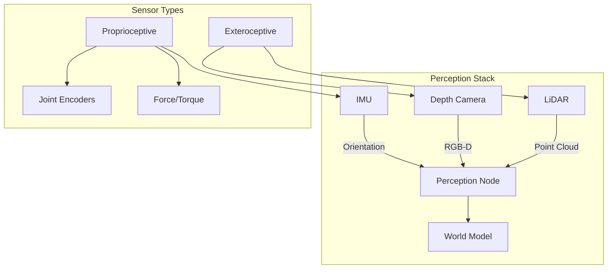
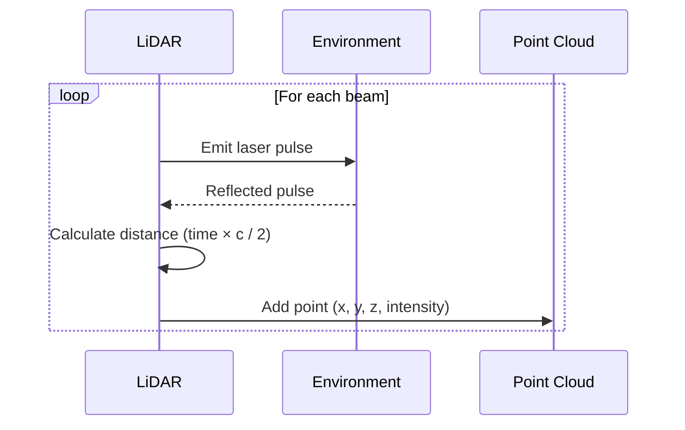
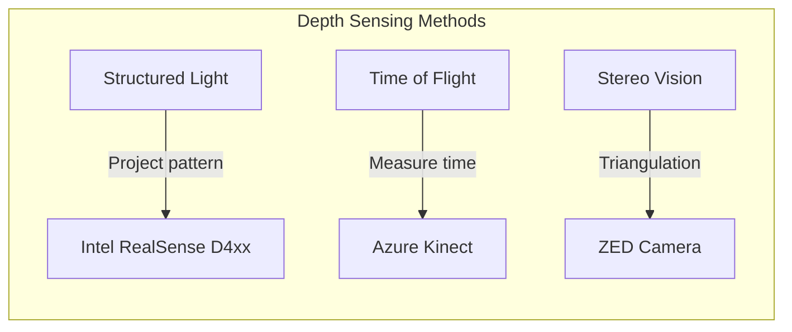
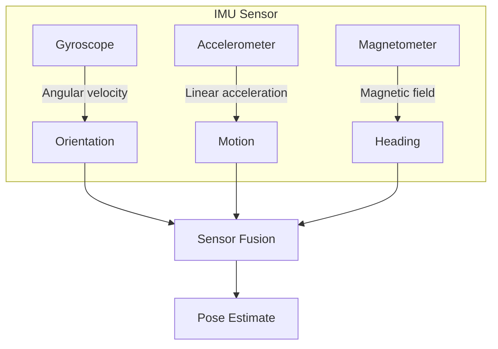
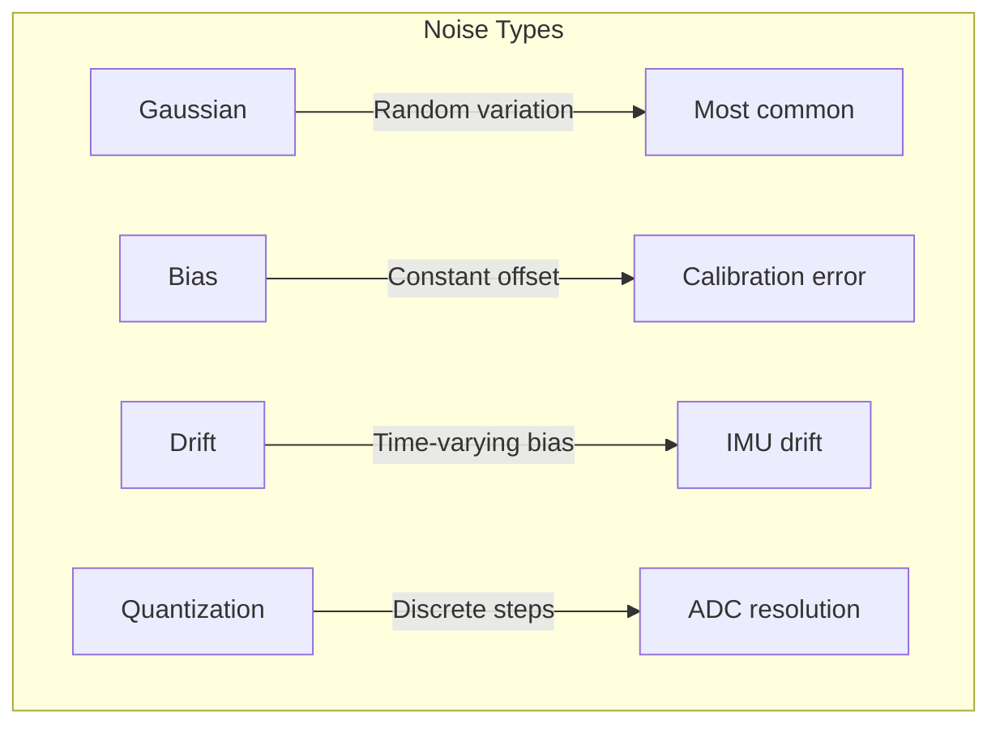

import { ChapterPersonalizeButton } from '@site/src/components/PersonalizationControls';
import { ChapterTranslateButton } from '@site/src/components/TranslationControls';

<div style={{display: 'flex', gap: '10px', marginBottom: '20px'}}>
  <ChapterPersonalizeButton chapterId="digital-twin-sensor-simulation" />
  <ChapterTranslateButton chapterId="digital-twin-sensor-simulation" />
</div>

# Sensor Simulation

Sensors are the eyes, ears, and proprioceptive system of a robot. In simulation, we need to accurately model how sensors perceive the environment—from cameras capturing images to LiDAR scanning distances to IMUs measuring motion. This chapter covers simulating the key sensors used in humanoid robotics: LiDAR, depth cameras, and IMUs.

## Learning Objectives

By the end of this chapter, you will be able to:
- Configure LiDAR sensors in Gazebo simulation
- Set up RGB and depth cameras with realistic parameters
- Simulate IMU sensors for orientation and motion tracking
- Bridge sensor data from Gazebo to ROS 2 topics
- Add noise models for realistic sensor behavior
- Combine multiple sensors for comprehensive perception

## Sensor Overview for Humanoid Robots




| Sensor | Data Type | Use Case | Update Rate |
|--------|-----------|----------|-------------|
| **LiDAR** | Point cloud | Navigation, mapping | 10-20 Hz |
| **RGB Camera** | Color image | Object recognition | 30-60 Hz |
| **Depth Camera** | Depth image | 3D perception | 30 Hz |
| **IMU** | Orientation, acceleration | Balance, motion | 100-1000 Hz |
| **Force/Torque** | Forces, moments | Manipulation | 1000 Hz |

## LiDAR Simulation

LiDAR (Light Detection and Ranging) sensors emit laser beams and measure the time for reflections to return, creating 3D point clouds of the environment.

### LiDAR Principles



### Adding LiDAR to Your Robot (SDF)

```xml
<!-- In your robot model SDF or URDF with Gazebo extensions -->
<link name="lidar_link">
  <pose>0 0 0.8 0 0 0</pose>

  <visual name="lidar_visual">
    <geometry>
      <cylinder>
        <radius>0.05</radius>
        <length>0.07</length>
      </cylinder>
    </geometry>
    <material>
      <ambient>0.1 0.1 0.1 1</ambient>
    </material>
  </visual>

  <collision name="lidar_collision">
    <geometry>
      <cylinder>
        <radius>0.05</radius>
        <length>0.07</length>
      </cylinder>
    </geometry>
  </collision>

  <sensor name="lidar" type="gpu_lidar">
    <pose>0 0 0.035 0 0 0</pose>
    <topic>lidar/points</topic>
    <update_rate>10</update_rate>

    <lidar>
      <scan>
        <horizontal>
          <samples>640</samples>
          <resolution>1</resolution>
          <min_angle>-3.14159</min_angle>
          <max_angle>3.14159</max_angle>
        </horizontal>
        <vertical>
          <samples>16</samples>
          <resolution>1</resolution>
          <min_angle>-0.26</min_angle>
          <max_angle>0.26</max_angle>
        </vertical>
      </scan>
      <range>
        <min>0.1</min>
        <max>30.0</max>
        <resolution>0.01</resolution>
      </range>
      <noise>
        <type>gaussian</type>
        <mean>0.0</mean>
        <stddev>0.01</stddev>
      </noise>
    </lidar>

    <always_on>true</always_on>
    <visualize>true</visualize>
  </sensor>
</link>
```

### LiDAR in URDF with Gazebo Plugin

```xml
<!-- Add to your URDF file -->
<link name="lidar_link">
  <visual>
    <geometry>
      <cylinder radius="0.05" length="0.07"/>
    </geometry>
  </visual>
  <collision>
    <geometry>
      <cylinder radius="0.05" length="0.07"/>
    </geometry>
  </collision>
  <inertial>
    <mass value="0.5"/>
    <inertia ixx="0.001" iyy="0.001" izz="0.001" ixy="0" ixz="0" iyz="0"/>
  </inertial>
</link>

<joint name="lidar_joint" type="fixed">
  <parent link="torso_link"/>
  <child link="lidar_link"/>
  <origin xyz="0 0 0.6" rpy="0 0 0"/>
</joint>

<!-- Gazebo sensor plugin -->
<gazebo reference="lidar_link">
  <sensor name="lidar" type="gpu_lidar">
    <topic>lidar/points</topic>
    <update_rate>10</update_rate>
    <gz_frame_id>lidar_link</gz_frame_id>
    <lidar>
      <scan>
        <horizontal>
          <samples>640</samples>
          <resolution>1</resolution>
          <min_angle>-3.14159</min_angle>
          <max_angle>3.14159</max_angle>
        </horizontal>
        <vertical>
          <samples>16</samples>
          <resolution>1</resolution>
          <min_angle>-0.26</min_angle>
          <max_angle>0.26</max_angle>
        </vertical>
      </scan>
      <range>
        <min>0.1</min>
        <max>30.0</max>
        <resolution>0.01</resolution>
      </range>
    </lidar>
    <always_on>true</always_on>
    <visualize>true</visualize>
  </sensor>
</gazebo>
```

### Common LiDAR Configurations

| LiDAR Type | Channels | H-FOV | V-FOV | Range | Example |
|------------|----------|-------|-------|-------|---------|
| 2D | 1 | 360° | 0° | 30m | RPLidar A1 |
| 3D (16ch) | 16 | 360° | 30° | 100m | Velodyne VLP-16 |
| 3D (32ch) | 32 | 360° | 40° | 200m | Ouster OS1-32 |
| Solid State | 128 | 120° | 25° | 200m | Livox Avia |


## Depth Camera Simulation

Depth cameras (RGB-D) provide both color images and per-pixel depth information—essential for 3D perception in humanoid robots.

### Depth Camera Technologies



| Technology | Pros | Cons | Example |
|------------|------|------|---------|
| **Structured Light** | Accurate indoors | Fails in sunlight | RealSense D435 |
| **Time of Flight** | Works outdoors | Lower resolution | Azure Kinect |
| **Stereo** | Passive, works anywhere | Needs texture | ZED 2 |

### Adding a Depth Camera (SDF)

```xml
<link name="camera_link">
  <pose>0.1 0 0.7 0 0 0</pose>

  <visual name="camera_visual">
    <geometry>
      <box><size>0.02 0.09 0.025</size></box>
    </geometry>
    <material>
      <ambient>0.1 0.1 0.1 1</ambient>
    </material>
  </visual>

  <sensor name="rgbd_camera" type="rgbd_camera">
    <topic>camera</topic>
    <update_rate>30</update_rate>

    <camera>
      <horizontal_fov>1.047</horizontal_fov>  <!-- 60 degrees -->
      <image>
        <width>640</width>
        <height>480</height>
        <format>R8G8B8</format>
      </image>
      <clip>
        <near>0.1</near>
        <far>10.0</far>
      </clip>
      <depth_camera>
        <clip>
          <near>0.1</near>
          <far>10.0</far>
        </clip>
      </depth_camera>
      <noise>
        <type>gaussian</type>
        <mean>0.0</mean>
        <stddev>0.007</stddev>
      </noise>
    </camera>

    <always_on>true</always_on>
    <visualize>true</visualize>
  </sensor>
</link>
```

### Intel RealSense D435i Configuration

```xml
<!-- Simulating RealSense D435i specs -->
<sensor name="realsense_d435i" type="rgbd_camera">
  <topic>camera/realsense</topic>
  <update_rate>30</update_rate>

  <camera>
    <!-- RGB camera specs -->
    <horizontal_fov>1.21</horizontal_fov>  <!-- 69.4° -->
    <image>
      <width>1280</width>
      <height>720</height>
      <format>R8G8B8</format>
    </image>

    <!-- Depth camera specs -->
    <depth_camera>
      <clip>
        <near>0.105</near>  <!-- Min depth 10.5cm -->
        <far>10.0</far>     <!-- Max depth 10m -->
      </clip>
    </depth_camera>

    <!-- Realistic noise model -->
    <noise>
      <type>gaussian</type>
      <mean>0.0</mean>
      <stddev>0.005</stddev>  <!-- ~5mm noise -->
    </noise>
  </camera>

  <always_on>true</always_on>
</sensor>

<!-- Separate IMU sensor (D435i has built-in IMU) -->
<sensor name="realsense_imu" type="imu">
  <topic>camera/imu</topic>
  <update_rate>200</update_rate>
  <imu>
    <angular_velocity>
      <x><noise type="gaussian"><mean>0</mean><stddev>0.0003</stddev></noise></x>
      <y><noise type="gaussian"><mean>0</mean><stddev>0.0003</stddev></noise></y>
      <z><noise type="gaussian"><mean>0</mean><stddev>0.0003</stddev></noise></z>
    </angular_velocity>
    <linear_acceleration>
      <x><noise type="gaussian"><mean>0</mean><stddev>0.003</stddev></noise></x>
      <y><noise type="gaussian"><mean>0</mean><stddev>0.003</stddev></noise></y>
      <z><noise type="gaussian"><mean>0</mean><stddev>0.003</stddev></noise></z>
    </linear_acceleration>
  </imu>
  <always_on>true</always_on>
</sensor>
```

### Depth Camera in URDF

```xml
<link name="camera_link">
  <visual>
    <geometry>
      <box size="0.02 0.09 0.025"/>
    </geometry>
    <material name="camera_black">
      <color rgba="0.1 0.1 0.1 1"/>
    </material>
  </visual>
  <collision>
    <geometry>
      <box size="0.02 0.09 0.025"/>
    </geometry>
  </collision>
  <inertial>
    <mass value="0.072"/>  <!-- RealSense D435 weight -->
    <inertia ixx="0.00001" iyy="0.00001" izz="0.00001"
             ixy="0" ixz="0" iyz="0"/>
  </inertial>
</link>

<joint name="camera_joint" type="fixed">
  <parent link="head_link"/>
  <child link="camera_link"/>
  <origin xyz="0.05 0 0" rpy="0 0 0"/>
</joint>

<!-- Optical frame (Z forward, X right, Y down) -->
<link name="camera_optical_frame"/>
<joint name="camera_optical_joint" type="fixed">
  <parent link="camera_link"/>
  <child link="camera_optical_frame"/>
  <origin xyz="0 0 0" rpy="-1.5708 0 -1.5708"/>
</joint>

<gazebo reference="camera_link">
  <sensor name="rgbd_camera" type="rgbd_camera">
    <topic>camera</topic>
    <update_rate>30</update_rate>
    <camera>
      <horizontal_fov>1.21</horizontal_fov>
      <image>
        <width>640</width>
        <height>480</height>
      </image>
      <clip><near>0.1</near><far>10</far></clip>
    </camera>
    <always_on>true</always_on>
  </sensor>
</gazebo>
```


## IMU Simulation

The Inertial Measurement Unit (IMU) measures angular velocity and linear acceleration—critical for humanoid balance and motion estimation.

### IMU Components



| Component | Measures | Units | Typical Noise |
|-----------|----------|-------|---------------|
| **Gyroscope** | Angular velocity | rad/s | 0.01 rad/s |
| **Accelerometer** | Linear acceleration | m/s² | 0.1 m/s² |
| **Magnetometer** | Magnetic field | μT | 0.5 μT |

### Adding IMU to Your Robot (SDF)

```xml
<link name="imu_link">
  <pose>0 0 0.5 0 0 0</pose>

  <inertial>
    <mass>0.01</mass>
    <inertia>
      <ixx>0.000001</ixx>
      <iyy>0.000001</iyy>
      <izz>0.000001</izz>
    </inertia>
  </inertial>

  <sensor name="imu_sensor" type="imu">
    <topic>imu/data</topic>
    <update_rate>200</update_rate>

    <imu>
      <!-- Gyroscope configuration -->
      <angular_velocity>
        <x>
          <noise type="gaussian">
            <mean>0.0</mean>
            <stddev>0.0003</stddev>  <!-- rad/s -->
            <bias_mean>0.0001</bias_mean>
            <bias_stddev>0.00001</bias_stddev>
          </noise>
        </x>
        <y>
          <noise type="gaussian">
            <mean>0.0</mean>
            <stddev>0.0003</stddev>
            <bias_mean>0.0001</bias_mean>
            <bias_stddev>0.00001</bias_stddev>
          </noise>
        </y>
        <z>
          <noise type="gaussian">
            <mean>0.0</mean>
            <stddev>0.0003</stddev>
            <bias_mean>0.0001</bias_mean>
            <bias_stddev>0.00001</bias_stddev>
          </noise>
        </z>
      </angular_velocity>

      <!-- Accelerometer configuration -->
      <linear_acceleration>
        <x>
          <noise type="gaussian">
            <mean>0.0</mean>
            <stddev>0.017</stddev>  <!-- m/s² -->
            <bias_mean>0.001</bias_mean>
            <bias_stddev>0.0001</bias_stddev>
          </noise>
        </x>
        <y>
          <noise type="gaussian">
            <mean>0.0</mean>
            <stddev>0.017</stddev>
            <bias_mean>0.001</bias_mean>
            <bias_stddev>0.0001</bias_stddev>
          </noise>
        </y>
        <z>
          <noise type="gaussian">
            <mean>0.0</mean>
            <stddev>0.017</stddev>
            <bias_mean>0.001</bias_mean>
            <bias_stddev>0.0001</bias_stddev>
          </noise>
        </z>
      </linear_acceleration>
    </imu>

    <always_on>true</always_on>
  </sensor>
</link>
```

### IMU in URDF with Gazebo Plugin

```xml
<link name="imu_link">
  <visual>
    <geometry>
      <box size="0.02 0.02 0.01"/>
    </geometry>
  </visual>
  <inertial>
    <mass value="0.01"/>
    <inertia ixx="0.000001" iyy="0.000001" izz="0.000001"
             ixy="0" ixz="0" iyz="0"/>
  </inertial>
</link>

<joint name="imu_joint" type="fixed">
  <parent link="torso_link"/>
  <child link="imu_link"/>
  <origin xyz="0 0 0.3" rpy="0 0 0"/>
</joint>

<gazebo reference="imu_link">
  <sensor name="imu" type="imu">
    <topic>imu/data</topic>
    <update_rate>200</update_rate>
    <gz_frame_id>imu_link</gz_frame_id>
    <imu>
      <angular_velocity>
        <x><noise type="gaussian"><mean>0</mean><stddev>0.0003</stddev></noise></x>
        <y><noise type="gaussian"><mean>0</mean><stddev>0.0003</stddev></noise></y>
        <z><noise type="gaussian"><mean>0</mean><stddev>0.0003</stddev></noise></z>
      </angular_velocity>
      <linear_acceleration>
        <x><noise type="gaussian"><mean>0</mean><stddev>0.017</stddev></noise></x>
        <y><noise type="gaussian"><mean>0</mean><stddev>0.017</stddev></noise></y>
        <z><noise type="gaussian"><mean>0</mean><stddev>0.017</stddev></noise></z>
      </linear_acceleration>
    </imu>
    <always_on>true</always_on>
  </sensor>
</gazebo>
```

### IMU Data Processing

```python
#!/usr/bin/env python3
"""Process IMU data for humanoid balance estimation."""

import rclpy
from rclpy.node import Node
from sensor_msgs.msg import Imu
from geometry_msgs.msg import Vector3
import numpy as np
from scipy.spatial.transform import Rotation


class IMUProcessor(Node):
    """Process IMU data for balance control."""

    def __init__(self):
        super().__init__('imu_processor')

        self.subscription = self.create_subscription(
            Imu,
            '/imu/data',
            self.imu_callback,
            10
        )

        self.orientation_pub = self.create_publisher(
            Vector3,
            '/robot/orientation_euler',
            10
        )

        # Complementary filter parameters
        self.alpha = 0.98  # Gyro weight
        self.orientation = np.array([0.0, 0.0, 0.0])  # Roll, pitch, yaw
        self.last_time = None

        self.get_logger().info('IMU processor started')

    def imu_callback(self, msg: Imu):
        """Process incoming IMU data."""
        current_time = self.get_clock().now()

        if self.last_time is None:
            self.last_time = current_time
            return

        # Calculate dt
        dt = (current_time - self.last_time).nanoseconds / 1e9
        self.last_time = current_time

        # Get angular velocity
        gyro = np.array([
            msg.angular_velocity.x,
            msg.angular_velocity.y,
            msg.angular_velocity.z
        ])

        # Get acceleration
        accel = np.array([
            msg.linear_acceleration.x,
            msg.linear_acceleration.y,
            msg.linear_acceleration.z
        ])

        # Calculate orientation from accelerometer
        accel_roll = np.arctan2(accel[1], accel[2])
        accel_pitch = np.arctan2(-accel[0],
                                  np.sqrt(accel[1]**2 + accel[2]**2))

        # Complementary filter
        self.orientation[0] = self.alpha * (self.orientation[0] + gyro[0] * dt) + \
                              (1 - self.alpha) * accel_roll
        self.orientation[1] = self.alpha * (self.orientation[1] + gyro[1] * dt) + \
                              (1 - self.alpha) * accel_pitch
        self.orientation[2] += gyro[2] * dt  # Yaw from gyro only

        # Publish Euler angles
        euler_msg = Vector3()
        euler_msg.x = np.degrees(self.orientation[0])  # Roll
        euler_msg.y = np.degrees(self.orientation[1])  # Pitch
        euler_msg.z = np.degrees(self.orientation[2])  # Yaw
        self.orientation_pub.publish(euler_msg)

        # Check for dangerous tilt
        if abs(self.orientation[0]) > 0.5 or abs(self.orientation[1]) > 0.5:
            self.get_logger().warn(
                f'Robot tilting! Roll: {np.degrees(self.orientation[0]):.1f}°, '
                f'Pitch: {np.degrees(self.orientation[1]):.1f}°'
            )


def main():
    rclpy.init()
    node = IMUProcessor()
    rclpy.spin(node)
    rclpy.shutdown()


if __name__ == '__main__':
    main()
```


## Bridging Sensors to ROS 2

Gazebo sensor data needs to be bridged to ROS 2 topics for your robot's perception stack.

### ROS-Gazebo Bridge Configuration

```bash
# Bridge LiDAR point cloud
ros2 run ros_gz_bridge parameter_bridge \
  /lidar/points@sensor_msgs/msg/PointCloud2[gz.msgs.PointCloudPacked

# Bridge camera image
ros2 run ros_gz_bridge parameter_bridge \
  /camera/image@sensor_msgs/msg/Image[gz.msgs.Image

# Bridge depth image
ros2 run ros_gz_bridge parameter_bridge \
  /camera/depth@sensor_msgs/msg/Image[gz.msgs.Image

# Bridge camera info
ros2 run ros_gz_bridge parameter_bridge \
  /camera/camera_info@sensor_msgs/msg/CameraInfo[gz.msgs.CameraInfo

# Bridge IMU
ros2 run ros_gz_bridge parameter_bridge \
  /imu/data@sensor_msgs/msg/Imu[gz.msgs.IMU
```

### Launch File with All Bridges

```python
# launch/sensor_bridge.launch.py
from launch import LaunchDescription
from launch_ros.actions import Node


def generate_launch_description():
    # Define all sensor bridges
    bridges = [
        # LiDAR
        '/lidar/points@sensor_msgs/msg/PointCloud2[gz.msgs.PointCloudPacked',

        # RGB Camera
        '/camera/image@sensor_msgs/msg/Image[gz.msgs.Image',
        '/camera/camera_info@sensor_msgs/msg/CameraInfo[gz.msgs.CameraInfo',

        # Depth Camera
        '/camera/depth@sensor_msgs/msg/Image[gz.msgs.Image',
        '/camera/depth/camera_info@sensor_msgs/msg/CameraInfo[gz.msgs.CameraInfo',

        # IMU
        '/imu/data@sensor_msgs/msg/Imu[gz.msgs.IMU',

        # Clock (essential for time sync)
        '/clock@rosgraph_msgs/msg/Clock[gz.msgs.Clock',
    ]

    return LaunchDescription([
        Node(
            package='ros_gz_bridge',
            executable='parameter_bridge',
            arguments=bridges,
            output='screen'
        ),
    ])
```

## Sensor Noise Models

Realistic simulation requires adding noise to sensor data.

### Types of Sensor Noise



### Configuring Noise in Gazebo

```xml
<!-- Gaussian noise -->
<noise type="gaussian">
  <mean>0.0</mean>
  <stddev>0.01</stddev>
</noise>

<!-- Gaussian with bias -->
<noise type="gaussian">
  <mean>0.0</mean>
  <stddev>0.01</stddev>
  <bias_mean>0.001</bias_mean>
  <bias_stddev>0.0001</bias_stddev>
</noise>

<!-- Custom noise for depth camera -->
<noise type="gaussian">
  <mean>0.0</mean>
  <!-- Noise increases with distance -->
  <stddev>0.005</stddev>  <!-- Base noise -->
</noise>
```

### Realistic Noise Parameters

| Sensor | Parameter | Typical Value |
|--------|-----------|---------------|
| **LiDAR** | Range noise | 0.01-0.03 m |
| **RGB Camera** | Pixel noise | 0.005-0.01 |
| **Depth Camera** | Depth noise | 0.005-0.02 m |
| **IMU Gyro** | Angular velocity | 0.0003 rad/s |
| **IMU Accel** | Linear acceleration | 0.017 m/s² |

## Complete Sensor Suite Example

Here's a complete humanoid robot with all sensors:

```xml
<?xml version="1.0"?>
<robot xmlns:xacro="http://www.ros.org/wiki/xacro" name="humanoid_sensors">

  <!-- Include base robot -->
  <xacro:include filename="$(find humanoid_description)/urdf/humanoid_base.urdf.xacro"/>

  <!-- ============ HEAD CAMERA ============ -->
  <link name="head_camera_link">
    <visual>
      <geometry><box size="0.02 0.09 0.025"/></geometry>
      <material name="black"/>
    </visual>
    <collision>
      <geometry><box size="0.02 0.09 0.025"/></geometry>
    </collision>
    <inertial>
      <mass value="0.072"/>
      <inertia ixx="0.00001" iyy="0.00001" izz="0.00001" ixy="0" ixz="0" iyz="0"/>
    </inertial>
  </link>

  <joint name="head_camera_joint" type="fixed">
    <parent link="head_link"/>
    <child link="head_camera_link"/>
    <origin xyz="0.08 0 0" rpy="0 0 0"/>
  </joint>

  <gazebo reference="head_camera_link">
    <sensor name="head_rgbd" type="rgbd_camera">
      <topic>head_camera</topic>
      <update_rate>30</update_rate>
      <camera>
        <horizontal_fov>1.21</horizontal_fov>
        <image><width>640</width><height>480</height></image>
        <clip><near>0.1</near><far>10</far></clip>
      </camera>
      <always_on>true</always_on>
    </sensor>
  </gazebo>

  <!-- ============ TORSO IMU ============ -->
  <link name="torso_imu_link">
    <visual>
      <geometry><box size="0.02 0.02 0.01"/></geometry>
      <material name="green"/>
    </visual>
    <inertial>
      <mass value="0.01"/>
      <inertia ixx="0.000001" iyy="0.000001" izz="0.000001" ixy="0" ixz="0" iyz="0"/>
    </inertial>
  </link>

  <joint name="torso_imu_joint" type="fixed">
    <parent link="torso_link"/>
    <child link="torso_imu_link"/>
    <origin xyz="0 0 0.25" rpy="0 0 0"/>
  </joint>

  <gazebo reference="torso_imu_link">
    <sensor name="torso_imu" type="imu">
      <topic>torso/imu</topic>
      <update_rate>200</update_rate>
      <imu>
        <angular_velocity>
          <x><noise type="gaussian"><mean>0</mean><stddev>0.0003</stddev></noise></x>
          <y><noise type="gaussian"><mean>0</mean><stddev>0.0003</stddev></noise></y>
          <z><noise type="gaussian"><mean>0</mean><stddev>0.0003</stddev></noise></z>
        </angular_velocity>
        <linear_acceleration>
          <x><noise type="gaussian"><mean>0</mean><stddev>0.017</stddev></noise></x>
          <y><noise type="gaussian"><mean>0</mean><stddev>0.017</stddev></noise></y>
          <z><noise type="gaussian"><mean>0</mean><stddev>0.017</stddev></noise></z>
        </linear_acceleration>
      </imu>
      <always_on>true</always_on>
    </sensor>
  </gazebo>

  <!-- ============ NAVIGATION LIDAR ============ -->
  <link name="nav_lidar_link">
    <visual>
      <geometry><cylinder radius="0.05" length="0.07"/></geometry>
      <material name="dark_gray"/>
    </visual>
    <collision>
      <geometry><cylinder radius="0.05" length="0.07"/></geometry>
    </collision>
    <inertial>
      <mass value="0.5"/>
      <inertia ixx="0.001" iyy="0.001" izz="0.001" ixy="0" ixz="0" iyz="0"/>
    </inertial>
  </link>

  <joint name="nav_lidar_joint" type="fixed">
    <parent link="torso_link"/>
    <child link="nav_lidar_link"/>
    <origin xyz="0 0 0.55" rpy="0 0 0"/>
  </joint>

  <gazebo reference="nav_lidar_link">
    <sensor name="nav_lidar" type="gpu_lidar">
      <topic>scan</topic>
      <update_rate>10</update_rate>
      <lidar>
        <scan>
          <horizontal>
            <samples>360</samples>
            <min_angle>-3.14159</min_angle>
            <max_angle>3.14159</max_angle>
          </horizontal>
        </scan>
        <range><min>0.1</min><max>12</max></range>
        <noise type="gaussian"><mean>0</mean><stddev>0.01</stddev></noise>
      </lidar>
      <always_on>true</always_on>
      <visualize>true</visualize>
    </sensor>
  </gazebo>

</robot>
```


## Visualizing Sensor Data

### RViz Configuration for Sensors

```python
# launch/visualize_sensors.launch.py
from launch import LaunchDescription
from launch_ros.actions import Node
from ament_index_python.packages import get_package_share_directory
import os


def generate_launch_description():
    pkg_path = get_package_share_directory('humanoid_description')
    rviz_config = os.path.join(pkg_path, 'rviz', 'sensors.rviz')

    return LaunchDescription([
        Node(
            package='rviz2',
            executable='rviz2',
            arguments=['-d', rviz_config],
            output='screen'
        ),
    ])
```

### RViz Display Configuration

```yaml
# rviz/sensors.rviz
Visualization Manager:
  Displays:
    - Class: rviz_default_plugins/RobotModel
      Name: Robot
      Robot Description: robot_description

    - Class: rviz_default_plugins/PointCloud2
      Name: LiDAR
      Topic: /scan
      Size (m): 0.02
      Color Transformer: Intensity

    - Class: rviz_default_plugins/Image
      Name: RGB Camera
      Topic: /head_camera/image

    - Class: rviz_default_plugins/Image
      Name: Depth Camera
      Topic: /head_camera/depth

    - Class: rviz_default_plugins/Imu
      Name: IMU
      Topic: /torso/imu
      Acceleration Arrow Scale: 0.1
```

## Summary

In this chapter, you learned how to simulate the key sensors for humanoid robots:

- **LiDAR** provides 3D point clouds for navigation and mapping
- **Depth Cameras** give RGB-D data for perception and manipulation
- **IMUs** measure orientation and motion for balance control
- **Noise models** make simulation more realistic
- **ROS-Gazebo bridge** connects sensor data to your perception stack

<div className="key-takeaway">

Accurate sensor simulation is crucial for developing perception algorithms that transfer to real robots. Always add realistic noise models and validate sensor parameters against real hardware specifications.

</div>

:::note Looking Ahead
In the next chapter, we'll explore Unity for high-fidelity robot visualization, learning how to create photorealistic environments for human-robot interaction testing.
:::

## Further Reading

- [Gazebo Sensor Plugins](https://gazebosim.org/docs/harmonic/sensors)
- [Intel RealSense Gazebo Plugin](https://github.com/IntelRealSense/realsense-ros)
- [ROS 2 Sensor Messages](https://docs.ros.org/en/humble/p/sensor_msgs/)
- [IMU Sensor Fusion](https://www.bzarg.com/p/how-a-kalman-filter-works-in-pictures/)

---

**Next Chapter:** [Unity for Robot Visualization](/digital-twin/unity-visualization)
