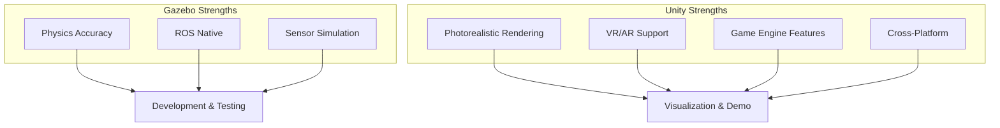
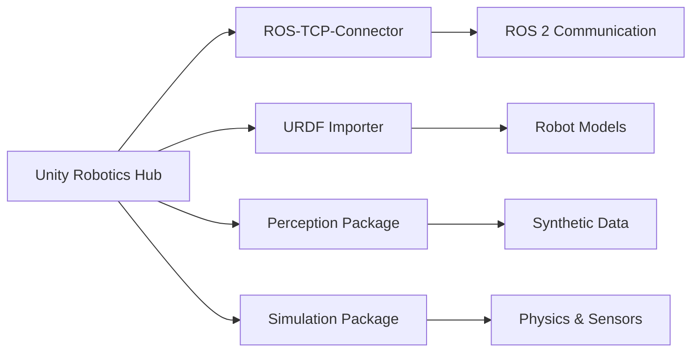
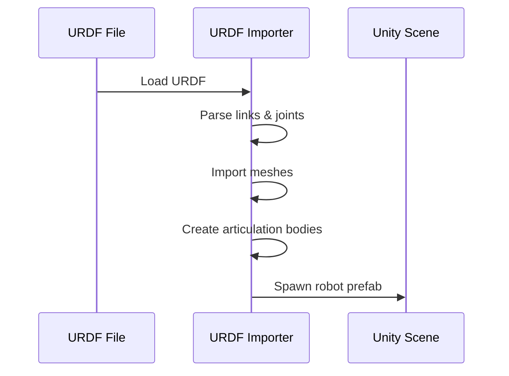

import { ChapterPersonalizeButton } from '@site/src/components/PersonalizationControls';
import { ChapterTranslateButton } from '@site/src/components/TranslationControls';

<div style={{display: 'flex', gap: '10px', marginBottom: '20px'}}>
  <ChapterPersonalizeButton chapterId="digital-twin-unity-visualization" />
  <ChapterTranslateButton chapterId="digital-twin-unity-visualization" />
</div>

# Unity for Robot Visualization

While Gazebo excels at physics simulation, Unity brings photorealistic rendering and advanced visualization capabilities to robotics. In this chapter, you'll learn how to use Unity for high-fidelity robot visualization, creating immersive environments for human-robot interaction testing and demonstration.

## Learning Objectives

By the end of this chapter, you will be able to:
- Understand Unity's role in robotics visualization
- Set up Unity with ROS 2 integration
- Import robot models (URDF) into Unity
- Create photorealistic environments for robot testing
- Visualize sensor data in Unity
- Build interactive demonstrations for stakeholders

## Why Unity for Robotics?




| Feature | Gazebo | Unity |
|---------|--------|-------|
| **Physics** | Accurate, configurable | Good, game-focused |
| **Rendering** | Functional | Photorealistic |
| **ROS Integration** | Native | Via packages |
| **Learning Curve** | Moderate | Steeper |
| **VR/AR** | Limited | Excellent |
| **Use Case** | Development | Visualization, demos |

:::tip When to Use Unity
Use Unity when you need:
- Photorealistic visuals for presentations
- VR/AR human-robot interaction studies
- Training data generation with realistic images
- Interactive demonstrations for non-technical stakeholders
:::

## Unity Robotics Hub

Unity provides official packages for robotics development through the Unity Robotics Hub.

### Key Packages



| Package | Purpose |
|---------|---------|
| **ROS-TCP-Connector** | Bidirectional ROS 2 communication |
| **URDF Importer** | Import robot models from URDF |
| **Perception** | Synthetic data generation, labeling |
| **Simulation** | Physics, articulation bodies |

## Setting Up Unity for Robotics

### Prerequisites

1. Unity Hub installed
2. Unity 2021.3 LTS or newer
3. ROS 2 Humble installed
4. Basic C# knowledge

### Installation Steps

```bash
# 1. Install Unity Hub (download from unity.com)

# 2. Install Unity 2021.3 LTS via Unity Hub

# 3. Clone the ROS-TCP-Endpoint for ROS 2
cd ~/ros2_ws/src
git clone -b main-ros2 https://github.com/Unity-Technologies/ROS-TCP-Endpoint.git

# 4. Build the ROS 2 workspace
cd ~/ros2_ws
colcon build --packages-select ros_tcp_endpoint
source install/setup.bash
```

### Unity Project Setup

1. Create new Unity project (3D URP template recommended)
2. Open Package Manager (Window → Package Manager)
3. Add packages from git URL:

```
https://github.com/Unity-Technologies/ROS-TCP-Connector.git?path=/com.unity.robotics.ros-tcp-connector
https://github.com/Unity-Technologies/URDF-Importer.git?path=/com.unity.robotics.urdf-importer
```

### Configure ROS Connection

```csharp
// In Unity: Robotics → ROS Settings
// Set ROS IP Address: 127.0.0.1 (or your ROS machine IP)
// Set ROS Port: 10000
```

```bash
# Start ROS TCP endpoint
ros2 run ros_tcp_endpoint default_server_endpoint --ros-args -p ROS_IP:=0.0.0.0
```


## Importing Robot Models

### URDF Import Process



### Import Steps

1. Copy your URDF folder to Unity's `Assets/` directory
2. In Unity: Assets → Import Robot from URDF
3. Select your `.urdf` file
4. Configure import settings:

```csharp
// Import settings (in Unity Inspector)
public class URDFImportSettings
{
    public bool useUrdfInertiaData = true;
    public bool useGravity = true;
    public float defaultMass = 1.0f;
    public ImportPipelineType pipeline = ImportPipelineType.ArticulationBody;
}
```

### Articulation Bodies vs Rigidbodies

| Feature | Articulation Body | Rigidbody + Joints |
|---------|-------------------|-------------------|
| **Stability** | Very stable | Can be unstable |
| **Performance** | Better for chains | Better for few bodies |
| **Use Case** | Robot arms, humanoids | Simple mechanisms |
| **Joint Types** | All standard types | All standard types |

:::tip Best Practice
Always use Articulation Bodies for robot models. They're specifically designed for robotic kinematic chains and provide much more stable simulation.
:::

### Post-Import Configuration

```csharp
using UnityEngine;
using Unity.Robotics.UrdfImporter;

public class RobotSetup : MonoBehaviour
{
    void Start()
    {
        // Get all articulation bodies
        var articulationBodies = GetComponentsInChildren<ArticulationBody>();

        foreach (var body in articulationBodies)
        {
            // Configure joint drives for position control
            if (body.jointType == ArticulationJointType.RevoluteJoint)
            {
                var drive = body.xDrive;
                drive.stiffness = 10000f;
                drive.damping = 100f;
                drive.forceLimit = float.MaxValue;
                body.xDrive = drive;
            }
        }
    }
}
```

## Creating Photorealistic Environments

### Universal Render Pipeline (URP) Setup

Unity's URP provides high-quality rendering with good performance.

```csharp
// Recommended URP settings for robotics visualization
// Edit → Project Settings → Graphics

// Quality Settings:
// - Anti-aliasing: 4x MSAA
// - Shadow Resolution: 2048
// - Shadow Distance: 50m
// - Soft Shadows: Enabled
```

### Lighting for Realism

```csharp
using UnityEngine;

public class RealisticLighting : MonoBehaviour
{
    [Header("Main Light")]
    public Light sunLight;
    public float sunIntensity = 1.5f;
    public Color sunColor = new Color(1f, 0.95f, 0.9f);

    [Header("Ambient")]
    public Color ambientColor = new Color(0.4f, 0.45f, 0.5f);

    void Start()
    {
        // Configure sun light
        sunLight.type = LightType.Directional;
        sunLight.intensity = sunIntensity;
        sunLight.color = sunColor;
        sunLight.shadows = LightShadows.Soft;
        sunLight.shadowStrength = 0.8f;

        // Configure ambient lighting
        RenderSettings.ambientMode = UnityEngine.Rendering.AmbientMode.Flat;
        RenderSettings.ambientLight = ambientColor;

        // Enable reflection probes
        RenderSettings.defaultReflectionMode =
            UnityEngine.Rendering.DefaultReflectionMode.Skybox;
    }
}
```

### Material Setup for Robot Parts

```csharp
using UnityEngine;

public class RobotMaterials : MonoBehaviour
{
    public Material metalMaterial;
    public Material plasticMaterial;
    public Material rubberMaterial;

    void SetupMaterials()
    {
        // Metal (brushed aluminum)
        metalMaterial.SetFloat("_Metallic", 0.9f);
        metalMaterial.SetFloat("_Smoothness", 0.6f);
        metalMaterial.SetColor("_BaseColor", new Color(0.8f, 0.8f, 0.85f));

        // Plastic (robot shell)
        plasticMaterial.SetFloat("_Metallic", 0.0f);
        plasticMaterial.SetFloat("_Smoothness", 0.7f);
        plasticMaterial.SetColor("_BaseColor", Color.white);

        // Rubber (grippers, feet)
        rubberMaterial.SetFloat("_Metallic", 0.0f);
        rubberMaterial.SetFloat("_Smoothness", 0.2f);
        rubberMaterial.SetColor("_BaseColor", new Color(0.1f, 0.1f, 0.1f));
    }
}
```


## ROS 2 Communication

### Publishing from Unity to ROS 2

```csharp
using UnityEngine;
using Unity.Robotics.ROSTCPConnector;
using RosMessageTypes.Geometry;
using RosMessageTypes.Std;

public class JointStatePublisher : MonoBehaviour
{
    ROSConnection ros;
    public string topicName = "/unity/joint_states";
    public float publishRate = 50f; // Hz

    private ArticulationBody[] joints;
    private float timeElapsed;

    void Start()
    {
        ros = ROSConnection.GetOrCreateInstance();
        ros.RegisterPublisher<JointStateMsg>(topicName);

        // Get all joints
        joints = GetComponentsInChildren<ArticulationBody>();
    }

    void FixedUpdate()
    {
        timeElapsed += Time.deltaTime;

        if (timeElapsed >= 1f / publishRate)
        {
            PublishJointStates();
            timeElapsed = 0;
        }
    }

    void PublishJointStates()
    {
        var msg = new JointStateMsg();

        var names = new List<string>();
        var positions = new List<double>();
        var velocities = new List<double>();

        foreach (var joint in joints)
        {
            if (joint.jointType != ArticulationJointType.FixedJoint)
            {
                names.Add(joint.name);
                positions.Add(joint.jointPosition[0]);
                velocities.Add(joint.jointVelocity[0]);
            }
        }

        msg.name = names.ToArray();
        msg.position = positions.ToArray();
        msg.velocity = velocities.ToArray();
        msg.header.stamp = new TimeMsg();  // Add timestamp

        ros.Publish(topicName, msg);
    }
}
```

### Subscribing to ROS 2 Topics

```csharp
using UnityEngine;
using Unity.Robotics.ROSTCPConnector;
using RosMessageTypes.Sensor;

public class JointCommandSubscriber : MonoBehaviour
{
    ROSConnection ros;
    public string topicName = "/joint_commands";

    private ArticulationBody[] joints;
    private Dictionary<string, ArticulationBody> jointMap;

    void Start()
    {
        ros = ROSConnection.GetOrCreateInstance();
        ros.Subscribe<JointStateMsg>(topicName, OnJointCommand);

        // Build joint lookup
        joints = GetComponentsInChildren<ArticulationBody>();
        jointMap = new Dictionary<string, ArticulationBody>();

        foreach (var joint in joints)
        {
            jointMap[joint.name] = joint;
        }
    }

    void OnJointCommand(JointStateMsg msg)
    {
        for (int i = 0; i < msg.name.Length; i++)
        {
            if (jointMap.TryGetValue(msg.name[i], out var joint))
            {
                // Set target position
                var drive = joint.xDrive;
                drive.target = (float)msg.position[i] * Mathf.Rad2Deg;
                joint.xDrive = drive;
            }
        }
    }
}
```

### Visualizing Sensor Data

```csharp
using UnityEngine;
using Unity.Robotics.ROSTCPConnector;
using RosMessageTypes.Sensor;

public class PointCloudVisualizer : MonoBehaviour
{
    ROSConnection ros;
    public string topicName = "/lidar/points";
    public Material pointMaterial;
    public float pointSize = 0.02f;

    private ParticleSystem particleSystem;
    private ParticleSystem.Particle[] particles;

    void Start()
    {
        ros = ROSConnection.GetOrCreateInstance();
        ros.Subscribe<PointCloud2Msg>(topicName, OnPointCloud);

        // Setup particle system for visualization
        SetupParticleSystem();
    }

    void SetupParticleSystem()
    {
        var go = new GameObject("PointCloud");
        particleSystem = go.AddComponent<ParticleSystem>();

        var main = particleSystem.main;
        main.loop = false;
        main.playOnAwake = false;
        main.startSize = pointSize;
        main.startLifetime = float.MaxValue;
        main.maxParticles = 100000;

        var emission = particleSystem.emission;
        emission.enabled = false;

        var renderer = go.GetComponent<ParticleSystemRenderer>();
        renderer.material = pointMaterial;
    }

    void OnPointCloud(PointCloud2Msg msg)
    {
        // Parse point cloud data
        int pointCount = (int)(msg.width * msg.height);
        particles = new ParticleSystem.Particle[pointCount];

        int offset = 0;
        for (int i = 0; i < pointCount; i++)
        {
            float x = System.BitConverter.ToSingle(msg.data, offset);
            float y = System.BitConverter.ToSingle(msg.data, offset + 4);
            float z = System.BitConverter.ToSingle(msg.data, offset + 8);

            // Convert ROS coordinates to Unity (ROS: X-forward, Unity: Z-forward)
            particles[i].position = new Vector3(-y, z, x);
            particles[i].startSize = pointSize;
            particles[i].startColor = Color.green;

            offset += (int)msg.point_step;
        }

        particleSystem.SetParticles(particles, pointCount);
    }
}
```


## Building Interactive Demonstrations

### Camera Controls for Presentations

```csharp
using UnityEngine;

public class OrbitCamera : MonoBehaviour
{
    public Transform target;
    public float distance = 3f;
    public float rotationSpeed = 5f;
    public float zoomSpeed = 2f;
    public float minDistance = 1f;
    public float maxDistance = 10f;

    private float currentX = 0f;
    private float currentY = 30f;

    void LateUpdate()
    {
        // Mouse rotation
        if (Input.GetMouseButton(1))  // Right mouse button
        {
            currentX += Input.GetAxis("Mouse X") * rotationSpeed;
            currentY -= Input.GetAxis("Mouse Y") * rotationSpeed;
            currentY = Mathf.Clamp(currentY, -80f, 80f);
        }

        // Scroll zoom
        distance -= Input.GetAxis("Mouse ScrollWheel") * zoomSpeed;
        distance = Mathf.Clamp(distance, minDistance, maxDistance);

        // Calculate position
        Quaternion rotation = Quaternion.Euler(currentY, currentX, 0);
        Vector3 position = target.position - rotation * Vector3.forward * distance;

        transform.position = position;
        transform.LookAt(target);
    }
}
```

### UI Overlay for Robot Status

```csharp
using UnityEngine;
using UnityEngine.UI;
using TMPro;

public class RobotStatusUI : MonoBehaviour
{
    public TextMeshProUGUI statusText;
    public Slider batterySlider;
    public Image connectionIndicator;

    private ROSConnection ros;
    private bool isConnected = false;

    void Start()
    {
        ros = ROSConnection.GetOrCreateInstance();
        InvokeRepeating(nameof(UpdateConnectionStatus), 0f, 1f);
    }

    void UpdateConnectionStatus()
    {
        // Check ROS connection
        isConnected = ros.HasConnectionThread;
        connectionIndicator.color = isConnected ? Color.green : Color.red;
    }

    public void UpdateStatus(string jointName, float position, float velocity)
    {
        statusText.text = $"Joint: {jointName}\n" +
                          $"Position: {position:F2} rad\n" +
                          $"Velocity: {velocity:F2} rad/s";
    }

    public void UpdateBattery(float level)
    {
        batterySlider.value = level;

        // Color based on level
        var fill = batterySlider.fillRect.GetComponent<Image>();
        if (level > 0.5f)
            fill.color = Color.green;
        else if (level > 0.2f)
            fill.color = Color.yellow;
        else
            fill.color = Color.red;
    }
}
```

### Recording Demonstrations

```csharp
using UnityEngine;
using System.Collections.Generic;
using System.IO;

public class DemoRecorder : MonoBehaviour
{
    public bool isRecording = false;
    public string outputPath = "Recordings/";

    private List<RobotState> recordedStates;
    private float recordInterval = 0.02f;  // 50 Hz
    private float timer = 0f;

    [System.Serializable]
    public class RobotState
    {
        public float timestamp;
        public float[] jointPositions;
        public Vector3 basePosition;
        public Quaternion baseRotation;
    }

    void Update()
    {
        if (Input.GetKeyDown(KeyCode.R))
        {
            ToggleRecording();
        }

        if (isRecording)
        {
            timer += Time.deltaTime;
            if (timer >= recordInterval)
            {
                RecordState();
                timer = 0f;
            }
        }
    }

    void ToggleRecording()
    {
        isRecording = !isRecording;

        if (isRecording)
        {
            recordedStates = new List<RobotState>();
            Debug.Log("Recording started...");
        }
        else
        {
            SaveRecording();
            Debug.Log($"Recording saved: {recordedStates.Count} frames");
        }
    }

    void RecordState()
    {
        var state = new RobotState
        {
            timestamp = Time.time,
            basePosition = transform.position,
            baseRotation = transform.rotation
        };

        // Record joint positions
        var joints = GetComponentsInChildren<ArticulationBody>();
        state.jointPositions = new float[joints.Length];
        for (int i = 0; i < joints.Length; i++)
        {
            if (joints[i].jointType != ArticulationJointType.FixedJoint)
            {
                state.jointPositions[i] = joints[i].jointPosition[0];
            }
        }

        recordedStates.Add(state);
    }

    void SaveRecording()
    {
        string json = JsonUtility.ToJson(new { states = recordedStates }, true);
        string filename = $"{outputPath}recording_{System.DateTime.Now:yyyyMMdd_HHmmss}.json";

        Directory.CreateDirectory(outputPath);
        File.WriteAllText(filename, json);
    }
}
```

## Synthetic Data Generation

Unity's Perception package enables generating labeled training data for computer vision.

### Setting Up Perception

```csharp
using UnityEngine;
using UnityEngine.Perception.GroundTruth;

public class SyntheticDataCapture : MonoBehaviour
{
    public Camera captureCamera;
    public int captureWidth = 640;
    public int captureHeight = 480;

    private PerceptionCamera perceptionCamera;

    void Start()
    {
        // Add perception camera component
        perceptionCamera = captureCamera.gameObject.AddComponent<PerceptionCamera>();

        // Configure labelers
        var boundingBoxLabeler = new BoundingBox2DLabeler();
        var semanticLabeler = new SemanticSegmentationLabeler();

        perceptionCamera.AddLabeler(boundingBoxLabeler);
        perceptionCamera.AddLabeler(semanticLabeler);
    }
}
```

### Domain Randomization

```csharp
using UnityEngine;
using UnityEngine.Perception.Randomization.Parameters;
using UnityEngine.Perception.Randomization.Scenarios;

public class RobotDomainRandomization : MonoBehaviour
{
    [Header("Lighting Randomization")]
    public Light mainLight;
    public FloatParameter lightIntensity;
    public ColorRgbParameter lightColor;

    [Header("Material Randomization")]
    public Material robotMaterial;
    public ColorRgbParameter robotColor;
    public FloatParameter roughness;

    [Header("Background Randomization")]
    public GameObject[] backgrounds;

    public void Randomize()
    {
        // Randomize lighting
        mainLight.intensity = lightIntensity.Sample();
        mainLight.color = lightColor.Sample();

        // Randomize robot appearance
        robotMaterial.SetColor("_BaseColor", robotColor.Sample());
        robotMaterial.SetFloat("_Smoothness", 1f - roughness.Sample());

        // Randomize background
        foreach (var bg in backgrounds)
            bg.SetActive(false);

        int randomIndex = Random.Range(0, backgrounds.Length);
        backgrounds[randomIndex].SetActive(true);
    }
}
```


## VR/AR Integration

Unity excels at creating immersive VR/AR experiences for human-robot interaction research.

### VR Setup for Robot Teleoperation

```csharp
using UnityEngine;
using UnityEngine.XR;
using Unity.Robotics.ROSTCPConnector;
using RosMessageTypes.Geometry;

public class VRTeleoperation : MonoBehaviour
{
    public Transform vrController;
    public Transform robotEndEffector;
    public float scaleFactor = 1.0f;

    private ROSConnection ros;
    private Vector3 initialControllerPos;
    private Vector3 initialRobotPos;

    void Start()
    {
        ros = ROSConnection.GetOrCreateInstance();
        ros.RegisterPublisher<PoseStampedMsg>("/vr/target_pose");

        // Store initial positions for relative control
        initialControllerPos = vrController.position;
        initialRobotPos = robotEndEffector.position;
    }

    void Update()
    {
        // Calculate relative movement
        Vector3 controllerDelta = vrController.position - initialControllerPos;
        Vector3 targetPos = initialRobotPos + controllerDelta * scaleFactor;

        // Publish target pose to ROS
        var msg = new PoseStampedMsg();
        msg.header.frame_id = "base_link";
        msg.pose.position.x = targetPos.z;   // Unity Z → ROS X
        msg.pose.position.y = -targetPos.x;  // Unity X → ROS -Y
        msg.pose.position.z = targetPos.y;   // Unity Y → ROS Z

        // Convert rotation
        Quaternion rot = vrController.rotation;
        msg.pose.orientation.x = rot.z;
        msg.pose.orientation.y = -rot.x;
        msg.pose.orientation.z = rot.y;
        msg.pose.orientation.w = -rot.w;

        ros.Publish("/vr/target_pose", msg);
    }
}
```

### AR Visualization with HoloLens

```csharp
using UnityEngine;
using Microsoft.MixedReality.Toolkit;
using Unity.Robotics.ROSTCPConnector;

public class ARRobotOverlay : MonoBehaviour
{
    public GameObject robotHologram;
    public float updateRate = 30f;

    private ROSConnection ros;

    void Start()
    {
        ros = ROSConnection.GetOrCreateInstance();
        ros.Subscribe<TransformStampedMsg>("/robot/pose", OnRobotPose);
    }

    void OnRobotPose(TransformStampedMsg msg)
    {
        // Update hologram position to match real robot
        Vector3 position = new Vector3(
            (float)-msg.transform.translation.y,
            (float)msg.transform.translation.z,
            (float)msg.transform.translation.x
        );

        Quaternion rotation = new Quaternion(
            (float)-msg.transform.rotation.y,
            (float)msg.transform.rotation.z,
            (float)msg.transform.rotation.x,
            (float)msg.transform.rotation.w
        );

        robotHologram.transform.SetPositionAndRotation(position, rotation);
    }
}
```

## Performance Optimization

### LOD (Level of Detail) for Robot Models

```csharp
using UnityEngine;

public class RobotLOD : MonoBehaviour
{
    public Mesh highDetailMesh;
    public Mesh mediumDetailMesh;
    public Mesh lowDetailMesh;

    public float highDetailDistance = 5f;
    public float mediumDetailDistance = 15f;

    private MeshFilter meshFilter;
    private Camera mainCamera;

    void Start()
    {
        meshFilter = GetComponent<MeshFilter>();
        mainCamera = Camera.main;
    }

    void Update()
    {
        float distance = Vector3.Distance(
            transform.position,
            mainCamera.transform.position
        );

        if (distance < highDetailDistance)
            meshFilter.mesh = highDetailMesh;
        else if (distance < mediumDetailDistance)
            meshFilter.mesh = mediumDetailMesh;
        else
            meshFilter.mesh = lowDetailMesh;
    }
}
```

### Optimizing Physics Updates

```csharp
using UnityEngine;

public class PhysicsOptimization : MonoBehaviour
{
    void Start()
    {
        // Reduce physics update rate for visualization
        // (Not needed for accurate physics, just visualization)
        Time.fixedDeltaTime = 0.02f;  // 50 Hz instead of default

        // Optimize solver iterations
        Physics.defaultSolverIterations = 6;
        Physics.defaultSolverVelocityIterations = 1;
    }
}
```

## Summary

In this chapter, you learned how to use Unity for high-fidelity robot visualization:

- **Unity Robotics Hub** provides official packages for ROS integration
- **URDF Import** brings robot models into Unity with articulation bodies
- **Photorealistic Rendering** creates compelling visuals for demonstrations
- **ROS 2 Communication** enables real-time data exchange
- **VR/AR Integration** supports immersive human-robot interaction research
- **Synthetic Data** generation for training computer vision models

<div className="key-takeaway">

Unity complements Gazebo by providing superior visualization capabilities. Use Gazebo for physics-accurate development and Unity for presentations, VR/AR research, and synthetic data generation.

</div>

:::note Module Complete
Congratulations! You've completed Module 2: Digital Twin. You now understand how to simulate robots in Gazebo, describe them with URDF/SDF, add sensors, and visualize them in Unity. In the next module, we'll explore NVIDIA Isaac for AI-powered robotics.
:::

## Further Reading

- [Unity Robotics Hub](https://github.com/Unity-Technologies/Unity-Robotics-Hub)
- [ROS-TCP-Connector Documentation](https://github.com/Unity-Technologies/ROS-TCP-Connector)
- [Unity Perception Package](https://github.com/Unity-Technologies/com.unity.perception)
- [URDF Importer](https://github.com/Unity-Technologies/URDF-Importer)

---

**Next Module:** [NVIDIA Isaac Platform](/isaac/isaac-sdk-sim)
