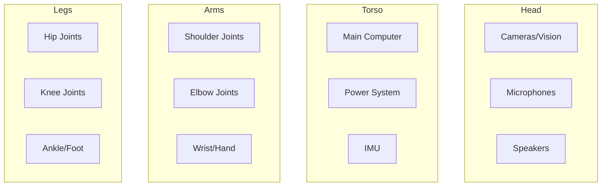

import { ChapterPersonalizeButton } from '@site/src/components/PersonalizationControls';
import { ChapterTranslateButton } from '@site/src/components/TranslationControls';

<div style={{display: 'flex', gap: '10px', marginBottom: '20px'}}>
  <ChapterPersonalizeButton chapterId="fundamentals-humanoid-robotics" />
  <ChapterTranslateButton chapterId="fundamentals-humanoid-robotics" />
</div>

# Fundamentals of Humanoid Robotics

Humanoid robots are designed with a body structure similar to humans, enabling them to operate in environments built for people.

## Learning Objectives

By the end of this chapter, you will be able to:
- Explain the advantages of humanoid robot design
- Identify the major components and subsystems of a humanoid robot
- Understand degrees of freedom and their role in robot mobility
- Compare different actuation technologies
- Describe the fundamentals of bipedal balance and locomotion

## Why Humanoid Form?

The humanoid form factor offers several advantages:

1. **Environment Compatibility**: Can navigate stairs, doors, and human spaces
2. **Tool Usage**: Can use tools designed for human hands
3. **Natural Interaction**: Familiar form facilitates human-robot interaction
4. **Versatility**: Single platform for diverse tasks

## Anatomy of a Humanoid Robot



## Degrees of Freedom (DoF)

A typical humanoid robot has 20-50 degrees of freedom:

| Body Part | Typical DoF |
|-----------|-------------|
| Head/Neck | 2-3 |
| Each Arm | 6-7 |
| Each Hand | 5-20 |
| Torso | 2-3 |
| Each Leg | 6 |

## Actuation Systems

### Electric Motors
Most common in modern humanoids:
- High precision control
- Good power-to-weight ratio
- Quiet operation

```python
# Example: Simple joint control
class JointController:
    def __init__(self, motor_id: int):
        self.motor_id = motor_id
        self.position = 0.0
        self.velocity = 0.0

    def move_to(self, target_position: float, speed: float = 1.0):
        """Move joint to target position."""
        # PID control would be implemented here
        self.position = target_position
        return self.position
```

### Hydraulic Systems
Used in heavy-duty applications:
- High force output
- Complex maintenance
- Used in Boston Dynamics robots

## Balance and Locomotion

Maintaining balance is a fundamental challenge:

### Zero Moment Point (ZMP)
The point where the sum of horizontal inertia and gravity forces equals zero.

### Inverted Pendulum Model
Simplified model for bipedal walking analysis.

## Kinematics

Understanding how robot joints relate to end-effector positions:

### Forward Kinematics
Given joint angles, compute end-effector position:

```python
import numpy as np

def forward_kinematics_2link(theta1: float, theta2: float,
                              l1: float, l2: float) -> tuple:
    """
    Compute end-effector position for a 2-link planar arm.

    Args:
        theta1: First joint angle (radians)
        theta2: Second joint angle (radians)
        l1: Length of first link
        l2: Length of second link

    Returns:
        (x, y) position of end-effector
    """
    x = l1 * np.cos(theta1) + l2 * np.cos(theta1 + theta2)
    y = l1 * np.sin(theta1) + l2 * np.sin(theta1 + theta2)
    return (x, y)

# Example: 2-link arm with 1m links
position = forward_kinematics_2link(
    theta1=np.pi/4,  # 45 degrees
    theta2=np.pi/6,  # 30 degrees
    l1=1.0, l2=1.0
)
print(f"End-effector position: {position}")
```

### Inverse Kinematics
Given desired end-effector position, compute joint angles:


## Power Systems

Humanoid robots require significant power for operation:

| Power Source | Advantages | Disadvantages |
|--------------|------------|---------------|
| Lithium Batteries | High energy density | Limited runtime |
| Hydraulic | High force output | Heavy, complex |
| Tethered | Unlimited power | Restricted mobility |

### Power Budget Example

```python
class PowerBudget:
    """Estimate power requirements for a humanoid robot."""

    def __init__(self):
        self.components = {
            'computation': 50,      # Watts
            'sensors': 20,          # Watts
            'communication': 10,    # Watts
            'actuators_idle': 100,  # Watts
            'actuators_active': 500 # Watts (walking)
        }

    def estimate_runtime(self, battery_wh: float,
                         activity: str = 'idle') -> float:
        """Estimate runtime in hours."""
        if activity == 'idle':
            power = (self.components['computation'] +
                    self.components['sensors'] +
                    self.components['communication'] +
                    self.components['actuators_idle'])
        else:
            power = (self.components['computation'] +
                    self.components['sensors'] +
                    self.components['communication'] +
                    self.components['actuators_active'])

        return battery_wh / power

# Example: 500Wh battery
budget = PowerBudget()
print(f"Idle runtime: {budget.estimate_runtime(500, 'idle'):.1f} hours")
print(f"Active runtime: {budget.estimate_runtime(500, 'active'):.1f} hours")
```

## Notable Humanoid Robots

| Robot | Developer | Key Features |
|-------|-----------|--------------|
| Atlas | Boston Dynamics | Dynamic locomotion, parkour |
| Optimus | Tesla | Manufacturing focus, affordability |
| ASIMO | Honda | Pioneer in humanoid walking |
| Digit | Agility Robotics | Logistics, warehouse work |
| Figure 01 | Figure AI | General-purpose design |

## Summary

Understanding humanoid robot fundamentals provides the foundation for more advanced topics in motion planning and control. Key points:

- Humanoid form enables operation in human environments
- Degrees of freedom determine robot capability and complexity
- Balance requires sophisticated control of the Zero Moment Point
- Power management is critical for practical operation

:::tip Key Takeaway
The humanoid form factor is chosen not for aesthetics, but for practical compatibility with human-designed environments, tools, and interaction patterns.
:::

## Further Reading

- Siciliano, B., & Khatib, O. (Eds.). (2016). Springer Handbook of Robotics
- Craig, J. J. (2005). Introduction to Robotics: Mechanics and Control

---

**Next Chapter:** [Sensors and Perception](/fundamentals/sensors-perception)
