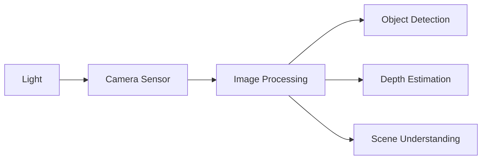
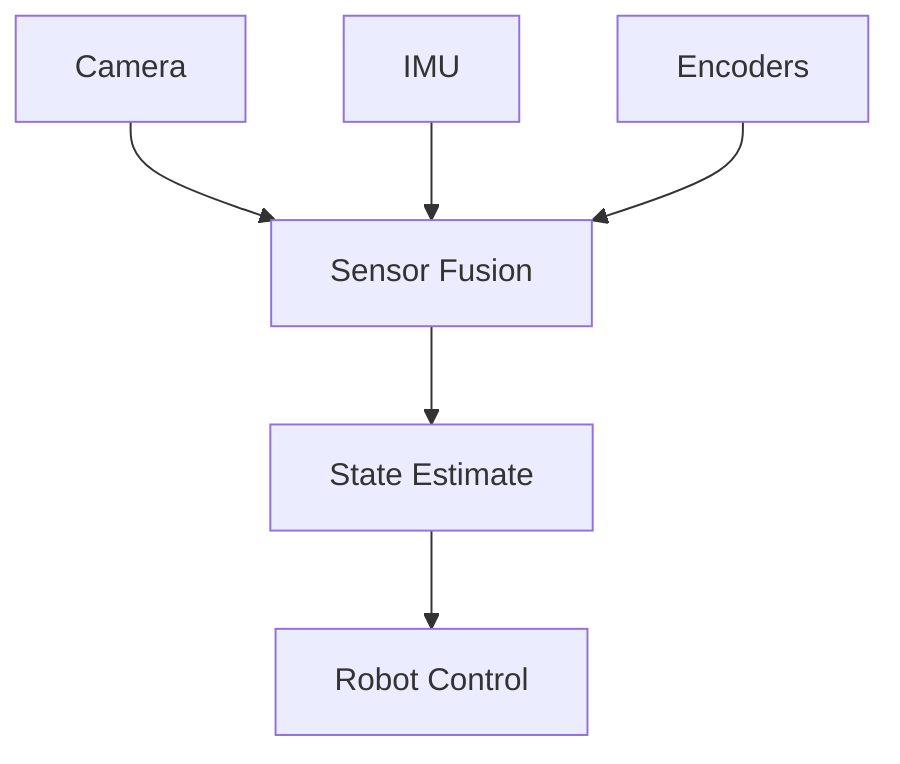
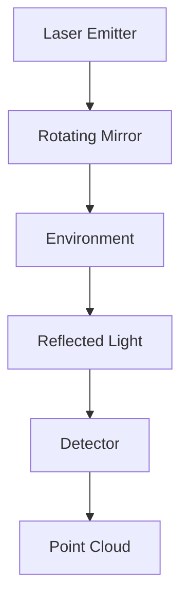

import { ChapterPersonalizeButton } from '@site/src/components/PersonalizationControls';
import { ChapterTranslateButton } from '@site/src/components/TranslationControls';

<div style={{display: 'flex', gap: '10px', marginBottom: '20px'}}>
  <ChapterPersonalizeButton chapterId="fundamentals-sensors-perception" />
  <ChapterTranslateButton chapterId="fundamentals-sensors-perception" />
</div>

# Sensors and Perception

Perception is how robots understand their environment. This chapter covers the sensors and algorithms that enable robots to see, hear, and feel the world around them.

## Learning Objectives

By the end of this chapter, you will be able to:
- Classify different types of sensors used in robotics
- Explain how vision sensors capture and process visual information
- Understand proprioceptive sensing for robot state estimation
- Describe sensor fusion techniques for robust perception
- Apply basic point cloud processing concepts

## Types of Sensors

### Vision Sensors



#### RGB Cameras
- Standard color imaging
- High resolution available
- Passive sensing (no emissions)

#### Depth Cameras
- RGB-D sensors (e.g., Intel RealSense)
- Structured light or Time-of-Flight
- Direct 3D measurements

#### Stereo Vision
- Two cameras for depth perception
- Mimics human binocular vision

### Proprioceptive Sensors

Sensors that measure the robot's internal state:

| Sensor Type | Measures | Application |
|-------------|----------|-------------|
| Encoders | Joint angles | Position control |
| IMU | Orientation, acceleration | Balance |
| Force/Torque | Contact forces | Manipulation |
| Current sensors | Motor load | Safety limits |

### Tactile Sensors

Enable robots to "feel" contact:

```python
# Example: Tactile sensor reading
class TactileSensor:
    def __init__(self, resolution: tuple = (16, 16)):
        self.resolution = resolution
        self.pressure_map = [[0.0] * resolution[1]
                            for _ in range(resolution[0])]

    def read_pressure(self) -> list:
        """Read current pressure distribution."""
        return self.pressure_map

    def detect_contact(self, threshold: float = 0.1) -> bool:
        """Check if contact is detected."""
        for row in self.pressure_map:
            if any(p > threshold for p in row):
                return True
        return False
```

## Sensor Fusion

Combining multiple sensor inputs for robust perception:

### Kalman Filter
Optimal estimation for linear systems with Gaussian noise.

### Extended Kalman Filter (EKF)
Handles nonlinear systems through linearization.



## Point Cloud Processing

3D point clouds from depth sensors require processing:

1. **Filtering**: Remove noise and outliers
2. **Segmentation**: Identify distinct objects
3. **Registration**: Align multiple scans
4. **Feature extraction**: Identify key points

## LIDAR Systems

Light Detection and Ranging for precise distance measurement:



### LIDAR Types

| Type | Range | Resolution | Cost |
|------|-------|------------|------|
| 2D LIDAR | 10-30m | 0.25-1° | Low |
| 3D Spinning | 100m+ | High | High |
| Solid-State | 50-200m | Medium | Medium |

### LIDAR Processing Example

```python
import numpy as np

class LidarProcessor:
    """Process LIDAR point cloud data."""

    def __init__(self, max_range: float = 30.0):
        self.max_range = max_range

    def filter_points(self, points: np.ndarray) -> np.ndarray:
        """Remove invalid and out-of-range points."""
        distances = np.linalg.norm(points[:, :3], axis=1)
        valid_mask = (distances > 0.1) & (distances < self.max_range)
        return points[valid_mask]

    def detect_ground_plane(self, points: np.ndarray,
                            height_threshold: float = 0.2) -> np.ndarray:
        """Simple ground plane detection by height."""
        ground_mask = points[:, 2] < height_threshold
        return points[~ground_mask]  # Return non-ground points

    def cluster_objects(self, points: np.ndarray,
                        eps: float = 0.5) -> list:
        """Cluster points into objects using DBSCAN."""
        from sklearn.cluster import DBSCAN

        clustering = DBSCAN(eps=eps, min_samples=10).fit(points[:, :3])
        labels = clustering.labels_

        clusters = []
        for label in set(labels):
            if label == -1:  # Noise
                continue
            cluster_points = points[labels == label]
            clusters.append(cluster_points)

        return clusters
```

## Audio Sensors

Robots also perceive through sound:

### Microphone Arrays
- Direction of arrival estimation
- Sound source localization
- Speech recognition input

```python
class AudioLocalizer:
    """Localize sound sources using microphone array."""

    def __init__(self, mic_positions: np.ndarray):
        self.mic_positions = mic_positions
        self.speed_of_sound = 343.0  # m/s

    def estimate_direction(self, time_delays: np.ndarray) -> np.ndarray:
        """
        Estimate sound source direction from time delays.
        Uses time difference of arrival (TDOA).
        """
        # Simplified 2-mic example
        delay = time_delays[1] - time_delays[0]
        mic_distance = np.linalg.norm(
            self.mic_positions[1] - self.mic_positions[0]
        )

        # Angle from delay
        cos_theta = (delay * self.speed_of_sound) / mic_distance
        cos_theta = np.clip(cos_theta, -1, 1)
        angle = np.arccos(cos_theta)

        return angle
```

## Sensor Calibration

Accurate perception requires proper calibration:

### Intrinsic Calibration
- Camera focal length, principal point
- Lens distortion parameters

### Extrinsic Calibration
- Sensor position relative to robot frame
- Multi-sensor alignment

:::caution Important
Poor calibration is a common source of perception errors. Always verify calibration before deployment.
:::

## Summary

Effective perception combines multiple sensor modalities with sophisticated algorithms to build a reliable understanding of the environment. Key points:

- Vision sensors provide rich environmental information
- Proprioceptive sensors measure internal robot state
- Sensor fusion combines multiple sources for robustness
- Calibration is essential for accurate perception

<div className="key-takeaway">

No single sensor is perfect. Robust perception systems combine multiple sensor types and use fusion algorithms to handle noise and failures.

</div>

## Further Reading

- Thrun, S., Burgard, W., & Fox, D. (2005). Probabilistic Robotics
- Hartley, R., & Zisserman, A. (2003). Multiple View Geometry in Computer Vision

---

**Next Chapter:** [Motion Planning and Control](/core/motion-planning)
