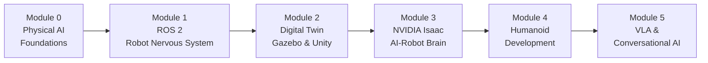

# Physical AI & Humanoid Robotics

## What is Physical AI System Design?

Imagine deploying an advanced AI system in a warehouse. It needs to navigate aisles, identify packages, pick them up, and place them on shelves—all while avoiding humans and adapting to unexpected obstacles.

But there's a problem.

- When you ask it to grab a fragile item, it crushes it because it doesn't understand force feedback
- The robot plans a perfect path in simulation, but stumbles on the real floor's slight unevenness
- It recognizes objects perfectly in good lighting, but fails when a shadow crosses its camera

**That's why simply adding AI to a robot isn't enough.**

Without understanding Physical AI System Design, your robot can't reliably bridge the gap between digital intelligence and real-world action. This course teaches you to design systems that work in the messy, unpredictable physical world.

:::tip Key Insight
Physical AI is not just robotics + AI. It's a fundamentally different approach where intelligence emerges from the interaction between a physical body and its environment.
:::

---

## Who is this course for?

Physical AI System Design sits at the intersection of robotics, AI, and systems engineering. This course is designed for learners at different stages and roles:

| Audience | What You'll Gain |
|----------|------------------|
| **Robotics Engineers** | System-level thinking beyond individual components. Learn sim-to-real transfer, production deployment, and reliability patterns. |
| **AI/ML Engineers** | Understand embodied AI, perception pipelines, and how to apply ML in real-time physical systems with safety constraints. |
| **Backend/Platform Developers** | Master ROS 2 architecture, real-time systems, and hardware-software integration patterns. |
| **Product Managers** | Technical awareness to scope robotics projects, understand feasibility, and lead product discussions grounded in physical constraints. |
| **Interview Candidates** | Frameworks and real-world scenarios for robotics system design interviews. |

If you're curious about how AI systems operate in the physical world—even if you're not hands-on with robots—this course will fill that gap.

---

## Prerequisites

Before diving in, you should have a foundation in these areas:

| Prerequisite | Why It Matters |
|--------------|----------------|
| **Python Programming** | Most examples use Python. You should be comfortable with classes, functions, and basic data structures. |
| **Basic ML Concepts** | Understanding of neural networks, training, and inference helps with perception and learning chapters. |
| **Linux Familiarity** | ROS 2 runs on Ubuntu. Basic command line skills are helpful. |
| **Linear Algebra Basics** | Transformations, matrices, and vectors appear in kinematics and perception. |

:::note Don't worry!
You don't need to be an expert in these areas. The course is designed to be accessible, and we'll explain concepts as we go. Stay curious, and we'll help you make the connections.
:::

---

## What will you learn?

This course provides the mental models and system-level thinking needed to build resilient, capable Physical AI systems. You'll learn:

### Core Skills
- **Design for the physical world**: Handle sensor noise, actuator delays, and environmental uncertainty
- **Bridge simulation and reality**: Master sim-to-real transfer techniques
- **Build robust systems**: Create robots that work when things go wrong
- **Think in systems**: Understand how perception, planning, and control interact

### Hands-On Experience
- Build ROS 2 packages for robot control
- Create digital twins in Gazebo simulation
- Implement AI perception with NVIDIA Isaac
- Design humanoid robot interactions
- Integrate LLMs for conversational robotics

### Real-World Case Studies
Each concept is grounded in practical examples:
- Building a warehouse navigation robot
- Designing a humanoid assistant
- Implementing sim-to-real transfer pipelines

---

## Course Structure

The journey is organized into **6 modules** over **13 weeks**:

| Module | Weeks | Focus | Key Topics |
|--------|-------|-------|------------|
| **0** | 1-2 | Introduction to Physical AI | Embodied intelligence, humanoid landscape, sensors |
| **1** | 3-5 | ROS 2 (Robotic Nervous System) | Nodes, topics, services, URDF, Python integration |
| **2** | 6-7 | Digital Twin (Gazebo & Unity) | Physics simulation, sensor simulation, visualization |
| **3** | 8-10 | NVIDIA Isaac (AI-Robot Brain) | Isaac Sim, perception, reinforcement learning, sim-to-real |
| **4** | 11-12 | Humanoid Robot Development | Kinematics, locomotion, manipulation, HRI |
| **5** | 13 | VLA & Conversational Robotics | Whisper, GPT integration, multi-modal interaction |

### Capstone Project
By the end, you'll build an **Autonomous Humanoid** that:
- Receives voice commands (Whisper)
- Plans navigation paths
- Avoids obstacles
- Identifies objects (computer vision)
- Manipulates objects

---

## How to Use This Course

Each chapter includes:

| Element | Purpose |
|---------|---------|
| 📚 **Learning Objectives** | Clear goals at the start of each chapter |
| 💡 **Key Takeaways** | Highlighted insights you shouldn't miss |
| 📊 **Comparison Tables** | Side-by-side analysis of concepts |
| 💻 **Code Examples** | Runnable Python and ROS 2 code |
| 🔧 **Hands-on Exercises** | Practice what you've learned |
| 🤖 **Interactive 3D Playground** | Manipulate robot models in your browser |
| 📝 **Summary** | Recap and next steps |

### AI Chat Assistant
Use the **chat widget** on each page to:
- Ask questions about the content
- Get concepts explained differently
- Request additional examples

---

## Let's Begin!

Are you ready to explore Physical AI System Design?

The next lesson introduces the foundations—why Physical AI matters, what makes it different from digital AI, and how robots learn to understand the physical world.

**[Start Chapter 1: Foundations of Physical AI →](/introduction/physical-ai)**
