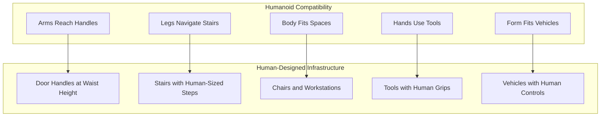
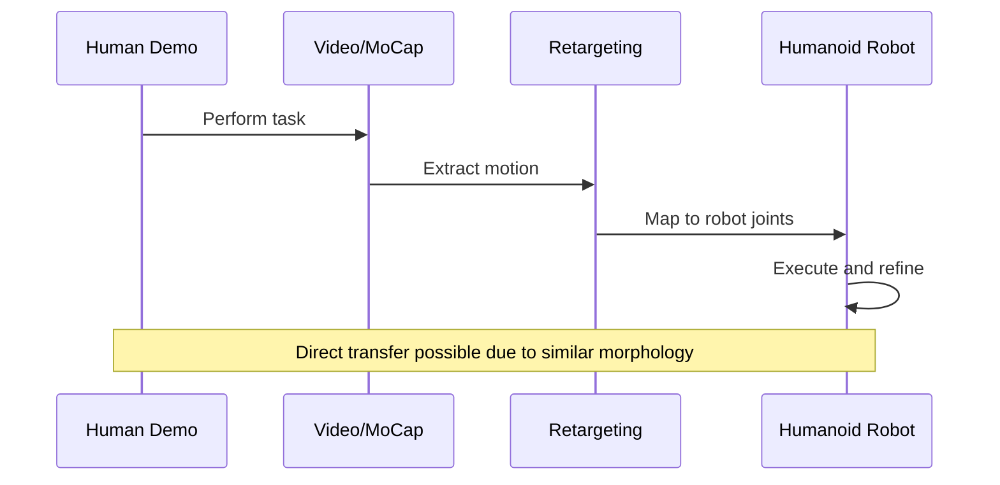
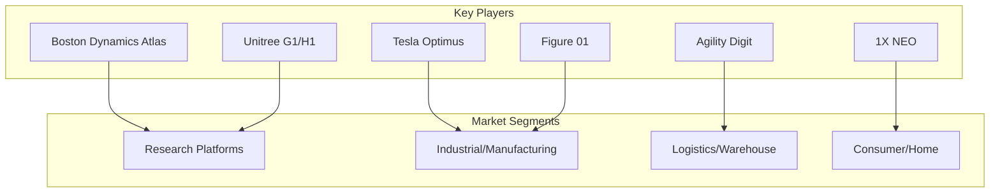
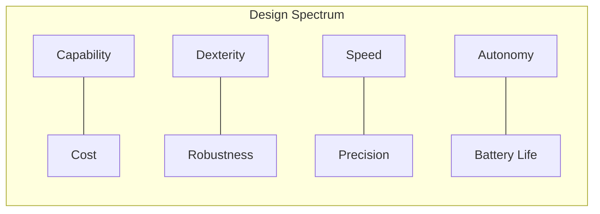
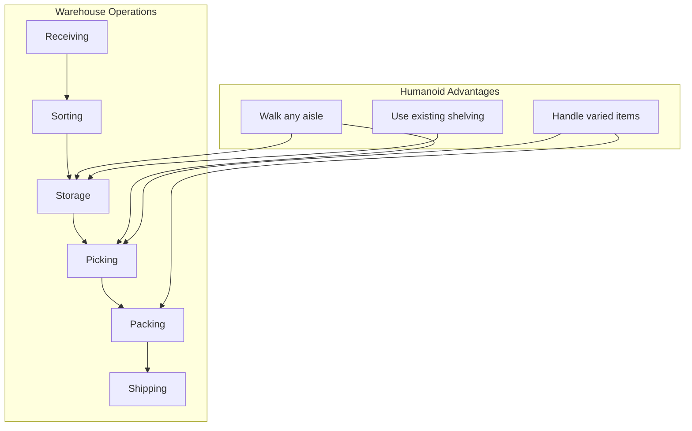

import { ChapterPersonalizeButton } from '@site/src/components/PersonalizationControls';
import { ChapterTranslateButton } from '@site/src/components/TranslationControls';

<div style={{display: 'flex', gap: '10px', marginBottom: '20px'}}>
  <ChapterPersonalizeButton chapterId="introduction-humanoid-landscape" />
  <ChapterTranslateButton chapterId="introduction-humanoid-landscape" />
</div>

# The Humanoid Robotics Landscape

Why build robots that look like humans? This chapter explores the compelling reasons behind the humanoid form factor and surveys the current landscape of humanoid robotics—from research platforms to commercial systems poised to transform industries.

## Learning Objectives

By the end of this chapter, you will be able to:
- Explain why humanoid robots excel in human-centered environments
- Identify the key players and platforms in the humanoid robotics industry
- Compare different humanoid robot designs and their trade-offs
- Understand the market forces driving humanoid robot development
- Evaluate humanoid platforms for different application domains

## Why Humanoids Excel in Human-Centered Environments

### The World is Built for Humans

Every aspect of our built environment assumes a human operator:



### The Single-Platform Advantage

Traditional robotics requires specialized robots for each task:

| Task | Traditional Approach | Humanoid Approach |
|------|---------------------|-------------------|
| Warehouse picking | Specialized arm on rail | Walk to shelf, pick item |
| Floor cleaning | Roomba-style robot | Use human mop/vacuum |
| Package delivery | Wheeled delivery bot | Walk up stairs, ring doorbell |
| Manufacturing | Fixed industrial arm | Move between stations |
| Home assistance | Multiple specialized bots | One general-purpose helper |

<div className="key-takeaway">

A single humanoid robot can potentially replace dozens of specialized robots, dramatically simplifying deployment, maintenance, and training.

</div>

### Natural Human-Robot Interaction

Humans instinctively understand how to interact with human-shaped entities:

```python
class HumanRobotInteraction:
    """Benefits of humanoid form for interaction."""

    def __init__(self):
        self.interaction_advantages = {
            "gaze_direction": "Humans naturally follow robot's head orientation",
            "gesture_recognition": "Human gestures map directly to robot gestures",
            "personal_space": "Intuitive understanding of robot's reach",
            "handoffs": "Natural object transfer between human and robot hands",
            "collaboration": "Side-by-side work feels natural"
        }

    def predict_human_comfort(self, robot_form: str) -> float:
        """
        Estimate human comfort level with different robot forms.
        Based on HRI research findings.
        """
        comfort_scores = {
            "humanoid": 0.85,      # Familiar, predictable
            "animal_like": 0.75,   # Cute but less predictable
            "industrial_arm": 0.45, # Functional but intimidating
            "abstract": 0.55,      # Novel, uncertain
        }
        return comfort_scores.get(robot_form, 0.5)
```

### Learning from Human Data

Perhaps the most powerful advantage: humanoid robots can learn from the vast repository of human demonstration data.



```python
class DemonstrationLearning:
    """Learn tasks from human demonstrations."""

    def __init__(self, robot_type: str):
        self.robot_type = robot_type
        self.joint_mapping = self._create_joint_mapping()

    def _create_joint_mapping(self) -> dict:
        """Map human joints to robot joints."""

        if self.robot_type == "humanoid":
            # Direct 1:1 mapping for most joints
            return {
                "human_shoulder": "robot_shoulder",
                "human_elbow": "robot_elbow",
                "human_wrist": "robot_wrist",
                "human_hip": "robot_hip",
                "human_knee": "robot_knee",
                "human_ankle": "robot_ankle",
            }
        else:
            # Non-humanoid requires complex retargeting
            return self._compute_complex_retargeting()

    def transfer_demonstration(self, human_trajectory: np.ndarray) -> np.ndarray:
        """
        Transfer human motion to robot.

        For humanoids: Simple joint angle mapping
        For others: Complex optimization required
        """

        if self.robot_type == "humanoid":
            # Scale joint angles, adjust for robot limits
            robot_trajectory = self._scale_to_robot_limits(human_trajectory)
            return robot_trajectory
        else:
            # Solve inverse kinematics for each pose
            # Much more computationally expensive
            return self._solve_ik_trajectory(human_trajectory)

    def available_training_data(self) -> dict:
        """Estimate available training data by robot type."""

        return {
            "humanoid": {
                "youtube_videos": "billions of hours",
                "motion_capture": "millions of sequences",
                "teleoperation": "growing rapidly",
                "transfer_difficulty": "low"
            },
            "quadruped": {
                "animal_videos": "millions of hours",
                "motion_capture": "thousands of sequences",
                "transfer_difficulty": "medium"
            },
            "custom_morphology": {
                "available_data": "must collect from scratch",
                "transfer_difficulty": "high"
            }
        }
```

## The Current Humanoid Landscape

### Major Players and Platforms

The humanoid robotics field has exploded with activity. Here's the current landscape:

#### Research and Development Leaders

| Company | Robot | Key Features | Target Market |
|---------|-------|--------------|---------------|
| Boston Dynamics | Atlas | Dynamic locomotion, parkour | Research, demonstration |
| Tesla | Optimus | Manufacturing integration, cost focus | Factory automation |
| Figure | Figure 01/02 | General purpose, BMW partnership | Manufacturing |
| Agility Robotics | Digit | Logistics focus, Amazon partnership | Warehouse, delivery |
| 1X Technologies | NEO | Consumer focus, OpenAI partnership | Home assistance |
| Sanctuary AI | Phoenix | Dexterous manipulation | Manufacturing |
| Apptronik | Apollo | NASA collaboration, modular design | Industrial |
| Unitree | G1/H1 | Affordable, open platform | Research, education |



### Platform Comparison

#### Boston Dynamics Atlas

The benchmark for dynamic humanoid locomotion:

```python
class AtlasCapabilities:
    """Boston Dynamics Atlas specifications."""

    specs = {
        "height": 1.5,  # meters
        "weight": 89,   # kg
        "degrees_of_freedom": 28,
        "power": "hydraulic + electric",
        "notable_capabilities": [
            "Backflips",
            "Parkour",
            "Dynamic obstacle navigation",
            "Tool manipulation"
        ],
        "limitations": [
            "High cost (not commercially available)",
            "Requires tether for extended operation",
            "Complex maintenance"
        ]
    }
```

#### Tesla Optimus

Designed for mass production and factory integration:

```python
class OptimusCapabilities:
    """Tesla Optimus (Gen 2) specifications."""

    specs = {
        "height": 1.73,  # meters
        "weight": 56,    # kg (30% lighter than Gen 1)
        "degrees_of_freedom": 28,  # body
        "hand_dof": 11,  # per hand
        "power": "2.3 kWh battery",
        "walk_speed": 1.3,  # m/s
        "notable_capabilities": [
            "Tesla factory integration",
            "Dojo training infrastructure",
            "Cost-optimized design",
            "Tactile fingertips"
        ],
        "target_price": 20000,  # USD (Musk's stated goal)
    }
```

#### Unitree G1/H1

Accessible platforms for research and education:

```python
class UnitreeHumanoids:
    """Unitree humanoid robot lineup."""

    g1_specs = {
        "height": 1.27,  # meters
        "weight": 35,    # kg
        "degrees_of_freedom": 23,
        "price": 16000,  # USD (starting)
        "notable_features": [
            "Most affordable humanoid",
            "ROS 2 compatible",
            "Open SDK",
            "Good for education/research"
        ]
    }

    h1_specs = {
        "height": 1.8,   # meters
        "weight": 47,    # kg
        "degrees_of_freedom": 19,
        "walk_speed": 1.5,  # m/s
        "run_speed": 3.3,   # m/s (record holder)
        "notable_features": [
            "Full-size humanoid",
            "Dynamic locomotion",
            "Modular design"
        ]
    }
```

### Design Trade-offs

Different humanoid designs make different trade-offs:



| Design Choice | Advantage | Disadvantage |
|---------------|-----------|--------------|
| Hydraulic actuation | High force, dynamic motion | Heavy, complex, expensive |
| Electric actuation | Efficient, precise, quiet | Lower force density |
| High DoF hands | Dexterous manipulation | Complex control, fragile |
| Simple grippers | Robust, reliable | Limited manipulation |
| Full-size (1.7m+) | Human workspace compatible | Higher cost, power needs |
| Compact (1.2-1.5m) | Lower cost, safer | May not reach all spaces |

## Application Domains

### Manufacturing and Assembly

The first major market for humanoid robots:

```python
class ManufacturingApplications:
    """Humanoid applications in manufacturing."""

    use_cases = {
        "assembly": {
            "description": "Assembling components on production lines",
            "advantages": [
                "Can use existing human workstations",
                "Flexible task switching",
                "Works alongside humans safely"
            ],
            "current_deployments": ["Tesla", "BMW (Figure)", "Mercedes"]
        },
        "quality_inspection": {
            "description": "Visual and tactile quality checks",
            "advantages": [
                "Can access same inspection points as humans",
                "Consistent, tireless inspection"
            ]
        },
        "material_handling": {
            "description": "Moving parts between stations",
            "advantages": [
                "Navigates human-designed factory floors",
                "Handles irregular objects"
            ]
        }
    }
```

### Logistics and Warehousing



### Healthcare and Eldercare

A growing application area as populations age:

| Application | Humanoid Benefit |
|-------------|------------------|
| Patient transfer | Human-like lifting mechanics |
| Medication delivery | Navigate hospital corridors |
| Rehabilitation assistance | Natural movement demonstration |
| Companionship | Familiar, non-threatening form |

### Home and Consumer

The ultimate goal for many humanoid developers:

```python
class HomeApplications:
    """Potential home applications for humanoids."""

    near_term = [
        "Laundry folding",
        "Dishwasher loading/unloading",
        "Basic cleaning",
        "Package receiving"
    ]

    medium_term = [
        "Cooking assistance",
        "Elderly care support",
        "Home maintenance",
        "Child supervision support"
    ]

    challenges = {
        "cost": "Must reach <$20k for mass adoption",
        "safety": "Must be safe around children/pets",
        "reliability": "Must work without constant supervision",
        "aesthetics": "Must be acceptable in home environment"
    }
```

## The Economics of Humanoid Robots

### Cost Trajectory


### Total Cost of Ownership

```python
class HumanoidTCO:
    """Calculate total cost of ownership for humanoid deployment."""

    def __init__(self, robot_cost: float, deployment_years: int = 5):
        self.robot_cost = robot_cost
        self.years = deployment_years

    def calculate_tco(self) -> dict:
        """Estimate 5-year total cost of ownership."""

        annual_maintenance = self.robot_cost * 0.10  # 10% of purchase
        annual_energy = 365 * 8 * 0.5 * 0.15  # 8hrs/day, 500W, $0.15/kWh
        annual_software = 5000  # Updates, cloud services

        total = (
            self.robot_cost +
            (annual_maintenance * self.years) +
            (annual_energy * self.years) +
            (annual_software * self.years)
        )

        return {
            "initial_cost": self.robot_cost,
            "5_year_maintenance": annual_maintenance * self.years,
            "5_year_energy": annual_energy * self.years,
            "5_year_software": annual_software * self.years,
            "total_tco": total,
            "annual_equivalent": total / self.years,
            "hourly_cost": total / (self.years * 365 * 8)  # 8hr days
        }

# Example: $50k humanoid
tco = HumanoidTCO(50000)
costs = tco.calculate_tco()
print(f"Hourly cost: ${costs['hourly_cost']:.2f}")
# Compare to human worker hourly cost
```

### Market Projections

| Year | Estimated Market Size | Key Drivers |
|------|----------------------|-------------|
| 2024 | $2-3 billion | Research, early industrial |
| 2027 | $10-15 billion | Manufacturing scale-up |
| 2030 | $30-50 billion | Logistics, healthcare entry |
| 2035 | $100+ billion | Consumer market emergence |

## Choosing a Platform

### For Education and Research

```python
class PlatformRecommendation:
    """Recommend humanoid platform based on use case."""

    @staticmethod
    def for_education() -> dict:
        return {
            "recommended": "Unitree G1",
            "reasons": [
                "Lowest cost full humanoid",
                "ROS 2 support",
                "Active community",
                "Good documentation"
            ],
            "alternatives": ["Robotis OP3", "NAO (if budget allows)"]
        }

    @staticmethod
    def for_research() -> dict:
        return {
            "recommended": "Unitree H1 or G1",
            "reasons": [
                "Open SDK for customization",
                "Reasonable cost for lab budgets",
                "Full-size for real-world experiments"
            ],
            "alternatives": ["Agility Digit (if logistics focus)"]
        }

    @staticmethod
    def for_industrial_pilot() -> dict:
        return {
            "recommended": "Figure 01 or Apptronik Apollo",
            "reasons": [
                "Commercial support",
                "Safety certifications",
                "Integration assistance"
            ],
            "considerations": [
                "Higher cost",
                "May require partnership agreement"
            ]
        }
```

### Evaluation Criteria

When evaluating humanoid platforms, consider:

| Criterion | Questions to Ask |
|-----------|------------------|
| **Capability** | Can it perform your target tasks? |
| **Cost** | Initial + ongoing costs within budget? |
| **Support** | SDK quality? Community? Commercial support? |
| **Safety** | Certifications? Safety features? |
| **Integration** | ROS 2 support? API quality? |
| **Reliability** | MTBF? Maintenance requirements? |

## Summary

The humanoid robotics landscape is rapidly evolving, with multiple well-funded companies racing to deliver practical humanoid robots. Key takeaways:

- **Humanoid form** enables operation in human-designed environments without modification
- **Learning from human data** gives humanoids a massive advantage in acquiring new skills
- **Multiple market segments** are emerging: manufacturing, logistics, healthcare, and eventually consumer
- **Costs are dropping rapidly**, making humanoids increasingly economically viable
- **Platform choice** depends on your specific application, budget, and support needs

:::note The Humanoid Moment
We are at an inflection point in humanoid robotics. The combination of AI advances (especially foundation models), improved hardware, and massive investment means humanoid robots will likely become common in industrial settings within 5 years and potentially in homes within 10-15 years.
:::

## Further Reading

- [IEEE Spectrum Robotics](https://spectrum.ieee.org/robotics)
- [The Robot Report](https://www.therobotreport.com/)
- Company technical blogs: Boston Dynamics, Tesla AI, Figure AI

---

**Next Chapter:** [Sensor Systems for Physical AI](/introduction/sensor-systems)
