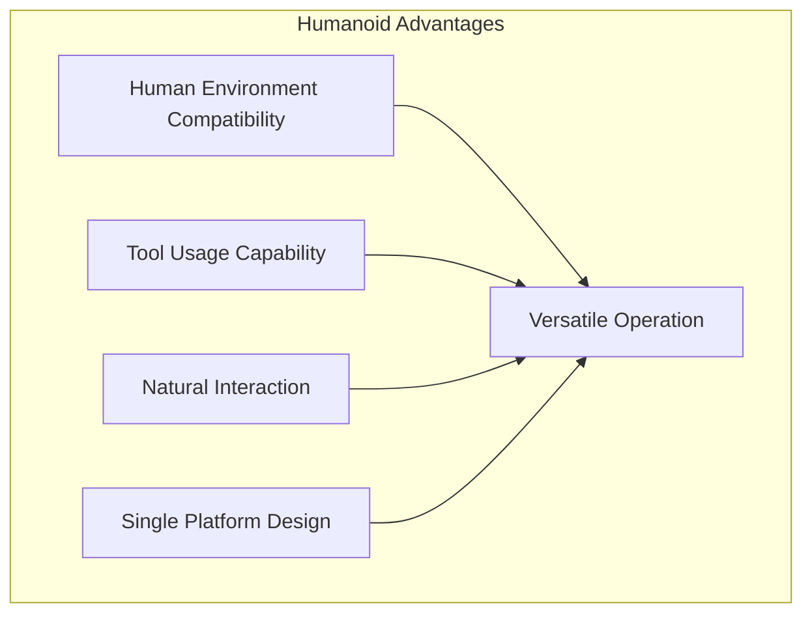

import { ChapterPersonalizeButton } from '@site/src/components/PersonalizationControls';
import { ChapterTranslateButton } from '@site/src/components/TranslationControls';

<div style={{display: 'flex', gap: '10px', marginBottom: '20px'}}>
  <ChapterPersonalizeButton chapterId="introduction-physical-ai" />
  <ChapterTranslateButton chapterId="introduction-physical-ai" />
</div>

# Introduction to Physical AI

Physical AI represents the intersection of artificial intelligence and robotics, where intelligent systems interact with and manipulate the physical world.

## Learning Objectives

By the end of this chapter, you will be able to:
- Define Physical AI and distinguish it from purely digital AI systems
- Identify the key characteristics of embodied intelligent systems
- Explain the perception-reasoning-action cycle in robotics
- Describe major application domains for Physical AI
- Understand the role of humanoid robots in Physical AI

## What is Physical AI?

Physical AI refers to AI systems that:
- **Perceive** the physical environment through sensors
- **Reason** about physical interactions and constraints
- **Act** on the world through actuators and motors
- **Learn** from physical experiences and feedback


## Key Characteristics

### Embodiment
Unlike purely digital AI, Physical AI systems have a physical presence. This embodiment creates unique challenges and opportunities:

- **Spatial awareness**: Understanding 3D space and navigation
- **Physical constraints**: Dealing with gravity, friction, and material properties
- **Real-time processing**: Responding to dynamic environments

### Interaction with Uncertainty
The physical world is inherently uncertain. Physical AI must handle:

- Sensor noise and limitations
- Unpredictable environmental changes
- Imprecise actuator control

## Applications of Physical AI

| Domain | Examples |
|--------|----------|
| Manufacturing | Assembly robots, quality inspection |
| Healthcare | Surgical robots, rehabilitation assistants |
| Service | Delivery robots, cleaning robots |
| Exploration | Mars rovers, underwater drones |

## The Role of Humanoid Robots

Humanoid robots represent a special category of Physical AI designed to:
- Operate in human-designed environments
- Use human tools and interfaces
- Interact naturally with people

### Why Humanoid Form Matters



## Historical Context

The development of Physical AI has evolved through several key phases:

| Era | Focus | Key Developments |
|-----|-------|------------------|
| 1960s-1980s | Industrial Automation | Programmable robot arms, assembly lines |
| 1990s-2000s | Mobile Robotics | Autonomous navigation, SLAM |
| 2010s | Deep Learning Integration | Vision, manipulation, end-to-end learning |
| 2020s | Foundation Models | LLM-powered robots, general-purpose systems |

## Core Technologies

Physical AI systems integrate multiple technology domains:

```python
class PhysicalAISystem:
    """Core components of a Physical AI system."""

    def __init__(self):
        self.perception = PerceptionModule()  # Sensors, vision, audio
        self.cognition = CognitionModule()    # Planning, reasoning
        self.action = ActionModule()          # Motors, actuators
        self.learning = LearningModule()      # Adaptation, improvement

    def sense_think_act_loop(self):
        """The fundamental cycle of Physical AI."""
        while self.is_active:
            # Sense: Gather information from environment
            observations = self.perception.observe()

            # Think: Process and plan
            plan = self.cognition.reason(observations)

            # Act: Execute in the physical world
            result = self.action.execute(plan)

            # Learn: Improve from experience
            self.learning.update(observations, plan, result)
```

## Challenges in Physical AI

### The Reality Gap

Unlike digital AI, Physical AI must contend with:

:::caution Key Challenges
1. **Sensor Noise**: Real sensors are imperfect and noisy
2. **Actuator Uncertainty**: Motors don't always do exactly what commanded
3. **Environmental Variability**: The real world is unpredictable
4. **Safety Requirements**: Mistakes can cause physical harm
5. **Real-Time Constraints**: Decisions must be made quickly
:::

### Bridging Simulation and Reality


## Summary

Physical AI bridges the gap between digital intelligence and real-world action. Key takeaways:

- Physical AI systems perceive, reason, and act in the physical world
- Embodiment creates unique challenges: uncertainty, real-time constraints, safety
- The sense-think-act loop is fundamental to all Physical AI systems
- Humanoid robots are designed for human environments and natural interaction

:::tip Key Takeaway
Physical AI systems must handle the unique challenges of embodiment: spatial awareness, physical constraints, and real-time processing in uncertain environments.
:::

:::note Prerequisites
Before diving deeper, ensure you're comfortable with basic programming concepts and have a foundational understanding of machine learning principles.
:::

## Further Reading

- [Stanford Robotics Lab](https://robotics.stanford.edu/)
- [MIT CSAIL Robotics](https://www.csail.mit.edu/research/robotics)
- [IEEE Robotics and Automation Society](https://www.ieee-ras.org/)

---

**Next Chapter:** [Fundamentals of Humanoid Robotics](/fundamentals/humanoid-robotics)
