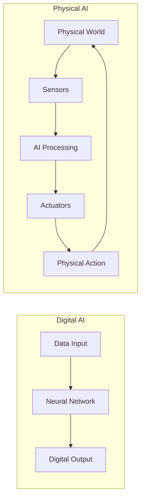
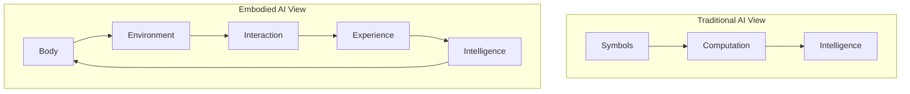
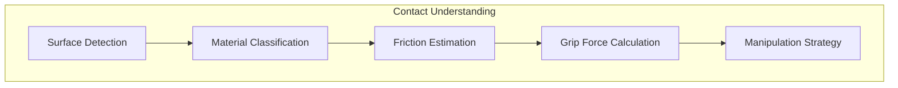
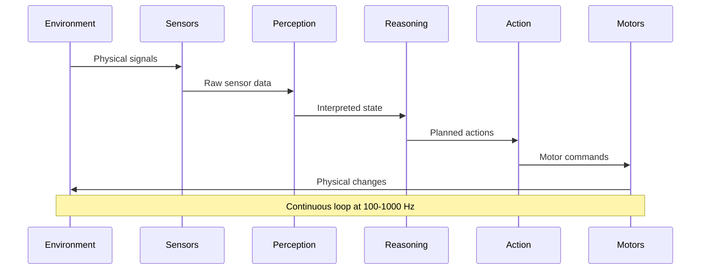
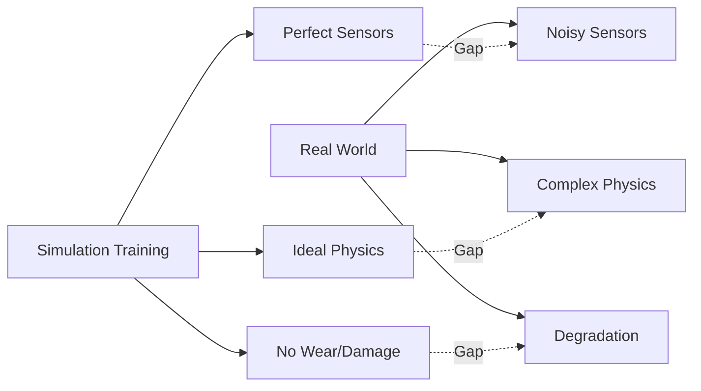
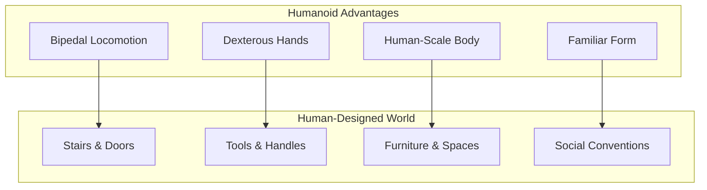
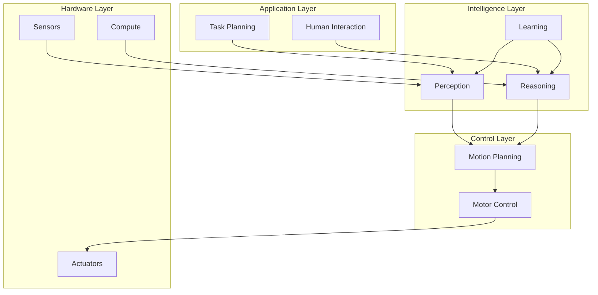

import { ChapterPersonalizeButton } from '@site/src/components/PersonalizationControls';
import { ChapterTranslateButton } from '@site/src/components/TranslationControls';

<div style={{display: 'flex', gap: '10px', marginBottom: '20px'}}>
  <ChapterPersonalizeButton chapterId="introduction-physical-ai" />
  <ChapterTranslateButton chapterId="introduction-physical-ai" />
</div>

# Foundations of Physical AI and Embodied Intelligence

> **Estimated Time:** 45 minutes | **Difficulty:** Beginner

Welcome to the world of Physical AI—where artificial intelligence breaks free from the digital realm and enters the physical world. This chapter explores the fundamental shift from purely digital AI systems to robots that understand and interact with physical laws, laying the groundwork for your journey into humanoid robotics.

:::info What You'll Build
By the end of this module, you'll understand why a robot that can play chess perfectly might still struggle to pick up a chess piece—and how Physical AI solves this challenge.
:::

## Learning Objectives

By the end of this chapter, you will be able to:
- Define Physical AI and distinguish it from purely digital AI systems
- Explain the concept of embodied intelligence and its importance
- Describe the transition from digital AI to physically-grounded systems
- Understand how robots learn to comprehend physical laws
- Identify the key challenges unique to Physical AI systems
- Articulate why humanoid robots represent a significant advancement in Physical AI

## The Digital-to-Physical AI Transition

### From Bits to Atoms

Traditional AI systems operate entirely in the digital domain—processing text, images, and data without any physical presence. Physical AI represents a fundamental paradigm shift:



### Digital AI vs Physical AI: Key Differences

Understanding the fundamental differences between Digital AI and Physical AI is crucial for designing effective robotic systems.

| Aspect | Digital AI | Physical AI |
|--------|-----------|-------------|
| **Environment** | Virtual, controlled | Real, unpredictable |
| **Input** | Clean data | Noisy sensor readings |
| **Output** | Predictions, text | Physical movements |
| **Feedback** | Immediate, precise | Delayed, uncertain |
| **Consequences** | Reversible | Often irreversible |
| **Time** | Can pause/replay | Real-time only |
| **Training** | Unlimited retries | Limited by hardware wear |
| **Failure Mode** | Wrong answer | Physical damage possible |
| **Latency Tolerance** | Seconds acceptable | Milliseconds required |
| **State Space** | Discrete, bounded | Continuous, infinite |

<div className="key-takeaway">

**Key Insight:** Digital AI optimizes for accuracy; Physical AI must optimize for safety, robustness, and real-time performance simultaneously. A 99% accurate digital model might be excellent, but a 99% reliable physical robot could fail catastrophically 1% of the time.

</div>

### Why Physical AI Matters Now

The convergence of several technologies has made Physical AI practical:

1. **Advanced Sensors**: High-resolution cameras, LiDAR, and tactile sensors provide rich environmental data
2. **Powerful Edge Computing**: NVIDIA Jetson and similar platforms enable real-time AI processing
3. **Foundation Models**: Large language models and vision-language models provide general reasoning capabilities
4. **Simulation Advances**: Photorealistic simulators like NVIDIA Isaac Sim enable safe training
5. **Improved Actuators**: Electric motors with high torque density enable dynamic movement

## What is Embodied Intelligence?

Embodied intelligence is the principle that true intelligence emerges from the interaction between a physical body and its environment. Unlike disembodied AI that processes abstract symbols, embodied AI learns through physical experience.

### The Embodiment Hypothesis



<div className="key-takeaway">

Intelligence is not just computation—it emerges from the continuous interaction between an agent's body and its environment. A robot learns that objects fall not by reading physics textbooks, but by dropping things and observing the results.

</div>

### Grounding: Connecting Symbols to Reality

One of the fundamental challenges in AI is the "symbol grounding problem"—how do abstract symbols (like the word "heavy") connect to real-world experiences?

```python
class DigitalAI:
    """Traditional AI: symbols without grounding."""

    def understand_heavy(self):
        # Only knows "heavy" as a word relationship
        return {
            "definition": "of great weight",
            "synonyms": ["weighty", "massive"],
            "antonyms": ["light", "weightless"]
        }

class EmbodiedAI:
    """Physical AI: grounded understanding through experience."""

    def __init__(self):
        self.lifting_experiences = []
        self.force_sensor = ForceSensor()

    def understand_heavy(self, object_id: str) -> dict:
        # Learns "heavy" through physical interaction
        force_required = self.force_sensor.measure_lift(object_id)
        motor_strain = self.measure_motor_current()

        self.lifting_experiences.append({
            "object": object_id,
            "force": force_required,
            "strain": motor_strain
        })

        # "Heavy" is grounded in actual physical experience
        return {
            "force_required": force_required,
            "relative_to_capacity": force_required / self.max_lift_force,
            "is_heavy": force_required > self.comfortable_threshold
        }
```

## Understanding Physical Laws Through Interaction

Physical AI systems must learn to understand and work with the fundamental laws that govern our world. Unlike digital systems that can ignore physics, robots must contend with:

### Gravity and Dynamics

Every movement a robot makes is affected by gravity. Understanding this requires:

```python
class PhysicsAwareRobot:
    """A robot that understands physical dynamics."""

    def __init__(self):
        self.gravity = 9.81  # m/s²
        self.mass = 50.0     # kg
        self.learned_dynamics = {}

    def learn_object_dynamics(self, object_id: str):
        """Learn how an object behaves through interaction."""

        # Drop the object and observe
        drop_height = 0.5  # meters
        observed_fall_time = self.observe_fall(object_id, drop_height)

        # Calculate expected vs actual
        expected_time = np.sqrt(2 * drop_height / self.gravity)

        # Learn about air resistance, object properties
        self.learned_dynamics[object_id] = {
            "fall_time_ratio": observed_fall_time / expected_time,
            "likely_properties": self.infer_properties(observed_fall_time)
        }

    def predict_trajectory(self, object_id: str,
                          initial_velocity: np.ndarray) -> np.ndarray:
        """Predict where an object will land based on learned dynamics."""

        dynamics = self.learned_dynamics.get(object_id, {"fall_time_ratio": 1.0})

        # Apply learned corrections to physics model
        adjusted_gravity = self.gravity / dynamics["fall_time_ratio"]

        # Projectile motion with learned adjustments
        t_flight = 2 * initial_velocity[2] / adjusted_gravity
        landing_x = initial_velocity[0] * t_flight
        landing_y = initial_velocity[1] * t_flight

        return np.array([landing_x, landing_y, 0])
```

### Contact and Friction

Robots must understand how surfaces interact:



### Cause and Effect

Physical AI systems learn causal relationships through experimentation:

| Action | Observed Effect | Learned Rule |
|--------|-----------------|--------------|
| Push object | Object moves | Force causes acceleration |
| Release object | Object falls | Unsupported objects fall |
| Grip too hard | Object deforms | Excessive force damages soft objects |
| Move too fast | Object slips | Acceleration affects grip stability |

## The Sense-Think-Act Loop

The fundamental operating cycle of any Physical AI system:



### Real-Time Constraints

Unlike digital AI that can take arbitrary time to compute, Physical AI must respond in real-time:

```python
class RealTimeController:
    """Controller that must meet timing deadlines."""

    def __init__(self, control_frequency: float = 1000.0):
        self.dt = 1.0 / control_frequency  # 1ms at 1kHz
        self.deadline_violations = 0

    def control_loop(self):
        """Main control loop with timing guarantees."""

        while self.running:
            loop_start = time.perf_counter()

            # Sense
            sensor_data = self.read_sensors()

            # Think (must be fast!)
            action = self.compute_action(sensor_data)

            # Act
            self.send_commands(action)

            # Check timing
            elapsed = time.perf_counter() - loop_start
            if elapsed > self.dt:
                self.deadline_violations += 1
                self.log_warning(f"Deadline missed: {elapsed*1000:.2f}ms")
            else:
                # Sleep for remaining time
                time.sleep(self.dt - elapsed)

    def compute_action(self, sensor_data: dict) -> dict:
        """
        Compute action within time budget.

        Note: This is where the trade-off between
        computation quality and real-time constraints
        becomes critical.
        """
        # Simple reactive control: fast but limited
        if self.time_budget_remaining() < 0.0005:  # 0.5ms
            return self.reactive_control(sensor_data)

        # More sophisticated planning if time permits
        return self.planned_control(sensor_data)
```

## Challenges Unique to Physical AI

### The Reality Gap

Models trained in simulation often fail in the real world:



### Bridging the Gap: Domain Randomization

```python
class DomainRandomizer:
    """Randomize simulation parameters to improve transfer."""

    def __init__(self):
        self.randomization_ranges = {
            "friction": (0.5, 1.5),      # Multiply base friction
            "mass": (0.8, 1.2),          # Multiply base mass
            "sensor_noise": (0.0, 0.1),  # Add Gaussian noise
            "actuator_delay": (0, 20),   # Milliseconds
            "lighting": (0.5, 2.0),      # Brightness multiplier
        }

    def randomize_environment(self, env):
        """Apply random perturbations to simulation."""

        for param, (low, high) in self.randomization_ranges.items():
            value = np.random.uniform(low, high)
            env.set_parameter(param, value)

        return env

    def train_with_randomization(self, policy, num_episodes: int):
        """Train policy across randomized environments."""

        for episode in range(num_episodes):
            # Each episode uses different physics parameters
            env = self.randomize_environment(self.base_env.copy())

            # Policy must learn to handle variation
            self.run_episode(policy, env)
```

### Safety: The Non-Negotiable Requirement

Physical AI systems can cause real harm. Safety must be built in at every level:

:::caution Critical Safety Considerations
1. **Force Limits**: Never exceed safe force thresholds
2. **Speed Limits**: Reduce speed near humans
3. **Emergency Stops**: Always have a way to halt immediately
4. **Fail-Safe Defaults**: When uncertain, stop and ask
5. **Continuous Monitoring**: Watch for anomalies constantly
:::

```python
class SafetyMonitor:
    """Continuous safety monitoring for Physical AI."""

    def __init__(self):
        self.force_limit = 100.0  # Newtons
        self.speed_limit = 1.0    # m/s near humans
        self.emergency_stop = False

    def check_safety(self, state: dict) -> bool:
        """Check all safety conditions. Returns False if unsafe."""

        # Check force limits
        if state["contact_force"] > self.force_limit:
            self.trigger_emergency_stop("Force limit exceeded")
            return False

        # Check speed near humans
        if state["human_nearby"] and state["speed"] > self.speed_limit:
            self.trigger_emergency_stop("Speed too high near human")
            return False

        # Check for unexpected contacts
        if state["unexpected_contact"]:
            self.trigger_emergency_stop("Unexpected contact detected")
            return False

        return True

    def trigger_emergency_stop(self, reason: str):
        """Immediately halt all motion."""
        self.emergency_stop = True
        self.log_critical(f"EMERGENCY STOP: {reason}")
        self.send_stop_command_to_all_actuators()
```

## Why Humanoid Robots?

Humanoid robots represent the pinnacle of Physical AI because they're designed to operate in our world—a world built for humans.

### The Human Environment Advantage



### Data Abundance

One of the most compelling arguments for humanoid robots:

<div className="key-takeaway">

Humanoid robots can learn from the vast amount of human demonstration data available—videos, motion capture, and direct teleoperation. A robot with a human-like body can directly apply lessons learned from watching humans perform tasks.

</div>

```python
class HumanDemonstrationLearner:
    """Learn from human demonstrations."""

    def __init__(self, robot_embodiment: str = "humanoid"):
        self.embodiment = robot_embodiment
        self.demonstration_buffer = []

    def learn_from_video(self, video_path: str, task: str):
        """
        Extract actionable knowledge from human demonstration video.

        This is much easier for humanoid robots because:
        1. Joint correspondence is straightforward
        2. Workspace is similar
        3. Tool usage transfers directly
        """

        # Extract human pose from video
        human_poses = self.extract_poses(video_path)

        if self.embodiment == "humanoid":
            # Direct mapping possible
            robot_trajectory = self.map_human_to_robot(human_poses)
        else:
            # Non-humanoid requires complex retargeting
            robot_trajectory = self.complex_retargeting(human_poses)

        self.demonstration_buffer.append({
            "task": task,
            "trajectory": robot_trajectory,
            "source": "human_video"
        })

        return robot_trajectory
```

## The Physical AI Stack

A complete Physical AI system integrates multiple layers:



<div className="chapter-summary">

Physical AI represents a fundamental evolution in artificial intelligence—from systems that process information to systems that act in the world.

**What you learned:**
- **Physical AI** bridges the gap between digital intelligence and real-world action
- **Embodied Intelligence** emerges from the interaction between body and environment
- **Physical Laws** understanding requires direct interaction, not just computation
- **Real-Time Constraints** fundamentally change how AI systems must be designed
- **Safety** is paramount—physical actions have real consequences
- **Humanoid Robots** are uniquely suited to operate in human environments

<a href="/introduction/humanoid-landscape" className="next-chapter">
  Next: The Humanoid Robotics Landscape →
</a>

</div>

<div className="knowledge-check">

<div className="question">
<span className="question-number">Q1.</span> Why can't a chess-playing AI directly control a robot arm to move chess pieces?
<div className="options">

- A) The AI is too slow
- B) It lacks understanding of physical forces, grip strength, and real-world sensor noise ✓
- C) Chess pieces are too small
- D) The AI doesn't know chess rules

</div>
</div>

<div className="question">
<span className="question-number">Q2.</span> What is the "symbol grounding problem"?
<div className="options">

- A) Robots can't read text
- B) The challenge of connecting abstract symbols (like "heavy") to real-world physical experiences ✓
- C) Programming languages are too abstract
- D) Sensors produce too much data

</div>
</div>

<div className="question">
<span className="question-number">Q3.</span> Why is safety more critical in Physical AI than Digital AI?
<div className="options">

- A) Physical AI is more expensive
- B) Physical AI uses more power
- C) Physical actions have real, often irreversible consequences ✓
- D) Physical AI is harder to program

</div>
</div>

<div className="question">
<span className="question-number">Q4.</span> What is the typical control loop frequency for a real-time robot controller?
<div className="options">

- A) 1-10 Hz
- B) 10-50 Hz
- C) 100-1000 Hz ✓
- D) 10,000+ Hz

</div>
</div>

</div>

## Further Reading

- Brooks, R. A. (1991). "Intelligence without representation"
- Pfeifer, R., & Bongard, J. (2006). "How the Body Shapes the Way We Think"
- [Stanford HAI - Embodied Intelligence](https://hai.stanford.edu/)
- [NVIDIA Isaac Platform](https://developer.nvidia.com/isaac)

---

**Next Chapter:** [The Humanoid Robotics Landscape →](/introduction/humanoid-landscape)
