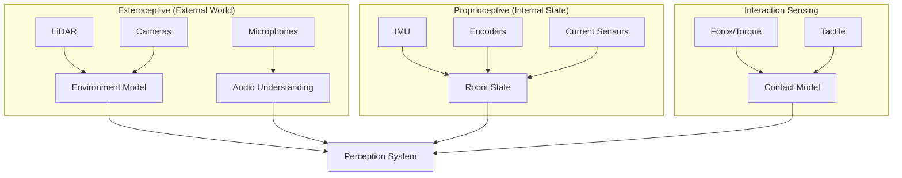
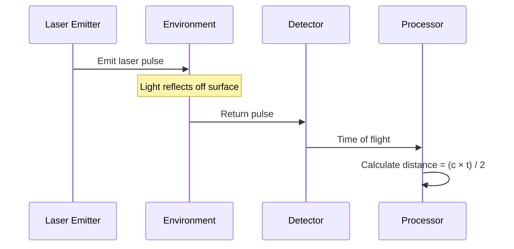
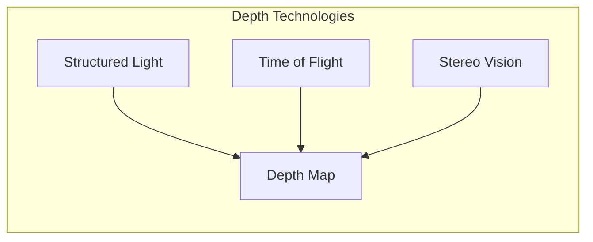
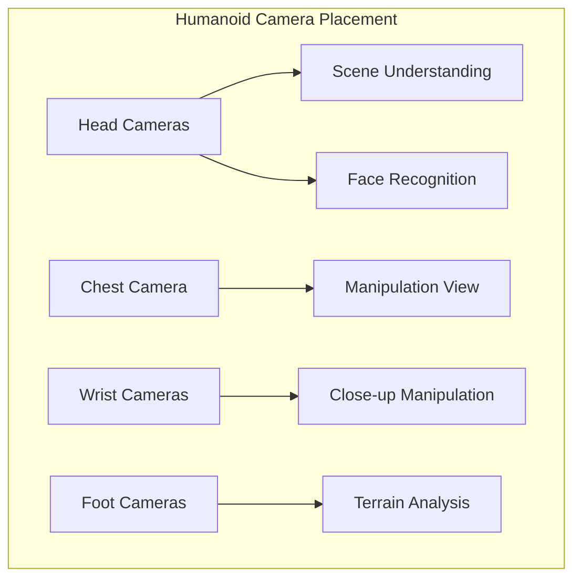
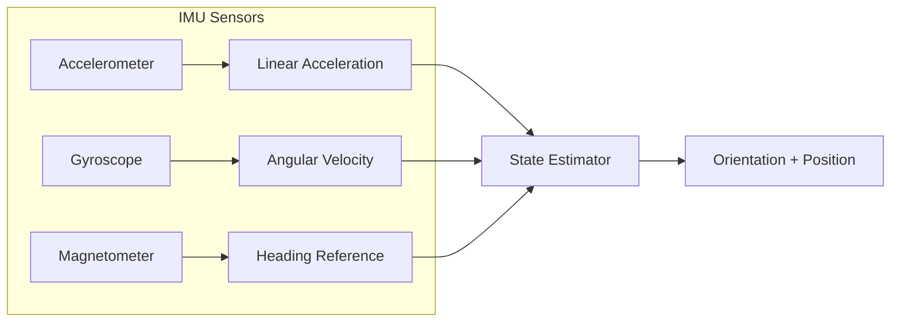
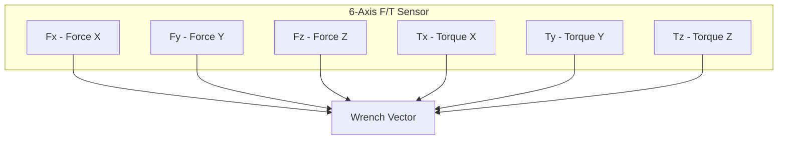
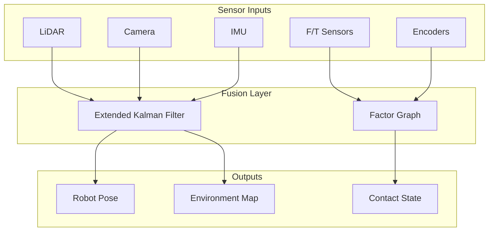

import { ChapterPersonalizeButton } from '@site/src/components/PersonalizationControls';
import { ChapterTranslateButton } from '@site/src/components/TranslationControls';

<div style={{display: 'flex', gap: '10px', marginBottom: '20px'}}>
  <ChapterPersonalizeButton chapterId="introduction-sensor-systems" />
  <ChapterTranslateButton chapterId="introduction-sensor-systems" />
</div>

# Sensor Systems for Physical AI

Sensors are the eyes, ears, and touch of a robot. This chapter provides a comprehensive overview of the sensor systems that enable Physical AI—from LiDAR and cameras for perceiving the environment to IMUs and force/torque sensors for understanding the robot's own state and interactions.

## Learning Objectives

By the end of this chapter, you will be able to:
- Explain the role of different sensor types in Physical AI systems
- Compare LiDAR technologies and their applications
- Understand camera systems including RGB, depth, and stereo vision
- Describe how IMUs enable robot state estimation
- Explain force/torque sensing for manipulation and safety
- Design sensor configurations for different robotic applications

## The Sensor Hierarchy

Physical AI systems use multiple sensor types organized in a hierarchy:



| Sensor Category | Purpose | Examples |
|-----------------|---------|----------|
| **Exteroceptive** | Perceive external environment | LiDAR, cameras, radar |
| **Proprioceptive** | Measure internal robot state | IMU, encoders, joint sensors |
| **Interaction** | Sense contact and forces | Force/torque, tactile arrays |

## LiDAR: Light Detection and Ranging

LiDAR sensors measure distances by emitting laser pulses and timing their return. They're essential for navigation, obstacle detection, and 3D mapping.

### How LiDAR Works



### LiDAR Types

```python
class LiDARTypes:
    """Comparison of LiDAR technologies."""

    types = {
        "2D_scanning": {
            "description": "Single plane laser scanner",
            "range": "10-30 meters",
            "resolution": "0.25-1 degree",
            "cost": "$100-2000",
            "examples": ["RPLIDAR A1/A2", "Hokuyo URG"],
            "use_cases": ["Indoor navigation", "Obstacle avoidance"]
        },
        "3D_spinning": {
            "description": "Multi-beam rotating scanner",
            "range": "100-300 meters",
            "resolution": "16-128 channels",
            "cost": "$4000-75000",
            "examples": ["Velodyne VLP-16", "Ouster OS1"],
            "use_cases": ["Autonomous vehicles", "Large-scale mapping"]
        },
        "solid_state": {
            "description": "No moving parts, electronic steering",
            "range": "50-200 meters",
            "resolution": "Variable",
            "cost": "$500-5000",
            "examples": ["Livox Mid-360", "Intel RealSense L515"],
            "use_cases": ["Robotics", "Consumer devices"]
        }
    }
```

### LiDAR Data Processing

```python
import numpy as np

class LiDARProcessor:
    """Process LiDAR point cloud data for robotics applications."""

    def __init__(self, max_range: float = 30.0, min_range: float = 0.1):
        self.max_range = max_range
        self.min_range = min_range

    def filter_range(self, points: np.ndarray) -> np.ndarray:
        """Remove points outside valid range."""
        distances = np.linalg.norm(points[:, :3], axis=1)
        valid = (distances > self.min_range) & (distances < self.max_range)
        return points[valid]

    def detect_ground_plane(self, points: np.ndarray,
                            height_threshold: float = 0.15) -> tuple:
        """
        Separate ground points from obstacles.

        Returns:
            (ground_points, obstacle_points)
        """
        # Simple heig segmentation
        # In practice, use RANSAC for robust plane fitting
        ground_mask = points[:, 2] < height_threshold
        return points[ground_mask], points[~ground_mask]

    def find_obstacles(self, points: np.ndarray,
                       cluster_distance: float = 0.5) -> list:
        """
        Cluster non-ground points into obstacles.

        Uses Euclidean clustering (simplified DBSCAN).
        """
        from sklearn.cluster import DBSCAN

        if len(points) == 0:
            return []

        clustering = DBSCAN(eps=cluster_distance, min_samples=5)
        labels = clustering.fit_predict(points[:, :3])

        obstacles = []
        for label in set(labels):
            if label == -1:  # Noise
                continue
            cluster = points[labels == label]
            obstacles.append({
                "centroid": np.mean(cluster[:, :3], axis=0),
                "size": np.max(cluster[:, :3], axis=0) - np.min(cluster[:, :3], axis=0),
                "num_points": len(cluster)
            })

        return obstacles
```

### LiDAR for Humanoid Robots

Humanoid robots typically use LiDAR for:

| Application | LiDAR Type | Mounting Location |
|-------------|------------|-------------------|
| Navigation | 2D or 3D | Head or torso |
| Stair detection | 3D | Tilted downward |
| Manipulation | Short-range 3D | Wrist or hand |
| Safety | 2D curtain | Waist level |

## Camera Systems

Cameras provide rich visual information essential for object recognition, scene understanding, and visual servoing.

### RGB Cameras

Standard color cameras capture 2D images:

```python
class RGBCamera:
    """RGB camera interface for robotics."""

    def __init__(self, resolution: tuple = (1920, 1080), fps: int = 30):
        self.resolution = resolution
        self.fps = fps
        self.intrinsics = None  # Camera matrix

    def capture(self)rray:
        """Capture a single frame."""
        # In practice, interface with camera driver
        pass

    def get_intrinsics(self) -> np.ndarray:
        """
        Return camera intrinsic matrix K.

        K = [[fx, 0, cx],
             [0, fy, cy],
             [0,  0,  1]]
        """
        return self.intrinsics

    def pixel_to_ray(self, u: int, v: int) -> np.ndarray:
        """Convert pixel coordinates to 3D ray direction."""
        K_inv = np.linalg.inv(self.intrinsics)
        pixel_homogeneous = np.array([u, v, 1])
        ray = K_inv @ pixel_homogeneous
        return ray / np.linalg.norm(ray)
```

### Depth Cameras

Depth cameras provide per-pixel distance measurements:



| Technology | How It Works | Range | Pros | Cons |
|------------|--------------|-------|------|------|
| **Structured Light** | Project pattern, analyze distortion | 0.3-4m | High accuracy indoors | Fails in sunlight |
| **Time of Flight** | Measure light round-trip time | 0.5-10m | Works outdoors | Lower resolution |
| **Stereo** | Triangulate from two cameras | 0.5-20m | Passive, works anywhere | Needs texture |

```python
class DepthCamera:
    """Depth camera interface (e.g., Intel RealSense)."""

    def __init__(self, depth_resolution: tuple = (640, 480)):
        self.depth_resolution = depth_resolution
        self.depth_scale = 0.001  # Convert to meters

    def capture_rgbd(self) -> tuple:
        """
        Capture aligned RGB and depth images.

        Returns:
            (rgb_image, depth_image) where depth is in meters
        """
        pass

    def depth_to_pointcloud(self, depth: np.ndarray,
                            intrinsics: np.ndarray) -> np.ndarray:
        """
        Convert depth image to 3D point cloud.

        Args:
            depth: HxW depth image in meters
            intrinsics: 3x3 camera intrinsic matrix

        Returns:
            Nx3 array of 3D points
        """
        h, w = depth.shape
        fx, fy = intrinsics[0, 0], intrinsics[1, 1]
        cx, cy = intrinsics[0, 2], intrinsics[1, 2]

        # Create pixel coordinate grids
        u, v = np.meshgrid(np.arange(w), np.arange(h))

        # Back-project to 3D
        z = depth
        x = (u - cx) * z / fx
        y = (v - cy) * z / fy

        # Stack and reshape
        points = np.stack([x, y, z], axis=-1)
        valid = z > 0

        return points[valid]
```

### Popular Depth Cameras for Robotics

| Camera | Technology | Resolution | Range | Price |
|--------|------------|------------|-------|-------|
| Intel RealSense D435i | Stereo + IMU | 1280x720 | 0.3-3m | ~$300 |
| Intel RealSense D455 | Stereo + IMU | 1280x720 | 0.6-6m | ~$350 |
| Intel RealSense L515 | LiDAR | 1024x768 | 0.25-9m | ~$350 |
| Azure Kinect | ToF + RGB | 1024x1024 | 0.5-5.5m | ~$400 |
| ZED 2 | Stereo | 2208x1242 | 0.3-20m | ~$450 |

### Camera Placement on Humanoids



## IMU: Inertial Measurement Unit

IMUs measure acceleration and angular velocity, essential for robot state estimation and balance control.

### IMU Components



### IMU Data Processing

```python
import numpy as np
from scipy.spatial.transform import Rotation

class IMUProcessor:
    """Process IMU data for robot state estimation."""

    def __init__(self, dt: float = 0.01):
        self.dt = dt
        self.orientation = Rotation.identity()
        self.velocity = np.zeros(3)
        self.position = np.zeros(3)

        # Bias estimates (calibrated)
        self.accel_bias = np.zeros(3)
        self.gyro_bias = np.zeros(3)

    def update(self, accel: np.ndarray, gyro: np.ndarray):
        """
        Update state estimate from IMU readings.

        Args:
            accel: 3D accelerometer reading (m/s²)
            gyro: 3D gyroscope reading (rad/s)
        """
        # Remove bias
        accel_corrected = accel - self.accel_bias
        gyro_corrected = gyro - self.gyro_bias

        # Integrate angular velocity to update orientation
        delta_rotation = Rotation.from_rotvec(gyro_corrected * self.dt)
        self.orientation = self.orientation * delta_rotation

        # Transform acceleration to world frame and remove gravity
        gravity = np.array([0, 0, 9.81])
        accel_world = self.orientation.apply(accel_corrected) - gravity

        # Integrate acceleration to update velocity and position
        self.velocity += accel_world * self.dt
        self.position += self.velocity * self.dt

    def get_orientation_euler(self) -> np.ndarray:
        """Get current orientation as roll, pitch, yaw."""
        return self.orientation.as_euler('xyz')

    def detect_fall(self, accel: np.ndarray, threshold: float = 15.0) -> bool:
        """
        Detect if robot is falling based on acceleration magnitude.

        Free fall: |accel| ≈ 0
        Impact: |accel| >> g
        """
        accel_magnitude = np.linalg.norm(accel)

        # Check for free fall (near zero acceleration)
        if accel_magnitude < 2.0:  # Much less than g
            return True

        # Check for impact (very high acceleration)
        if accel_magnitude > threshold:
            return True

        return False
```

### IMU Specifications for Robotics

| Parameter | Low-Cost IMU | Mid-Range IMU | High-End IMU |
|-----------|--------------|---------------|--------------|
| Gyro Noise | 0.1 °/s | 0.01 °/s | 0.001 °/s |
| Accel Noise | 0.5 mg | 0.1 mg | 0.01 mg |
| Gyro Bias Stability | 10 °/hr | 1 °/hr | 0.1 °/hr |
| Update Rate | 100 Hz | 400 Hz | 1000+ Hz |
| Price | $10-50 | $100-500 | $1000+ |
| Examples | MPU-6050 | BMI088 | ADIS16470 |

### IMU Challenges and Solutions

:::caution IMU Drift
IMUs suffer from drift due to bias and noise integration. Position estimates can drift meters per minute without correction!
:::

```python
class IMUDriftMitigation:
    """Strategies to handle IMU drift."""

    strategies = {
        "sensor_fusion": {
            "description": "Combine IMU with other sensors",
            "examples": ["Visual-Inertial Odometry", "GPS-IMU fusion"],
            "effectiveness": "High"
        },
        "zero_velocity_updates": {
            "description": "Reset velocity when stationary",
            "detection": "Low acceleration + low gyro",
            "effectiveness": "Medium"
        },
        "magnetometer_heading": {
            "description": "Use magnetometer for yaw correction",
            "limitation": "Affected by magnetic interference",
            "effectiveness": "Medium"
        },
        "loop_closure": {
            "description": "Recognize revisited locations",
            "requirement": "Visual or LiDAR SLAM",
            "effectiveness": "High"
        }
    }
```

## Force/Torque Sensors

Force/torque (F/T) sensors measure the forces and torques applied to the robot, essential for manipulation and safe human interaction.

### F/T Sensor Principles



### Applications in Humanoid Robots

```python
class ForceTorqueSensor:
    """6-axis force/torque sensor interface."""

    def __init__(self, location: str):
        self.location = location  # e.g., "wrist", "ankle", "fingertip"
        self.calibration_matrix = np.eye(6)
        self.zero_offset = np.zeros(6)

    def read_wrench(self) -> np.ndarray:
        """
        Read 6D wrench (force + torque).

        Returns:
            [Fx, Fy, Fz, Tx, Ty, Tz]
        """
        raw = self._read_raw()
        calibrated = self.calibration_matrix @ (raw - self.zero_offset)
        return calibrated

    def detect_contact(self, threshold: float = 5.0) -> bool:
        """Detect if contact has occurred."""
        wrench = self.read_wrench()
        force_magnitude = np.linalg.norm(wrench[:3])
        return force_magnitude > threshold

    def estimate_contact_location(self, wrench: np.ndarray) -> np.ndarray:
        """
        Estimate contact point from wrench.

        For a point contact: τ = r × F
        """
        force = wrench[:3]
        torque = wrench[3:]

        force_mag = np.linalg.norm(force)
        if force_mag < 0.1:
            return None

        # Solve for contact point (simplified)
        # In practice, need sensor geometry
        r = np.cross(force, torque) / (force_mag ** 2)
        return r
```

### F/T Sensor Locations on Humanoids

| Location | Purpose | Typical Range |
|----------|---------|---------------|
| **Wrist** | Manipulation force control | ±100N, ±10Nm |
| **Ankle** | Ground reaction forces | ±1000N, ±100Nm |
| **Fingertip** | Grasp force sensing | ±10N |
| **Torso** | Whole-body contact | ±500N, ±50Nm |

### Force Control for Safe Interaction

```python
class ImpedanceController:
    """
    Impedance control for safe human-robot interaction.

    Makes the robot behave like a spring-damper system.
    """

    def __init__(self, stiffness: np.ndarray, damping: np.ndarray):
        """
        Args:
            stiffness: 6D stiffness [Kx, Ky, Kz, Krx, Kry, Krz]
            damping: 6D damping [Dx, Dy, Dz, Drx, Dry, Drz]
        """
        self.K = np.diag(stiffness)
        self.D = np.diag(damping)

    def compute_wrench(self,
                       pose_error: np.ndarray,
                       velocity: np.ndarray) -> np.ndarray:
        """
        Compute desired wrench for impedance behavior.

        F = K * (x_desired - x_actual) - D * velocity

        This makes the robot feel "soft" to external forces.
        """
        return self.K @ pose_error - self.D @ velocity

    def adjust_for_human_proximity(self, human_distance: float):
        """
        Reduce stiffness when humans are nearby for safety.
        """
        if human_distance < 0.5:  # Within 50cm
            safety_factor = human_distance / 0.5
            self.K = self.K * safety_factor
```

## Sensor Fusion

Real robots combine multiple sensors for robust perception:



### Sensor Fusion Example

```python
class SensorFusion:
    """Fuse multiple sensors for state estimation."""

    def __init__(self):
        self.state = {
            "position": np.zeros(3),
            "velocity": np.zeros(3),
            "orientation": Rotation.identity(),
            "angular_velocity": np.zeros(3)
        }
        self.covariance = np.eye(12) * 0.1

    def predict(self, imu_accel: np.ndarray, imu_gyro: np.ndarray, dt: float):
        """Prediction step using IMU."""
        # Propagate state using IMU
        self.state["orientation"] = (
            self.state["orientation"] *
            Rotation.from_rotvec(imu_gyro * dt)
        )

        accel_world = self.state["orientation"].apply(imu_accel)
        accel_world[2] -= 9.81  # Remove gravity

        self.state["velocity"] += accel_world * dt
        self.state["position"] += self.state["velocity"] * dt

        # Increase uncertainty
        self.covariance += np.eye(12) * 0.01 * dt

    def update_with_lidar(self, lidar_pose: np.ndarray):
        """Correction step using LiDAR localization."""
        # Kalman update (simplified)
        innovation = lidar_pose[:3] - self.state["position"]
        kalman_gain = 0.5  # Simplified

        self.state["position"] += kalman_gain * innovation
        self.covariance *= (1 - kalman_gain)

    def update_with_vision(self, visual_pose: np.ndarray):
        """Correction step using visual odometry."""
        # Similar Kalman update
        pass
```

## Sensor Selection Guidelines

### For Different Applications

```python
class SensorRecommendations:
    """Sensor recommendations by application."""

    @staticmethod
    def for_indoor_navigation() -> dict:
        return {
            "primary": ["2D LiDAR", "RGB-D Camera"],
            "secondary": ["IMU"],
            "reasoning": "Indoor environments have good structure for LiDAR"
        }

    @staticmethod
    def for_manipulation() -> dict:
        return {
            "primary": ["Wrist F/T Sensor", "Wrist Camera"],
            "secondary": ["Tactile Fingertips", "Joint Torque Sensors"],
            "reasoning": "Need force feedback for safe, precise manipulation"
        }

    @staticmethod
    def for_outdoor_navigation() -> dict:
        return {
            "primary": ["3D LiDAR", "Stereo Camera", "GPS"],
            "secondary": ["IMU", "Wheel Encoders"],
            "reasoning": "Need robust sensing in varying lighting/weather"
        }

    @staticmethod
    def for_humanoid_balance() -> dict:
        return {
            "primary": ["IMU", "Ankle F/T Sensors"],
            "secondary": ["Joint Encoders", "Foot Pressure Sensors"],
            "reasoning": "Fast proprioceptive feedback essential for balance"
        }
```

## Summary

Sensors are the foundation of Physical AI—without them, robots are blind and deaf to the world. Key takeaways:

- **LiDAR** provides precise distance measurements for navigation and mapping
- **Cameras** offer rich visual information for recognition and scene understanding
- **IMUs** enable fast state estimation essential for balance and motion control
- **Force/Torque sensors** allow safe interaction and precise manipulation
- **Sensor fusion** combines multiple modalities for robust perception

<div className="key-takeaway">

No single sensor is perfect. Robust Physical AI systems combine multiple sensor types, using the strengths of each to compensate for others' weaknesses. The art of robotics is often in the sensor fusion.

</div>

## Further Reading

- Thrun, S., Burgard, W., & Fox, D. (2005). "Probabilistic Robotics"
- [Intel RealSense Documentation](https://dev.intelrealsense.com/)
- [Velodyne LiDAR Technical Resources](https://velodynelidar.com/)

---

**Next Chapter:** [ROS 2 Architecture and Core Concepts](/ros2/architecture-core-concepts)
