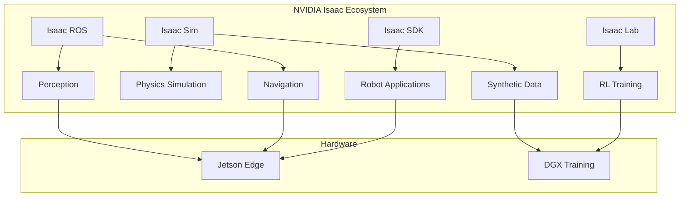
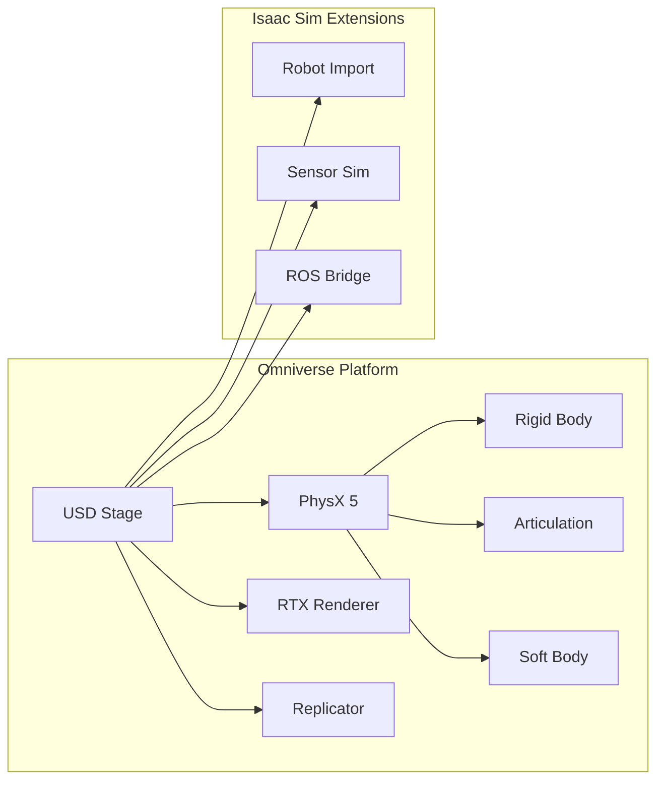
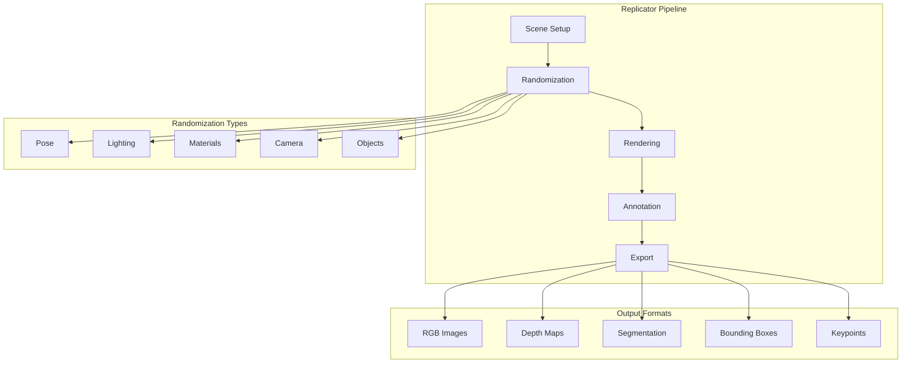
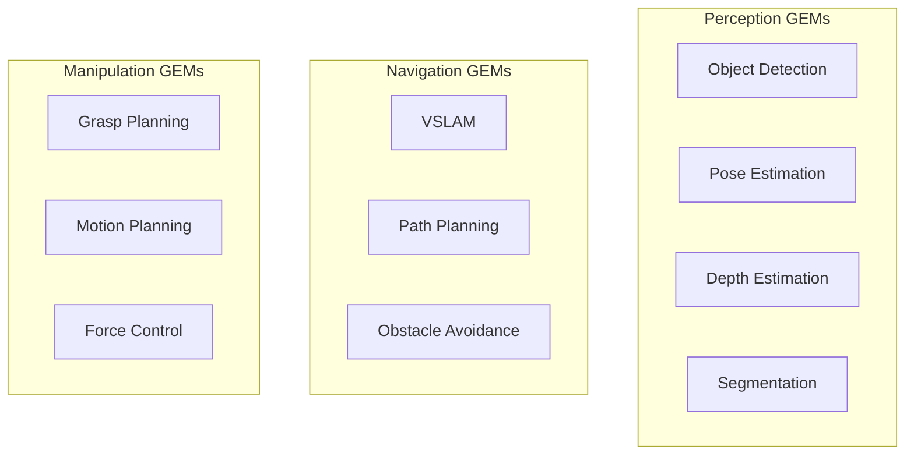

import { ChapterPersonalizeButton } from '@site/src/components/PersonalizationControls';
import { ChapterTranslateButton } from '@site/src/components/TranslationControls';

<div style={{display: 'flex', gap: '10px', marginBottom: '20px'}}>
  <ChapterPersonalizeButton chapterId="isaac-sdk-sim" />
  <ChapterTranslateButton chapterId="isaac-sdk-sim" />
</div>

# NVIDIA Isaac SDK and Isaac Sim

Welcome to the AI-Robot Brain! NVIDIA Isaac is a comprehensive platform that brings GPU-accelerated AI to robotics. In this chapter, you'll learn about Isaac SDK for building intelligent robot applications and Isaac Sim for photorealistic simulation powered by NVIDIA Omniverse.

## Learning Objectives

By the end of this chapter, you will be able to:
- Understand the NVIDIA Isaac ecosystem and its components
- Set up Isaac Sim for photorealistic robot simulation
- Create synthetic training data using Omniverse Replicator
- Build AI-powered robot applications with Isaac SDK
- Integrate Isaac with ROS 2 for real-world deployment

## The NVIDIA Isaac Ecosystem

NVIDIA Isaac is not a single tool but an ecosystem of interconnected platforms designed for AI-powered robotics.

### Isaac Platform Overview



### Component Breakdown

| Component | Purpose | Key Features |
|-----------|---------|--------------|
| **Isaac Sim** | Photorealistic simulation | Omniverse, physics, sensors |
| **Isaac ROS** | Hardware-accelerated ROS | VSLAM, stereo, DNN inference |
| **Isaac SDK** | Robot application framework | GEMs, behavior trees, deployment |
| **Isaac Lab** | RL training environment | GPU-parallel envs, curriculum |
| **Jetson** | Edge deployment | Orin, Xavier, optimized inference |

<div className="key-takeaway">

Isaac provides the complete pipeline: simulate humanoids in photorealistic environments, generate unlimited training data, train with GPU-accelerated RL, and deploy to Jetson edge devices.

</div>

## Isaac Sim: Photorealistic Simulation

Isaac Sim is built on NVIDIA Omniverse, providing physically accurate and visually stunning robot simulation.

### Omniverse Foundation



### Key Technologies

#### Universal Scene Description (USD)

USD is the foundation of Omniverse—a powerful scene description format:

```python
# Example: Creating a USD stage programmatically
from pxr import Usd, UsdGeom, Gf

# Create a new stage
stage = Usd.Stage.CreateNew("humanoid_scene.usda")

# Set up axis and units
UsdGeom.SetStageUpAxis(stage, UsdGeom.Tokens.z)
UsdGeom.SetStageMetersPerUnit(stage, 1.0)

# Create a simple cube
cube_path = "/World/TestCube"
cube = UsdGeom.Cube.Define(stage, cube_path)
cube.GetSizeAttr().Set(0.1)

# Set transform
xform = UsdGeom.Xformable(cube)
xform.AddTranslateOp().Set(Gf.Vec3d(0, 0, 0.5))

stage.Save()
```

#### PhysX 5 Physics Engine

PhysX 5 provides GPU-accelerated physics simulation:

```python
# Physics configuration in Isaac Sim
from omni.isaac.core.physics_context import PhysicsContext

# Configure physics
physics_context = PhysicsContext()
physics_context.set_physics_dt(1.0 / 120.0)  # 120 Hz
physics_context.set_solver_type("TGS")  # Temporal Gauss-Seidel
physics_context.enable_gpu_dynamics(True)
physics_context.set_gravity([0, 0, -9.81])
```

#### RTX Ray Tracing

Isaac Sim uses RTX for photorealistic rendering:

| Rendering Feature | Benefit for Robotics |
|-------------------|---------------------|
| **Ray-traced lighting** | Realistic shadows for vision |
| **Path tracing** | Accurate reflections, refractions |
| **Material simulation** | Realistic surface appearance |
| **Motion blur** | Camera motion effects |

## Installing Isaac Sim

### System Requirements

| Component | Minimum | Recommended |
|-----------|---------|-------------|
| **GPU** | RTX 2070 | RTX 4080+ |
| **VRAM** | 8 GB | 16+ GB |
| **RAM** | 32 GB | 64 GB |
| **Storage** | 50 GB SSD | 100+ GB NVMe |
| **OS** | Ubuntu 22.04 | Ubuntu 22.04 |
| **Driver** | 525.60+ | Latest |

### Installation Steps

```bash
# 1. Install NVIDIA Driver (if not already)
sudo apt update
sudo apt install nvidia-driver-535

# 2. Download Isaac Sim from NVIDIA NGC
# Visit: https://developer.nvidia.com/isaac-sim

# 3. Extract and run
cd ~/isaac_sim-2023.1.1
./isaac-sim.sh

# 4. For headless operation (servers)
./isaac-sim.sh --headless
```

### Verify Installation

```python
# test_isaac_sim.py
from omni.isaac.kit import SimulationApp

# Launch Isaac Sim
simulation_app = SimulationApp({"headless": False})

from omni.isaac.core import World
from omni.isaac.core.objects import DynamicCuboid

# Create world
world = World()
world.scene.add_default_ground_plane()

# Add a test cube
cube = world.scene.add(
    DynamicCuboid(
        prim_path="/World/Cube",
        name="test_cube",
        position=[0, 0, 0.5],
        size=0.1,
        color=[1, 0, 0]
    )
)

# Run simulation
world.reset()
for i in range(1000):
    world.step(render=True)

simulation_app.close()
```

## Creating Simulation Environments

### Loading Robot Models

Isaac Sim supports multiple robot formats:

```python
from omni.isaac.core import World
from omni.isaac.core.utils.stage import add_reference_to_stage
from omni.isaac.core.robots import Robot

# Create world
world = World()

# Method 1: Load from USD
add_reference_to_stage(
    usd_path="/path/to/humanoid.usd",
    prim_path="/World/Humanoid"
)

# Method 2: Load from URDF
from omni.isaac.urdf import _urdf
urdf_interface = _urdf.acquire_urdf_interface()

import_config = _urdf.ImportConfig()
import_config.merge_fixed_joints = False
import_config.fix_base = False
import_config.make_default_prim = True

result = urdf_interface.parse_urdf(
    "/path/to/humanoid.urdf",
    import_config
)

# Method 3: Use built-in robots
from omni.isaac.wheeled_robots.robots import WheeledRobot
# Or import humanoid models from Isaac assets
```

### Building a Humanoid Lab Environment

```python
from omni.isaac.core import World
from omni.isaac.core.objects import FixedCuboid, DynamicCuboid
from omni.isaac.core.materials import PreviewSurface
import numpy as np

def create_humanoid_lab():
    """Create a lab environment for humanoid testing."""

    world = World()

    # Ground plane with friction
    world.scene.add_default_ground_plane(
        z_position=0,
        name="ground",
        static_friction=0.8,
        dynamic_friction=0.6
    )

    # Lab walls
    wall_positions = [
        ([5, 0, 1.5], [0.1, 10, 3]),   # East wall
        ([-5, 0, 1.5], [0.1, 10, 3]),  # West wall
        ([0, 5, 1.5], [10, 0.1, 3]),   # North wall
        ([0, -5, 1.5], [10, 0.1, 3]),  # South wall
    ]

    for i, (pos, size) in enumerate(wall_positions):
        world.scene.add(
            FixedCuboid(
                prim_path=f"/World/Wall_{i}",
                name=f"wall_{i}",
                position=pos,
                size=size,
                color=[0.9, 0.9, 0.9]
            )
        )

    # Manipulation table
    world.scene.add(
        FixedCuboid(
            prim_path="/World/Table",
            name="table",
            position=[2, 0, 0.4],
            size=[1.2, 0.8, 0.8],
            color=[0.6, 0.4, 0.2]
        )
    )

    # Test objects on table
    colors = [[1, 0, 0], [0, 1, 0], [0, 0, 1]]
    for i, color in enumerate(colors):
        world.scene.add(
            DynamicCuboid(
                prim_path=f"/World/Cube_{i}",
                name=f"cube_{i}",
                position=[2 + (i-1)*0.15, 0, 0.85],
                size=0.05,
                color=color,
                mass=0.1
            )
        )

    return world
```

## Synthetic Data Generation with Replicator

One of Isaac Sim's most powerful features is generating unlimited, perfectly labeled training data.

### Omniverse Replicator Overview



### Domain Randomization

Domain randomization helps models generalize from simulation to reality:

```python
import omni.replicator.core as rep

# Define randomization
with rep.new_layer():
    # Randomize lighting
    light = rep.create.light(
        light_type="dome",
        rotation=rep.distribution.uniform((0, 0, 0), (360, 360, 360)),
        intensity=rep.distribution.uniform(500, 2000)
    )

    # Randomize object positions
    cubes = rep.get.prims(path_pattern="/World/Cube_*")
    with cubes:
        rep.modify.pose(
            position=rep.distribution.uniform(
                (1.5, -0.3, 0.85),
                (2.5, 0.3, 0.85)
            ),
            rotation=rep.distribution.uniform(
                (0, 0, 0),
                (0, 0, 360)
            )
        )

    # Randomize materials
    rep.randomizer.materials(
        cubes,
        materials=rep.distribution.choice([
            "OmniPBR_Red",
            "OmniPBR_Blue",
            "OmniPBR_Green"
        ])
    )

    # Camera randomization
    camera = rep.create.camera(
        position=rep.distribution.uniform(
            (0, -2, 1.5),
            (0, -1, 2.0)
        ),
        look_at=(2, 0, 0.85)
    )
```

### Generating Training Data

```python
import omni.replicator.core as rep

def generate_object_detection_data(num_frames=10000):
    """Generate synthetic data for object detection training."""

    # Set up render products
    render_product = rep.create.render_product(
        camera="/World/Camera",
        resolution=(1280, 720)
    )

    # Configure output
    writer = rep.WriterRegistry.get("BasicWriter")
    writer.initialize(
        output_dir="/data/synthetic_dataset",
        rgb=True,
        bounding_box_2d_tight=True,
        semantic_segmentation=True,
        instance_segmentation=True,
        distance_to_camera=True
    )
    writer.attach([render_product])

    # Generate frames
    with rep.trigger.on_frame(num_frames=num_frames):
        # Randomization happens here (defined above)
        pass

    # Run generation
    rep.orchestrator.run()

    print(f"Generated {num_frames} training samples")
```

### Output Data Formats

```json
// Example annotation output (COCO format)
{
  "images": [
    {
      "id": 1,
      "file_name": "rgb_00001.png",
      "width": 1280,
      "height": 720
    }
  ],
  "annotations": [
    {
      "id": 1,
      "image_id": 1,
      "category_id": 1,
      "bbox": [512, 340, 64, 64],
      "segmentation": [[...]],
      "area": 4096
    }
  ],
  "categories": [
    {"id": 1, "name": "cube"}
  ]
}
```

## Isaac SDK for Robot Applications

Isaac SDK provides building blocks for creating intelligent robot applications.

### GEMs (GPU-accelerated Modules)

GEMs are pre-built, optimized components:



### Building an Isaac Application

```python
# humanoid_perception_app.py
from isaac import Application, Node
from isaac.perception import ObjectDetection, PoseEstimation
from isaac.navigation import GlobalPlanner, LocalPlanner

class HumanoidPerceptionApp(Application):
    """Isaac application for humanoid perception."""

    def __init__(self):
        super().__init__()

        # Add perception nodes
        self.add_node("object_detector", ObjectDetection())
        self.add_node("pose_estimator", PoseEstimation())

        # Add navigation nodes
        self.add_node("global_planner", GlobalPlanner())
        self.add_node("local_planner", LocalPlanner())

        # Connect nodes
        self.connect(
            "object_detector/detections",
            "pose_estimator/detections"
        )

    def configure(self):
        # Configure object detector
        self.get_node("object_detector").config.update({
            "model_path": "/models/yolov8_humanoid.onnx",
            "confidence_threshold": 0.5,
            "nms_threshold": 0.4
        })

        # Configure pose estimator
        self.get_node("pose_estimator").config.update({
            "model_path": "/models/pose_estimation.onnx",
            "num_keypoints": 17
        })

if __name__ == "__main__":
    app = HumanoidPerceptionApp()
    app.configure()
    app.run()
```

## ROS 2 Integration

Isaac Sim provides seamless ROS 2 integration for real-world deployment.

### Isaac ROS Bridge

```python
from omni.isaac.ros2_bridge import ROS2Bridge

# Enable ROS 2 bridge
ros2_bridge = ROS2Bridge()

# Publish joint states
ros2_bridge.create_joint_state_publisher(
    robot_prim_path="/World/Humanoid",
    topic_name="/joint_states",
    publish_rate=100
)

# Subscribe to joint commands
ros2_bridge.create_joint_command_subscriber(
    robot_prim_path="/World/Humanoid",
    topic_name="/joint_commands"
)

# Publish camera images
ros2_bridge.create_camera_publisher(
    camera_prim_path="/World/Humanoid/Camera",
    topic_name="/camera/image_raw",
    publish_rate=30
)

# Publish LiDAR scans
ros2_bridge.create_lidar_publisher(
    lidar_prim_path="/World/Humanoid/Lidar",
    topic_name="/scan"
)
```

### Complete ROS 2 Launch Integration

```python
# launch/isaac_humanoid.launch.py
from launch import LaunchDescription
from launch.actions import ExecuteProcess, TimerAction
from launch_ros.actions import Node

def generate_launch_description():
    # Start Isaac Sim
    isaac_sim = ExecuteProcess(
        cmd=[
            '/home/user/isaac_sim/isaac-sim.sh',
            '--/app/window/width=1280',
            '--/app/window/height=720',
            '--exec', '/scripts/load_humanoid_scene.py'
        ],
        output='screen'
    )

    # Wait for Isaac Sim to start, then launch ROS nodes
    delayed_nodes = TimerAction(
        period=10.0,
        actions=[
            # State estimation
            Node(
                package='robot_localization',
                executable='ekf_node',
                name='ekf_filter',
                parameters=['config/ekf.yaml']
            ),
            # Navigation
            Node(
                package='nav2_bringup',
                executable='navigation_launch.py',
                parameters=['config/nav2_params.yaml']
            ),
        ]
    )

    return LaunchDescription([
        isaac_sim,
        delayed_nodes
    ])
```

<div className="hands-on-exercise">

#### Exercise: Verify Your Isaac Sim Installation

Before diving into complex simulations, let's verify Isaac Sim is working correctly.

**Step 1:** Launch Isaac Sim:
```bash
cd ~/isaac_sim-2023.1.1
./isaac-sim.sh
```

**Step 2:** Once loaded, open the Script Editor (Window → Script Editor) and run:
```python
from omni.isaac.core import World
world = World()
world.scene.add_default_ground_plane()
print("Isaac Sim is working!")
```

**Step 3:** Press Play (▶️) to start the simulation. You should see a ground plane.

<div className="expected-output">
Isaac Sim is working!
[Info] Physics scene created
[Info] Ground plane added to scene
</div>

</div>

## Practical Exercise: Humanoid in Isaac Sim

Let's create a complete humanoid simulation with perception and control.

### Step 1: Scene Setup Script

```python
# scripts/setup_humanoid_scene.py
from omni.isaac.kit import SimulationApp

simulation_app = SimulationApp({"headless": False})

from omni.isaac.core import World
from omni.isaac.core.utils.stage import add_reference_to_stage
from omni.isaac.sensor import Camera, RotatingLidarPhysX
from omni.isaac.core.utils.nucleus import get_assets_root_path
import numpy as np

# Create world
world = World(stage_units_in_meters=1.0)
world.scene.add_default_ground_plane()

# Get Isaac assets path
assets_root = get_assets_root_path()

# Load humanoid robot (using available Isaac asset)
humanoid_usd = f"{assets_root}/Isaac/Robots/Humanoid/humanoid.usd"
add_reference_to_stage(
    usd_path=humanoid_usd,
    prim_path="/World/Humanoid"
)

# Add head camera
camera = Camera(
    prim_path="/World/Humanoid/head/Camera",
    position=np.array([0, 0, 1.7]),
    frequency=30,
    resolution=(640, 480)
)
world.scene.add(camera)

# Add LiDAR sensor
lidar = RotatingLidarPhysX(
    prim_path="/World/Humanoid/torso/Lidar",
    name="lidar",
    rotation_frequency=10,
    fov=(360, 30),
    resolution=(0.4, 0.4)
)
world.scene.add(lidar)

# Add environment objects
from omni.isaac.core.objects import DynamicCuboid, FixedCuboid

# Table
world.scene.add(
    FixedCuboid(
        prim_path="/World/Table",
        position=[1.5, 0, 0.4],
        size=[1.0, 0.6, 0.8],
        color=[0.6, 0.4, 0.2]
    )
)

# Objects to manipulate
for i in range(3):
    world.scene.add(
        DynamicCuboid(
            prim_path=f"/World/Object_{i}",
            position=[1.5 + (i-1)*0.15, 0, 0.85],
            size=0.05,
            color=[float(i==0), float(i==1), float(i==2)],
            mass=0.1
        )
    )

# Initialize world
world.reset()

# Main simulation loop
while simulation_app.is_running():
    world.step(render=True)

    # Get sensor data
    rgb = camera.get_rgba()
    depth = camera.get_depth()
    lidar_data = lidar.get_current_frame()

simulation_app.close()
```

### Step 2: Control Interface

```python
# scripts/humanoid_controller.py
from omni.isaac.core.articulations import Articulation
from omni.isaac.core.utils.types import ArticulationAction
import numpy as np

class HumanoidController:
    """Controller for humanoid robot in Isaac Sim."""

    def __init__(self, robot_prim_path: str):
        self.robot = Articulation(prim_path=robot_prim_path)
        self.robot.initialize()

        # Get joint info
        self.num_dof = self.robot.num_dof
        self.joint_names = self.robot.dof_names

        # Default standing pose
        self.standing_pose = np.zeros(self.num_dof)

    def get_joint_positions(self) -> np.ndarray:
        """Get current joint positions."""
        return self.robot.get_joint_positions()

    def get_joint_velocities(self) -> np.ndarray:
        """Get current joint velocities."""
        return self.robot.get_joint_velocities()

    def set_joint_positions(self, positions: np.ndarray):
        """Set target joint positions."""
        action = ArticulationAction(
            joint_positions=positions
        )
        self.robot.apply_action(action)

    def set_joint_velocities(self, velocities: np.ndarray):
        """Set target joint velocities."""
        action = ArticulationAction(
            joint_velocities=velocities
        )
        self.robot.apply_action(action)

    def stand(self):
        """Move to standing pose."""
        self.set_joint_positions(self.standing_pose)

    def wave(self):
        """Simple wave gesture."""
        wave_pose = self.standing_pose.copy()
        # Assuming right arm joints are at indices 10-13
        wave_pose[10] = 1.5  # Shoulder pitch
        wave_pose[11] = 0.5  # Shoulder roll
        self.set_joint_positions(wave_pose)
```

<div className="chapter-summary">

**What you learned:**
- **Isaac Sim**: Photorealistic simulation built on Omniverse with PhysX 5 and RTX rendering
- **Synthetic Data**: Using Replicator for domain randomization and unlimited training data
- **Isaac SDK**: Building GPU-accelerated robot applications with GEMs
- **ROS 2 Integration**: Seamless bridge between Isaac Sim and ROS 2

<div className="key-takeaway">

Isaac Sim's photorealistic rendering and synthetic data generation capabilities make it ideal for training perception models that transfer to the real world. Combined with GPU-accelerated physics, you can simulate thousands of humanoid robots in parallel.

</div>

<a href="/isaac/perception" className="next-chapter">
  Next: AI-Powered Perception with Isaac ROS →
</a>

</div>

## Further Reading

- [NVIDIA Isaac Sim Documentation](https://docs.omniverse.nvidia.com/isaacsim/latest/)
- [Omniverse Replicator Guide](https://docs.omniverse.nvidia.com/replicator/latest/)
- [Isaac ROS Documentation](https://nvidia-isaac-ros.github.io/)
- [USD Specification](https://openusd.org/release/spec.html)

---

**Next Chapter:** [AI-Powered Perception with Isaac ROS](/isaac/perception)
