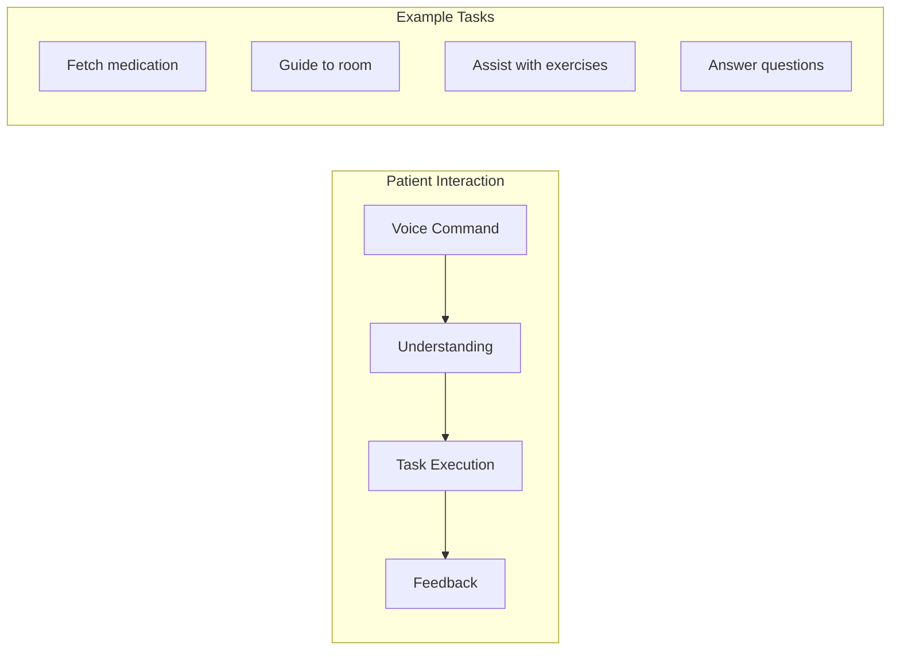
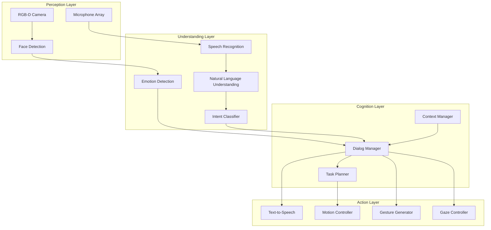
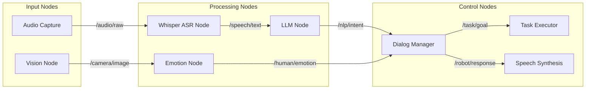
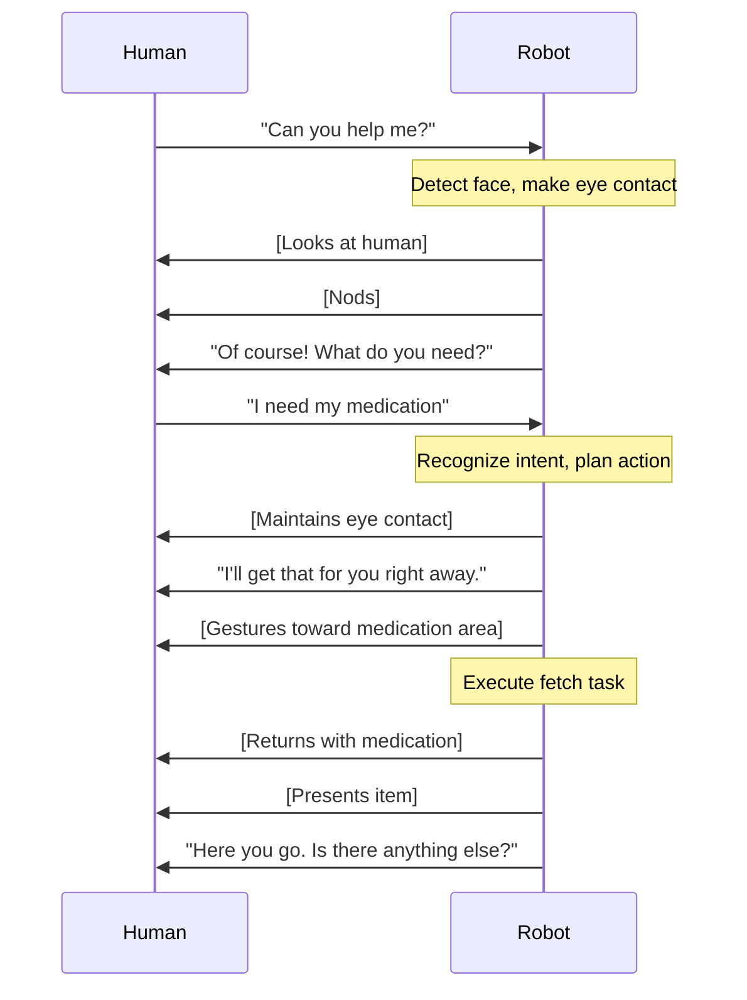

import { ChapterPersonalizeButton } from '@site/src/components/PersonalizationControls';
import { ChapterTranslateButton } from '@site/src/components/TranslationControls';

<div style={{display: 'flex', gap: '10px', marginBottom: '20px'}}>
  <ChapterPersonalizeButton chapterId="case-study-humanoid-assistant" />
  <ChapterTranslateButton chapterId="case-study-humanoid-assistant" />
</div>

# Case Study: Humanoid Assistant

> **Estimated Time:** 90 minutes | **Difficulty:** Advanced

In this case study, you'll design and implement a humanoid robot assistant that can understand natural language commands, engage in conversation, and perform physical tasks. This integrates Human-Robot Interaction (HRI), Vision-Language-Action (VLA) models, and conversational AI concepts.

:::info What You'll Build
A humanoid assistant that can receive voice commands, understand context, plan actions, and execute physical tasks while maintaining natural conversation with humans.
:::

## Learning Objectives

By the end of this case study, you will be able to:
- Design a conversational AI system for humanoid robots
- Integrate speech recognition and synthesis with ROS 2
- Implement intent recognition and task planning
- Build natural human-robot interaction patterns
- Create multi-modal interaction combining speech, gesture, and vision

## The Challenge: Natural Human-Robot Interaction

### Use Case: Healthcare Assistant Robot

Imagine a humanoid robot assistant in a rehabilitation clinic:



### Interaction Requirements

| Capability | Description | Technology |
|------------|-------------|------------|
| **Listen** | Understand spoken commands | Whisper ASR |
| **Understand** | Parse intent and context | LLM (GPT-4) |
| **Plan** | Convert intent to actions | Task Planner |
| **Execute** | Perform physical tasks | ROS 2 Actions |
| **Respond** | Provide verbal feedback | TTS |
| **Adapt** | Adjust to user emotions | Emotion Recognition |

## System Architecture

### High-Level Design



### ROS 2 Node Architecture



<div className="key-takeaway">

**Design Principle:** The dialog manager is the central coordinator. It maintains conversation state, decides when to speak vs. act, and ensures the robot's responses are contextually appropriate.

</div>

## Implementation: Core Components

### 1. Speech Recognition with Whisper

```python
#!/usr/bin/env python3
"""Speech recognition node using OpenAI Whisper."""

import rclpy
from rclpy.node import Node
from std_msgs.msg import String
from audio_msgs.msg import Audio
import whisper
import numpy as np
import torch


class WhisperASRNode(Node):
    """Real-time speech recognition using Whisper."""

    def __init__(self):
        super().__init__('whisper_asr')

        # Load Whisper model
        model_size = self.declare_parameter('model_size', 'base').value
        self.model = whisper.load_model(model_size)
        self.device = 'cuda' if torch.cuda.is_available() else 'cpu'

        # Audio buffer for streaming
        self.audio_buffer = []
        self.sample_rate = 16000
        self.buffer_duration = 5.0  # seconds

        # Subscribers and publishers
        self.audio_sub = self.create_subscription(
            Audio, '/audio/raw', self.audio_callback, 10
        )
        self.text_pub = self.create_publisher(
            String, '/speech/text', 10
        )
        self.listening_pub = self.create_publisher(
            String, '/robot/listening_status', 10
        )

        # Voice activity detection
        self.silence_threshold = 0.01
        self.silence_duration = 0
        self.is_speaking = False

        self.get_logger().info(f'Whisper ASR initialized with {model_size} model')

    def audio_callback(self, msg: Audio):
        """Process incoming audio data."""
        # Convert to numpy array
        audio_data = np.frombuffer(msg.data, dtype=np.float32)

        # Voice activity detection
        energy = np.sqrt(np.mean(audio_data**2))

        if energy > self.silence_threshold:
            self.is_speaking = True
            self.silence_duration = 0
            self.audio_buffer.extend(audio_data)
            self.publish_status('listening')
        elif self.is_speaking:
            self.silence_duration += len(audio_data) / self.sample_rate
            self.audio_buffer.extend(audio_data)

            # End of utterance detected
            if self.silence_duration > 0.8:
                self.process_utterance()
                self.is_speaking = False
                self.audio_buffer = []

    def process_utterance(self):
        """Transcribe the buffered audio."""
        if len(self.audio_buffer) < self.sample_rate:
            return  # Too short

        self.publish_status('processing')

        # Convert to numpy and normalize
        audio = np.array(self.audio_buffer, dtype=np.float32)
        audio = whisper.pad_or_trim(audio)

        # Transcribe
        result = self.model.transcribe(
            audio,
            language='en',
            fp16=torch.cuda.is_available()
        )

        text = result['text'].strip()
        if text:
            self.get_logger().info(f'Recognized: "{text}"')
            msg = String()
            msg.data = text
            self.text_pub.publish(msg)

        self.publish_status('idle')

    def publish_status(self, status: str):
        """Publish listening status for UI feedback."""
        msg = String()
        msg.data = status
        self.listening_pub.publish(msg)
```

### 2. LLM-Based Intent Recognition and Response

```python
#!/usr/bin/env python3
"""LLM node for natural language understanding and response generation."""

import rclpy
from rclpy.node import Node
from std_msgs.msg import String
import json
from openai import OpenAI


class LLMNode(Node):
    """Process natural language using GPT for intent and response."""

    def __init__(self):
        super().__init__('llm_node')

        self.client = OpenAI()

        # Conversation history for context
        self.conversation_history = []
        self.max_history = 10

        # System prompt defining robot capabilities
        self.system_prompt = """You are a helpful humanoid robot assistant
in a healthcare facility. You can:
- Fetch items (medications, water, blankets)
- Guide people to locations (rooms, exits, facilities)
- Answer questions about the facility
- Assist with simple physical tasks
- Provide companionship and conversation

When the user requests a physical task, respond with:
1. A friendly acknowledgment
2. A JSON action block: {"action": "action_name", "params": {...}}

Available actions:
- fetch_item: {"item": "item_name", "location": "optional_location"}
- guide_to: {"destination": "location_name"}
- assist_exercise: {"exercise_type": "type", "duration": minutes}
- call_staff: {"urgency": "low/medium/high", "reason": "description"}

Always be warm, patient, and reassuring."""

        # Subscribers and publishers
        self.text_sub = self.create_subscription(
            String, '/speech/text', self.text_callback, 10
        )
        self.emotion_sub = self.create_subscription(
            String, '/human/emotion', self.emotion_callback, 10
        )

        self.response_pub = self.create_publisher(
            String, '/robot/response', 10
        )
        self.action_pub = self.create_publisher(
            String, '/task/goal', 10
        )

        self.current_emotion = 'neutral'
        self.get_logger().info('LLM node initialized')

    def emotion_callback(self, msg: String):
        """Update current detected emotion."""
        self.current_emotion = msg.data

    def text_callback(self, msg: String):
        """Process user speech and generate response."""
        user_text = msg.data
        self.get_logger().info(f'Processing: "{user_text}"')

        # Add emotion context
        emotion_context = f"[User appears {self.current_emotion}]"

        # Build messages
        messages = [{"role": "system", "content": self.system_prompt}]
        messages.extend(self.conversation_history)
        messages.append({
            "role": "user",
            "content": f"{emotion_context} {user_text}"
        })

        # Call GPT
        response = self.client.chat.completions.create(
            model="gpt-4",
            messages=messages,
            temperature=0.7,
            max_tokens=300
        )

        assistant_response = response.choices[0].message.content

        # Update history
        self.conversation_history.append({"role": "user", "content": user_text})
        self.conversation_history.append({
            "role": "assistant",
            "content": assistant_response
        })

        # Trim history if needed
        if len(self.conversation_history) > self.max_history * 2:
            self.conversation_history = self.conversation_history[-self.max_history*2:]

        # Parse response for actions
        self.process_response(assistant_response)

    def process_response(self, response: str):
        """Extract speech and actions from LLM response."""
        # Look for JSON action block
        speech_text = response
        action_data = None

        if '{"action"' in response:
            try:
                # Extract JSON
                start = response.index('{"action"')
                end = response.index('}', start) + 1
                action_json = response[start:end]
                action_data = json.loads(action_json)

                # Remove JSON from speech
                speech_text = response[:start] + response[end:]
                speech_text = speech_text.strip()
            except (ValueError, json.JSONDecodeError):
                pass

        # Publish speech response
        if speech_text:
            speech_msg = String()
            speech_msg.data = speech_text
            self.response_pub.publish(speech_msg)

        # Publish action if present
        if action_data:
            action_msg = String()
            action_msg.data = json.dumps(action_data)
            self.action_pub.publish(action_msg)
            self.get_logger().info(f'Action: {action_data}')
```

### 3. Dialog Manager with Context

```python
#!/usr/bin/env python3
"""Dialog manager for coordinating conversation and actions."""

import rclpy
from rclpy.node import Node
from rclpy.action import ActionClient
from std_msgs.msg import String
from humanoid_msgs.action import ExecuteTask
import json
from dataclasses import dataclass, field
from typing import Optional, List
from enum import Enum


class DialogState(Enum):
    IDLE = "idle"
    LISTENING = "listening"
    PROCESSING = "processing"
    SPEAKING = "speaking"
    EXECUTING = "executing"
    WAITING_CONFIRMATION = "waiting_confirmation"


@dataclass
class ConversationContext:
    """Maintains conversation context and state."""
    user_name: Optional[str] = None
    current_topic: Optional[str] = None
    pending_action: Optional[dict] = None
    interaction_count: int = 0
    last_emotion: str = "neutral"
    preferences: dict = field(default_factory=dict)


class DialogManager(Node):
    """Coordinate conversation flow and robot behavior."""

    def __init__(self):
        super().__init__('dialog_manager')

        self.state = DialogState.IDLE
        self.context = ConversationContext()

        # Action client for task execution
        self.task_client = ActionClient(
            self, ExecuteTask, '/humanoid/execute_task'
        )

        # Subscribers
        self.response_sub = self.create_subscription(
            String, '/robot/response', self.response_callback, 10
        )
        self.action_sub = self.create_subscription(
            String, '/task/goal', self.action_callback, 10
        )
        self.emotion_sub = self.create_subscription(
            String, '/human/emotion', self.emotion_callback, 10
        )

        # Publishers
        self.speech_pub = self.create_publisher(String, '/tts/text', 10)
        self.gesture_pub = self.create_publisher(String, '/gesture/command', 10)
        self.gaze_pub = self.create_publisher(String, '/gaze/target', 10)

        # Behavior coordination
        self.create_timer(0.1, self.behavior_loop)

        self.get_logger().info('Dialog manager initialized')

    def emotion_callback(self, msg: String):
        """Adapt behavior based on detected emotion."""
        emotion = msg.data
        self.context.last_emotion = emotion

        # Adjust robot behavior based on emotion
        if emotion == 'anxious' or emotion == 'fearful':
            self.trigger_gesture('reassuring_nod')
            self.adjust_speech_rate(0.8)  # Slower, calmer
        elif emotion == 'happy':
            self.trigger_gesture('smile')
        elif emotion == 'sad':
            self.trigger_gesture('empathetic_tilt')

    def response_callback(self, msg: String):
        """Handle LLM response - speak it."""
        self.state = DialogState.SPEAKING
        self.speak(msg.data)

    def action_callback(self, msg: String):
        """Handle action request from LLM."""
        action = json.loads(msg.data)
        self.context.pending_action = action

        # For critical actions, ask confirmation
        if self._requires_confirmation(action):
            self.state = DialogState.WAITING_CONFIRMATION
            self.speak(f"Just to confirm, you'd like me to {self._describe_action(action)}?")
        else:
            self.execute_action(action)

    def _requires_confirmation(self, action: dict) -> bool:
        """Check if action needs user confirmation."""
        critical_actions = ['call_staff', 'administer_medication']
        return action.get('action') in critical_actions

    def _describe_action(self, action: dict) -> str:
        """Generate human-readable action description."""
        action_type = action.get('action')
        params = action.get('params', {})

        descriptions = {
            'fetch_item': f"fetch {params.get('item', 'the item')}",
            'guide_to': f"guide you to {params.get('destination', 'the location')}",
            'call_staff': f"call a staff member",
            'assist_exercise': f"help with {params.get('exercise_type', 'exercises')}"
        }
        return descriptions.get(action_type, "perform that action")

    def execute_action(self, action: dict):
        """Execute the physical action."""
        self.state = DialogState.EXECUTING

        goal = ExecuteTask.Goal()
        goal.task_type = action.get('action', '')
        goal.parameters = json.dumps(action.get('params', {}))

        self.task_client.wait_for_server()
        future = self.task_client.send_goal_async(
            goal, feedback_callback=self.task_feedback
        )
        future.add_done_callback(self.task_done)

    def task_feedback(self, feedback_msg):
        """Provide verbal feedback during task execution."""
        progress = feedback_msg.feedback.progress
        if progress == 50:
            self.speak("I'm halfway there.")

    def task_done(self, future):
        """Handle task completion."""
        result = future.result()
        self.state = DialogState.IDLE

        if result.status == 4:  # SUCCEEDED
            self.speak("All done! Is there anything else I can help with?")
            self.trigger_gesture('task_complete')
        else:
            self.speak("I'm sorry, I had trouble completing that. Should I try again?")

    def speak(self, text: str):
        """Send text to speech synthesis."""
        msg = String()
        msg.data = text
        self.speech_pub.publish(msg)

    def trigger_gesture(self, gesture_name: str):
        """Trigger a social gesture."""
        msg = String()
        msg.data = gesture_name
        self.gesture_pub.publish(msg)

    def behavior_loop(self):
        """Continuous behavior coordination."""
        # Maintain eye contact when in conversation
        if self.state in [DialogState.LISTENING, DialogState.SPEAKING]:
            self.gaze_pub.publish(String(data='face'))
        else:
            self.gaze_pub.publish(String(data='neutral'))
```

### 4. Social Gesture Controller

```python
#!/usr/bin/env python3
"""Generate social gestures for natural interaction."""

import rclpy
from rclpy.node import Node
from std_msgs.msg import String
from trajectory_msgs.msg import JointTrajectory, JointTrajectoryPoint
from builtin_interfaces.msg import Duration
import numpy as np


class GestureController(Node):
    """Control humanoid gestures for social interaction."""

    def __init__(self):
        super().__init__('gesture_controller')

        # Joint names for upper body
        self.arm_joints = [
            'left_shoulder_pitch', 'left_shoulder_roll', 'left_elbow',
            'right_shoulder_pitch', 'right_shoulder_roll', 'right_elbow'
        ]
        self.head_joints = ['head_pan', 'head_tilt']

        # Gesture library
        self.gestures = {
            'wave': self._create_wave_trajectory,
            'nod': self._create_nod_trajectory,
            'point': self._create_point_trajectory,
            'shrug': self._create_shrug_trajectory,
            'reassuring_nod': self._create_reassuring_nod,
            'empathetic_tilt': self._create_empathetic_tilt,
            'task_complete': self._create_task_complete,
        }

        # Subscriber for gesture commands
        self.gesture_sub = self.create_subscription(
            String, '/gesture/command', self.gesture_callback, 10
        )

        # Publishers for joint trajectories
        self.arm_pub = self.create_publisher(
            JointTrajectory, '/arm_controller/joint_trajectory', 10
        )
        self.head_pub = self.create_publisher(
            JointTrajectory, '/head_controller/joint_trajectory', 10
        )

        self.get_logger().info('Gesture controller initialized')

    def gesture_callback(self, msg: String):
        """Execute requested gesture."""
        gesture_name = msg.data

        if gesture_name in self.gestures:
            trajectory = self.gestures[gesture_name]()
            self._execute_trajectory(trajectory)
        else:
            self.get_logger().warn(f'Unknown gesture: {gesture_name}')

    def _create_wave_trajectory(self) -> dict:
        """Create a friendly wave gesture."""
        points = []

        # Raise arm
        points.append({
            'positions': [0.0, -0.5, 0.0, -1.5, 0.8, 1.2],
            'time': 0.5
        })

        # Wave back and forth
        for i in range(3):
            points.append({
                'positions': [0.0, -0.5, 0.0, -1.5, 0.5, 1.2],
                'time': 0.7 + i * 0.4
            })
            points.append({
                'positions': [0.0, -0.5, 0.0, -1.5, 1.1, 1.2],
                'time': 0.9 + i * 0.4
            })

        # Return to neutral
        points.append({
            'positions': [0.0, 0.0, 0.0, 0.0, 0.0, 0.0],
            'time': 2.5
        })

        return {'type': 'arm', 'points': points}

    def _create_nod_trajectory(self) -> dict:
        """Create a nodding gesture for acknowledgment."""
        points = [
            {'positions': [0.0, 0.2], 'time': 0.3},   # Tilt down
            {'positions': [0.0, -0.1], 'time': 0.5},  # Tilt up
            {'positions': [0.0, 0.15], 'time': 0.7},  # Tilt down
            {'positions': [0.0, 0.0], 'time': 1.0},   # Return
        ]
        return {'type': 'head', 'points': points}

    def _create_reassuring_nod(self) -> dict:
        """Slower, more empathetic nod."""
        points = [
            {'positions': [0.0, 0.15], 'time': 0.5},
            {'positions': [0.0, 0.0], 'time': 1.0},
            {'positions': [0.0, 0.1], 'time': 1.5},
            {'positions': [0.0, 0.0], 'time': 2.0},
        ]
        return {'type': 'head', 'points': points}

    def _create_empathetic_tilt(self) -> dict:
        """Slight head tilt showing empathy."""
        points = [
            {'positions': [0.15, 0.1], 'time': 0.5},  # Tilt to side
            {'positions': [0.15, 0.1], 'time': 2.0},  # Hold
            {'positions': [0.0, 0.0], 'time': 2.5},   # Return
        ]
        return {'type': 'head', 'points': points}

    def _create_task_complete(self) -> dict:
        """Gesture indicating task completion."""
        points = [
            # Small celebratory arm raise
            {'positions': [0.0, -0.3, 0.0, 0.0, -0.3, 0.0], 'time': 0.4},
            {'positions': [0.0, 0.0, 0.0, 0.0, 0.0, 0.0], 'time': 0.8},
        ]
        return {'type': 'arm', 'points': points}

    def _execute_trajectory(self, trajectory: dict):
        """Execute a trajectory on the appropriate joints."""
        msg = JointTrajectory()

        if trajectory['type'] == 'arm':
            msg.joint_names = self.arm_joints
            publisher = self.arm_pub
        else:
            msg.joint_names = self.head_joints
            publisher = self.head_pub

        for point_data in trajectory['points']:
            point = JointTrajectoryPoint()
            point.positions = point_data['positions']
            point.time_from_start = Duration(
                sec=int(point_data['time']),
                nanosec=int((point_data['time'] % 1) * 1e9)
            )
            msg.points.append(point)

        publisher.publish(msg)
```

## Multi-Modal Interaction

### Combining Speech, Gesture, and Gaze



### Gaze Controller for Natural Attention

```python
#!/usr/bin/env python3
"""Control robot gaze for natural attention behavior."""

import rclpy
from rclpy.node import Node
from std_msgs.msg import String
from geometry_msgs.msg import PointStamped
from sensor_msgs.msg import JointState
import numpy as np


class GazeController(Node):
    """Control head movement for natural gaze behavior."""

    def __init__(self):
        super().__init__('gaze_controller')

        # Current gaze target
        self.gaze_mode = 'neutral'
        self.face_position = None

        # Subscribers
        self.target_sub = self.create_subscription(
            String, '/gaze/target', self.target_callback, 10
        )
        self.face_sub = self.create_subscription(
            PointStamped, '/face/position', self.face_callback, 10
        )

        # Publisher for head joints
        self.head_pub = self.create_publisher(
            JointState, '/head/command', 10
        )

        # Gaze update timer
        self.create_timer(0.05, self.update_gaze)  # 20 Hz

        # Natural movement parameters
        self.saccade_probability = 0.02  # Small random movements
        self.blink_probability = 0.005

        self.get_logger().info('Gaze controller initialized')

    def target_callback(self, msg: String):
        """Set gaze target mode."""
        self.gaze_mode = msg.data

    def face_callback(self, msg: PointStamped):
        """Update detected face position."""
        self.face_position = msg.point

    def update_gaze(self):
        """Update gaze based on current mode."""
        if self.gaze_mode == 'face' and self.face_position:
            target = self._compute_face_gaze()
        elif self.gaze_mode == 'point':
            target = self._compute_point_gaze()
        else:
            target = self._compute_neutral_gaze()

        # Add natural micro-movements
        target = self._add_natural_movement(target)

        # Publish head command
        self._publish_head_command(target)

    def _compute_face_gaze(self) -> tuple:
        """Compute gaze angles to look at face."""
        if not self.face_position:
            return (0.0, 0.0)

        # Simple inverse kinematics for head
        pan = np.arctan2(self.face_position.y, self.face_position.x)
        tilt = np.arctan2(
            self.face_position.z,
            np.sqrt(self.face_position.x**2 + self.face_position.y**2)
        )

        return (pan, tilt)

    def _compute_neutral_gaze(self) -> tuple:
        """Neutral forward-looking gaze."""
        return (0.0, 0.0)

    def _add_natural_movement(self, target: tuple) -> tuple:
        """Add subtle natural movements."""
        pan, tilt = target

        # Occasional micro-saccades
        if np.random.random() < self.saccade_probability:
            pan += np.random.normal(0, 0.02)
            tilt += np.random.normal(0, 0.01)

        return (pan, tilt)

    def _publish_head_command(self, target: tuple):
        """Publish head joint command."""
        msg = JointState()
        msg.name = ['head_pan', 'head_tilt']
        msg.position = list(target)
        self.head_pub.publish(msg)
```

## Emotion-Aware Interaction

### Adapting to User Emotional State

| Detected Emotion | Robot Adaptation |
|-----------------|------------------|
| **Anxious** | Slower speech, calmer tone, reassuring gestures |
| **Happy** | Matching energy, friendly gestures |
| **Sad** | Empathetic tone, gentle movements, offer support |
| **Frustrated** | Patient responses, offer alternatives |
| **Confused** | Clearer explanations, visual demonstrations |

```python
class EmotionAdaptiveBehavior:
    """Adapt robot behavior based on detected emotions."""

    def __init__(self):
        self.behavior_params = {
            'neutral': {
                'speech_rate': 1.0,
                'movement_speed': 1.0,
                'proximity': 1.0,
                'gesture_frequency': 0.5
            },
            'anxious': {
                'speech_rate': 0.8,
                'movement_speed': 0.7,
                'proximity': 1.2,  # More distance
                'gesture_frequency': 0.3
            },
            'happy': {
                'speech_rate': 1.1,
                'movement_speed': 1.0,
                'proximity': 0.9,
                'gesture_frequency': 0.7
            },
            'sad': {
                'speech_rate': 0.85,
                'movement_speed': 0.8,
                'proximity': 1.0,
                'gesture_frequency': 0.4
            },
            'frustrated': {
                'speech_rate': 0.9,
                'movement_speed': 0.9,
                'proximity': 1.1,
                'gesture_frequency': 0.3
            }
        }

    def get_params(self, emotion: str) -> dict:
        """Get behavior parameters for detected emotion."""
        return self.behavior_params.get(emotion, self.behavior_params['neutral'])

    def generate_empathetic_response(self, emotion: str, context: str) -> str:
        """Generate emotion-appropriate response prefix."""
        prefixes = {
            'anxious': "I understand this might feel overwhelming. ",
            'sad': "I'm sorry you're feeling down. ",
            'frustrated': "I can see this is frustrating. Let me help. ",
            'happy': "That's wonderful! ",
            'confused': "Let me explain that more clearly. "
        }
        return prefixes.get(emotion, "")
```

<div className="hands-on-exercise">

#### Exercise: Build a Simple Voice Command Handler

Create a basic voice command system that recognizes commands and triggers actions.

**Step 1:** Define command patterns:
```python
COMMANDS = {
    'fetch': ['get me', 'bring me', 'fetch', 'can you get'],
    'guide': ['take me to', 'show me where', 'guide me'],
    'help': ['help', 'assist', 'i need'],
    'stop': ['stop', 'cancel', 'never mind']
}
```

**Step 2:** Implement intent matching:
```python
def match_intent(text: str) -> tuple:
    """Match user text to intent and extract parameters."""
    text_lower = text.lower()

    for intent, patterns in COMMANDS.items():
        for pattern in patterns:
            if pattern in text_lower:
                # Extract what comes after the pattern
                idx = text_lower.index(pattern) + len(pattern)
                params = text[idx:].strip()
                return intent, params

    return 'unknown', text

# Test
intent, params = match_intent("Can you get me some water?")
print(f"Intent: {intent}, Params: {params}")
```

<div className="expected-output">
Intent: fetch, Params: some water?
</div>

**Step 3:** Create action dispatcher:
```python
def dispatch_action(intent: str, params: str):
    """Dispatch action based on intent."""
    actions = {
        'fetch': lambda p: f"Fetching {p}...",
        'guide': lambda p: f"I'll guide you to {p}",
        'help': lambda p: "How can I help you?",
        'stop': lambda p: "Stopping current action."
    }
    return actions.get(intent, lambda p: "I didn't understand.")(params)
```

</div>

## Launch Configuration

### Complete System Launch

```python
# launch/humanoid_assistant.launch.py
from launch import LaunchDescription
from launch_ros.actions import Node
from launch.actions import DeclareLaunchArgument
from launch.substitutions import LaunchConfiguration


def generate_launch_description():
    return LaunchDescription([
        # Arguments
        DeclareLaunchArgument('whisper_model', default_value='base'),
        DeclareLaunchArgument('openai_model', default_value='gpt-4'),

        # Speech recognition
        Node(
            package='humanoid_assistant',
            executable='whisper_asr',
            name='whisper_asr',
            parameters=[{
                'model_size': LaunchConfiguration('whisper_model')
            }],
            output='screen'
        ),

        # LLM processing
        Node(
            package='humanoid_assistant',
            executable='llm_node',
            name='llm_node',
            parameters=[{
                'model': LaunchConfiguration('openai_model')
            }],
            output='screen'
        ),

        # Dialog manager
        Node(
            package='humanoid_assistant',
            executable='dialog_manager',
            name='dialog_manager',
            output='screen'
        ),

        # Gesture controller
        Node(
            package='humanoid_assistant',
            executable='gesture_controller',
            name='gesture_controller',
            output='screen'
        ),

        # Gaze controller
        Node(
            package='humanoid_assistant',
            executable='gaze_controller',
            name='gaze_controller',
            output='screen'
        ),

        # Text-to-speech
        Node(
            package='humanoid_assistant',
            executable='tts_node',
            name='tts_node',
            output='screen'
        ),

        # Emotion detection
        Node(
            package='humanoid_assistant',
            executable='emotion_detector',
            name='emotion_detector',
            output='screen'
        ),
    ])
```

## Evaluation Metrics

### HRI Quality Metrics

| Metric | Description | Target |
|--------|-------------|--------|
| **Task Success Rate** | Percentage of tasks completed correctly | > 95% |
| **Response Latency** | Time from speech end to robot response | < 2 sec |
| **User Satisfaction** | Post-interaction survey score | > 4.0/5.0 |
| **Natural Interaction** | Perceived naturalness rating | > 3.5/5.0 |
| **Error Recovery** | Successful recovery from misunderstandings | > 80% |

## Summary

In this case study, you learned how to build a conversational humanoid assistant:

- **Speech Recognition**: Real-time ASR with Whisper for natural voice input
- **Language Understanding**: LLM-based intent recognition and response generation
- **Dialog Management**: Context-aware conversation coordination
- **Social Gestures**: Natural non-verbal communication
- **Emotion Adaptation**: Adjusting behavior based on user emotional state
- **Multi-Modal Integration**: Combining speech, gesture, and gaze

<div className="key-takeaway">

**Real-World Insight:** The most successful humanoid assistants don't just complete tasks—they make humans feel comfortable and understood. Technical capability must be paired with social intelligence for effective human-robot interaction.

</div>

## Further Reading

- [OpenAI Whisper Documentation](https://github.com/openai/whisper)
- [Human-Robot Interaction: An Introduction](https://www.cambridge.org/core/books/humanrobot-interaction/B5C6D8E8F8E8F8E8F8E8F8E8F8E8F8E8)
- [Affective Computing in HRI](https://ieeexplore.ieee.org/document/8956789)

---

**Next Case Study:** [Sim-to-Real Transfer](/practical/case-study-sim-to-real)
