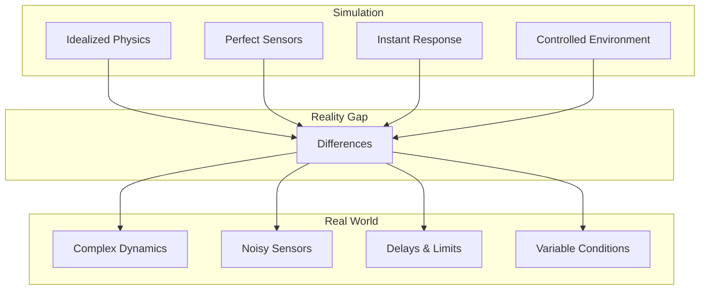
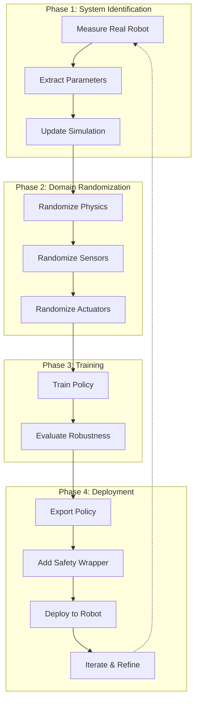
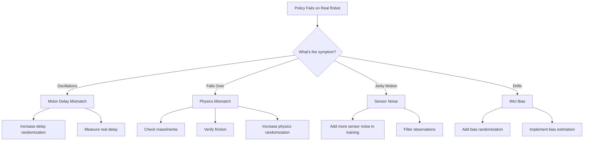
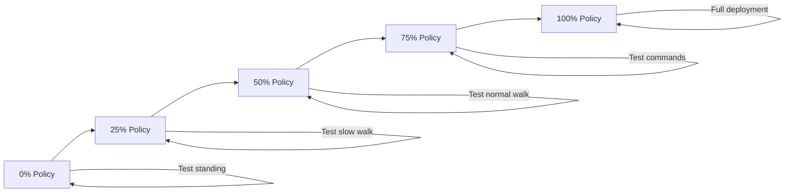

import { ChapterPersonalizeButton } from '@site/src/components/PersonalizationControls';
import { ChapterTranslateButton } from '@site/src/components/TranslationControls';

<div style={{display: 'flex', gap: '10px', marginBottom: '20px'}}>
  <ChapterPersonalizeButton chapterId="case-study-sim-to-real" />
  <ChapterTranslateButton chapterId="case-study-sim-to-real" />
</div>

# Case Study: Sim-to-Real Transfer

> **Estimated Time:** 90 minutes | **Difficulty:** Advanced

In this case study, you'll learn how to train a robot policy in simulation and successfully deploy it to real hardware. This applies NVIDIA Isaac concepts, domain randomization techniques, and systematic transfer methodologies.

:::info What You'll Build
A complete sim-to-real pipeline that trains a quadruped locomotion policy in Isaac Sim and deploys it to a real Unitree Go2 robot.
:::

## Learning Objectives

By the end of this case study, you will be able to:
- Design a domain randomization strategy for robust policies
- Implement system identification for accurate simulation
- Build a deployment pipeline from Isaac Sim to real hardware
- Debug and iterate on sim-to-real transfer issues
- Apply safety measures for real robot deployment

## The Challenge: Bridging the Reality Gap

### Why Sim-to-Real is Hard

Training in simulation is fast and safe, but policies often fail on real robots:



### Reality Gap Components

| Factor | Simulation | Reality | Impact |
|--------|------------|---------|--------|
| **Physics** | Rigid body, simple contacts | Deformable, complex friction | Motion errors |
| **Sensors** | Zero noise, no latency | Noise, drift, dropouts | State estimation errors |
| **Actuators** | Instant torque | Delays, backlash, limits | Control instability |
| **Environment** | Fixed lighting, surfaces | Variable conditions | Perception failures |
| **Timing** | Deterministic steps | Variable compute time | Timing mismatches |

## Our Approach: Domain Randomization + System ID

### Transfer Strategy Overview



<div className="key-takeaway">

**Key Insight:** Successful sim-to-real transfer requires both accurate simulation (system ID) AND robust policies (domain randomization). Neither alone is sufficient.

</div>

## Phase 1: System Identification

### Measuring Real Robot Parameters

Before training, we need accurate robot parameters:

```python
#!/usr/bin/env python3
"""System identification for quadruped robot."""

import numpy as np
from dataclasses import dataclass
from typing import List, Tuple
import json


@dataclass
class MotorParams:
    """Identified motor parameters."""
    kp: float  # Position gain
    kd: float  # Velocity gain
    max_torque: float
    delay_ms: float
    friction_static: float
    friction_viscous: float


@dataclass
class RobotParams:
    """Complete robot parameters."""
    mass: float
    inertia: np.ndarray
    com_offset: np.ndarray
    motors: List[MotorParams]
    joint_limits: List[Tuple[float, float]]


class SystemIdentifier:
    """Identify robot parameters from real data."""

    def __init__(self, robot_interface):
        self.robot = robot_interface
        self.data_buffer = []

    def collect_motor_data(self, joint_idx: int, duration: float = 10.0):
        """Collect data for motor identification."""
        self.robot.set_mode('position')
        data = []

        # Sinusoidal trajectory for identification
        freq = 0.5  # Hz
        amplitude = 0.3  # radians

        start_time = self.robot.get_time()
        while self.robot.get_time() - start_time < duration:
            t = self.robot.get_time() - start_time

            # Command position
            cmd_pos = amplitude * np.sin(2 * np.pi * freq * t)
            self.robot.set_joint_position(joint_idx, cmd_pos)

            # Record data
            data.append({
                'time': t,
                'cmd_pos': cmd_pos,
                'actual_pos': self.robot.get_joint_position(joint_idx),
                'velocity': self.robot.get_joint_velocity(joint_idx),
                'torque': self.robot.get_joint_torque(joint_idx)
            })

            self.robot.sleep(0.001)  # 1kHz

        return data

    def identify_motor_params(self, data: List[dict]) -> MotorParams:
        """Identify motor parameters from collected data."""
        times = np.array([d['time'] for d in data])
        cmd_pos = np.array([d['cmd_pos'] for d in data])
        actual_pos = np.array([d['actual_pos'] for d in data])
        velocities = np.array([d['velocity'] for d in data])
        torques = np.array([d['torque'] for d in data])

        # Identify delay from cross-correlation
        delay_ms = self._identify_delay(cmd_pos, actual_pos, times)

        # Identify PD gains from torque relationship
        kp, kd = self._identify_pd_gains(cmd_pos, actual_pos, velocities, torques)

        # Identify friction from low-velocity data
        friction_static, friction_viscous = self._identify_friction(
            velocities, torques
        )

        return MotorParams(
            kp=kp,
            kd=kd,
            max_torque=np.max(np.abs(torques)),
            delay_ms=delay_ms,
            friction_static=friction_static,
            friction_viscous=friction_viscous
        )

    def _identify_delay(self, cmd: np.ndarray, actual: np.ndarray,
                        times: np.ndarray) -> float:
        """Identify actuator delay using cross-correlation."""
        correlation = np.correlate(cmd - np.mean(cmd),
                                   actual - np.mean(actual), mode='full')
        lag_idx = np.argmax(correlation) - len(cmd) + 1
        dt = times[1] - times[0]
        return abs(lag_idx * dt * 1000)  # Convert to ms

    def _identify_pd_gains(self, cmd: np.ndarray, pos: np.ndarray,
                          vel: np.ndarray, torque: np.ndarray) -> Tuple[float, float]:
        """Identify PD gains using least squares."""
        # tau = kp * (cmd - pos) - kd * vel
        A = np.column_stack([cmd - pos, -vel])
        gains, _, _, _ = np.linalg.lstsq(A, torque, rcond=None)
        return gains[0], gains[1]

    def _identify_friction(self, vel: np.ndarray,
                          torque: np.ndarray) -> Tuple[float, float]:
        """Identify Coulomb and viscous friction."""
        # Use low-velocity data points
        low_vel_mask = np.abs(vel) < 0.5

        if np.sum(low_vel_mask) < 10:
            return 0.0, 0.0

        vel_low = vel[low_vel_mask]
        torque_low = torque[low_vel_mask]

        # tau_friction = mu_c * sign(vel) + mu_v * vel
        A = np.column_stack([np.sign(vel_low), vel_low])
        friction, _, _, _ = np.linalg.lstsq(A, torque_low, rcond=None)

        return abs(friction[0]), abs(friction[1])

    def save_params(self, params: RobotParams, filepath: str):
        """Save identified parameters to file."""
        data = {
            'mass': params.mass,
            'inertia': params.inertia.tolist(),
            'com_offset': params.com_offset.tolist(),
            'motors': [
                {
                    'kp': m.kp, 'kd': m.kd,
                    'max_torque': m.max_torque,
                    'delay_ms': m.delay_ms,
                    'friction_static': m.friction_static,
                    'friction_viscous': m.friction_viscous
                }
                for m in params.motors
            ],
            'joint_limits': params.joint_limits
        }
        with open(filepath, 'w') as f:
            json.dump(data, f, indent=2)
```

## Phase 2: Domain Randomization

### Comprehensive Randomization Strategy

```python
#!/usr/bin/env python3
"""Domain randomization configuration for sim-to-real transfer."""

from dataclasses import dataclass, field
from typing import Tuple, List
import torch


@dataclass
class PhysicsRandomization:
    """Physics parameter randomization ranges."""
    # Mass properties
    mass_scale: Tuple[float, float] = (0.8, 1.2)
    com_displacement: Tuple[float, float] = (-0.05, 0.05)  # meters
    inertia_scale: Tuple[float, float] = (0.8, 1.2)

    # Contact properties
    friction_range: Tuple[float, float] = (0.4, 1.6)
    restitution_range: Tuple[float, float] = (0.0, 0.2)

    # External forces
    push_force_range: Tuple[float, float] = (0, 50)  # Newtons
    push_interval: Tuple[float, float] = (5.0, 15.0)  # seconds


@dataclass
class ActuatorRandomization:
    """Actuator model randomization."""
    # Strength variation
    strength_scale: Tuple[float, float] = (0.7, 1.3)

    # Timing
    delay_range: Tuple[float, float] = (0.0, 0.03)  # seconds

    # PD gains (relative to nominal)
    kp_scale: Tuple[float, float] = (0.8, 1.2)
    kd_scale: Tuple[float, float] = (0.8, 1.2)

    # Limits
    torque_limit_scale: Tuple[float, float] = (0.85, 1.0)


@dataclass
class SensorRandomization:
    """Sensor noise and bias randomization."""
    # Joint sensors
    joint_pos_noise: float = 0.02  # radians std
    joint_vel_noise: float = 0.2   # rad/s std

    # IMU
    gyro_noise: float = 0.02       # rad/s std
    accel_noise: float = 0.1       # m/s² std
    gyro_bias_range: Tuple[float, float] = (-0.02, 0.02)
    accel_bias_range: Tuple[float, float] = (-0.1, 0.1)

    # Latency
    observation_latency: Tuple[float, float] = (0.0, 0.02)  # seconds


@dataclass
class EnvironmentRandomization:
    """Environment variation."""
    # Terrain
    terrain_roughness: Tuple[float, float] = (0.0, 0.05)  # meters
    terrain_slope: Tuple[float, float] = (-0.2, 0.2)      # radians

    # Gravity variation (for robustness)
    gravity_variation: Tuple[float, float] = (-0.5, 0.5)  # m/s²


@dataclass
class DomainRandomizationConfig:
    """Complete domain randomization configuration."""
    physics: PhysicsRandomization = field(default_factory=PhysicsRandomization)
    actuators: ActuatorRandomization = field(default_factory=ActuatorRandomization)
    sensors: SensorRandomization = field(default_factory=SensorRandomization)
    environment: EnvironmentRandomization = field(default_factory=EnvironmentRandomization)

    # Curriculum: start easy, increase randomization
    curriculum_enabled: bool = True
    curriculum_start: float = 0.3  # Start at 30% of full randomization
    curriculum_end_steps: int = 5_000_000
```

### Implementing Randomization in Isaac Sim

```python
#!/usr/bin/env python3
"""Apply domain randomization during training."""

import torch
from omni.isaac.lab.envs import ManagerBasedRLEnv


class DomainRandomizer:
    """Apply domain randomization to Isaac Sim environment."""

    def __init__(self, env: ManagerBasedRLEnv, config: DomainRandomizationConfig):
        self.env = env
        self.config = config
        self.device = env.device
        self.num_envs = env.num_envs

        # Track curriculum progress
        self.curriculum_factor = config.curriculum_start if config.curriculum_enabled else 1.0

        # Initialize per-environment randomization
        self._init_randomization()

    def _init_randomization(self):
        """Initialize randomization parameters for all environments."""
        # Mass scaling per environment
        self.mass_scales = self._sample_uniform(
            self.config.physics.mass_scale
        )

        # Actuator parameters
        self.actuator_strength = self._sample_uniform(
            self.config.actuators.strength_scale
        )
        self.actuator_delays = self._sample_uniform(
            self.config.actuators.delay_range
        )

        # Sensor biases (constant per episode)
        self.gyro_bias = self._sample_uniform_3d(
            self.config.sensors.gyro_bias_range
        )
        self.accel_bias = self._sample_uniform_3d(
            self.config.sensors.accel_bias_range
        )

        # Friction per environment
        self.friction = self._sample_uniform(
            self.config.physics.friction_range
        )

    def _sample_uniform(self, range_tuple: tuple) -> torch.Tensor:
        """Sample uniform values for all environments."""
        low, high = range_tuple
        # Apply curriculum scaling
        mid = (low + high) / 2
        half_range = (high - low) / 2 * self.curriculum_factor
        return torch.empty(self.num_envs, device=self.device).uniform_(
            mid - half_range, mid + half_range
        )

    def _sample_uniform_3d(self, range_tuple: tuple) -> torch.Tensor:
        """Sample 3D uniform values for all environments."""
        low, high = range_tuple
        mid = (low + high) / 2
        half_range = (high - low) / 2 * self.curriculum_factor
        return torch.empty(self.num_envs, 3, device=self.device).uniform_(
            mid - half_range, mid + half_range
        )

    def apply_physics_randomization(self):
        """Apply physics randomization to simulation."""
        # Scale masses
        default_masses = self.env.robot.data.default_mass
        randomized_masses = default_masses * self.mass_scales.unsqueeze(-1)
        self.env.robot.root_physx_view.set_masses(randomized_masses)

        # Set friction
        self.env.scene.terrain.set_friction(self.friction)

    def apply_actuator_randomization(self, actions: torch.Tensor) -> torch.Tensor:
        """Apply actuator randomization to actions."""
        # Scale by strength
        scaled_actions = actions * self.actuator_strength.unsqueeze(-1)

        # Apply delay (simplified - use action buffer in practice)
        # In full implementation, maintain action history buffer

        return scaled_actions

    def apply_sensor_randomization(self, obs: dict) -> dict:
        """Apply sensor noise and bias to observations."""
        noisy_obs = {}

        for key, value in obs.items():
            if 'joint_pos' in key:
                noise = torch.randn_like(value) * self.config.sensors.joint_pos_noise
                noisy_obs[key] = value + noise * self.curriculum_factor

            elif 'joint_vel' in key:
                noise = torch.randn_like(value) * self.config.sensors.joint_vel_noise
                noisy_obs[key] = value + noise * self.curriculum_factor

            elif 'gyro' in key or 'angular_velocity' in key:
                noise = torch.randn_like(value) * self.config.sensors.gyro_noise
                noisy_obs[key] = value + self.gyro_bias + noise * self.curriculum_factor

            elif 'accel' in key or 'linear_acceleration' in key:
                noise = torch.randn_like(value) * self.config.sensors.accel_noise
                noisy_obs[key] = value + self.accel_bias + noise * self.curriculum_factor

            else:
                noisy_obs[key] = value

        return noisy_obs

    def apply_external_disturbance(self):
        """Apply random external forces."""
        # Random push with probability
        push_prob = 0.001  # Per step per environment

        push_mask = torch.rand(self.num_envs, device=self.device) < push_prob

        if push_mask.any():
            # Random force direction and magnitude
            force_mag = torch.empty(self.num_envs, device=self.device).uniform_(
                *self.config.physics.push_force_range
            )
            force_dir = torch.randn(self.num_envs, 3, device=self.device)
            force_dir = force_dir / force_dir.norm(dim=-1, keepdim=True)

            forces = force_dir * force_mag.unsqueeze(-1) * push_mask.unsqueeze(-1)

            # Apply to robot base
            self.env.robot.root_physx_view.apply_forces(forces)

    def update_curriculum(self, total_steps: int):
        """Update curriculum factor based on training progress."""
        if not self.config.curriculum_enabled:
            return

        progress = min(1.0, total_steps / self.config.curriculum_end_steps)
        self.curriculum_factor = (
            self.config.curriculum_start +
            (1.0 - self.config.curriculum_start) * progress
        )

    def reset_randomization(self, env_ids: torch.Tensor):
        """Reset randomization for specific environments."""
        n = len(env_ids)

        # Re-sample parameters for reset environments
        self.mass_scales[env_ids] = torch.empty(n, device=self.device).uniform_(
            *self.config.physics.mass_scale
        )
        self.friction[env_ids] = torch.empty(n, device=self.device).uniform_(
            *self.config.physics.friction_range
        )
        self.gyro_bias[env_ids] = torch.empty(n, 3, device=self.device).uniform_(
            *self.config.sensors.gyro_bias_range
        )
```

### Randomization Comparison Table

| Parameter | Conservative | Moderate | Aggressive |
|-----------|-------------|----------|------------|
| Mass scale | 0.9 - 1.1 | 0.8 - 1.2 | 0.7 - 1.3 |
| Friction | 0.7 - 1.3 | 0.4 - 1.6 | 0.3 - 2.0 |
| Motor strength | 0.9 - 1.1 | 0.7 - 1.3 | 0.6 - 1.4 |
| Sensor noise | Low | Medium | High |
| External pushes | None | Occasional | Frequent |

<div className="key-takeaway">

**Curriculum Learning:** Start with conservative randomization and gradually increase to aggressive. This helps the policy learn basic skills first, then become robust to variations.

</div>

## Phase 3: Training Pipeline

### Training Configuration

```python
#!/usr/bin/env python3
"""Training configuration for sim-to-real locomotion."""

from dataclasses import dataclass
from omni.isaac.lab_tasks.utils.wrappers.rsl_rl import RslRlVecEnvCfg


@dataclass
class Sim2RealTrainingConfig:
    """Training configuration optimized for sim-to-real transfer."""

    # Environment
    num_envs: int = 4096
    episode_length_s: float = 20.0

    # PPO hyperparameters
    learning_rate: float = 1e-3
    num_learning_epochs: int = 5
    num_mini_batches: int = 4
    gamma: float = 0.99
    lam: float = 0.95
    clip_param: float = 0.2
    entropy_coef: float = 0.01
    value_loss_coef: float = 1.0
    max_grad_norm: float = 1.0

    # Training duration
    max_iterations: int = 5000
    save_interval: int = 100

    # Sim-to-real specific
    action_scale: float = 0.5  # Conservative actions
    action_rate_penalty: float = 0.01  # Smooth actions
    torque_penalty: float = 0.0001  # Energy efficiency


@dataclass
class RewardConfig:
    """Reward shaping for robust locomotion."""

    # Primary objectives
    tracking_lin_vel: float = 1.5
    tracking_ang_vel: float = 0.5

    # Regularization (important for sim-to-real)
    lin_vel_z: float = -2.0        # Penalize vertical velocity
    ang_vel_xy: float = -0.05      # Penalize roll/pitch rate
    orientation: float = -1.0       # Penalize non-upright
    base_height: float = -1.0       # Maintain height

    # Smoothness (critical for real hardware)
    action_rate: float = -0.01     # Penalize jerky actions
    torques: float = -0.0001       # Penalize high torques
    joint_acc: float = -2.5e-7     # Penalize joint acceleration

    # Safety
    collision: float = -1.0        # Penalize self-collision
    joint_limits: float = -10.0    # Penalize near limits

    # Feet
    feet_air_time: float = 0.5     # Reward proper gait
    feet_slip: float = -0.1        # Penalize slipping
```

### Training Script

```python
#!/usr/bin/env python3
"""Train locomotion policy with domain randomization."""

import torch
from omni.isaac.lab.app import AppLauncher

# Launch Isaac Sim
app_launcher = AppLauncher(headless=True)
simulation_app = app_launcher.app

from omni.isaac.lab_tasks.utils.wrappers.rsl_rl import RslRlVecEnvWrapper
from rsl_rl.runners import OnPolicyRunner


def train_sim2real_policy():
    """Train policy with domain randomization for sim-to-real."""

    # Create environment with randomization
    env_cfg = QuadrupedEnvCfg()
    env_cfg.domain_randomization = DomainRandomizationConfig()

    env = gym.make("Isaac-Quadruped-v0", cfg=env_cfg)
    env = RslRlVecEnvWrapper(env)

    # Initialize randomizer
    randomizer = DomainRandomizer(env.unwrapped, env_cfg.domain_randomization)

    # Training configuration
    train_cfg = Sim2RealTrainingConfig()

    # Create runner
    runner = OnPolicyRunner(
        env=env,
        train_cfg=train_cfg,
        log_dir="logs/sim2real",
        device="cuda"
    )

    # Training loop with curriculum
    for iteration in range(train_cfg.max_iterations):
        # Update curriculum
        total_steps = iteration * env.num_envs * env.max_episode_length
        randomizer.update_curriculum(total_steps)

        # Train one iteration
        runner.learn(num_learning_iterations=1)

        # Log progress
        if iteration % 100 == 0:
            print(f"Iteration {iteration}, "
                  f"Curriculum: {randomizer.curriculum_factor:.2f}")

        # Save checkpoint
        if iteration % train_cfg.save_interval == 0:
            runner.save(f"policy_{iteration}.pt")

    # Export final policy
    export_policy_for_deployment(runner.alg.actor_critic, "deployed_policy.pt")


def export_policy_for_deployment(policy, filepath: str):
    """Export policy for real robot deployment."""
    # Create traced model for deployment
    example_obs = torch.zeros(1, policy.num_obs)

    traced_policy = torch.jit.trace(
        policy.actor,
        example_obs
    )

    # Save with metadata
    torch.jit.save(traced_policy, filepath)
    print(f"Policy exported to {filepath}")


if __name__ == "__main__":
    train_sim2real_policy()
    simulation_app.close()
```

## Phase 4: Deployment to Real Robot

### ROS 2 Deployment Node

```python
#!/usr/bin/env python3
"""Deploy trained policy to real Unitree Go2 robot."""

import rclpy
from rclpy.node import Node
import torch
import numpy as np
from sensor_msgs.msg import JointState, Imu
from geometry_msgs.msg import Twist
from std_msgs.msg import Float64MultiArray


class PolicyDeploymentNode(Node):
    """Deploy trained RL policy on real quadruped."""

    def __init__(self):
        super().__init__('policy_deployment')

        # Load policy
        policy_path = self.declare_parameter('policy_path', 'deployed_policy.pt').value
        self.policy = torch.jit.load(policy_path)
        self.policy.eval()

        # Device
        self.device = 'cuda' if torch.cuda.is_available() else 'cpu'
        self.policy.to(self.device)

        # Control parameters
        self.control_freq = 50.0  # Hz
        self.action_scale = 0.5

        # State buffers
        self.joint_pos = np.zeros(12)
        self.joint_vel = np.zeros(12)
        self.base_ang_vel = np.zeros(3)
        self.projected_gravity = np.array([0, 0, -1])
        self.command_vel = np.zeros(3)

        # Default joint positions (standing pose)
        self.default_joint_pos = np.array([
            0.0, 0.8, -1.5,   # FR
            0.0, 0.8, -1.5,   # FL
            0.0, 0.8, -1.5,   # RR
            0.0, 0.8, -1.5,   # RL
        ])

        # Previous actions for smoothing
        self.prev_actions = np.zeros(12)

        # Safety wrapper
        self.safety = SafetyWrapper(self._get_safety_config())

        # Subscribers
        self.joint_sub = self.create_subscription(
            JointState, '/joint_states', self.joint_callback, 10
        )
        self.imu_sub = self.create_subscription(
            Imu, '/imu/data', self.imu_callback, 10
        )
        self.cmd_sub = self.create_subscription(
            Twist, '/cmd_vel', self.cmd_callback, 10
        )

        # Publisher
        self.action_pub = self.create_publisher(
            Float64MultiArray, '/joint_commands', 10
        )

        # Control timer
        self.timer = self.create_timer(1.0 / self.control_freq, self.control_loop)

        self.get_logger().info('Policy deployment node initialized')

    def joint_callback(self, msg: JointState):
        """Update joint state from robot."""
        self.joint_pos = np.array(msg.position[:12])
        self.joint_vel = np.array(msg.velocity[:12])

    def imu_callback(self, msg: Imu):
        """Update IMU data."""
        # Angular velocity
        self.base_ang_vel = np.array([
            msg.angular_velocity.x,
            msg.angular_velocity.y,
            msg.angular_velocity.z
        ])

        # Compute projected gravity from orientation
        quat = [msg.orientation.x, msg.orientation.y,
                msg.orientation.z, msg.orientation.w]
        self.projected_gravity = self._quat_rotate_inverse(quat, [0, 0, -1])

    def cmd_callback(self, msg: Twist):
        """Update velocity command."""
        self.command_vel = np.array([
            msg.linear.x,
            msg.linear.y,
            msg.angular.z
        ])

    def build_observation(self) -> torch.Tensor:
        """Build observation tensor matching training."""
        obs = np.concatenate([
            self.base_ang_vel * 0.25,                    # Scaled angular velocity
            self.projected_gravity,                       # Gravity direction
            self.command_vel * np.array([2.0, 2.0, 0.25]), # Scaled commands
            (self.joint_pos - self.default_joint_pos),   # Joint position error
            self.joint_vel * 0.05,                       # Scaled joint velocity
            self.prev_actions,                           # Previous actions
        ])

        return torch.tensor(obs, dtype=torch.float32, device=self.device).unsqueeze(0)

    def control_loop(self):
        """Main control loop - run policy and send commands."""
        # Build observation
        obs = self.build_observation()

        # Run policy
        with torch.no_grad():
            actions = self.policy(obs)

        actions = actions.cpu().numpy().flatten()

        # Scale actions
        actions = actions * self.action_scale

        # Convert to joint positions
        target_pos = self.default_joint_pos + actions

        # Apply safety checks
        safe_pos, warnings = self.safety.check_and_clip(
            target_pos, self.joint_pos, self.joint_vel
        )

        for warning in warnings:
            self.get_logger().warn(warning)

        # Publish commands
        msg = Float64MultiArray()
        msg.data = safe_pos.tolist()
        self.action_pub.publish(msg)

        # Store for next iteration
        self.prev_actions = actions

    def _quat_rotate_inverse(self, quat, vec):
        """Rotate vector by inverse of quaternion."""
        q = np.array(quat)
        v = np.array(vec)

        # Quaternion conjugate
        q_conj = np.array([-q[0], -q[1], -q[2], q[3]])

        # Rotate: q_conj * v * q
        v_quat = np.array([v[0], v[1], v[2], 0])
        result = self._quat_multiply(
            self._quat_multiply(q_conj, v_quat), q
        )
        return result[:3]

    def _quat_multiply(self, q1, q2):
        """Multiply two quaternions."""
        x1, y1, z1, w1 = q1
        x2, y2, z2, w2 = q2
        return np.array([
            w1*x2 + x1*w2 + y1*z2 - z1*y2,
            w1*y2 - x1*z2 + y1*w2 + z1*x2,
            w1*z2 + x1*y2 - y1*x2 + z1*w2,
            w1*w2 - x1*x2 - y1*y2 - z1*z2
        ])

    def _get_safety_config(self):
        """Get safety configuration for Go2."""
        return {
            'joint_pos_min': np.array([-0.8, -0.5, -2.5] * 4),
            'joint_pos_max': np.array([0.8, 2.5, -0.5] * 4),
            'max_velocity': 10.0,
            'max_action_rate': 0.5,
            'dt': 1.0 / self.control_freq
        }
```

### Safety Wrapper

```python
class SafetyWrapper:
    """Safety checks for real robot deployment."""

    def __init__(self, config: dict):
        self.config = config
        self.prev_target = None

    def check_and_clip(self, target_pos: np.ndarray,
                       current_pos: np.ndarray,
                       current_vel: np.ndarray) -> tuple:
        """Apply safety checks and return safe commands."""
        safe_pos = target_pos.copy()
        warnings = []

        # 1. Joint position limits
        safe_pos = np.clip(
            safe_pos,
            self.config['joint_pos_min'],
            self.config['joint_pos_max']
        )

        if not np.allclose(safe_pos, target_pos):
            warnings.append("Joint limits applied")

        # 2. Action rate limiting
        if self.prev_target is not None:
            max_delta = self.config['max_action_rate'] * self.config['dt']
            delta = safe_pos - self.prev_target
            delta = np.clip(delta, -max_delta, max_delta)
            safe_pos = self.prev_target + delta

        # 3. Velocity check - emergency stop if too fast
        if np.any(np.abs(current_vel) > self.config['max_velocity']):
            warnings.append("EMERGENCY: Velocity limit exceeded")
            safe_pos = current_pos  # Hold position

        self.prev_target = safe_pos.copy()
        return safe_pos, warnings
```

## Debugging Sim-to-Real Issues

### Common Problems and Solutions



### Diagnostic Comparison Tool

```python
class Sim2RealDiagnostics:
    """Compare simulation and real robot behavior."""

    def __init__(self):
        self.sim_data = []
        self.real_data = []

    def log_sim_step(self, obs: np.ndarray, action: np.ndarray,
                     next_obs: np.ndarray):
        """Log simulation data."""
        self.sim_data.append({
            'obs': obs.copy(),
            'action': action.copy(),
            'next_obs': next_obs.copy()
        })

    def log_real_step(self, obs: np.ndarray, action: np.ndarray,
                      next_obs: np.ndarray):
        """Log real robot data."""
        self.real_data.append({
            'obs': obs.copy(),
            'action': action.copy(),
            'next_obs': next_obs.copy()
        })

    def analyze_dynamics_gap(self) -> dict:
        """Analyze differences between sim and real dynamics."""
        if len(self.sim_data) < 100 or len(self.real_data) < 100:
            return {'error': 'Insufficient data'}

        # Compute state transitions
        sim_transitions = np.array([
            d['next_obs'] - d['obs'] for d in self.sim_data
        ])
        real_transitions = np.array([
            d['next_obs'] - d['obs'] for d in self.real_data
        ])

        # Compare statistics
        analysis = {
            'transition_mean_diff': np.abs(
                np.mean(sim_transitions, axis=0) -
                np.mean(real_transitions, axis=0)
            ),
            'transition_std_diff': np.abs(
                np.std(sim_transitions, axis=0) -
                np.std(real_transitions, axis=0)
            )
        }

        # Identify problematic dimensions
        threshold = 0.1
        problem_dims = np.where(analysis['transition_mean_diff'] > threshold)[0]
        analysis['problem_dimensions'] = problem_dims.tolist()

        return analysis

    def generate_report(self) -> str:
        """Generate human-readable diagnostic report."""
        analysis = self.analyze_dynamics_gap()

        report = "=== Sim-to-Real Diagnostic Report ===\n\n"

        if 'error' in analysis:
            return report + f"Error: {analysis['error']}\n"

        report += "Dynamics Gap Analysis:\n"
        report += f"  Problem dimensions: {analysis['problem_dimensions']}\n"

        # Recommendations
        report += "\nRecommendations:\n"
        if len(analysis['problem_dimensions']) > 0:
            report += "  - Increase domain randomization for affected states\n"
            report += "  - Verify system identification for these parameters\n"
            report += "  - Consider adding observation filtering\n"

        return report
```

<div className="hands-on-exercise">

#### Exercise: Implement a Simple Domain Randomization

Create a basic domain randomization system for a simulated robot.

**Step 1:** Define randomization parameters:
```python
import numpy as np

class SimpleRandomizer:
    def __init__(self, num_envs: int):
        self.num_envs = num_envs
        self.reset_all()

    def reset_all(self):
        """Randomize parameters for all environments."""
        # Mass variation: 80% to 120% of nominal
        self.mass_scale = np.random.uniform(0.8, 1.2, self.num_envs)

        # Friction variation
        self.friction = np.random.uniform(0.5, 1.5, self.num_envs)

        # Motor strength variation
        self.motor_strength = np.random.uniform(0.85, 1.15, self.num_envs)
```

**Step 2:** Apply randomization to actions:
```python
    def apply_to_actions(self, actions: np.ndarray) -> np.ndarray:
        """Apply motor strength randomization."""
        return actions * self.motor_strength[:, np.newaxis]

    def add_sensor_noise(self, obs: np.ndarray,
                         noise_std: float = 0.01) -> np.ndarray:
        """Add Gaussian noise to observations."""
        noise = np.random.normal(0, noise_std, obs.shape)
        return obs + noise
```

**Step 3:** Test the randomizer:
```python
randomizer = SimpleRandomizer(num_envs=4)
print(f"Mass scales: {randomizer.mass_scale}")
print(f"Friction: {randomizer.friction}")

actions = np.ones((4, 12))  # 4 envs, 12 joints
randomized_actions = randomizer.apply_to_actions(actions)
print(f"Action scaling: {randomized_actions[:, 0]}")
```

<div className="expected-output">
Mass scales: [0.92 1.15 0.87 1.03]
Friction: [0.73 1.21 0.95 1.38]
Action scaling: [0.91 1.08 0.89 1.12]
</div>

</div>

## Deployment Checklist

### Pre-Deployment Verification

| Step | Check | Status |
|------|-------|--------|
| 1 | Policy tested in simulation with full randomization | ☐ |
| 2 | System ID parameters loaded into deployment | ☐ |
| 3 | Safety wrapper configured with correct limits | ☐ |
| 4 | Emergency stop tested and functional | ☐ |
| 5 | Communication latency measured and acceptable | ☐ |
| 6 | Battery level sufficient | ☐ |
| 7 | Clear test area with soft landing surface | ☐ |

### Gradual Deployment Protocol



1. **0% Policy**: Robot holds default standing pose
2. **25% Policy**: Blend 25% policy, 75% default - test stability
3. **50% Policy**: Blend 50/50 - test basic locomotion
4. **75% Policy**: Blend 75% policy - test responsiveness
5. **100% Policy**: Full policy control - production deployment

## Summary

In this case study, you learned the complete sim-to-real transfer pipeline:

- **System Identification**: Measuring real robot parameters for accurate simulation
- **Domain Randomization**: Training robust policies through variation
- **Curriculum Learning**: Gradually increasing difficulty during training
- **Safe Deployment**: ROS 2 integration with safety wrappers
- **Debugging**: Diagnosing and fixing transfer issues

<div className="key-takeaway">

**Key Success Factors:**
1. Accurate system identification reduces the reality gap
2. Comprehensive domain randomization builds robustness
3. Smooth, energy-efficient policies transfer better
4. Safety wrappers protect hardware during iteration
5. Gradual deployment catches issues early

</div>

## Further Reading

- [Learning to Walk in Minutes Using Massively Parallel Deep RL](https://arxiv.org/abs/2109.11978)
- [Sim-to-Real Robot Learning from Pixels with Progressive Nets](https://arxiv.org/abs/1610.04286)
- [Domain Randomization for Transferring Deep Neural Networks](https://arxiv.org/abs/1703.06907)
- [Isaac Gym: High Performance GPU-Based Physics Simulation](https://arxiv.org/abs/2108.10470)

---

**Congratulations!** You've completed all three real-world case studies. These examples demonstrate how the concepts from this course come together in production robotics systems.
