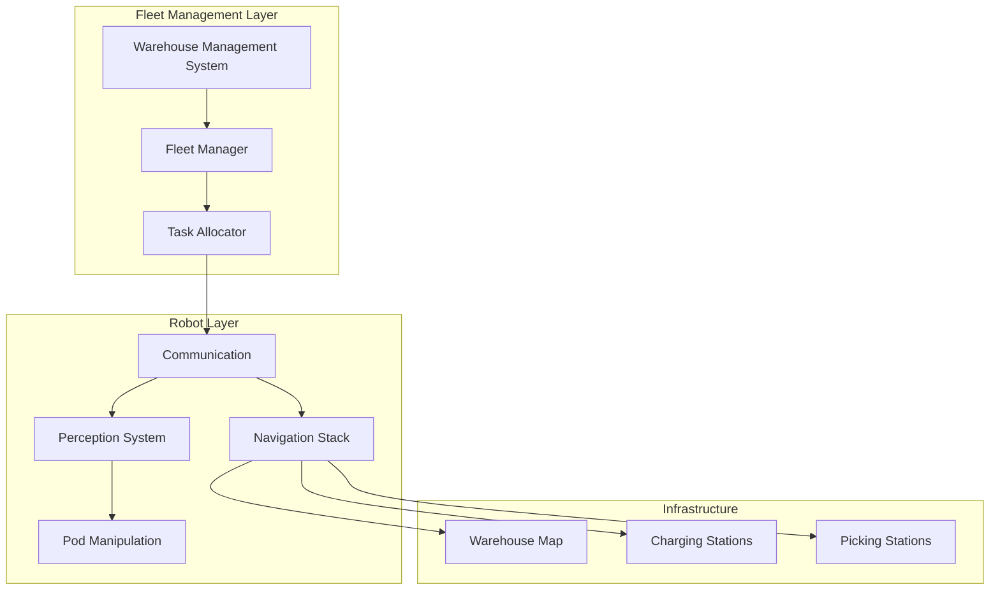
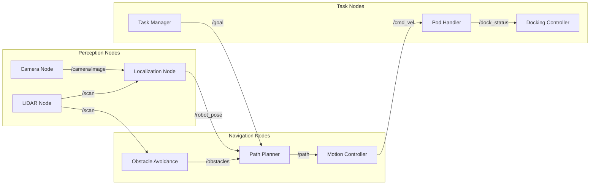
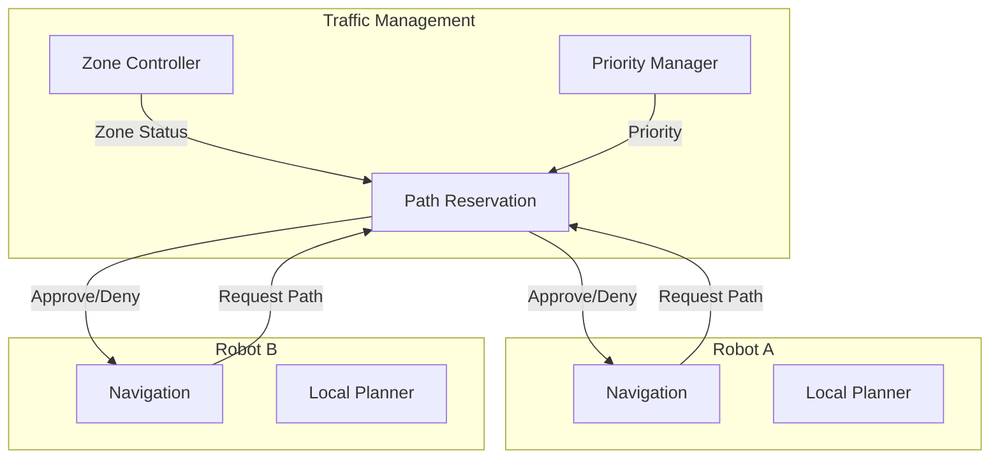
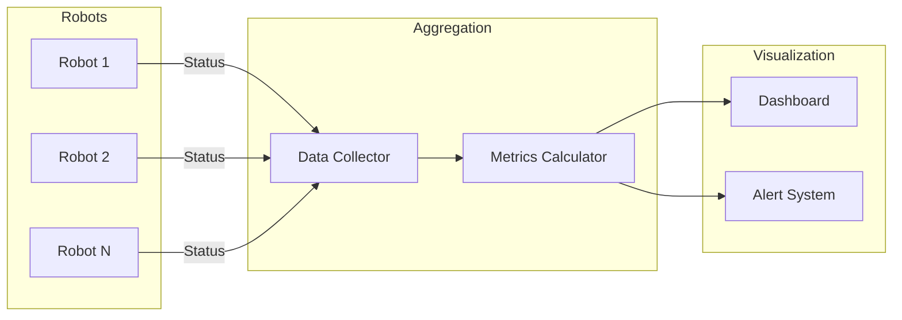

import { ChapterPersonalizeButton } from '@site/src/components/PersonalizationControls';
import { ChapterTranslateButton } from '@site/src/components/TranslationControls';

<div style={{display: 'flex', gap: '10px', marginBottom: '20px'}}>
  <ChapterPersonalizeButton chapterId="case-study-warehouse-robot" />
  <ChapterTranslateButton chapterId="case-study-warehouse-robot" />
</div>

# Case Study: Building a Warehouse Robot

> **Estimated Time:** 90 minutes | **Difficulty:** Advanced

In this case study, you'll apply ROS 2, navigation, and perception concepts to design and implement a complete warehouse automation robot system. This real-world scenario demonstrates how the concepts from Modules 1-3 come together in production robotics.

:::info What You'll Build
A complete warehouse robot system that can autonomously navigate, locate items, and coordinate with other robots and human workers.
:::

## Learning Objectives

By the end of this case study, you will be able to:
- Design a complete ROS 2 architecture for warehouse automation
- Implement autonomous navigation with obstacle avoidance
- Integrate perception systems for item identification
- Build a task management system for order fulfillment
- Handle multi-robot coordination and fleet management

## The Challenge: Modern Warehouse Automation

### Business Context

E-commerce growth has created unprecedented demand for warehouse efficiency:

| Challenge | Traditional Approach | Robot Solution |
|-----------|---------------------|----------------|
| Order volume | More workers | Scalable fleet |
| Speed | Walking 10-15 miles/day | Robots bring items to workers |
| Accuracy | Human error ~1-3% | Vision-verified picking |
| 24/7 operation | Shift scheduling | Continuous operation |
| Peak handling | Temporary workers | Deploy more robots |

### System Requirements

Our warehouse robot must:
1. **Navigate** autonomously through warehouse aisles
2. **Locate** specific storage pods using perception
3. **Transport** pods to picking stations
4. **Coordinate** with other robots to avoid collisions
5. **Integrate** with warehouse management systems

## System Architecture

### High-Level Design



### ROS 2 Node Architecture



<div className="key-takeaway">

**Design Principle:** Each node has a single responsibility. The perception nodes don't know about navigation, and navigation nodes don't know about tasks. This modularity allows independent testing and replacement of components.

</div>

## Implementation: Core Components

### 1. Robot Configuration (URDF)

First, define the robot's physical structure:

```xml
<?xml version="1.0"?>
<robot name="warehouse_robot">
  <!-- Base Link -->
  <link name="base_link">
    <visual>
      <geometry>
        <box size="0.6 0.4 0.2"/>
      </geometry>
      <material name="orange"/>
    </visual>
    <collision>
      <geometry>
        <box size="0.6 0.4 0.2"/>
      </geometry>
    </collision>
    <inertial>
      <mass value="50.0"/>
      <inertia ixx="1.0" ixy="0" ixz="0" iyy="1.0" iyz="0" izz="1.0"/>
    </inertial>
  </link>

  <!-- Lift Mechanism -->
  <link name="lift_platform">
    <visual>
      <geometry>
        <box size="0.5 0.35 0.05"/>
      </geometry>
    </visual>
  </link>

  <joint name="lift_joint" type="prismatic">
    <parent link="base_link"/>
    <child link="lift_platform"/>
    <axis xyz="0 0 1"/>
    <limit lower="0" upper="0.3" effort="500" velocity="0.1"/>
  </joint>

  <!-- LiDAR Sensor -->
  <link name="lidar_link">
    <visual>
      <geometry>
        <cylinder radius="0.05" length="0.05"/>
      </geometry>
    </visual>
  </link>

  <joint name="lidar_joint" type="fixed">
    <parent link="base_link"/>
    <child link="lidar_link"/>
    <origin xyz="0.25 0 0.15"/>
  </joint>

  <!-- Camera for Pod Detection -->
  <link name="camera_link"/>
  <joint name="camera_joint" type="fixed">
    <parent link="base_link"/>
    <child link="camera_link"/>
    <origin xyz="0.3 0 0.1" rpy="0 0.2 0"/>
  </joint>
</robot>
```

### 2. Navigation Stack Integration

Configure Nav2 for warehouse navigation:

```python
#!/usr/bin/env python3
"""Warehouse robot navigation node using Nav2."""

import rclpy
from rclpy.node import Node
from rclpy.action import ActionClient
from nav2_msgs.action import NavigateToPose
from geometry_msgs.msg import PoseStamped, PoseWithCovarianceStamped
from std_msgs.msg import String
import json


class WarehouseNavigator(Node):
    """Navigate warehouse robot to specified locations."""

    def __init__(self):
        super().__init__('warehouse_navigator')

        # Nav2 action client
        self._nav_client = ActionClient(
            self, NavigateToPose, 'navigate_to_pose'
        )

        # Warehouse locations (loaded from config)
        self.locations = self._load_warehouse_map()

        # Task subscription
        self.task_sub = self.create_subscription(
            String, '/robot/task', self.task_callback, 10
        )

        # Status publisher
        self.status_pub = self.create_publisher(
            String, '/robot/status', 10
        )

        self.current_task = None
        self.get_logger().info('Warehouse navigator initialized')

    def _load_warehouse_map(self) -> dict:
        """Load predefined warehouse locations."""
        return {
            'charging_station_1': {'x': 0.0, 'y': 0.0, 'theta': 0.0},
            'picking_station_A': {'x': 10.0, 'y': 0.0, 'theta': 1.57},
            'picking_station_B': {'x': 10.0, 'y': 5.0, 'theta': 1.57},
            'aisle_1_start': {'x': 2.0, 'y': 2.0, 'theta': 0.0},
            'aisle_1_end': {'x': 8.0, 'y': 2.0, 'theta': 0.0},
            # Pod locations dynamically added
        }

    def task_callback(self, msg: String):
        """Handle incoming task assignments."""
        task = json.loads(msg.data)
        self.get_logger().info(f"Received task: {task['type']}")

        if task['type'] == 'fetch_pod':
            self.fetch_pod(task['pod_id'], task['destination'])
        elif task['type'] == 'return_pod':
            self.return_pod(task['pod_id'], task['storage_location'])
        elif task['type'] == 'go_charge':
            self.navigate_to('charging_station_1')

    def fetch_pod(self, pod_id: str, destination: str):
        """Fetch a pod and deliver to destination."""
        self.current_task = {'type': 'fetch', 'pod': pod_id}
        self.publish_status('navigating_to_pod')

        # Navigate to pod location
        pod_location = f'pod_{pod_id}'
        self.navigate_to(pod_location, callback=lambda: self._dock_and_lift(
            pod_id, destination
        ))

    def navigate_to(self, location_name: str, callback=None):
        """Navigate to a named location."""
        if location_name not in self.locations:
            self.get_logger().error(f'Unknown location: {location_name}')
            return

        loc = self.locations[location_name]

        goal = NavigateToPose.Goal()
        goal.pose = PoseStamped()
        goal.pose.header.frame_id = 'map'
        goal.pose.header.stamp = self.get_clock().now().to_msg()
        goal.pose.pose.position.x = loc['x']
        goal.pose.pose.position.y = loc['y']

        # Convert theta to quaternion
        goal.pose.pose.orientation.z = math.sin(loc['theta'] / 2)
        goal.pose.pose.orientation.w = math.cos(loc['theta'] / 2)

        self._nav_client.wait_for_server()
        future = self._nav_client.send_goal_async(
            goal, feedback_callback=self._nav_feedback
        )
        future.add_done_callback(
            lambda f: self._nav_done(f, callback)
        )

    def _nav_feedback(self, feedback_msg):
        """Handle navigation feedback."""
        feedback = feedback_msg.feedback
        remaining = feedback.distance_remaining
        self.get_logger().debug(f'Distance remaining: {remaining:.2f}m')

    def _nav_done(self, future, callback):
        """Handle navigation completion."""
        result = future.result()
        if result.status == 4:  # SUCCEEDED
            self.publish_status('navigation_complete')
            if callback:
                callback()
        else:
            self.publish_status('navigation_failed')
            self.get_logger().error('Navigation failed')

    def publish_status(self, status: str):
        """Publish robot status."""
        msg = String()
        msg.data = json.dumps({
            'robot_id': self.get_name(),
            'status': status,
            'task': self.current_task
        })
        self.status_pub.publish(msg)
```

### 3. Perception System for Pod Detection

Implement computer vision for identifying and localizing pods:

```python
#!/usr/bin/env python3
"""Pod detection using computer vision."""

import rclpy
from rclpy.node import Node
from sensor_msgs.msg import Image, CameraInfo
from geometry_msgs.msg import PoseStamped
from cv_bridge import CvBridge
import cv2
import numpy as np


class PodDetector(Node):
    """Detect and localize storage pods using vision."""

    def __init__(self):
        super().__init__('pod_detector')

        self.bridge = CvBridge()

        # Subscribers
        self.image_sub = self.create_subscription(
            Image, '/camera/image_raw', self.image_callback, 10
        )
        self.depth_sub = self.create_subscription(
            Image, '/camera/depth', self.depth_callback, 10
        )
        self.camera_info_sub = self.create_subscription(
            CameraInfo, '/camera/camera_info', self.camera_info_callback, 10
        )

        # Publishers
        self.pod_pose_pub = self.create_publisher(
            PoseStamped, '/detected_pod_pose', 10
        )
        self.debug_image_pub = self.create_publisher(
            Image, '/pod_detection/debug', 10
        )

        self.camera_matrix = None
        self.depth_image = None

        # ArUco marker detection for pod identification
        self.aruco_dict = cv2.aruco.getPredefinedDictionary(
            cv2.aruco.DICT_4X4_50
        )
        self.aruco_params = cv2.aruco.DetectorParameters()

        self.get_logger().info('Pod detector initialized')

    def camera_info_callback(self, msg: CameraInfo):
        """Store camera intrinsics."""
        self.camera_matrix = np.array(msg.k).reshape(3, 3)

    def depth_callback(self, msg: Image):
        """Store latest depth image."""
        self.depth_image = self.bridge.imgmsg_to_cv2(msg)

    def image_callback(self, msg: Image):
        """Process image to detect pods."""
        if self.camera_matrix is None:
            return

        cv_image = self.bridge.imgmsg_to_cv2(msg, 'bgr8')
        gray = cv2.cvtColor(cv_image, cv2.COLOR_BGR2GRAY)

        # Detect ArUco markers on pods
        detector = cv2.aruco.ArucoDetector(
            self.aruco_dict, self.aruco_params
        )
        corners, ids, rejected = detector.detectMarkers(gray)

        if ids is not None:
            for i, marker_id in enumerate(ids.flatten()):
                # Get marker pose
                pose = self._estimate_marker_pose(corners[i], marker_id)
                if pose:
                    self.pod_pose_pub.publish(pose)

                # Draw detection for debugging
                cv2.aruco.drawDetectedMarkers(cv_image, corners, ids)

        # Publish debug image
        debug_msg = self.bridge.cv2_to_imgmsg(cv_image, 'bgr8')
        self.debug_image_pub.publish(debug_msg)

    def _estimate_marker_pose(self, corners, marker_id) -> PoseStamped:
        """Estimate 3D pose of detected marker."""
        marker_size = 0.1  # 10cm markers

        # Define marker corners in 3D
        obj_points = np.array([
            [-marker_size/2, marker_size/2, 0],
            [marker_size/2, marker_size/2, 0],
            [marker_size/2, -marker_size/2, 0],
            [-marker_size/2, -marker_size/2, 0]
        ], dtype=np.float32)

        # Solve PnP
        success, rvec, tvec = cv2.solvePnP(
            obj_points,
            corners[0],
            self.camera_matrix,
            None
        )

        if not success:
            return None

        # Create pose message
        pose = PoseStamped()
        pose.header.frame_id = 'camera_link'
        pose.header.stamp = self.get_clock().now().to_msg()
        pose.pose.position.x = float(tvec[0])
        pose.pose.position.y = float(tvec[1])
        pose.pose.position.z = float(tvec[2])

        return pose
```

### 4. Fleet Management System

Coordinate multiple robots efficiently:

```python
#!/usr/bin/env python3
"""Fleet management for warehouse robots."""

import rclpy
from rclpy.node import Node
from std_msgs.msg import String
import json
from dataclasses import dataclass
from typing import Dict, List, Optional
from enum import Enum


class RobotState(Enum):
    IDLE = "idle"
    NAVIGATING = "navigating"
    DOCKING = "docking"
    CARRYING = "carrying"
    CHARGING = "charging"
    ERROR = "error"


@dataclass
class Robot:
    id: str
    state: RobotState
    position: tuple
    battery: float
    current_task: Optional[dict]


@dataclass
class Task:
    id: str
    type: str
    pod_id: str
    destination: str
    priority: int
    assigned_robot: Optional[str]


class FleetManager(Node):
    """Manage fleet of warehouse robots."""

    def __init__(self):
        super().__init__('fleet_manager')

        self.robots: Dict[str, Robot] = {}
        self.pending_tasks: List[Task] = []
        self.active_tasks: Dict[str, Task] = {}

        # Subscribe to robot status updates
        self.status_sub = self.create_subscription(
            String, '/robots/status', self.robot_status_callback, 10
        )

        # Subscribe to new orders from WMS
        self.order_sub = self.create_subscription(
            String, '/wms/orders', self.order_callback, 10
        )

        # Publisher for task assignments
        self.task_pubs: Dict[str, any] = {}

        # Task allocation timer
        self.create_timer(1.0, self.allocate_tasks)

        self.get_logger().info('Fleet manager initialized')

    def robot_status_callback(self, msg: String):
        """Update robot status from heartbeat."""
        data = json.loads(msg.data)
        robot_id = data['robot_id']

        if robot_id not in self.robots:
            self.robots[robot_id] = Robot(
                id=robot_id,
                state=RobotState.IDLE,
                position=(0, 0),
                battery=100.0,
                current_task=None
            )
            # Create task publisher for this robot
            self.task_pubs[robot_id] = self.create_publisher(
                String, f'/{robot_id}/task', 10
            )

        robot = self.robots[robot_id]
        robot.state = RobotState(data.get('status', 'idle'))
        robot.position = tuple(data.get('position', [0, 0]))
        robot.battery = data.get('battery', 100.0)

    def order_callback(self, msg: String):
        """Handle new order from warehouse management system."""
        order = json.loads(msg.data)

        task = Task(
            id=order['order_id'],
            type='fetch_pod',
            pod_id=order['pod_id'],
            destination=order['picking_station'],
            priority=order.get('priority', 5),
            assigned_robot=None
        )

        self.pending_tasks.append(task)
        self.pending_tasks.sort(key=lambda t: t.priority, reverse=True)
        self.get_logger().info(f'New task queued: {task.id}')

    def allocate_tasks(self):
        """Allocate pending tasks to available robots."""
        available_robots = [
            r for r in self.robots.values()
            if r.state == RobotState.IDLE and r.battery > 20.0
        ]

        for task in self.pending_tasks[:]:
            if not available_robots:
                break

            # Find best robot (closest to pod)
            best_robot = self._find_best_robot(task, available_robots)
            if best_robot:
                self._assign_task(task, best_robot)
                available_robots.remove(best_robot)
                self.pending_tasks.remove(task)

        # Send low-battery robots to charge
        for robot in self.robots.values():
            if robot.battery < 20.0 and robot.state == RobotState.IDLE:
                self._send_to_charge(robot)

    def _find_best_robot(self, task: Task, robots: List[Robot]) -> Optional[Robot]:
        """Find the best robot for a task based on distance."""
        pod_location = self._get_pod_location(task.pod_id)
        if not pod_location:
            return None

        best_robot = None
        best_distance = float('inf')

        for robot in robots:
            distance = self._calculate_distance(robot.position, pod_location)
            if distance < best_distance:
                best_distance = distance
                best_robot = robot

        return best_robot

    def _assign_task(self, task: Task, robot: Robot):
        """Assign task to robot."""
        task.assigned_robot = robot.id
        robot.current_task = {'task_id': task.id, 'type': task.type}
        self.active_tasks[task.id] = task

        # Send task to robot
        msg = String()
        msg.data = json.dumps({
            'type': task.type,
            'pod_id': task.pod_id,
            'destination': task.destination
        })
        self.task_pubs[robot.id].publish(msg)

        self.get_logger().info(
            f'Assigned task {task.id} to robot {robot.id}'
        )

    def _calculate_distance(self, pos1: tuple, pos2: tuple) -> float:
        """Calculate Euclidean distance between positions."""
        return ((pos1[0] - pos2[0])**2 + (pos1[1] - pos2[1])**2)**0.5
```

## Multi-Robot Coordination

### Collision Avoidance Architecture



### Path Reservation System

```python
#!/usr/bin/env python3
"""Path reservation for multi-robot coordination."""

import rclpy
from rclpy.node import Node
from std_msgs.msg import String
from geometry_msgs.msg import PoseArray
import json
from typing import Dict, List, Set
from dataclasses import dataclass
import time


@dataclass
class PathReservation:
    robot_id: str
    cells: List[tuple]
    start_time: float
    duration: float


class TrafficController(Node):
    """Manage path reservations to prevent collisions."""

    def __init__(self):
        super().__init__('traffic_controller')

        # Grid-based reservation map
        self.grid_resolution = 0.5  # meters
        self.reservations: Dict[tuple, PathReservation] = {}
        self.robot_priorities: Dict[str, int] = {}

        # Service for path requests
        self.request_sub = self.create_subscription(
            String, '/traffic/path_request', self.handle_request, 10
        )
        self.response_pub = self.create_publisher(
            String, '/traffic/path_response', 10
        )

        # Cleanup timer
        self.create_timer(1.0, self.cleanup_expired)

        self.get_logger().info('Traffic controller initialized')

    def handle_request(self, msg: String):
        """Handle path reservation request."""
        request = json.loads(msg.data)
        robot_id = request['robot_id']
        path = request['path']  # List of (x, y) waypoints

        # Convert path to grid cells
        cells = self._path_to_cells(path)

        # Check for conflicts
        conflicts = self._check_conflicts(robot_id, cells)

        if not conflicts:
            # Reserve path
            reservation = PathReservation(
                robot_id=robot_id,
                cells=cells,
                start_time=time.time(),
                duration=request.get('duration', 30.0)
            )
            for cell in cells:
                self.reservations[cell] = reservation

            response = {'approved': True, 'robot_id': robot_id}
        else:
            # Resolve conflict based on priority
            response = self._resolve_conflict(robot_id, conflicts)

        self.response_pub.publish(String(data=json.dumps(response)))

    def _path_to_cells(self, path: List[dict]) -> List[tuple]:
        """Convert continuous path to grid cells."""
        cells = []
        for point in path:
            cell = (
                int(point['x'] / self.grid_resolution),
                int(point['y'] / self.grid_resolution)
            )
            if cell not in cells:
                cells.append(cell)
        return cells

    def _check_conflicts(self, robot_id: str, cells: List[tuple]) -> List[str]:
        """Check if path conflicts with existing reservations."""
        conflicts = []
        for cell in cells:
            if cell in self.reservations:
                existing = self.reservations[cell]
                if existing.robot_id != robot_id:
                    conflicts.append(existing.robot_id)
        return list(set(conflicts))

    def _resolve_conflict(self, robot_id: str, conflicts: List[str]) -> dict:
        """Resolve path conflict using priority."""
        my_priority = self.robot_priorities.get(robot_id, 0)

        for conflict_robot in conflicts:
            their_priority = self.robot_priorities.get(conflict_robot, 0)
            if their_priority >= my_priority:
                return {
                    'approved': False,
                    'robot_id': robot_id,
                    'reason': 'path_conflict',
                    'wait_for': conflict_robot
                }

        return {'approved': True, 'robot_id': robot_id}

    def cleanup_expired(self):
        """Remove expired reservations."""
        current_time = time.time()
        expired = [
            cell for cell, res in self.reservations.items()
            if current_time > res.start_time + res.duration
        ]
        for cell in expired:
            del self.reservations[cell]
```

## Performance Metrics

### Key Performance Indicators

| Metric | Target | Measurement Method |
|--------|--------|-------------------|
| Order fulfillment time | < 15 min | Task start to completion |
| Robot utilization | > 85% | Active time / total time |
| Collision incidents | 0 | Safety system logs |
| Battery efficiency | > 90% | Useful work / energy consumed |
| System throughput | 500 orders/hour | Orders completed per hour |

### Monitoring Dashboard Data Flow



<div className="hands-on-exercise">

#### Exercise: Implement a Simple Task Allocator

Create a basic task allocation algorithm that assigns tasks to the nearest available robot.

**Step 1:** Define the data structures:
```python
from dataclasses import dataclass
from typing import List, Optional

@dataclass
class Robot:
    id: str
    x: float
    y: float
    is_available: bool

@dataclass
class Task:
    id: str
    target_x: float
    target_y: float
```

**Step 2:** Implement the allocator:
```python
def allocate_task(task: Task, robots: List[Robot]) -> Optional[str]:
    """Allocate task to nearest available robot."""
    available = [r for r in robots if r.is_available]
    if not available:
        return None

    def distance(robot):
        return ((robot.x - task.target_x)**2 +
                (robot.y - task.target_y)**2)**0.5

    nearest = min(available, key=distance)
    nearest.is_available = False
    return nearest.id
```

**Step 3:** Test with sample data:
```python
robots = [
    Robot('R1', 0, 0, True),
    Robot('R2', 5, 5, True),
    Robot('R3', 10, 0, False),  # Not available
]
task = Task('T1', 4, 4)

assigned = allocate_task(task, robots)
print(f"Task assigned to: {assigned}")  # Should be R2
```

<div className="expected-output">
Task assigned to: R2
</div>

</div>

## Launch Configuration

### Complete System Launch

```python
# launch/warehouse_system.launch.py
from launch import LaunchDescription
from launch_ros.actions import Node
from launch.actions import IncludeLaunchDescription
from launch.launch_description_sources import PythonLaunchDescriptionSource
from ament_index_python.packages import get_package_share_directory
import os


def generate_launch_description():
    nav2_launch = os.path.join(
        get_package_share_directory('nav2_bringup'),
        'launch', 'navigation_launch.py'
    )

    return LaunchDescription([
        # Navigation stack
        IncludeLaunchDescription(
            PythonLaunchDescriptionSource(nav2_launch),
            launch_arguments={
                'use_sim_time': 'true',
                'params_file': 'config/nav2_params.yaml'
            }.items()
        ),

        # Warehouse navigator
        Node(
            package='warehouse_robot',
            executable='warehouse_navigator',
            name='warehouse_navigator',
            output='screen'
        ),

        # Pod detector
        Node(
            package='warehouse_robot',
            executable='pod_detector',
            name='pod_detector',
            output='screen'
        ),

        # Fleet manager
        Node(
            package='warehouse_robot',
            executable='fleet_manager',
            name='fleet_manager',
            output='screen'
        ),

        # Traffic controller
        Node(
            package='warehouse_robot',
            executable='traffic_controller',
            name='traffic_controller',
            output='screen'
        ),
    ])
```

## Summary

In this case study, you learned how to build a complete warehouse robot system:

- **ROS 2 Architecture**: Modular node design with clear responsibilities
- **Navigation**: Nav2 integration for autonomous movement
- **Perception**: Computer vision for pod detection and localization
- **Fleet Management**: Task allocation and multi-robot coordination
- **Traffic Control**: Path reservation to prevent collisions

<div className="key-takeaway">

**Real-World Insight:** Production warehouse systems like Amazon Robotics handle millions of orders daily using these same principles. The key to success is robust error handling, redundancy, and continuous monitoring.

</div>

## Further Reading

- [Nav2 Documentation](https://navigation.ros.org/)
- [Amazon Robotics Case Studies](https://www.aboutamazon.com/news/operations/10-years-of-amazon-robotics-how-robots-help-sort-packages-move-products-and-improve-safety)
- [Multi-Robot Path Planning Algorithms](https://arxiv.org/abs/1906.02291)

---

**Next Case Study:** [Humanoid Assistant](/practical/case-study-humanoid-assistant)
