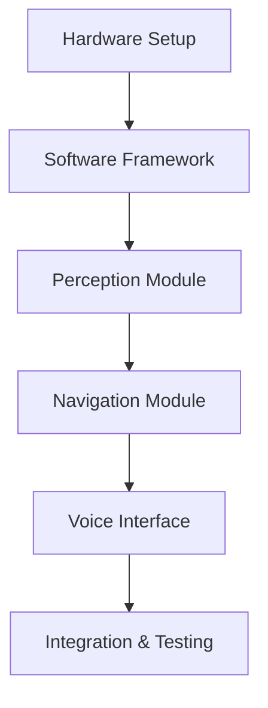

# Building Your First Robot Project

This chapter guides you through building a complete robot project, applying concepts from previous chapters.

## Learning Objectives

By the end of this chapter, you will be able to:
- Select appropriate hardware components for a mobile robot
- Design and implement a modular software architecture
- Integrate sensors, motors, and control systems
- Implement basic autonomous navigation with obstacle avoidance
- Test and debug robot systems systematically

## Project Overview

We'll build a simple mobile robot that can:
- Navigate autonomously
- Avoid obstacles
- Respond to voice commands



## Hardware Selection

### Essential Components

| Component | Purpose | Example |
|-----------|---------|---------|
| Microcontroller | Main processing | Raspberry Pi 4 |
| Motor Driver | Motor control | L298N |
| Motors | Movement | DC gear motors |
| Distance Sensor | Obstacle detection | HC-SR04 |
| Camera | Vision | Pi Camera |
| Microphone | Voice input | USB microphone |

### Wiring Diagram

```
Raspberry Pi GPIO:
├── GPIO 17 → Motor Driver IN1
├── GPIO 18 → Motor Driver IN2
├── GPIO 22 → Motor Driver IN3
├── GPIO 23 → Motor Driver IN4
├── GPIO 24 → Ultrasonic TRIG
└── GPIO 25 → Ultrasonic ECHO
```

## Software Architecture

### Project Structure
```
robot_project/
├── src/
│   ├── __init__.py
│   ├── robot.py
│   ├── motors.py
│   ├── sensors.py
│   ├── navigation.py
│   └── voice.py
├── config/
│   └── settings.yaml
├── tests/
│   └── test_motors.py
└── main.py
```

### Motor Control Module

```python
# src/motors.py
import RPi.GPIO as GPIO

class MotorController:
    def __init__(self, pins: dict):
        self.pins = pins
        GPIO.setmode(GPIO.BCM)
        for pin in pins.values():
            GPIO.setup(pin, GPIO.OUT)

    def forward(self, speed: float = 1.0):
        """Move robot forward."""
        self._set_motors(True, False, True, False)

    def backward(self, speed: float = 1.0):
        """Move robot backward."""
        self._set_motors(False, True, False, True)

    def turn_left(self):
        """Turn robot left."""
        self._set_motors(False, True, True, False)

    def turn_right(self):
        """Turn robot right."""
        self._set_motors(True, False, False, True)

    def stop(self):
        """Stop all motors."""
        self._set_motors(False, False, False, False)

    def _set_motors(self, m1a, m1b, m2a, m2b):
        GPIO.output(self.pins['m1a'], m1a)
        GPIO.output(self.pins['m1b'], m1b)
        GPIO.output(self.pins['m2a'], m2a)
        GPIO.output(self.pins['m2b'], m2b)
```

### Obstacle Avoidance

```python
# src/navigation.py
class ObstacleAvoider:
    def __init__(self, sensor, motors, safe_distance: float = 30.0):
        self.sensor = sensor
        self.motors = motors
        self.safe_distance = safe_distance

    def navigate(self):
        """Main navigation loop."""
        while True:
            distance = self.sensor.get_distance()

            if distance > self.safe_distance:
                self.motors.forward()
            else:
                self.motors.stop()
                self.avoid_obstacle()

    def avoid_obstacle(self):
        """Execute obstacle avoidance maneuver."""
        self.motors.backward()
        time.sleep(0.5)
        self.motors.turn_right()
        time.sleep(0.3)
```

## Testing Your Robot

### Unit Tests
```python
# tests/test_motors.py
import pytest
from src.motors import MotorController

def test_motor_initialization():
    pins = {'m1a': 17, 'm1b': 18, 'm2a': 22, 'm2b': 23}
    controller = MotorController(pins)
    assert controller is not None

def test_stop_command():
    # Test that stop sets all pins low
    pass
```

### Integration Testing
1. Test each component individually
2. Test component combinations
3. Full system test

## Troubleshooting

### Common Issues

| Problem | Possible Cause | Solution |
|---------|---------------|----------|
| Motors don't move | Wiring issue | Check connections |
| Robot spins | Motor polarity | Swap motor wires |
| Erratic behavior | Power supply | Use adequate power |

## Sensor Integration

### Ultrasonic Distance Sensor

```python
# src/sensors.py
import RPi.GPIO as GPIO
import time

class UltrasonicSensor:
    """HC-SR04 ultrasonic distance sensor."""

    def __init__(self, trigger_pin: int, echo_pin: int):
        self.trigger = trigger_pin
        self.echo = echo_pin

        GPIO.setmode(GPIO.BCM)
        GPIO.setup(self.trigger, GPIO.OUT)
        GPIO.setup(self.echo, GPIO.IN)
        GPIO.output(self.trigger, False)
        time.sleep(0.1)  # Settle time

    def get_distance(self) -> float:
        """
        Measure distance to nearest object.

        Returns:
            Distance in centimeters
        """
        # Send trigger pulse
        GPIO.output(self.trigger, True)
        time.sleep(0.00001)  # 10 microseconds
        GPIO.output(self.trigger, False)

        # Wait for echo
        pulse_start = time.time()
        timeout = pulse_start + 0.1

        while GPIO.input(self.echo) == 0:
            pulse_start = time.time()
            if pulse_start > timeout:
                return -1  # Timeout

        pulse_end = time.time()
        while GPIO.input(self.echo) == 1:
            pulse_end = time.time()
            if pulse_end > timeout:
                return -1  # Timeout

        # Calculate distance
        pulse_duration = pulse_end - pulse_start
        distance = pulse_duration * 17150  # Speed of sound / 2

        return round(distance, 2)

    def cleanup(self):
        """Release GPIO resources."""
        GPIO.cleanup([self.trigger, self.echo])
```

### Camera Integration

```python
# src/camera.py
import cv2
import numpy as np

class RobotCamera:
    """Camera interface for robot vision."""

    def __init__(self, camera_id: int = 0, resolution: tuple = (640, 480)):
        self.camera = cv2.VideoCapture(camera_id)
        self.camera.set(cv2.CAP_PROP_FRAME_WIDTH, resolution[0])
        self.camera.set(cv2.CAP_PROP_FRAME_HEIGHT, resolution[1])

    def capture_frame(self) -> np.ndarray:
        """Capture a single frame."""
        ret, frame = self.camera.read()
        if not ret:
            raise RuntimeError("Failed to capture frame")
        return frame

    def detect_obstacles(self, frame: np.ndarray) -> list:
        """
        Simple obstacle detection using color thresholding.

        Returns:
            List of obstacle bounding boxes
        """
        # Convert to HSV for better color detection
        hsv = cv2.cvtColor(frame, cv2.COLOR_BGR2HSV)

        # Detect dark objects (potential obstacles)
        lower_dark = np.array([0, 0, 0])
        upper_dark = np.array([180, 255, 50])
        mask = cv2.inRange(hsv, lower_dark, upper_dark)

        # Find contours
        contours, _ = cv2.findContours(
            mask, cv2.RETR_EXTERNAL, cv2.CHAIN_APPROX_SIMPLE
        )

        obstacles = []
        for contour in contours:
            area = cv2.contourArea(contour)
            if area > 500:  # Filter small detections
                x, y, w, h = cv2.boundingRect(contour)
                obstacles.append({'x': x, 'y': y, 'w': w, 'h': h})

        return obstacles

    def release(self):
        """Release camera resources."""
        self.camera.release()
```

## Main Robot Controller

```python
# src/robot.py
from dataclasses import dataclass
from enum import Enum
import time

class RobotState(Enum):
    IDLE = "idle"
    MOVING = "moving"
    AVOIDING = "avoiding"
    STOPPED = "stopped"

@dataclass
class RobotConfig:
    """Robot configuration parameters."""
    safe_distance: float = 30.0  # cm
    turn_duration: float = 0.3   # seconds
    backup_duration: float = 0.5 # seconds
    max_speed: float = 1.0

class Robot:
    """Main robot controller integrating all components."""

    def __init__(self, config: RobotConfig = None):
        self.config = config or RobotConfig()
        self.state = RobotState.IDLE

        # Initialize components
        self.motors = MotorController({
            'm1a': 17, 'm1b': 18, 'm2a': 22, 'm2b': 23
        })
        self.distance_sensor = UltrasonicSensor(
            trigger_pin=24, echo_pin=25
        )
        self.running = False

    def start(self):
        """Start the robot main loop."""
        self.running = True
        self.state = RobotState.IDLE
        print("Robot started")

        try:
            while self.running:
                self._update()
                time.sleep(0.1)  # 10 Hz update rate
        except KeyboardInterrupt:
            self.stop()

    def stop(self):
        """Stop the robot and cleanup."""
        self.running = False
        self.motors.stop()
        self.state = RobotState.STOPPED
        print("Robot stopped")

    def _update(self):
        """Main update loop."""
        distance = self.distance_sensor.get_distance()

        if distance < 0:
            # Sensor error, stop for safety
            self.motors.stop()
            self.state = RobotState.STOPPED
            return

        if distance < self.config.safe_distance:
            self._avoid_obstacle()
        else:
            self._move_forward()

    def _move_forward(self):
        """Move forward if path is clear."""
        self.motors.forward(self.config.max_speed)
        self.state = RobotState.MOVING

    def _avoid_obstacle(self):
        """Execute obstacle avoidance maneuver."""
        self.state = RobotState.AVOIDING

        # Back up
        self.motors.backward()
        time.sleep(self.config.backup_duration)

        # Turn right
        self.motors.turn_right()
        time.sleep(self.config.turn_duration)

        self.motors.stop()

# Entry point
if __name__ == "__main__":
    robot = Robot()
    robot.start()
```

## Configuration Management

```yaml
# config/settings.yaml
robot:
  name: "MyFirstRobot"
  version: "1.0.0"

navigation:
  safe_distance: 30.0  # cm
  max_speed: 0.8
  turn_speed: 0.5

sensors:
  ultrasonic:
    trigger_pin: 24
    echo_pin: 25
    timeout: 0.1

  camera:
    enabled: true
    resolution: [640, 480]
    fps: 30

motors:
  pins:
    m1a: 17
    m1b: 18
    m2a: 22
    m2b: 23
  pwm_frequency: 1000

logging:
  level: INFO
  file: "robot.log"
```

## Debugging Tips

### Serial Monitor
```python
# Debug utility for monitoring robot state
class DebugMonitor:
    """Monitor and log robot state for debugging."""

    def __init__(self, robot):
        self.robot = robot
        self.log = []

    def snapshot(self) -> dict:
        """Capture current robot state."""
        return {
            'timestamp': time.time(),
            'state': self.robot.state.value,
            'distance': self.robot.distance_sensor.get_distance(),
        }

    def print_status(self):
        """Print current status to console."""
        snap = self.snapshot()
        print(f"State: {snap['state']}, Distance: {snap['distance']:.1f}cm")
```

:::tip Debugging Advice
When things don't work:
1. Test each component in isolation first
2. Add logging to track state changes
3. Use slow motion (reduce speeds) to observe behavior
4. Check power supply - many issues come from insufficient power
:::

## Summary

Building a robot project integrates hardware, software, and systems thinking. Key points:

- Start with a clear project scope and component list
- Build modular software that's easy to test and debug
- Test components individually before integration
- Implement safety features from the beginning
- Iterate and improve based on real-world testing

:::tip Key Takeaway
The best robot projects start simple and grow incrementally. Get basic functionality working first, then add complexity.
:::

## Further Reading

- Raspberry Pi Foundation tutorials
- ROS (Robot Operating System) documentation for larger projects
- Arduino robotics projects for simpler platforms

---

**Next Chapter:** [Industry Applications](/practical/industry-applications)
