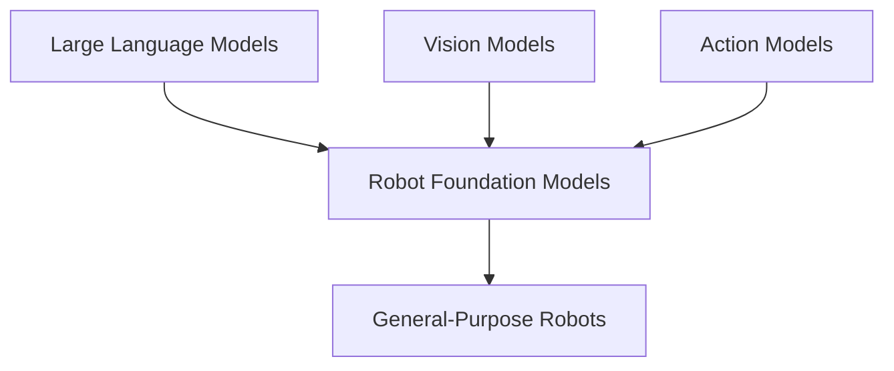
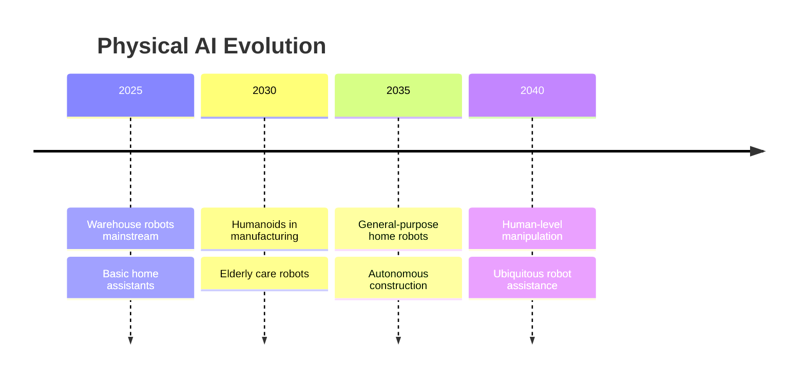
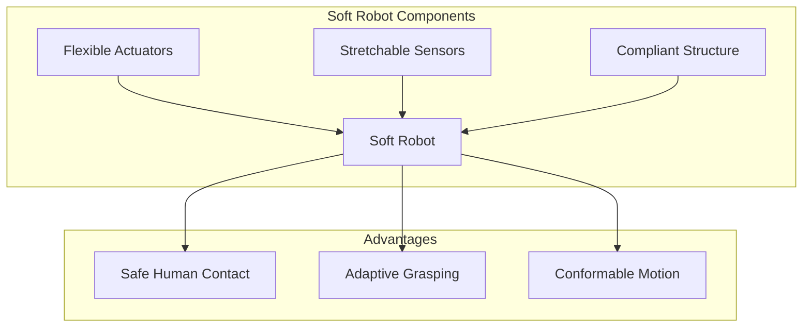

import { ChapterPersonalizeButton } from '@site/src/components/PersonalizationControls';
import { ChapterTranslateButton } from '@site/src/components/TranslationControls';

<div style={{display: 'flex', gap: '10px', marginBottom: '20px'}}>
  <ChapterPersonalizeButton chapterId="practical-future-physical-ai" />
  <ChapterTranslateButton chapterId="practical-future-physical-ai" />
</div>

# Future of Physical AI

This final chapter explores emerging trends, research directions, and the future landscape of Physical AI and humanoid robotics.

## Learning Objectives

By the end of this chapter, you will be able to:
- Identify emerging technologies shaping the future of robotics
- Understand the potential of foundation models for robotics
- Analyze open research problems in Physical AI
- Evaluate societal implications of widespread robot adoption
- Plan career paths in the robotics industry

## Emerging Technologies

### Foundation Models for Robotics



#### Key Developments
- **RT-2**: Vision-Language-Action models
- **PaLM-E**: Embodied multimodal language models
- **Gato**: Generalist agent architectures

### Soft Robotics
- Flexible, compliant materials
- Bio-inspired designs
- Safe human interaction

### Neuromorphic Computing
- Brain-inspired processors
- Event-driven sensing
- Energy-efficient computation

## Research Frontiers

### Open Problems

| Challenge | Current State | Future Direction |
|-----------|--------------|------------------|
| Dexterous manipulation | Limited | Human-level dexterity |
| Long-horizon planning | Emerging | Robust task completion |
| Common sense reasoning | Basic | Human-like understanding |
| Energy efficiency | Improving | All-day operation |

### Active Research Areas
1. **Sim-to-Real Transfer**: Bridging simulation and reality
2. **Few-Shot Learning**: Learning from minimal examples
3. **Multi-Robot Coordination**: Swarm intelligence
4. **Explainable AI**: Understanding robot decisions

## Humanoid Robot Evolution

### Current Generation
- Boston Dynamics Atlas
- Tesla Optimus
- Figure 01
- Agility Digit

### Future Capabilities
```python
# Hypothetical future robot capabilities
class FutureHumanoid:
    capabilities = {
        'manipulation': 'human-level dexterity',
        'locomotion': 'all-terrain navigation',
        'cognition': 'common sense reasoning',
        'interaction': 'natural conversation',
        'learning': 'continuous adaptation',
        'autonomy': 'hours of independent operation'
    }

    def assist_human(self, task: str):
        """Assist with any household or workplace task."""
        plan = self.understand_and_plan(task)
        return self.execute_safely(plan)
```

## Societal Implications

### Workforce Transformation
- New job categories
- Skill requirements shift
- Human-robot collaboration

### Accessibility
- Assistive technologies
- Independence for elderly
- Support for disabilities

### Ethical Considerations
- Robot rights debates
- Responsibility frameworks
- Privacy in robot-filled world

## Predictions Timeline



## Preparing for the Future

### Skills to Develop
1. **Technical**: Robotics, AI/ML, systems engineering
2. **Interdisciplinary**: HRI, ethics, design thinking
3. **Soft Skills**: Collaboration, adaptability, creativity

### Career Paths
- Robot software engineer
- AI/ML researcher
- HRI designer
- Robot ethicist
- Systems integrator

## Foundation Models for Robotics

The convergence of large language models and robotics:

```python
class RobotFoundationModel:
    """
    Conceptual architecture for a robot foundation model.
    Combines language, vision, and action in a unified framework.
    """

    def __init__(self):
        self.language_encoder = LanguageEncoder()
        self.vision_encoder = VisionEncoder()
        self.action_decoder = ActionDecoder()
        self.world_model = WorldModel()

    def process_instruction(self,
                           instruction: str,
                           visual_observation: np.ndarray,
                           robot_state: dict) -> dict:
        """
        Process natural language instruction with visual context.

        Returns:
            Action sequence to execute
        """
        # Encode instruction
        lang_embedding = self.language_encoder.encode(instruction)

        # Encode visual scene
        vision_embedding = self.vision_encoder.encode(visual_observation)

        # Fuse modalities
        fused_representation = self._fuse_modalities(
            lang_embedding, vision_embedding, robot_state
        )

        # Predict action sequence
        actions = self.action_decoder.decode(fused_representation)

        # Verify with world model
        predicted_outcome = self.world_model.simulate(
            robot_state, actions
        )

        return {
            'actions': actions,
            'predicted_outcome': predicted_outcome,
            'confidence': self._compute_confidence(actions)
        }

    def learn_from_demonstration(self, demonstrations: list):
        """Learn new skills from human demonstrations."""
        for demo in demonstrations:
            # Extract state-action pairs
            states = demo['states']
            actions = demo['actions']
            instruction = demo['instruction']

            # Update model
            self._update_from_demo(instruction, states, actions)
```

### Key Research Directions

| Direction | Description | Challenges |
|-----------|-------------|------------|
| Zero-shot Generalization | Perform new tasks without training | Grounding, safety |
| Long-horizon Planning | Plan complex multi-step tasks | Compounding errors |
| Physical Common Sense | Understand physics intuitively | Data scarcity |
| Continuous Learning | Improve from experience | Catastrophic forgetting |

## Soft Robotics Revolution

Robots made from compliant materials:



### Applications of Soft Robotics

```python
class SoftGripper:
    """Soft pneumatic gripper for delicate manipulation."""

    def __init__(self, num_fingers: int = 3):
        self.num_fingers = num_fingers
        self.pressure_range = (0, 100)  # kPa
        self.current_pressure = [0] * num_fingers

    def grasp(self, object_properties: dict) -> bool:
        """
        Adaptively grasp object based on properties.

        Soft grippers naturally conform to object shape.
        """
        # Determine grasp pressure based on object
        if object_properties.get('fragile', False):
            target_pressure = 20  # Gentle grasp
        elif object_properties.get('heavy', False):
            target_pressure = 80  # Firm grasp
        else:
            target_pressure = 50  # Normal grasp

        # Gradually increase pressure
        for p in range(0, target_pressure, 5):
            self._set_pressure(p)

            # Check if object is secured
            if self._detect_contact():
                return True

        return False

    def _set_pressure(self, pressure: float):
        """Set pneumatic pressure for all fingers."""
        self.current_pressure = [pressure] * self.num_fingers
```

## Swarm Robotics

Coordinated multi-robot systems:

```python
class SwarmRobot:
    """Individual robot in a swarm system."""

    def __init__(self, robot_id: int, communication_range: float):
        self.id = robot_id
        self.comm_range = communication_range
        self.position = np.random.rand(2) * 100
        self.velocity = np.zeros(2)
        self.neighbors = []

    def update(self, all_robots: list):
        """
        Update position using swarm behaviors.

        Implements Reynolds flocking rules:
        - Separation: Avoid crowding neighbors
        - Alignment: Steer toward average heading
        - Cohesion: Steer toward average position
        """
        self._find_neighbors(all_robots)

        if not self.neighbors:
            return

        # Separation
        separation = self._compute_separation()

        # Alignment
        alignment = self._compute_alignment()

        # Cohesion
        cohesion = self._compute_cohesion()

        # Combine behaviors
        self.velocity += (
            1.5 * separation +
            1.0 * alignment +
            1.0 * cohesion
        )

        # Limit speed
        speed = np.linalg.norm(self.velocity)
        if speed > 5.0:
            self.velocity = self.velocity / speed * 5.0

        # Update position
        self.position += self.velocity

    def _find_neighbors(self, all_robots: list):
        """Find robots within communication range."""
        self.neighbors = [
            r for r in all_robots
            if r.id != self.id and
            np.linalg.norm(r.position - self.position) < self.comm_range
        ]

    def _compute_separation(self) -> np.ndarray:
        """Compute separation steering vector."""
        steer = np.zeros(2)
        for neighbor in self.neighbors:
            diff = self.position - neighbor.position
            dist = np.linalg.norm(diff)
            if dist > 0:
                steer += diff / (dist * dist)  # Inverse square
        return steer
```

## The Path Forward

### Near-term (2025-2030)
- Warehouse and logistics automation at scale
- Collaborative manufacturing robots
- Basic home assistance robots
- Autonomous delivery (last mile)

### Medium-term (2030-2040)
- General-purpose humanoid robots
- Elderly care and healthcare assistance
- Construction automation
- Agricultural robotics at scale

### Long-term (2040+)
- Human-level manipulation dexterity
- Fully autonomous household robots
- Space exploration and construction
- Ubiquitous robot assistance

## Conclusion

Physical AI represents one of the most transformative technologies of our time. As robots become more capable, they will increasingly work alongside humans, augmenting our abilities and taking on tasks that are dangerous, difficult, or tedious.

The future of Physical AI is not about replacing humans but about creating partnerships that leverage the unique strengths of both humans and machines.

### Key Takeaways from This Textbook

:::tip Course Summary
1. **Fundamentals Matter**: Strong foundations in robotics, perception, and control are essential
2. **Integration is Key**: Successful robots combine multiple technologies seamlessly
3. **Safety First**: Ethical and safe design must be priorities
4. **Human-Centered Design**: The best robots augment human capabilities
5. **Continuous Learning**: The field evolves rapidly; stay curious and keep learning
:::

### Your Next Steps


1. **Build**: Start with the robot project in Chapter 10
2. **Learn**: Explore ROS, simulation tools, and ML frameworks
3. **Connect**: Join robotics communities and attend conferences
4. **Contribute**: Open source projects, research, or startups

## Summary

The future of Physical AI is bright and full of opportunity. Key points:

- Foundation models are bringing general-purpose capabilities to robots
- Soft robotics enables safer human interaction
- Swarm robotics offers scalable solutions for complex tasks
- Career opportunities span research, engineering, and entrepreneurship
- The field needs diverse perspectives and interdisciplinary thinking

---

**Thank you for completing this textbook!**

We hope this journey through Physical AI and Humanoid Robotics has inspired you to explore further and perhaps contribute to this exciting field.

*For questions or feedback, use the AI Chat Assistant available on each page.*

## Further Reading

- OpenAI Robotics Research
- Google DeepMind Robotics
- Stanford HAI (Human-Centered AI)
- IEEE Robotics and Automation Magazine
