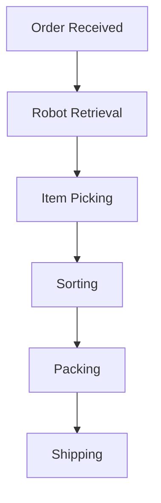
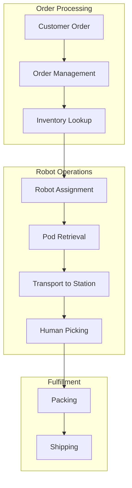

import { ChapterPersonalizeButton } from '@site/src/components/PersonalizationControls';
import { ChapterTranslateButton } from '@site/src/components/TranslationControls';

<div style={{display: 'flex', gap: '10px', marginBottom: '20px'}}>
  <ChapterPersonalizeButton chapterId="practical-industry-applications" />
  <ChapterTranslateButton chapterId="practical-industry-applications" />
</div>

# Industry Applications

Physical AI and humanoid robots are transforming industries across the globe. This chapter explores real-world applications and case studies.

## Learning Objectives

By the end of this chapter, you will be able to:
- Identify key robotics applications across major industries
- Analyze the technical requirements for different use cases
- Evaluate the economic impact of robotics adoption
- Understand the challenges of deploying robots in real-world settings
- Recognize emerging opportunities in robotics markets

## Manufacturing

### Assembly Line Robots


#### Key Capabilities
- Precise repetitive tasks
- 24/7 operation
- Consistent quality

#### Example: Automotive Assembly
- Welding and painting
- Component installation
- Final assembly

### Collaborative Manufacturing
Human-robot collaboration on assembly lines:
- Humans handle complex decisions
- Robots handle heavy lifting
- Shared workspace safety

## Healthcare

### Surgical Robotics

| System | Application | Advantage |
|--------|-------------|-----------|
| da Vinci | Minimally invasive surgery | Precision, small incisions |
| ROSA | Orthopedic surgery | Accuracy in bone cutting |
| Mako | Joint replacement | Personalized planning |

### Rehabilitation Robots
- Exoskeletons for mobility
- Therapy assistance
- Progress monitoring

### Hospital Logistics
- Medication delivery
- Sample transport
- Supply management

## Logistics and Warehousing

### Warehouse Automation



### Key Technologies
- Autonomous mobile robots (AMRs)
- Robotic arms for picking
- Conveyor integration

### Last-Mile Delivery
- Delivery robots
- Drone delivery
- Autonomous vehicles

## Agriculture

### Precision Farming
- Crop monitoring drones
- Automated harvesting
- Weed detection and removal

### Livestock Management
- Automated milking
- Health monitoring
- Feeding systems

## Service Industry

### Hospitality
- Room service robots
- Concierge assistance
- Cleaning robots

### Retail
- Inventory management
- Customer assistance
- Shelf stocking

### Food Service
- Kitchen automation
- Order delivery
- Food preparation

## Construction

### Applications
- Bricklaying robots
- 3D printing buildings
- Site inspection drones
- Demolition robots

### Benefits
- Improved safety
- Faster construction
- Reduced labor costs

## Space Exploration

### Current Missions
- Mars rovers (Perseverance, Curiosity)
- ISS robotic arms
- Satellite servicing

### Future Applications
- Lunar construction
- Asteroid mining
- Deep space exploration

## Economic Impact

### Job Transformation
- New roles in robot maintenance
- Programming and oversight
- Human-robot collaboration

### Productivity Gains
- Increased output
- Reduced errors
- 24/7 operation capability

## Case Study: Warehouse Automation

### Amazon Robotics Implementation



### Key Metrics

| Metric | Before Robots | After Robots | Improvement |
|--------|---------------|--------------|-------------|
| Order Processing Time | 60-75 min | 15 min | 75-80% |
| Storage Density | Baseline | 50% more | 50% |
| Worker Walking | 10-15 miles/day | &lt;1 mile/day | 90%+ |

### Technical Architecture

```python
class WarehouseRobot:
    """Simplified warehouse robot controller."""

    def __init__(self, robot_id: str, warehouse_map: dict):
        self.id = robot_id
        self.map = warehouse_map
        self.current_location = None
        self.carrying_pod = None
        self.battery_level = 100.0

    def execute_task(self, task: dict) -> bool:
        """
        Execute a warehouse task.

        Task types: retrieve_pod, deliver_pod, charge
        """
        if task['type'] == 'retrieve_pod':
            return self._retrieve_pod(task['pod_id'], task['destination'])
        elif task['type'] == 'deliver_pod':
            return self._deliver_pod(task['location'])
        elif task['type'] == 'charge':
            return self._go_charge()
        return False

    def _retrieve_pod(self, pod_id: str, destination: tuple) -> bool:
        """Navigate to pod, lift it, and deliver to station."""
        pod_location = self.map.get_pod_location(pod_id)

        # Navigate to pod
        path = self._plan_path(self.current_location, pod_location)
        self._follow_path(path)

        # Lift pod
        self.carrying_pod = pod_id

        # Navigate to destination
        path = self._plan_path(pod_location, destination)
        self._follow_path(path)

        return True

    def _plan_path(self, start: tuple, goal: tuple) -> list:
        """Plan collision-free path through warehouse."""
        # A* or similar pathfinding
        return self.map.find_path(start, goal, self.id)
```

## Case Study: Surgical Robotics

### da Vinci Surgical System

The da Vinci system demonstrates key principles of teleoperated robotics:

```python
class SurgicalRobotArm:
    """Simplified surgical robot arm controller."""

    def __init__(self):
        self.position = np.zeros(3)
        self.orientation = np.eye(3)
        self.gripper_state = 'open'
        self.force_feedback = True

    def teleoperate(self, surgeon_input: dict) -> dict:
        """
        Process surgeon input with motion scaling.

        Typical scaling: 3:1 to 5:1 (surgeon:robot)
        """
        # Scale motion for precision
        scale_factor = 0.2  # 5:1 scaling

        scaled_motion = {
            'translation': surgeon_input['translation'] * scale_factor,
            'rotation': surgeon_input['rotation'] * scale_factor
        }

        # Apply tremor filtering
        filtered_motion = self._filter_tremor(scaled_motion)

        # Execute motion with force feedback
        result = self._execute_motion(filtered_motion)

        # Return haptic feedback to surgeon
        return {
            'force_feedback': result['contact_force'] / scale_factor,
            'position': self.position
        }

    def _filter_tremor(self, motion: dict) -> dict:
        """Filter out hand tremor from surgeon input."""
        # Low-pass filter to remove high-frequency tremor
        # Typical tremor: 8-12 Hz
        cutoff_frequency = 6.0  # Hz
        # Apply filter (simplified)
        return motion
```

### Benefits of Surgical Robotics

| Benefit | Description |
|---------|-------------|
| Precision | Sub-millimeter accuracy |
| Minimally Invasive | Smaller incisions |
| 3D Visualization | Enhanced depth perception |
| Ergonomics | Reduced surgeon fatigue |
| Tremor Filtering | Steadier movements |

## Emerging Applications

### Humanoid Robots in Retail

```python
class RetailAssistantRobot:
    """Retail assistant robot capabilities."""

    def __init__(self, store_map: dict, inventory_db):
        self.map = store_map
        self.inventory = inventory_db
        self.interaction_mode = 'greeting'

    def assist_customer(self, query: str) -> dict:
        """
        Assist customer with their query.

        Returns:
            Response with action and information
        """
        # Parse customer intent
        intent = self._parse_intent(query)

        if intent['type'] == 'find_product':
            location = self.inventory.find(intent['product'])
            return {
                'response': f"I can show you where {intent['product']} is.",
                'action': 'guide_to_location',
                'location': location
            }

        elif intent['type'] == 'product_info':
            info = self.inventory.get_info(intent['product'])
            return {
                'response': info['description'],
                'action': 'display_info',
                'data': info
            }

        elif intent['type'] == 'checkout_help':
            return {
                'response': "I'll guide you to the nearest checkout.",
                'action': 'guide_to_checkout'
            }

        return {'response': "How can I help you today?", 'action': 'wait'}
```

## ROI Analysis Framework

```python
class RoboticsROICalculator:
    """Calculate return on investment for robotics deployment."""

    def __init__(self):
        self.cost_factors = {}
     self.benefit_factors = {}

    def calculate_roi(self, deployment: dict) -> dict:
        """
        Calculate ROI for a robotics deployment.

        Args:
            deployment: Configuration including costs and expected benefits

        Returns:
            ROI analysis with payback period
        """
        # Initial costs
        hardware_cost = deployment['robots'] * deployment['cost_per_robot']
        integration_cost = deployment['integration_cost']
        training_cost = deployment['training_cost']
        total_initial = hardware_cost + integration_cost + training_cost

        # Annual costs
        maintenance = hardware_cost * 0.1  # 10% of hardware
        energy = deployment['robots'] * 500  # $500/robot/year
        annual_cost = maintenance + energy

        # Annual benefits
        labor_savings = deployment['workers_replaced'] * deployment['annual_wage']
        productivity_gain = deployment['productivity_increase'] * deployment['revenue']
        quality_improvement = deployment['defect_reduction'] * deployment['defect_cost']
        annual_benefit = labor_savings + productivity_gain + quality_improvement

        # Calculate metrics
        net_annual = annual_benefit - annual_cost
        payback_years = total_initial / net_annual if net_annual > 0 else float('inf')
        five_year_roi = ((net_annual * 5) - total_initial) / total_initial * 100

        return {
            'total_initial_investment': total_initial,
            'annual_net_benefit': net_annual,
            'payback_period_years': round(payback_years, 1),
            'five_year_roi_percent': round(five_year_roi, 1)
        }
```

## Summary

Physical AI is revolutionizing industries by augmenting human capabilities and enabling new possibilities. Key points:

- Manufacturing leads in robotics adoption with proven ROI
- Healthcare robotics improves precision and patient outcomes
- Logistics automation addresses labor shortages and demand spikes
- Service robots are emerging in retail, hospitality, and food service
- ROI analysis is essential for deployment decisions

:::tip Key Takeaway
Successful robotics deployments focus on augmenting human workers rather than replacing them entirely, creating human-robot teams that leverage the strengths of both.
:::

## Further Reading

- International Federation of Robotics (IFR) Annual Reports
- McKinsey Global Institute reports on automation
- Industry-specific robotics case studies

---

**Next Chapter:** [Future of Physical AI](/practical/future-physical-ai)
