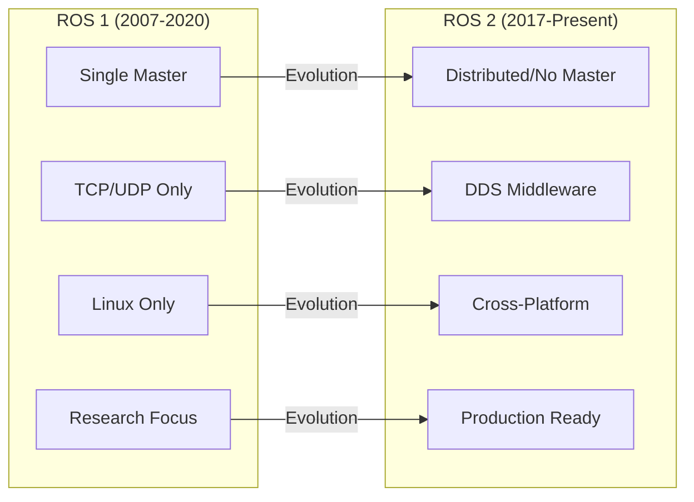
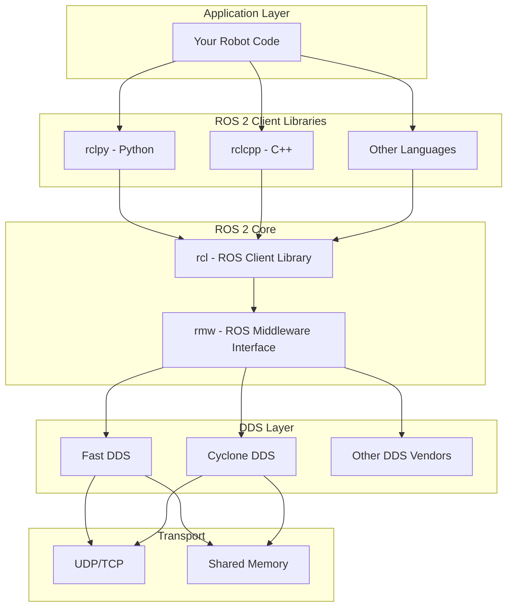
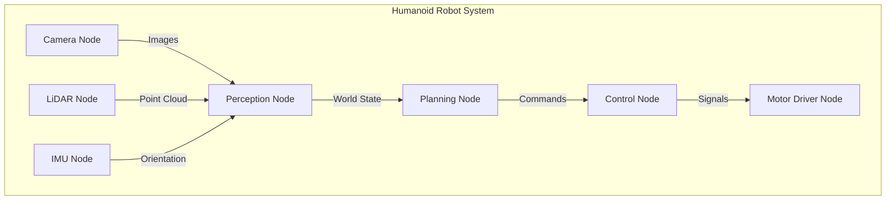
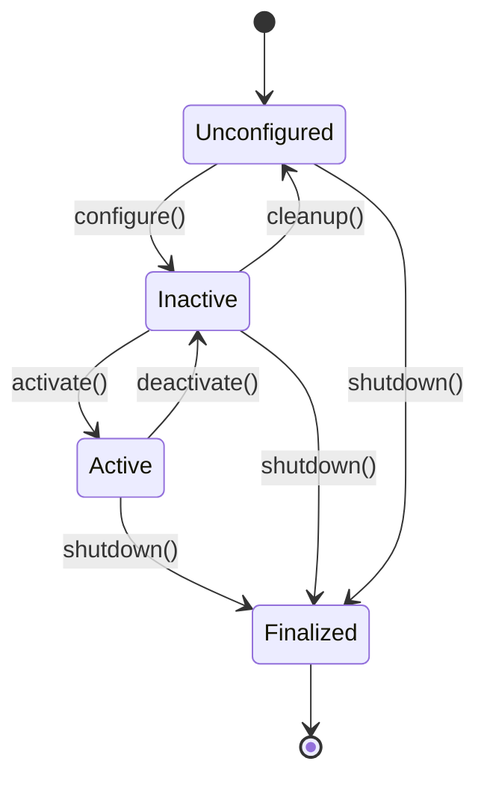
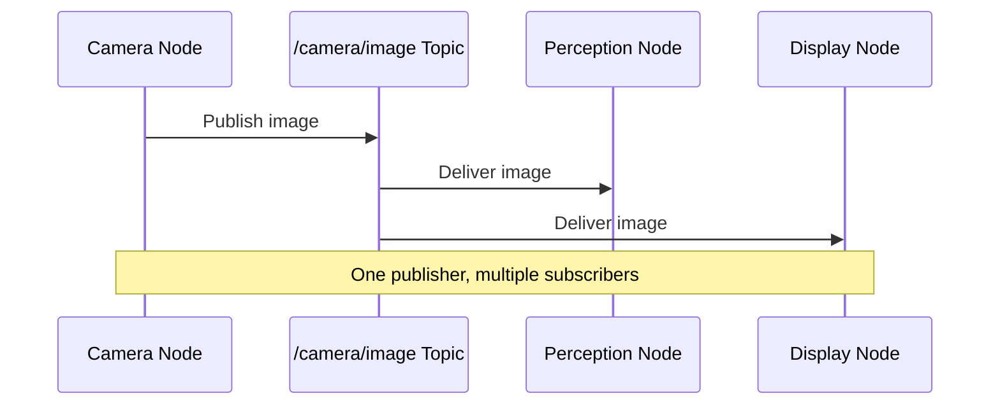
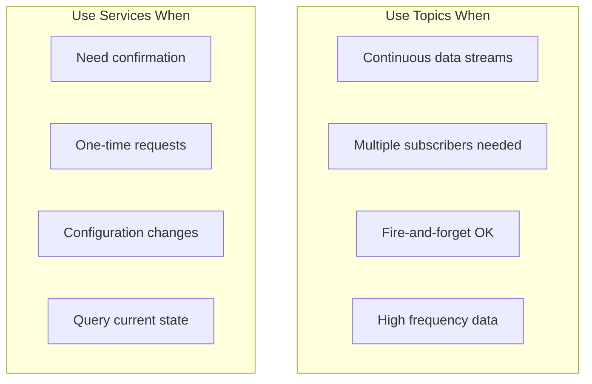
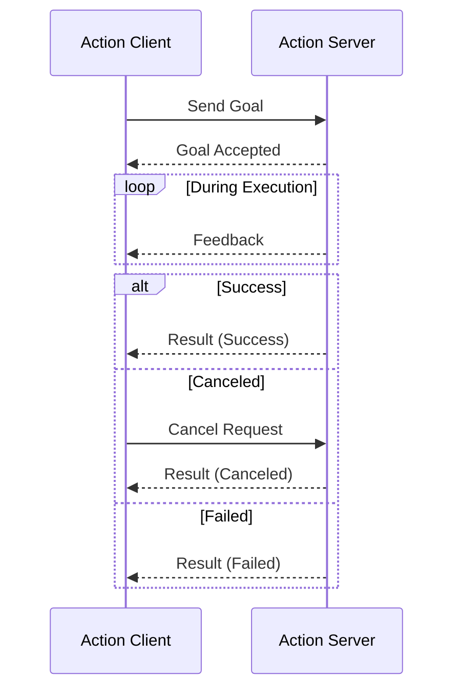
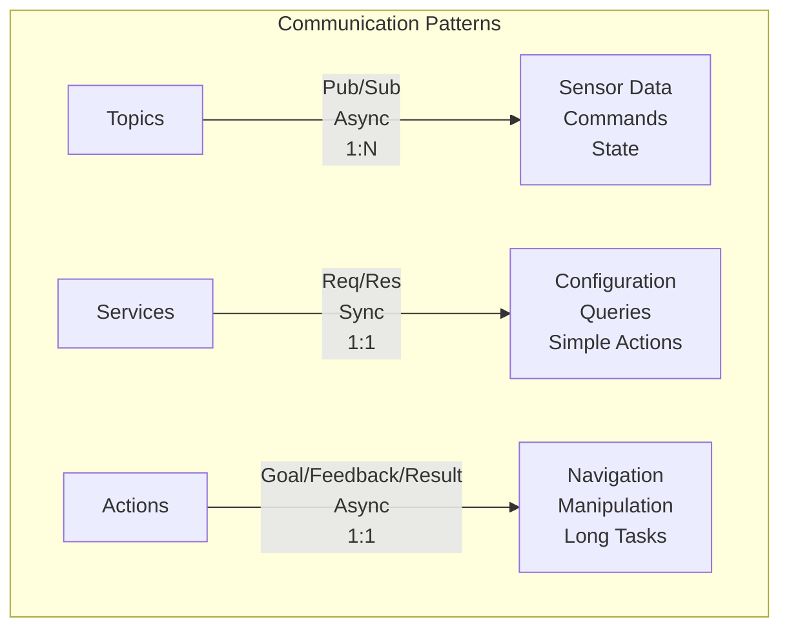

import { ChapterPersonalizeButton } from '@site/src/components/PersonalizationControls';
import { ChapterTranslateButton } from '@site/src/components/TranslationControls';

<div style={{display: 'flex', gap: '10px', marginBottom: '20px'}}>
  <ChapterPersonalizeButton chapterId="ros2-architecture-core-concepts" />
  <ChapterTranslateButton chapterId="ros2-architecture-core-concepts" />
</div>

# ROS 2 Architecture and Core Concepts

Welcome to the Robot Operating System 2 (ROS 2)—the middleware that serves as the nervous system of modern robots. In this chapter, you'll learn how ROS 2 enables different parts of a robot to communicate, coordinate, and work together as a unified system. Understanding ROS 2 is essential for building any sophisticated Physical AI system.

## Learning Objectives

By the end of this chapter, you will be able to:
- Explain the architecture and design principles of ROS 2
- Understand the role of nodes as the fundamental building blocks
- Describe how topics enable publish-subscribe communication
- Implement services for request-response interactions
- Use actions for long-running tasks with feedback
- Navigate the ROS 2 ecosystem and tooling

## Why ROS 2?

Before diving into the technical details, let's understand why ROS 2 has become the standard for robotics development.

### The Evolution from ROS 1 to ROS 2



| Feature | ROS 1 | ROS 2 |
|---------|-------|-------|
| **Architecture** | Centralized (roscore) | Distributed (no master) |
| **Communication** | Custom TCP/UDP | DDS (Data Distribution Service) |
| **Real-time** | Not supported | Supported |
| **Security** | None built-in | SROS2 (encryption, auth) |
| **Platforms** | Linux only | Linux, Windows, macOS |
| **Lifecycle** | None | Managed node lifecycle |
| **QoS** | Limited | Full QoS policies |

### ROS 2 Design Principles

ROS 2 was built with these core principles:

1. **Distributed Computing**: No single point of failure
2. **Real-time Capable**: Deterministic communication when needed
3. **Production Quality**: Security, reliability, and scalability
4. **Cross-platform**: Run on various operating systems
5. **Modularity**: Use only what you need

## ROS 2 Architecture Overview



## Nodes: The Building Blocks

Nodes are the fundamental units of computation in ROS 2. Each node is a process that performs a specific task—like reading a sensor, controlling a motor, or planning a path.

### What is a Node?



:::tip Design Principle
Each node should do one thing well. This modularity makes your system easier to develop, test, and maintain. A camera node reads images; a perception node processes them—they don't do both.
:::

### Creating Your First Node

```python
#!/usr/bin/env python3
"""A simple ROS 2 node that demonstrates basic structure."""

import rclpy
from rclpy.node import Node


class MinimalNode(Node):
    """A minimal ROS 2 node example."""

    def __init__(self):
        # Initialize the node with a name
        super().__init__('minimal_node')

        # Log that we're running
        self.get_logger().info('Minimal node has started!')

        # Create a timer that fires every second
        self.timer = self.create_timer(1.0, self.timer_callback)
        self.counter = 0

    def timer_callback(self):
        """Called every second by the timer."""
        self.counter += 1
        self.get_logger().info(f'Timer fired: count = {self.counter}')


def main(args=None):
    # Initialize ROS 2
    rclpy.init(args=args)

    # Create and spin the node
    node = MinimalNode()

    try:
        rclpy.spin(node)
    except KeyboardInterrupt:
        pass
    finally:
        # Clean up
        node.destroy_node()
        rclpy.shutdown()


if __name__ == '__main__':
    main()
```

### Node Lifecycle

ROS 2 introduces managed lifecycle nodes for better control:



```python
from rclpy.lifecycle import Node as LifecycleNode
from rclpy.lifecycle import State, TransitionCallbackReturn


class ManagedSensorNode(LifecycleNode):
    """A lifecycle-managed sensor node."""

    def __init__(self):
        super().__init__('managed_sensor')
        self.sensor = None

    def on_configure(self, state: State) -> TransitionCallbackReturn:
        """Configure the node - initialize resources."""
        self.get_logger().info('Configuring sensor...')
        try:
            self.sensor = self.initialize_sensor()
            return TransitionCallbackReturn.SUCCESS
        except Exception as e:
            self.get_logger().error(f'Configuration failed: {e}')
            return TransitionCallbackReturn.FAILURE

    def on_activate(self, state: State) -> TransitionCallbackReturn:
        """Activate the node - start publishing."""
        self.get_logger().info('Activating sensor...')
        self.sensor.start()
        return TransitionCallbackReturn.SUCCESS

    def on_deactivate(self, state: State) -> TransitionCallbackReturn:
        """Deactivate the node - stop publishing."""
        self.get_logger().info('Deactivating sensor...')
        self.sensor.stop()
        return TransitionCallbackReturn.SUCCESS

    def on_cleanup(self, state: State) -> TransitionCallbackReturn:
        """Clean up resources."""
        self.get_logger().info('Cleaning up...')
        self.sensor = None
        return TransitionCallbackReturn.SUCCESS
```

## Topics: Publish-Subscribe Communication

Topics are named buses over which nodes exchange messages. They implement the publish-subscribe pattern—publishers send messages without knowing who receives them, and subscribers receive messages without knowing who sent them.

### How Topics Work



### Topic Naming Conventions

```
/robot_name/sensor_type/data_type

Examples:
/humanoid/camera/rgb/image_raw
/humanoid/camera/depth/points
/humanoid/imu/data
/humanoid/joint_states
/humanoid/cmd_vel
```

### Publishing to a Topic

```python
import rclpy
from rclpy.node import Node
from sensor_msgs.msg import Imu
from geometry_msgs.msg import Vector3
import math


class ImuPublisher(Node):
    """Publishes IMU data to a topic."""

    def __init__(self):
        super().__init__('imu_publisher')

        # Create a publisher
        # Arguments: message type, topic name, queue size
        self.publisher = self.create_publisher(
            Imu,
            '/humanoid/imu/data',
            10  # Queue size
        )

        # Publish at 100 Hz
        self.timer = self.create_timer(0.01, self.publish_imu)
        self.get_logger().info('IMU publisher started')

    def publish_imu(self):
        """Read and publish IMU data."""
        msg = Imu()

        # Set header with timestamp
        msg.header.stamp = self.get_clock().now().to_msg()
        msg.header.frame_id = 'imu_link'

        # Set orientation (quaternion)
        msg.orientation.x = 0.0
        msg.orientation.y = 0.0
        msg.orientation.z = 0.0
        msg.orientation.w = 1.0

        # Set angular velocity (rad/s)
        msg.angular_velocity.x = 0.01
        msg.angular_velocity.y = 0.02
        msg.angular_velocity.z = 0.0

        # Set linear acceleration (m/s²)
        msg.linear_acceleration.x = 0.0
        msg.linear_acceleration.y = 0.0
        msg.linear_acceleration.z = 9.81

        # Publish the message
        self.publisher.publish(msg)
```

### Subscribing to a Topic

```python
import rclpy
from rclpy.node import Node
from sensor_msgs.msg import Imu
import numpy as np


class ImuSubscriber(Node):
    """Subscribes to IMU data and processes it."""

    def __init__(self):
        super().__init__('imu_subscriber')

        # Create a subscription
        self.subscription = self.create_subscription(
            Imu,
            '/humanoid/imu/data',
            self.imu_callback,
            10  # Queue size
        )

        self.orientation_history = []
        self.get_logger().info('IMU subscriber started')

    def imu_callback(self, msg: Imu):
        """Process incoming IMU data."""
        # Extract orientation as Euler angles
        orientation = self.quaternion_to_euler(
            msg.orientation.x,
            msg.orientation.y,
            msg.orientation.z,
            msg.orientation.w
        )

        # Log significant changes
        roll, pitch, yaw = orientation
        self.get_logger().debug(
            f'Orientation - Roll: {math.degrees(roll):.1f}°, '
            f'Pitch: {math.degrees(pitch):.1f}°, '
            f'Yaw: {math.degrees(yaw):.1f}°'
        )

        # Detect if robot is tilting dangerously
        if abs(roll) > 0.5 or abs(pitch) > 0.5:  # ~30 degrees
            self.get_logger().warn('Robot tilting significantly!')

    def quaternion_to_euler(self, x, y, z, w):
        """Convert quaternion to Euler angles."""
        # Roll (x-axis rotation)
        sinr_cosp = 2 * (w * x + y * z)
        cosr_cosp = 1 - 2 * (x * x + y * y)
        roll = np.arctan2(sinr_cosp, cosr_cosp)

        # Pitch (y-axis rotation)
        sinp = 2 * (w * y - z * x)
        pitch = np.arcsin(np.clip(sinp, -1, 1))

        # Yaw (z-axis rotation)
        siny_cosp = 2 * (w * z + x * y)
        cosy_cosp = 1 - 2 * (y * y + z * z)
        yaw = np.arctan2(siny_cosp, cosy_cosp)

        return roll, pitch, yaw
```

### Quality of Service (QoS)

QoS policies control how messages are delivered:

```python
from rclpy.qos import QoSProfile, ReliabilityPolicy, HistoryPolicy, DurabilityPolicy


# For sensor data: best effort, keep latest
sensor_qos = QoSProfile(
    reliability=ReliabilityPolicy.BEST_EFFORT,
    history=HistoryPolicy.KEEP_LAST,
    depth=1
)

# For commands: reliable delivery
command_qos = QoSProfile(
    reliability=ReliabilityPolicy.RELIABLE,
    history=HistoryPolicy.KEEP_LAST,
    depth=10
)

# For configuration: reliable + transient local (late joiners get last value)
config_qos = QoSProfile(
    reliability=ReliabilityPolicy.RELIABLE,
    durability=DurabilityPolicy.TRANSIENT_LOCAL,
    history=HistoryPolicy.KEEP_LAST,
    depth=1
)

# Use in publisher/subscriber
self.sensor_pub = self.create_publisher(Imu, '/imu', sensor_qos)
self.cmd_sub = self.create_subscription(Twist, '/cmd_vel', self.cmd_cb, command_qos)
```

| QoS Policy | Options | Use Case |
|------------|---------|----------|
| **Reliability** | RELIABLE, BEST_EFFORT | Commands vs sensor streams |
| **Durability** | VOLATILE, TRANSIENT_LOCAL | Whether late joiners get data |
| **History** | KEEP_LAST, KEEP_ALL | How much to buffer |
| **Depth** | 1-N | Buffer size |
| **Deadline** | Duration | Max time between messages |
| **Lifespan** | Duration | How long messages are valid |


## Services: Request-Response Communication

Services provide synchronous request-response communication. Unlike topics (fire-and-forget), services wait for a response.

### When to Use Services vs Topics



| Aspect | Topics | Services |
|--------|--------|----------|
| **Pattern** | Publish-Subscribe | Request-Response |
| **Blocking** | No | Yes (client waits) |
| **Frequency** | High (continuous) | Low (on-demand) |
| **Receivers** | Many | One server |
| **Use Case** | Sensor data, commands | Config, queries |

### Service Definition

Services are defined in `.srv` files:

```
# SetJointPosition.srv
# Request
string joint_name
float64 position
float64 velocity_limit
---
# Response
bool success
string message
float64 actual_position
```

### Creating a Service Server

```python
import rclpy
from rclpy.node import Node
from example_interfaces.srv import SetBool
from std_srvs.srv import Trigger


class RobotControlService(Node):
    """Provides services to control the robot."""

    def __init__(self):
        super().__init__('robot_control_service')

        # Create services
        self.enable_srv = self.create_service(
            SetBool,
            '/robot/enable_motors',
            self.enable_motors_callback
        )

        self.home_srv = self.create_service(
            Trigger,
            '/robot/go_home',
            self.go_home_callback
        )

        self.motors_enabled = False
        self.get_logger().info('Robot control services ready')

    def enable_motors_callback(self, request, response):
        """Handle motor enable/disable requests."""
        self.get_logger().info(
            f'Motor enable request: {request.data}'
        )

        try:
            if request.data:
                self.enable_motors()
                self.motors_enabled = True
                response.success = True
                response.message = 'Motors enabled successfully'
            else:
                self.disable_motors()
                self.motors_enabled = False
                response.success = True
                response.message = 'Motors disabled successfully'
        except Exception as e:
            response.success = False
            response.message = f'Failed: {str(e)}'

        return response

    def go_home_callback(self, request, response):
        """Move robot to home position."""
        self.get_logger().info('Go home request received')

        if not self.motors_enabled:
            response.success = False
            response.message = 'Cannot go home: motors not enabled'
            return response

        try:
            self.move_to_home_position()
            response.success = True
            response.message = 'Robot moved to home position'
        except Exception as e:
            response.success = False
            response.message = f'Failed to go home: {str(e)}'

        return response

    def enable_motors(self):
        """Enable all robot motors."""
        self.get_logger().info('Enabling motors...')
        # Hardware-specific motor enable code

    de_motors(self):
        """Disable all robot motors."""
        self.get_logger().info('Disabling motors...')
        # Hardware-specific motor disable code

    def move_to_home_position(self):
        """Move robot to predefined home position."""
        self.get_logger().info('Moving to home position...')
        # Motion control code
```

### Creating a Service Client

```python
import rclpy
from rclpy.node import Node
from example_interfaces.srv import SetBool
from std_srvs.srv import Trigger


class RobotControlClient(Node):
    """Client for robot control services."""

    def __init__(self):
        super().__init__('robot_control_client')

        # Create service clients
        self.enable_client = self.create_client(
            SetBool,
            '/robot/enable_motors'
        )

        self.home_client = self.create_client(
            Trigger,
            '/robot/go_home'
        )

        # Wait for services to be available
        self.wait_for_services()

    def wait_for_services(self):
        """Wait for all required services."""
        while not self.enable_client.wait_for_service(timeout_sec=1.0):
            self.get_logger().info('Waiting for enable_motors service...')

        while not self.home_client.wait_for_service(timeout_sec=1.0):
            self.get_logger().info('Waiting for go_home service...')

        self.get_logger().info('All services available!')

    def enable_motors(self, enable: bool) -> bool:
        """Enable or disable motors."""
        request = SetBool.Request()
        request.data = enable

        future = self.enable_client.call_async(request)
        rclpy.spin_until_future_complete(self, future)

        response = future.result()
        self.get_logger().info(f'Enable motors response: {response.message}')
        return response.success

    def go_home(self) -> bool:
        """Send robot to home position."""
        request = Trigger.Request()

        future = self.home_client.call_async(request)
        rclpy.spin_until_future_complete(self, future)

        response = future.result()
        self.get_logger().info(f'Go home response: {response.message}')
        return response.success


def main():
    rclpy.init()
    client = RobotControlClient()

    # Enable motors
    if client.enable_motors(True):
        # Go to home position
        client.go_home()

    client.destroy_node()
    rclpy.shutdown()
```

## Actions: Long-Running Tasks with Feedback

Actions are for tasks that take time to complete and need progress feedback. They combine the best of topics (feedback) and services (goal/result).

### Action Structure



### When to Use Actions

| Scenario | Communication Type |
|----------|-------------------|
| Read sensor value | Topic |
| Enable motors | Service |
| Navigate to waypoint | Action |
| Get robot state | Service |
| Stream camera images | Topic |
| Execute manipulation task | Action |
| Set parameter | Service |
| Follow trajectory | Action |

### Action Definition

Actions are defined in `.action` files:

```
# NavigateToPoint.action
# Goal
geometry_msgs/Point target_position
float64 speed
---
# Result
bool success
float64 total_distance
float64 total_time
---
# Feedback
geometry_msgs/Point current_position
float64 distance_remaining
float64 estimated_time_remaining
```

### Creating an Action Server

```python
import rclpy
from rclpy.node import Node
from rclpy.action import ActionServer, GoalResponse, CancelResponse
from rclpy.action.server import ServerGoalHandle
from geometry_msgs.msg import Point
from nav2_msgs.action import NavigateToPose
import time
import math


class NavigationActionServer(Node):
    """Action server for robot navigation."""

    def __init__(self):
        super().__init__('navigation_action_server')

        self._action_server = ActionServer(
            self,
            NavigateToPose,
            '/navigate_to_pose',
            execute_callback=self.execute_callback,
            goal_callback=self.goal_callback,
            cancel_callback=self.cancel_callback
        )

        self.current_position = Point(x=0.0, y=0.0, z=0.0)
        self.get_logger().info('Navigation action server ready')

    def goal_callback(self, goal_request):
        """Accept or reject a goal."""
        self.get_logger().info(
            f'Received goal: ({goal_request.pose.pose.position.x}, '
            f'{goal_request.pose.pose.position.y})'
        )

        # Could reject goals that are unreachable
        return GoalResponse.ACCEPT

    def cancel_callback(self, goal_handle):
        """Accept or reject a cancel request."""
        self.get_logger().info('Received cancel request')
        return CancelResponse.ACCEPT

    async def execute_callback(self, goal_handle: ServerGoalHandle):
        """Execute the navigation goal."""
        self.get_logger().info('Executing navigation goal...')

        target = goal_handle.request.pose.pose.position
        feedback_msg = NavigateToPose.Feedback()

        # Simulate navigation with progress updates
        start_time = time.time()
        total_distance = self.calculate_distance(
            self.current_position, target
        )

        while True:
            # Check if canceled
            if goal_handle.is_cancel_requested:
                goal_handle.canceled()
                self.get_logger().info('Goal canceled')
                return NavigateToPose.Result()

            # Simulate movement
            self.move_towards(target, step=0.1)

            # Calculate remaining distance
            remaining = self.calculate_distance(
                self.current_position, target
            )

            # Send feedback
            feedback_msg.current_pose.pose.position = self.current_position
            feedback_msg.distance_remaining = remaining
            goal_handle.publish_feedback(feedback_msg)

            # Check if reached
            if remaining < 0.1:
                break

            time.sleep(0.1)  # 10 Hz update rate

        # Goal succeeded
        goal_handle.succeed()

        result = NavigateToPose.Result()
        elapsed = time.time() - start_time
        self.get_logger().info(
            f'Navigation complete in {elapsed:.1f}s'
        )

        return result

    def calculate_distance(self, p1: Point, p2) -> float:
        """Calculate Euclidean distance between two points."""
        return math.sqrt(
            (p2.x - p1.x)**2 +
            (p2.y - p1.y)**2 +
            (p2.z - p1.z)**2
        )

    def move_towards(self, target, step: float):
        """Move current position towards target."""
        dx = target.x - self.current_position.x
        dy = target.y - self.current_position.y
        dist = math.sqrt(dx**2 + dy**2)

        if dist > step:
            self.current_position.x += (dx / dist) * step
            self.current_position.y += (dy / dist) * step
        else:
            self.current_position.x = target.x
            self.current_position.y = target.y
```

### Creating an Action Client

```python
import rclpy
from rclpy.node import Node
from rclpy.action import ActionClient
from nav2_msgs.action import NavigateToPose
from geometry_msgs.msg import PoseStamped


class NavigationClient(Node):
    """Client for navigation actions."""

    def __init__(self):
        super().__init__('navigation_client')

        self._action_client = ActionClient(
            self,
            NavigateToPose,
            '/navigate_to_pose'
        )

        self.get_logger().info('Navigation client ready')

    def send_goal(self, x: float, y: float):
        """Send a navigation goal."""
        self.get_logger().info(f'Sending goal: ({x}, {y})')

        # Wait for action server
        self._action_client.wait_for_server()

        # Create goal message
        goal_msg = NavigateToPose.Goal()
        goal_msg.pose = PoseStamped()
        goal_msg.pose.pose.position.x = x
        goal_msg.pose.pose.position.y = y

        # Send goal with callbacks
        self._send_goal_future = self._action_client.send_goal_async(
            goal_msg,
            feedback_callback=self.feedback_callback
        )
        self._send_goal_future.add_done_callback(self.goal_response_callback)

    def goal_response_callback(self, future):
        """Handle goal acceptance/rejection."""
        goal_handle = future.result()

        if not goal_handle.accepted:
            self.get_logger().info('Goal rejected')
            return

        self.get_logger().info('Goal accepted')

        # Get result
        self._get_result_future = goal_handle.get_result_async()
        self._get_result_future.add_done_callback(self.result_callback)

    def feedback_callback(self, feedback_msg):
        """Handle feedback during execution."""
        feedback = feedback_msg.feedback
        self.get_logger().info(
            f'Distance remaining: {feedback.distance_remaining:.2f}m'
        )

    def result_callback(self, future):
        """Handle final result."""
        result = future.result().result
        self.get_logger().info('Navigation complete!')


def main():
    rclpy.init()
    client = NavigationClient()

    # Navigate to position (5, 3)
    client.send_goal(5.0, 3.0)

    rclpy.spin(client)
    rclpy.shutdown()
```


## ROS 2 Communication Summary



| Feature | Topics | Services | Actions |
|---------|--------|----------|---------|
| **Pattern** | Publish-Subscribe | Request-Response | Goal-Feedback-Result |
| **Blocking** | No | Yes | No |
| **Feedback** | N/A | N/A | Yes |
| **Cancelable** | N/A | No | Yes |
| **Best For** | Streaming data | Quick queries | Long-running tasks |

## ROS 2 Command Line Tools

Essential commands for working with ROS 2:

```bash
# List all nodes
ros2 node list

# Get info about a node
ros2 node info /camera_node

# List all topics
ros2 topic list

# Show topic info
ros2 topic info /camera/image_raw

# Echo topic messages
ros2 topic echo /imu/data

# Publish to a topic
ros2 topic pub /cmd_vel geometry_msgs/msg/Twist "{linear: {x: 0.5}}"

# List all services
ros2 service list

# Call a service
ros2 service call /robot/enable_motors std_srvs/srv/SetBool "{data: true}"

# List all actions
ros2 action list

# Send an action goal
ros2 action send_goal /navigate_to_pose nav2_msgs/action/NavigateToPose "{pose: {pose: {position: {x: 1.0, y: 2.0}}}}"

# View the computation graph
ros2 run rqt_graph rqt_graph
```

## Summary

In this chapter, you learned the fundamental building blocks of ROS 2:

- **Nodes** are independent processes that perform specific tasks
- **Topics** enable asynchronous publish-subscribe communication for streaming data
- **Services** provide synchronous request-response for quick queries and configuration
- **Actions** handle long-running tasks with feedback and cancellation support
- **QoS policies** control message delivery guarantees

:::tip Key Takeaway
Choose the right communication pattern for your use case: Topics for continuous data, Services for quick queries, and Actions for long-running tasks that need feedback.
:::

:::note Looking Ahead
In the next chapter, we'll dive into Python ROS 2 integration with rclpy, learning how to bridge Python-based AI agents to ROS 2 robot controllers.
:::

## Further Reading

- [ROS 2 Documentation](https://docs.ros.org/en/humble/)
- [ROS 2 Design](https://design.ros2.org/)
- [DDS Specification](https://www.omg.org/spec/DDS/)
- [ROS 2 Tutorials](https://docs.ros.org/en/humble/Tutorials.html)

---

**Next Chapter:** [Python ROS 2 Integration](/ros2/python-integration)
