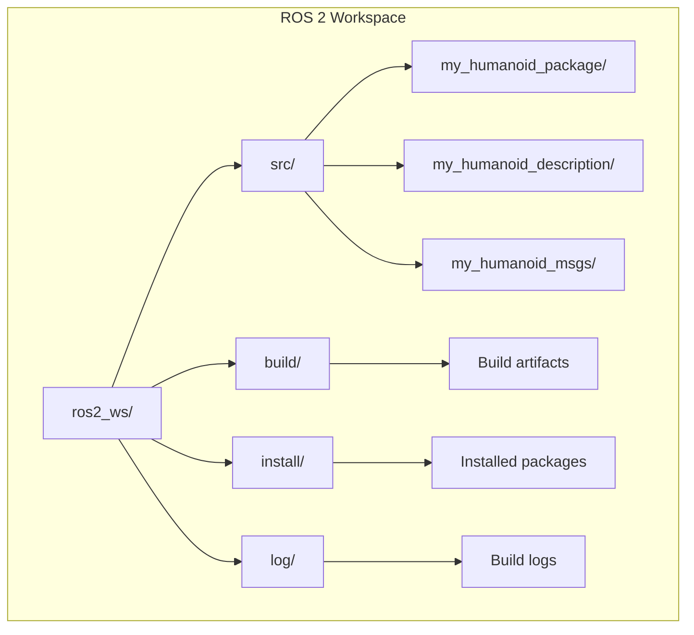

import { ChapterPersonalizeButton } from '@site/src/components/PersonalizationControls';
import { ChapterTranslateButton } from '@site/src/components/TranslationControls';

<div style={{display: 'flex', gap: '10px', marginBottom: '20px'}}>
  <ChapterPersonalizeButton chapterId="ros2-package-development" />
  <ChapterTranslateButton chapterId="ros2-package-development" />
</div>

# ROS 2 Package Development

A ROS 2 package is the fundamental unit of organization for your robot software. In this chapter, you'll learn how to create, build, and deploy ROS 2 packages using Python, write launch files to orchestrate complex systems, and manage parameters for configurable robot applications.

## Learning Objectives

By the end of this chapter, you will be able to:
- Create and structure ROS 2 Python packages
- Write and configure `package.xml` and `setup.py` files
- Build packages with colcon
- Create launch files to start multiple nodes
- Manage parameters with YAML configuration files
- Implement best practices for package organization
- Test and debug ROS 2 packages

## ROS 2 Package Structure

### Python Package Layout

```
my_humanoid_package/
├── my_humanoid_package/           # Python module
│   ├── __init__.py
│   ├── perception_node.py
│   ├── planning_node.py
│   ├── control_node.py
│   └── utils/
│       ├── __init__.py
│       ├── transforms.py
│       └── math_helpers.py
├── config/                        # Configuration files
│   ├── robot_params.yaml
│   └── controller_config.yaml
├── launch/                        # Launch files
│   ├── robot.launch.py
│   └── simulation.launch.py
├── resource/                      # Package marker
│   └── my_humanoid_package
├── test/                          # Tests
│   ├── test_perception.py
│   └── test_planning.py
├── package.xml                    # Package manifest
├── setup.py                       # Python setup
├── setup.cfg                      # Setup configuration
└── README.md
```

### Creating a New Package

```bash
# Navigate to your workspace src directory
cd ~/ros2_ws/src

# Create a Python package
ros2 pkg create --build-type ament_python \
    --node-name perception_node \
    --dependencies rclpy std_msgs sensor_msgs \
    my_humanoid_package

# Or create with more options
ros2 pkg create --build-type ament_python \
    --license Apache-2.0 \
    --description "Humanoid robot control package" \
    --maintainer-name "Your Name" \
    --maintainer-email "you@example.com" \
    my_humanoid_package
```

## Package Configuration Files

### package.xml

The package manifest defines metadata and dependencies:

```xml
<?xml version="1.0"?>
<?xml-model href="http://download.ros.org/schema/package_format3.xsd" schematypens="http://www.w3.org/2001/XMLSchema"?>
<package format="3">
  <name>my_humanoid_package</name>
  <version>1.0.0</version>
  <description>Control package for humanoid robot</description>

  <maintainer email="developer@example.com">Developer Name</maintainer>
  <license>Apache-2.0</license>

  <!-- Build tool -->
  <buildtool_depend>ament_python</buildtool_depend>

  <!-- Runtime dependencies -->
  <exec_depend>rclpy</exec_depend>
  <exec_depend>std_msgs</exec_depend>
  <exec_depend>sensor_msgs</exec_depend>
  <exec_depend>geometry_msgs</exec_depend>
  <exec_depend>nav_msgs</exec_depend>
  <exec_depend>cv_bridge</exec_depend>
  <exec_depend>tf2_ros</exec_depend>

  <!-- Test dependencies -->
  <test_depend>ament_copyright</test_depend>
  <test_depend>ament_flake8</test_depend>
  <test_depend>ament_pep257</test_depend>
  <test_depend>python3-pytest</test_depend>

  <!-- Export for ament -->
  <export>
    <build_type>ament_python</build_type>
  </export>
</package>
```

### setup.py

Python package setup configuration:

```python
from setuptools import setup, find_packages
import os
from glob import glob

package_name = 'my_humanoid_package'

setup(
    name=package_name,
    version='1.0.0',
    packages=find_packages(exclude=['test']),

    # Include data files
    data_files=[
        # Package marker
        ('share/ament_index/resource_index/packages',
            ['resource/' + package_name]),
        # Package manifest
        ('share/' + package_name, ['package.xml']),
        # Launch files
        (os.path.join('share', package_name, 'launch'),
            glob('launch/*.launch.py')),
        # Config files
        (os.path.join('share', package_name, 'config'),
            glob('config/*.yaml')),
        # URDF files (if any)
        (os.path.join('share', package_name, 'urdf'),
            glob('urdf/*.urdf') + glob('urdf/*.xacro')),
    ],

    install_requires=['setuptools'],
    zip_safe=True,

    maintainer='Developer Name',
    maintainer_email='developer@example.com',
    description='Control package for humanoid robot',
    license='Apache-2.0',

    tests_require=['pytest'],

    # Entry points for executables
    entry_points={
        'console_scripts': [
            'perception_node = my_humanoid_package.perception_node:main',
            'planning_node = my_humanoid_package.planning_node:main',
            'control_node = my_humanoid_package.control_node:main',
            'teleop_node = my_humanoid_package.teleop_node:main',
        ],
    },
)
```

### setup.cfg

```ini
[develop]
script_dir=$base/lib/my_humanoid_package

[install]
install_scripts=$base/lib/my_humanoid_package
```


## Building Packages with Colcon

### Basic Build Commands

```bash
# Navigate to workspace root
cd ~/ros2_ws

# Build all packages
colcon build

# Build specific package
colcon build --packages-select my_humanoid_package

# Build with dependencies
colcon build --packages-up-to my_humanoid_package

# Build in parallel (faster)
colcon build --parallel-workers 4

# Build with symlink install (for Python development)
colcon build --symlink-install

# Source the workspace
source install/setup.bash
```

### Colcon Build Options

| Option | Description |
|--------|-------------|
| `--packages-select` | Build only specified packages |
| `--packages-up-to` | Build package and its dependencies |
| `--symlink-install` | Use symlinks instead of copying (Python) |
| `--cmake-args` | Pass arguments to CMake |
| `--parallel-workers N` | Number of parallel jobs |
| `--event-handlers console_direct+` | Show build output in real-time |

### Workspace Organization



## Launch Files

Launch files orchestrate starting multiple nodes with their configurations.

### Basic Launch File

```python
# launch/robot.launch.py
from launch import LaunchDescription
from launch_ros.actions import Node


def generate_launch_description():
    return LaunchDescription([
        # Perception node
        Node(
            package='my_humanoid_package',
            executable='perception_node',
            name='perception',
            output='screen',
            parameters=[{
                'camera_topic': '/camera/image_raw',
                'detection_threshold': 0.7
            }]
        ),

        # Planning node
        Node(
            package='my_humanoid_package',
            executable='planning_node',
            name='planning',
            output='screen'
        ),

        # Control node
        Node(
            package='my_humanoid_package',
            executable='control_node',
            name='control',
            output='screen',
            remappings=[
                ('/cmd_vel', '/robot/cmd_vel'),
                ('/odom', '/robot/odom')
            ]
        )
    ])
```

### Launch File with Arguments

```python
# launch/configurable.launch.py
from launch import LaunchDescription
from launch.actions import DeclareLaunchArgument, GroupAction
from launch.substitutions import LaunchConfiguration, PathJoinSubstitution
from launch.conditions import IfCondition, UnlessCondition
from launch_ros.actions import Node, PushRosNamespace
from launch_ros.substitutions import FindPackageShare


def generate_launch_description():
    # Declare arguments
    use_sim_arg = DeclareLaunchArgument(
        'use_sim',
        default_value='true',
        description='Use simulation time'
    )

    robot_name_arg = DeclareLaunchArgument(
        'robot_name',
        default_value='humanoid_01',
        description='Name of the robot'
    )

    config_file_arg = DeclareLaunchArgument(
        'config_file',
        default_value=PathJoinSubstitution([
            FindPackageShare('my_humanoid_package'),
            'config',
            'robot_params.yaml'
        ]),
        description='Path to config file'
    )

    # Get argument values
    use_sim = LaunchConfiguration('use_sim')
    robot_name = LaunchConfiguration('robot_name')
    config_file = LaunchConfiguration('config_file')

    # Nodes
    perception_node = Node(
        package='my_humanoid_package',
        executable='perception_node',
        name='perception',
        namespace=robot_name,
        parameters=[
            config_file,
            {'use_sim_time': use_sim}
        ],
        output='screen'
    )

    control_node = Node(
        package='my_humanoid_package',
        executable='control_node',
        name='control',
        namespace=robot_name,
        parameters=[
            config_file,
            {'use_sim_time': use_sim}
        ],
        output='screen'
    )

    return LaunchDescription([
        use_sim_arg,
        robot_name_arg,
        config_file_arg,
        perception_node,
        control_node
    ])
```

### Including Other Launch Files

```python
# launch/full_system.launch.py
from launch import LaunchDescription
from launch.actions import IncludeLaunchDescription, GroupAction
from launch.launch_description_sources import PythonLaunchDescriptionSource
from launch.substitutions import PathJoinSubstitution
from launch_ros.substitutions import FindPackageShare
from launch_ros.actions import PushRosNamespace


def generate_launch_description():
    # Include robot description launch
    robot_description = IncludeLaunchDescription(
        PythonLaunchDescriptionSource([
            PathJoinSubstitution([
                FindPackageShare('my_humanoid_description'),
                'launch',
                'display.launch.py'
            ])
        ]),
        launch_arguments={
            'use_sim': 'true'
        }.items()
    )

    # Include control launch with namespace
    control_launch = GroupAction([
        PushRosNamespace('humanoid'),
        IncludeLaunchDescription(
            PythonLaunchDescriptionSource([
                PathJoinSubstitution([
                    FindPackageShare('my_humanoid_package'),
                    'launch',
                    'robot.launch.py'
                ])
            ])
        )
    ])

    return LaunchDescription([
        robot_description,
        control_launch
    ])
```

### Conditional Launch

```python
# launch/conditional.launch.py
from launch import LaunchDescription
from launch.actions import DeclareLaunchArgument, OpaqueFunction
from launch.substitutions import LaunchConfiguration
from launch.conditions import IfCondition, UnlessCondition
from launch_ros.actions import Node


def launch_setup(context, *args, **kwargs):
    """Dynamic launch setup based on arguments."""
    use_rviz = LaunchConfiguration('use_rviz').perform(context)

    nodes = []

    # Always launch core nodes
    nodes.append(Node(
        package='my_humanoid_package',
        executable='control_node',
        name='control'
    ))

    # Conditionally launch RViz
    if use_rviz.lower() == 'true':
        nodes.append(Node(
            package='rviz2',
            executable='rviz2',
            name='rviz2'
        ))

    return nodes


def generate_launch_description():
    return LaunchDescription([
        DeclareLaunchArgument(
            'use_rviz',
            default_value='true',
            description='Launch RViz'
        ),
        OpaqueFunction(function=launch_setup)
    ])
```

## Parameter Management

### YAML Configuration Files

```yaml
# config/robot_params.yaml
/**:
  ros__parameters:
    # Global parameters
    use_sim_time: true
    robot_name: "humanoid_alpha"

perception:
  ros__parameters:
    # Camera settings
    camera:
      topic: "/camera/image_raw"
      width: 640
      height: 480
      fps: 30

    # Detection settings
    detection:
      model_path: "models/yolov8n.pt"
      confidence_threshold: 0.7
      nms_threshold: 0.4
      classes:
        - person
        - chair
        - table

planning:
  ros__parameters:
    # Path planning
    planner:
      type: "rrt_star"
      max_iterations: 1000
      goal_tolerance: 0.1

    # Costmap
    costmap:
      resolution: 0.05
      width: 10.0
      height: 10.0
      inflation_radius: 0.5

control:
  ros__parameters:
    # PID gains
    pid:
      kp: 1.0
      ki: 0.1
      kd: 0.05

    # Velocity limits
    limits:
      max_linear_velocity: 0.5
      max_angular_velocity: 1.0
      max_acceleration: 0.3

    # Control frequency
    control_frequency: 100.0
```

### Loading Parameters in Nodes

```python
#!/usr/bin/env python3
"""Node with comprehensive parameter handling."""

import rclpy
from rclpy.node import Node
from rcl_interfaces.msg import ParameterDescriptor, ParameterType, FloatingPointRange


class ConfigurableControlNode(Node):
    """Control node with runtime-configurable parameters."""

    def __init__(self):
        super().__init__('control')

        # Declare parameters with descriptors
        self.declare_parameters(
            namespace='pid',
            parameters=[
                ('kp', 1.0, ParameterDescriptor(
                    description='Proportional gain',
                    type=ParameterType.PARAMETER_DOUBLE,
                    floating_point_range=[FloatingPointRange(
                        from_value=0.0,
                        to_value=10.0,
                        step=0.1
                    )]
                )),
                ('ki', 0.1, ParameterDescriptor(
                    description='Integral gain'
                )),
                ('kd', 0.05, ParameterDescriptor(
                    description='Derivative gain'
                ))
            ]
        )

        self.declare_parameters(
            namespace='limits',
            parameters=[
                ('max_linear_velocity', 0.5),
                ('max_angular_velocity', 1.0),
                ('max_acceleration', 0.3)
            ]
        )

        self.declare_parameter('control_frequency', 100.0)

        # Add parameter callback
        self.add_on_set_parameters_callback(self.parameter_callback)

        # Initialize controller with parameters
        self.setup_controller()

        # Control loop
        freq = self.get_parameter('control_frequency').value
        self.timer = self.create_timer(1.0 / freq, self.control_loop)

    def setup_controller(self):
        """Initialize controller with current parameters."""
        self.kp = self.get_parameter('pid.kp').value
        self.ki = self.get_parameter('pid.ki').value
        self.kd = self.get_parameter('pid.kd').value

        self.max_linear = self.get_parameter('limits.max_linear_velocity').value
        self.max_angular = self.get_parameter('limits.max_angular_velocity').value

        self.get_logger().info(
            f'Controller initialized: kp={self.kp}, ki={self.ki}, kd={self.kd}'
        )

    def parameter_callback(self, params):
        """Handle parameter changes at runtime."""
        from rcl_interfaces.msg import SetParametersResult

        for param in params:
            self.get_logger().info(f'Parameter changed: {param.name} = {param.value}')

            # Update internal state
            if param.name == 'pid.kp':
                self.kp = param.value
            elif param.name == 'pid.ki':
                self.ki = param.value
            elif param.name == 'pid.kd':
                self.kd = param.value

        return SetParametersResult(successful=True)

    def control_loop(self):
        """Main control loop."""
        # Control logic using self.kp, self.ki, self.kd
        pass


def main(args=None):
    rclpy.init(args=args)
    node = ConfigurableControlNode()
    rclpy.spin(node)
    node.destroy_node()
    rclpy.shutdown()


if __name__ == '__main__':
    main()
```

### Runtime Parameter Commands

```bash
# List parameters
ros2 param list /control

# Get parameter value
ros2 param get /control pid.kp

# Set parameter value
ros2 param set /control pid.kp 2.0

# Dump all parameters to file
ros2 param dump /control --output-dir ./

# Load parameters from file
ros2 param load /control robot_params.yaml
```


## Testing ROS 2 Packages

### Unit Tests with pytest

```python
# test/test_perception.py
import pytest
import rclpy
from rclpy.node import Node
from my_humanoid_package.perception_node import PerceptionNode


@pytest.fixture(scope='module')
def rclpy_init():
    """Initialize rclpy for tests."""
    rclpy.init()
    yield
    rclpy.shutdown()


@pytest.fixture
def perception_node(rclpy_init):
    """Create perception node for testing."""
    node = PerceptionNode()
    yield node
    node.destroy_node()


class TestPerceptionNode:
    """Tests for PerceptionNode."""

    def test_node_creation(self, perception_node):
        """Test that node is created correctly."""
        assert perception_node.get_name() == 'perception'

    def test_parameters_declared(self, perception_node):
        """Test that parameters are declared."""
        assert perception_node.has_parameter('detection_threshold')
        threshold = perception_node.get_parameter('detection_threshold').value
        assert 0.0 <= threshold <= 1.0

    def test_publishers_created(self, perception_node):
        """Test that publishers are created."""
        # Check publisher count
        publishers = perception_node.publishers
        assert len(publishers) > 0

    def test_subscribers_created(self, perception_node):
        """Test that subscribers are created."""
        subscriptions = perception_node.subscriptions
        assert len(subscriptions) > 0
```

### Integration Tests

```python
# test/test_integration.py
import pytest
import rclpy
from rclpy.executors import SingleThreadedExecutor
from std_msgs.msg import String
from geometry_msgs.msg import Twist
import time


@pytest.fixture(scope='module')
def ros_context():
    """Set up ROS context for integration tests."""
    rclpy.init()
    yield
    rclpy.shutdown()


class TestSystemIntegration:
    """Integration tests for the robot system."""

    def test_perception_to_control_pipeline(self, ros_context):
        """Test that perception output reaches control."""
        # Create test nodes
        test_node = rclpy.create_node('test_node')

        received_commands = []

        def cmd_callback(msg):
            received_commands.append(msg)

        # Subscribe to control output
        sub = test_node.create_subscription(
            Twist, '/cmd_vel', cmd_callback, 10
        )

        # Publish test perception data
        pub = test_node.create_publisher(
            String, '/perception/detections', 10
        )

        # Spin for a bit
        executor = SingleThreadedExecutor()
        executor.add_node(test_node)

        # Publish and wait
        msg = String()
        msg.data = '{"objects": [{"class": "person", "distance": 2.0}]}'
        pub.publish(msg)

        start = time.time()
        while time.time() - start < 2.0:
            executor.spin_once(timeout_sec=0.1)

        # Verify
        test_node.destroy_node()
        # Assert based on expected behavior
```

### Running Tests

```bash
# Run all tests in package
colcon test --packages-select my_humanoid_package

# Run with verbose output
colcon test --packages-select my_humanoid_package --event-handlers console_direct+

# View test results
colcon test-result --verbose

# Run specific test file
python -m pytest test/test_perception.py -v

# Run with coverage
python -m pytest test/ --cov=my_humanoid_package --cov-report=html
```

## Best Practices

### Code Organization

```python
# my_humanoid_package/perception_node.py
"""
Perception node for humanoid robot.

This module provides the PerceptionNode class that processes
sensor data and publishes detected objects.
"""

import rclpy
from rclpy.node import Node
from rclpy.qos import QoSProfile, ReliabilityPolicy
from sensor_msgs.msg import Image
from std_msgs.msg import String
from cv_bridge import CvBridge
import json

from .utils.transforms import image_to_world_coords
from .utils.detection import ObjectDetector


class PerceptionNode(Node):
    """
    Perception node that processes camera images.

    Subscribes to:
        /camera/image_raw (sensor_msgs/Image): Raw camera images

    Publishes:
        /perception/detections (std_msgs/String): JSON detection results

    Parameters:
        detection_threshold (float): Confidence threshold (default: 0.7)
        model_path (str): Path to detection model
    """

    def __init__(self):
        super().__init__('perception')
        self._setup_parameters()
        self._setup_communications()
        self._setup_detector()
        self.get_logger().info('Perception node initialized')

    def _setup_parameters(self):
        """Declare and get parameters."""
        self.declare_parameter('detection_threshold', 0.7)
        self.declare_parameter('model_path', 'models/detector.pt')

        self.threshold = self.get_parameter('detection_threshold').value
        self.model_path = self.get_parameter('model_path').value

    def _setup_communications(self):
        """Set up publishers and subscribers."""
        sensor_qos = QoSProfile(
            reliability=ReliabilityPolicy.BEST_EFFORT,
            depth=1
        )

        self.image_sub = self.create_subscription(
            Image, '/camera/image_raw',
            self._image_callback, sensor_qos
        )

        self.detection_pub = self.create_publisher(
            String, '/perception/detections', 10
        )

        self.cv_bridge = CvBridge()

    def _setup_detector(self):
        """Initialize the object detector."""
        self.detector = ObjectDetector(
            model_path=self.model_path,
            threshold=self.threshold
        )

    def _image_callback(self, msg: Image):
        """Process incoming images."""
        try:
            cv_image = self.cv_bridge.imgmsg_to_cv2(msg, 'bgr8')
            detections = self.detector.detect(cv_image)

            result = String()
            result.data = json.dumps(detections)
            self.detection_pub.publish(result)

        except Exception as e:
            self.get_logger().error(f'Detection failed: {e}')


def main(args=None):
    """Entry point for the perception node."""
    rclpy.init(args=args)
    node = PerceptionNode()

    try:
        rclpy.spin(node)
    except KeyboardInterrupt:
        pass
    finally:
        node.destroy_node()
        rclpy.shutdown()


if __name__ == '__main__':
    main()
```

### Documentation Standards

```python
"""
Module docstring explaining the purpose.

This module provides functionality for X, Y, Z.

Example:
    >>> from my_package import MyClass
    >>> obj = MyClass()
    >>> obj.do_something()
"""

class MyClass:
    """
    Class docstring with description.

    Attributes:
        attr1 (type): Description of attr1
        attr2 (type): Description of attr2

    Example:
        >>> obj = MyClass(param1=10)
        >>> result = obj.method()
    """

    def method(self, param: int) -> str:
        """
        Method docstring.

        Args:
            param: Description of parameter

        Returns:
            Description of return value

        Raises:
            ValueError: When param is invalid
        """
        pass
```

### Error Handling Patterns

```python
class RobustNode(Node):
    """Node with comprehensive error handling."""

    def __init__(self):
        super().__init__('robust_node')
        self._setup_with_retry()

    def _setup_with_retry(self, max_retries: int = 3):
        """Set up with retry logic."""
        for attempt in range(max_retries):
            try:
                self._initialize_hardware()
                return
            except Exception as e:
                self.get_logger().warning(
                    f'Setup attempt {attempt + 1} failed: {e}'
                )
                if attempt == max_retries - 1:
                    self.get_logger().error('Setup failed after all retries')
                    raise

    def safe_callback(self, msg):
        """Callback with error handling."""
        try:
            self._process_message(msg)
        except ValueError as e:
            self.get_logger().warning(f'Invalid data: {e}')
        except RuntimeError as e:
            self.get_logger().error(f'Processing error: {e}')
        except Exception as e:
            self.get_logger().fatal(f'Unexpected error: {e}')
            raise
```

## Summary

In this chapter, you learned how to:

- Create and structure ROS 2 Python packages
- Configure `package.xml` and `setup.py` for dependencies and entry points
- Build packages with colcon and manage workspaces
- Write launch files to orchestrate multi-node systems
- Manage parameters with YAML files and runtime updates
- Test packages with pytest and integration tests
- Follow best practices for code organization and documentation

:::tip Key Takeaway
A well-organized ROS 2 package with clear launch files and parameter management makes your robot software maintainable, configurable, and easy to deploy. Invest in good structure early—it pays dividends as your system grows.
:::

:::note Module Complete
Congratulations! You've completed Module 1: ROS 2 Fundamentals. You now have the foundation to build sophisticated robot applications using ROS 2. In the next module, we'll explore digital twins with Gazebo and Unity for simulation and testing.
:::

## Further Reading

- [ROS 2 Package Documentation](https://docs.ros.org/en/humble/Tutorials/Beginner-Client-Libraries/Creating-Your-First-ROS2-Package.html)
- [Launch File Documentation](https://docs.ros.org/en/humble/Tutorials/Intermediate/Launch/Launch-Main.html)
- [Colcon Documentation](https://colcon.readthedocs.io/)
- [ROS 2 Parameters](https://docs.ros.org/en/humble/Concepts/About-ROS-2-Parameters.html)

---

**Next Module:** [Humanoid Robotics](/fundamentals/humanoid-robotics)
