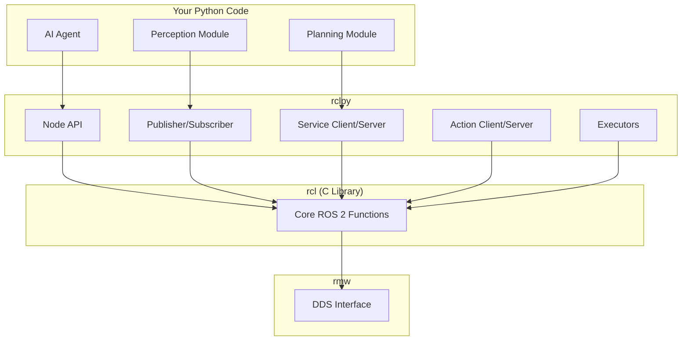
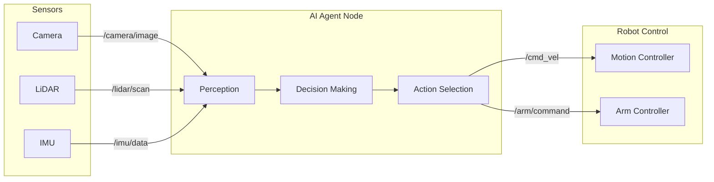
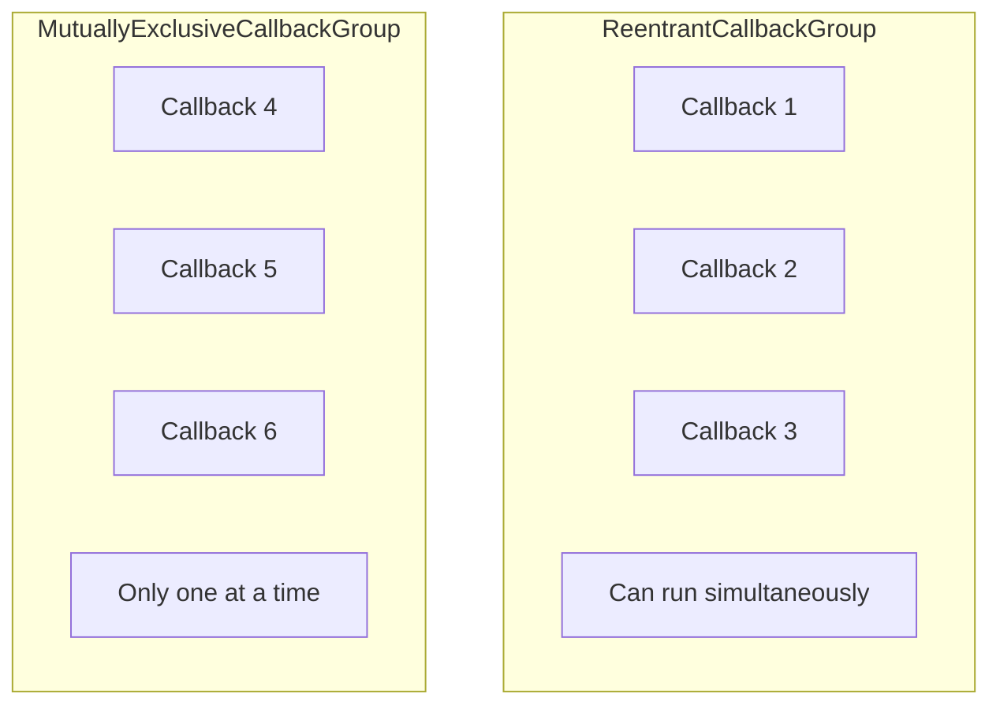

import { ChapterPersonalizeButton } from '@site/src/components/PersonalizationControls';
import { ChapterTranslateButton } from '@site/src/components/TranslationControls';
import BrowserOnly from '@docusaurus/BrowserOnly';

<div style={{display: 'flex', gap: '10px', marginBottom: '20px'}}>
  <ChapterPersonalizeButton chapterId="ros2-python-integration" />
  <ChapterTranslateButton chapterId="ros2-python-integration" />
</div>

# Python ROS 2 Integration

Python has become the language of choice for AI and machine learning, making it essential to bridge Python-based AI agents with ROS 2 robot controllers. In this chapter, you'll master rclpy—the Python client library for ROS 2—and learn how to create sophisticated robot applications that leverage Python's rich AI ecosystem.

## Learning Objectives

By the end of this chapter, you will be able to:
- Use rclpy to create ROS 2 nodes in Python
- Bridge Python AI agents to ROS 2 controllers
- Handle asynchronous operations with executors and callbacks
- Integrate popular Python libraries (NumPy, OpenCV, PyTorch) with ROS 2
- Implement best practices for Python ROS 2 development
- Debug and profile Python ROS 2 applications

## Introduction to rclpy

rclpy (ROS Client Library for Python) provides the Python interface to ROS 2. It wraps the underlying C library (rcl) to give you Pythonic access to all ROS 2 features.

### rclpy Architecture



### Basic rclpy Setup

```python
#!/usr/bin/env python3
"""Basic rclpy setup and node creation."""

import rclpy
from rclpy.node import Node


def main():
    # Initialize the ROS 2 Python client library
    rclpy.init()

    # Create a node
    node = Node('my_python_node')
    node.get_logger().info('Node started!')

    try:
        # Keep the node running
        rclpy.spin(node)
    except KeyboardInterrupt:
        pass
    finally:
        # Clean up
        node.destroy_node()
        rclpy.shutdown()


if __name__ == '__main__':
    main()
```

## Building AI-Powered Nodes

Let's create a complete example that bridges a Python AI agent with ROS 2 robot control.

### Interactive Demo: Joint Control with Python

Before we dive into the code, try manipulating this robot arm using the joint controls. The code panel shows the Python code you would use to control each joint via ROS 2:

<BrowserOnly fallback={<div style={{padding: '40px', background: '#1a1a2e', borderRadius: '8px', textAlign: 'center', color: '#64ffda'}}>Loading 3D Robot Viewer...</div>}>
  {() => {
    const { RobotPlayground } = require('@site/src/components/RobotViewer');
    return (
      <RobotPlayground
        urdfPath="/physical-ai-textbook/urdf/robot_arm/robot_arm.urdf"
        height={350}
        defaultTab="python"
      />
    );
  }}
</BrowserOnly>

:::info Python to Robot Connection
In ROS 2, you use `rclpy` to publish `sensor_msgs/JointState` messages that control these joints. Move the sliders to see the Python code for each joint. The joint values correspond to angles in radians that would be published via topics like `/joint_states`.
:::

### AI Agent Architecture



### Complete AI Agent Node

```python
#!/usr/bin/env python3
"""
AI Agent Node - Bridges Python AI with ROS 2 robot control.

This node demonstrates:
- Subscribing to multiple sensor topics
- Processing data with AI/ML libraries
- Publishing control commands
- Using timers for periodic tasks
"""

import rclpy
from rclpy.node import Node
from rclpy.qos import QoSProfile, ReliabilityPolicy
from sensor_msgs.msg import Image, LaserScan, Imu
from geometry_msgs.msg import Twist
from cv_bridge import CvBridge
import numpy as np


class AIAgentNode(Node):
    """An AI agent that processes sensor data and controls a robot."""

    def __init__(self):
        super().__init__('ai_agent')

        # Initialize CV Bridge for image conversion
        self.cv_bridge = CvBridge()

        # State variables
        self.latest_image = None
        self.latest_scan = None
        self.latest_imu = None
        self.obstacle_detected = False

        # QoS for sensor data (best effort for high-frequency data)
        sensor_qos = QoSProfile(
            reliability=ReliabilityPolicy.BEST_EFFORT,
            depth=1
        )

        # Subscribe to sensors
        self.image_sub = self.create_subscription(
            Image,
            '/camera/image_raw',
            self.image_callback,
            sensor_qos
        )

        self.scan_sub = self.create_subscription(
            LaserScan,
            '/lidar/scan',
            self.scan_callback,
            sensor_qos
        )

        self.imu_sub = self.create_subscription(
            Imu,
            '/imu/data',
            self.imu_callback,
            sensor_qos
        )

        # Publisher for velocity commands
        self.cmd_pub = self.create_publisher(
            Twist,
            '/cmd_vel',
            10
        )

        # Control loop timer (10 Hz)
        self.control_timer = self.create_timer(0.1, self.control_loop)

        # Declare parameters
        self.declare_parameter('max_linear_speed', 0.5)
        self.declare_parameter('max_angular_speed', 1.0)
        self.declare_parameter('obstacle_threshold', 0.5)

        self.get_logger().info('AI Agent initialized')

    def image_callback(self, msg: Image):
        """Process incoming camera images."""
        try:
            # Convert ROS Image to OpenCV format
            self.latest_image = self.cv_bridge.imgmsg_to_cv2(
                msg, desired_encoding='bgr8'
            )
        except Exception as e:
            self.get_logger().error(f'Image conversion failed: {e}')

    def scan_callback(self, msg: LaserScan):
        """Process incoming LiDAR scans."""
        self.latest_scan = msg

        # Check for obstacles in front
        ranges = np.array(msg.ranges)
        # Get front 60 degrees
        front_ranges = np.concatenate([
            ranges[:30],  # Right front
            ranges[-30:]  # Left front
        ])

        # Filter out invalid readings
        valid_ranges = front_ranges[
            (front_ranges > msg.range_min) &
            (front_ranges < msg.range_max)
        ]

        threshold = self.get_parameter('obstacle_threshold').value
        if len(valid_ranges) > 0 and np.min(valid_ranges) < threshold:
            self.obstacle_detected = True
        else:
            self.obstacle_detected = False

    def imu_callback(self, msg: Imu):
        """Process incoming IMU data."""
        self.latest_imu = msg

    def control_loop(self):
        """Main control loop - runs at 10 Hz."""
        cmd = Twist()

        max_linear = self.get_parameter('max_linear_speed').value
        max_angular = self.get_parameter('max_angular_speed').value

        if self.obstacle_detected:
            # Stopand turn if obstacle detected
            cmd.linear.x = 0.0
            cmd.angular.z = max_angular  # Turn left
            self.get_logger().warn('Obstacle detected! Turning...')
        else:
            # Move forward
            cmd.linear.x = max_linear
            cmd.angular.z = 0.0

        self.cmd_pub.publish(cmd)

    def process_image_with_ai(self, image: np.ndarray) -> dict:
        """
        Process image with AI model.

        This is where you'd integrate your ML model:
        - Object detection (YOLO, Detectron2)
        - Semantic segmentation
        - Pose estimation
      """
        # Placeholder for AI processing
        # In practice, you'd call your model here:
        # results = self.model.predict(image)

        return {
            'objects': [],
            'confidence': 0.0
        }


def main(args=None):
    rclpy.init(args=args)
    node = AIAgentNode()

    try:
        rclpy.spin(node)
    except KeyboardInterrupt:
        pass
    finally:
        node.destroy_node()
        rclpy.shutdown()


if __name__ == '__main__':
    main()
```


## Executors and Callbacks

Understanding how rclpy handles callbacks is crucial for building responsive robot applications.

### Single-Threaded Executor

The default executor processes callbacks one at a time:

```python
import rclpy
from rclpy.executors import SingleThreadedExecutor


def main():
    rclpy.init()

    node1 = SensorNode()
    node2 = ControlNode()

    # Single-threaded executor (default)
    executor = SingleThreadedExecutor()
    executor.add_node(node1)
    executor.add_node(node2)

    try:
        executor.spin()
    finally:
        executor.shutdown()
        rclpy.shutdown()
```

### Multi-Threaded Executor

For parallel callback processing:

```python
from rclpy.executors import MultiThreadedExecutor
from rclpy.callback_groups import ReentrantCallbackGroup, MutuallyExclusiveCallbackGroup


class ParallelProcessingNode(Node):
    """Node with parallel callback processing."""

    def __init__(self):
        super().__init__('parallel_node')

        # Callbacks in this group can run in parallel
        self.parallel_group = ReentrantCallbackGroup()

        # Callbacks in this group run one at a time
        self.exclusive_group = MutuallyExclusiveCallbackGroup()

        # Sensor callbacks can run in parallel
        self.camera_sub = self.create_subscription(
            Image, '/camera/image', self.camera_cb,
            10, callback_group=self.parallel_group
        )

        self.lidar_sub = self.create_subscription(
            LaserScan, '/lidar/scan', self.lidar_cb,
            10, callback_group=self.parallel_group
        )

        # Control callbacks are mutually exclusive
        self.control_timer = self.create_timer(
            0.1, self.control_cb,
            callback_group=self.exclusive_group
        )

    def camera_cb(self, msg):
        """Can run in parallel with lidar_cb."""
        self.process_image(msg)

    def lidar_cb(self, msg):
        """Can run in parallel with camera_cb."""
        self.process_scan(msg)

    def control_cb(self):
        """Runs exclusively - no other exclusive callbacks during this."""
        self.send_commands()


def main():
    rclpy.init()
    node = ParallelProcessingNode()

    # Use multi-threaded executor
    executor = MultiThreadedExecutor(num_threads=4)
    executor.add_node(node)

    try:
        executor.spin()
    finally:
        executor.shutdown()
        rclpy.shutdown()
```

### Callback Groups Explained



## Integrating Python Libraries

### NumPy Integration

```python
import numpy as np
from sensor_msgs.msg import PointCloud2
from sensor_msgs_py import point_cloud2


class PointCloudProcessor(Node):
    """Process point clouds with NumPy."""

    def __init__(self):
        super().__init__('pointcloud_processor')

        self.sub = self.create_subscription(
            PointCloud2,
            '/lidar/points',
            self.pointcloud_callback,
            10
        )

    def pointcloud_callback(self, msg: PointCloud2):
        """Convert PointCloud2 to NumPy array for processing."""
        # Convert to numpy array
        points = np.array(list(point_cloud2.read_points(
            msg, field_names=['x', 'y', 'z'], skip_nans=True
        )))

        if len(points) == 0:
            return

        # NumPy operations
        centroid = np.mean(points, axis=0)
        distances = np.linalg.norm(points, axis=1)
        closest_point = points[np.argmin(distances)]

        self.get_logger().info(
            f'Centroid: {centroid}, Closest: {closest_point}'
        )
```

### OpenCV Integration

```python
import cv2
import numpy as np
from sensor_msgs.msg import Image
from cv_bridge import CvBridge


class VisionNode(Node):
    """Computer vision with OpenCV."""

    def __init__(self):
        super().__init__('vision_node')

        self.bridge = CvBridge()

        self.image_sub = self.create_subscription(
            Image, '/camera/image_raw',
            self.image_callback, 10
        )

        self.processed_pub = self.create_publisher(
            Image, '/camera/processed', 10
        )

    def image_callback(self, msg: Image):
        """Process image with OpenCV."""
        # Convert ROS Image to OpenCV
        cv_image = self.bridge.imgmsg_to_cv2(msg, 'bgr8')

        # OpenCV processing
        gray = cv2.cvtColor(cv_image, cv2.COLOR_BGR2GRAY)
        blurred = cv2.GaussianBlur(gray, (5, 5), 0)
        edges = cv2.Canny(blurred, 50, 150)

        # Detect circles (e.g., for ball tracking)
        circles = cv2.HoughCircles(
            blurred,
            cv2.HOUGH_GRADIENT,
            dp=1,
            minDist=50,
            param1=50,
            param2=30,
            minRadius=10,
            maxRadius=100
        )

        # Draw detected circles
        output = cv_image.copy()
        if circles is not None:
            circles = np.uint16(np.around(circles))
            for circle in circles[0, :]:
                center = (circle[0], circle[1])
                radius = circle[2]
                cv2.circle(output, center, radius, (0, 255, 0), 2)
                self.get_logger().info(f'Circle at {center}, r={radius}')

        # Publish processed image
        processed_msg = self.bridge.cv2_to_imgmsg(output, 'bgr8')
        self.processed_pub.publish(processed_msg)
```

### PyTorch Integration

```python
import torch
import torchvision.transforms as transforms
from sensor_msgs.msg import Image
from std_msgs.msg import String
from cv_bridge import CvBridge
import json


class DeepLearningNode(Node):
    """Deep learning inference with PyTorch."""

    def __init__(self):
        super().__init__('deep_learning_node')

        self.bridge = CvBridge()

        # Load model (example: pretrained ResNet)
        self.device = torch.device(
            'cuda' if torch.cuda.is_available() else 'cpu'
        )
        self.get_logger().info(f'Using device: {self.device}')

        self.model = self.load_model()
        self.transform = self.get_transforms()

        # Subscribers and publishers
        self.image_sub = self.create_subscription(
            Image, '/camera/image_raw',
            self.inference_callback, 10
        )

        self.detection_pub = self.create_publisher(
            String, '/detections', 10
        )

    def load_model(self):
        """Load and prepare the model."""
        model = torch.hub.load(
            'pytorch/vision:v0.10.0',
            'resnet18',
            pretrained=True
        )
        model.eval()
        model.to(self.device)
        return model

    def get_transforms(self):
        """Image preprocessing transforms."""
        return transforms.Compose([
            transforms.ToPILImage(),
            transforms.Resize(256),
            transforms.CenterCrop(224),
            transforms.ToTensor(),
            transforms.Normalize(
                mean=[0.485, 0.456, 0.406],
                std=[0.229, 0.224, 0.225]
            )
        ])

    def inference_callback(self, msg: Image):
        """Run inference on incoming images."""
        # Convert to OpenCV format
        cv_image = self.bridge.imgmsg_to_cv2(msg, 'rgb8')

        # Preprocess
        input_tensor = self.transform(cv_image)
        input_batch = input_tensor.unsqueeze(0).to(self.device)

        # Inference
        with torch.no_grad():
            output = self.model(input_batch)

        # Get top predictions
        probabilities = torch.nn.functional.softmax(output[0], dim=0)
        top5_prob, top5_idx = torch.topk(probabilities, 5)

        # Publish results
        results = {
            'predictions': [
                {'class_id': idx.item(), 'confidence': prob.item()}
                for idx, prob in zip(top5_idx, top5_prob)
            ]
        }

        result_msg = String()
        result_msg.data = json.dumps(results)
        self.detection_pub.publish(result_msg)
```

## Parameters and Configuration

### Declaring and Using Parameters

```python
from rcl_interfaces.msg import ParameterDescriptor, ParameterType


class ConfigurableNode(Node):
    """Node with runtime-configurable parameters."""

    def __init__(self):
        super().__init__('configurable_node')

        # Declare parameters with descriptions
        self.declare_parameter(
            'robot_name',
            'humanoid_01',
            ParameterDescriptor(
                description='Name of the robot',
                type=ParameterType.PARAMETER_STRING
            )
        )

        self.declare_parameter(
            'max_speed',
            1.0,
            ParameterDescriptor(
                description='Maximum speed in m/s',
                type=ParameterType.PARAMETER_DOUBLE,
                additional_constraints='Must be positive'
            )
        )

        self.declare_parameter(
            'enabled_sensors',
            ['camera', 'lidar', 'imu'],
            ParameterDescriptor(
                description='List of enabled sensors',
                type=ParameterType.PARAMETER_STRING_ARRAY
            )
        )

        # Add parameter change callback
        self.add_on_set_parameters_callback(self.parameter_callback)

        # Use parameters
        self.print_config()

    def parameter_callback(self, params):
        """Handle parameter changes at runtime."""
        from rcl_interfaces.msg import SetParametersResult

        for param in params:
            self.get_logger().info(
                f'Parameter {param.name} changed to {param.value}'
            )

            # Validate changes
            if param.name == 'max_speed' and param.value < 0:
                return SetParametersResult(
                    successful=False,
                    reason='max_speed must be positive'
                )

        return SetParametersResult(successful=True)

    def print_config(self):
        """Print current configuration."""
        robot_name = self.get_parameter('robot_name').value
        max_speed = self.get_parameter('max_speed').value
        sensors = self.get_parameter('enabled_sensors').value

        self.get_logger().info(f'Robot: {robot_name}')
        self.get_logger().info(f'Max Speed: {max_speed} m/s')
        self.get_logger().info(f'Sensors: {sensors}')
```

### Loading Parameters from YAML

```yaml
# config/robot_params.yaml
configurable_node:
  ros__parameters:
    robot_name: "humanoid_alpha"
    max_speed: 0.8
    enabled_sensors:
      - camera
      - lidar
      - imu
      - force_torque

    perception:
      image_width: 640
      image_height: 480
      detection_threshold: 0.7

    control:
      kp: 1.0
      ki: 0.1
      kd: 0.05
```

```python
# Load in launch file or command line:
# ros2 run my_package my_node --ros-args --params-file config/robot_params.yaml
```


## Asynchronous Programming with rclpy

### Using async/await

```python
import asyncio
import rclpy
from rclpy.node import Node
from rclpy.executors import SingleThreadedExecutor
from example_interfaces.srv import AddTwoInts


class AsyncServiceClient(Node):
    """Demonstrates async service calls."""

    def __init__(self):
        super().__init__('async_client')
        self.client = self.create_client(AddTwoInts, 'add_two_ints')

    async def call_service(self, a: int, b: int) -> int:
        """Async service call."""
        while not self.client.wait_for_service(timeout_sec=1.0):
            self.get_logger().info('Waiting for service...')

        request = AddTwoInts.Request()
        request.a = a
        request.b = b

        # Async call
        future = self.client.call_async(request)

        # Wait for result without blocking
        result = await future
        return result.sum


async def main():
    rclpy.init()
    node = AsyncServiceClient()

    # Run async operations
    result = await node.call_service(5, 3)
    print(f'Result: {result}')

    node.destroy_node()
    rclpy.shutdown()


if __name__ == '__main__':
    asyncio.run(main())
```

### Combining ROS 2 with asyncio

```python
import asyncio
import rclpy
from rclpy.node import Node
from std_msgs.msg import String


class AsyncNode(Node):
    """Node that combines ROS 2 with asyncio."""

    def __init__(self):
        super().__init__('async_node')

        self.publisher = self.create_publisher(String, '/status', 10)
        self.subscription = self.create_subscription(
            String, '/commands', self.command_callback, 10
        )

        self.command_queue = asyncio.Queue()

    def command_callback(self, msg: String):
        """Put commands in async queue."""
        asyncio.get_event_loop().call_soon_threadsafe(
            self.command_queue.put_nowait, msg.data
        )

    async def process_commands(self):
        """Async command processor."""
        while True:
            command = await self.command_queue.get()
            self.get_logger().info(f'Processing: {command}')

            # Simulate async work
            await asyncio.sleep(0.1)

            # Publish status
            status = String()
            status.data = f'Completed: {command}'
            self.publisher.publish(status)

    async def periodic_task(self):
        """Async periodic task."""
        while True:
            self.get_logger().info('Periodic task running')
            await asyncio.sleep(1.0)


async def spin_node(node):
    """Spin node in async context."""
    while rclpy.ok():
        rclpy.spin_once(node, timeout_sec=0.01)
        await asyncio.sleep(0.01)


async def main():
    rclpy.init()
    node = AsyncNode()

    # Run multiple async tasks
    await asyncio.gather(
        spin_node(node),
        node.process_commands(),
        node.periodic_task()
    )

    node.destroy_node()
    rclpy.shutdown()


if __name__ == '__main__':
    asyncio.run(main())
```

## Best Practices

### Code Organization

```
my_robot_package/
├── my_robot_package/
│   ├── __init__.py
│   ├── nodes/
│   │   ├── __init__.py
│   │   ├── perception_node.py
│   │   ├── planning_node.py
│   │   └── control_node.py
│   ├── utils/
│   │   ├── __init__.py
│   │   ├── transforms.py
│   │   └── math_utils.py
│   └── models/
│       ├── __init__.py
│       └── detector.py
├── config/
│   └── params.yaml
├── launch/
│   └── robot.launch.py
├── test/
│   ├── test_perception.py
│   └── test_planning.py
├── package.xml
├── setup.py
└── setup.cfg
```

### Error Handling

```python
class RobustNode(Node):
    """Node with proper error handling."""

    def __init__(self):
        super().__init__('robust_node')

        self.subscription = self.create_subscription(
            Image, '/camera/image', self.image_callback, 10
        )

    def image_callback(self, msg: Image):
        """Callback with error handling."""
        try:
            self.process_image(msg)
        except ValueError as e:
            self.get_logger().warning(f'Invalid image data: {e}')
        except RuntimeError as e:
            self.get_logger().error(f'Processing failed: {e}')
        except Exception as e:
            self.get_logger().fatal(f'Unexpected error: {e}')
            raise  # Re-raise for critical errors

    def process_image(self, msg: Image):
        """Process image with validation."""
        if msg.width == 0 or msg.height == 0:
            raise ValueError('Image has zero dimensions')

        # Processing logic here
        pass
```

### Logging Best Practices

```python
class LoggingExample(Node):
    """Demonstrates proper logging."""

    def __init__(self):
        super().__init__('logging_example')

        # Different log levels
        self.get_logger().debug('Debug info (verbose)')
        self.get_logger().info('Normal operation info')
        self.get_logger().warning('Something unexpected')
        self.get_logger().error('Error occurred')
        self.get_logger().fatal('Critical failure')

        # Throttled logging (once per second)
        self.timer = self.create_timer(0.01, self.fast_callback)

    def fast_callback(self):
        """High-frequency callback with throttled logging."""
        # This would spam logs without throttling
        self.get_logger().info(
            'Processing...',
            throttle_duration_sec=1.0  # Log at most once per second
        )

        # Skip first N occurrences
        self.get_logger().info(
            'Startup message',
            skip_first=True  # Skip first occurrence
        )

        # Log only once
        self.get_logger().info(
            'One-time message',
            once=True
        )
```

## Debugging and Profiling

### Using rqt Tools

```bash
# Visualize node graph
ros2 run rqt_graph rqt_graph

# Monitor topics
ros2 run rqt_topic rqt_topic

# View logs
ros2 run rqt_console rqt_console

# Plot data
ros2 run rqt_plot rqt_plot /imu/data/linear_acceleration/x
```

### Python Debugging

```python
import cProfile
import pstats


class ProfilingNode(Node):
    """Node with profiling support."""

    def __init__(self):
        super().__init__('profiling_node')
        self.profiler = cProfile.Profile()

    def start_profiling(self):
        """Start profiling."""
        self.profiler.enable()

    def stop_profiling(self):
        """Stop and print profiling results."""
        self.profiler.disable()
        stats = pstats.Stats(self.profiler)
        stats.sort_stats('cumulative')
        stats.print_stats(20)  # Top 20 functions
```

## Summary

In this chapter, you learned how to:

- Use rclpy to create Python ROS 2 nodes
- Handle callbacks with single and multi-threaded executors
- Integrate NumPy, OpenCV, and PyTorch with ROS 2
- Configure nodes with parameters and YAML files
- Write async code with rclpy and asyncio
- Follow best practices for error handling and logging

:::tip Key Takeaway
Python's rich ecosystem of AI/ML libraries combined with rclpy makes it the ideal choice for building intelligent robot applications. Use callback groups and executors wisely to balance responsiveness with thread safety.
:::

:::note Looking Ahead
In the next chapter, we'll explore URDF (Unified Robot Description Format) and learn how to model humanoid robots for simulation and control.
:::

## Further Reading

- [rclpy API Documentation](https://docs.ros2.org/latest/api/rclpy/)
- [Python Client Library Design](https://design.ros2.org/articles/rclpy_overview.html)
- [cv_bridge Documentation](http://wiki.ros.org/cv_bridge)
- [PyTorch ROS Integration](https://pytorch.org/)

---

**Next Chapter:** [URDF and Robot Description](/ros2/urdf-robot-description)
