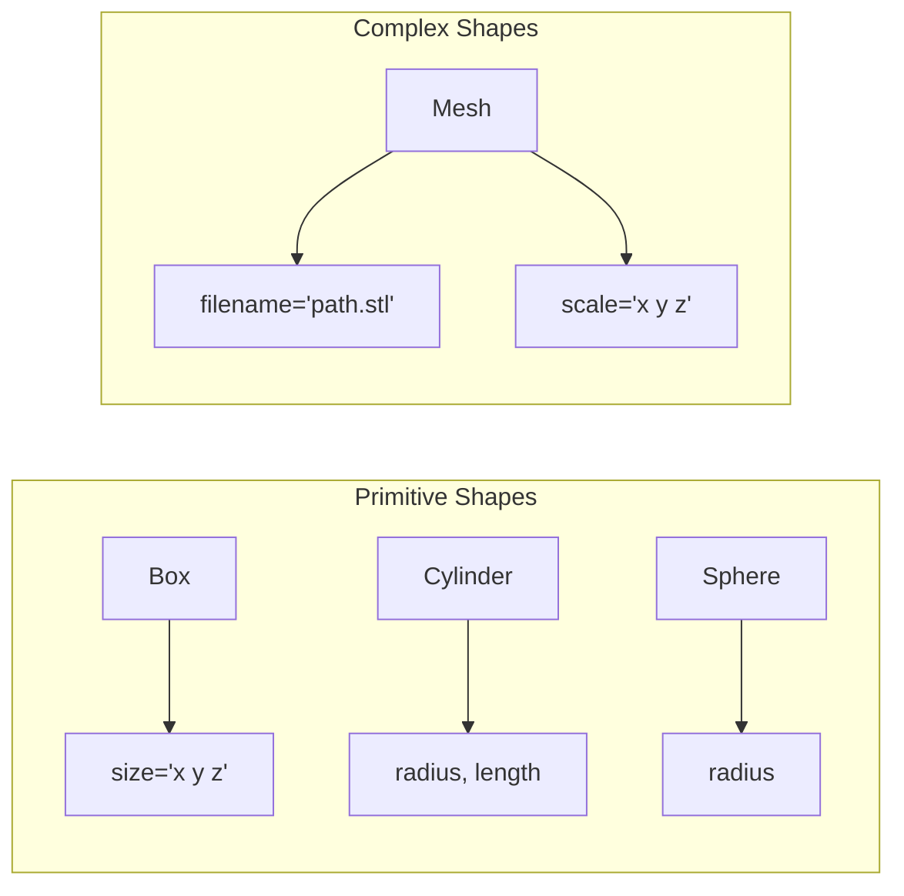
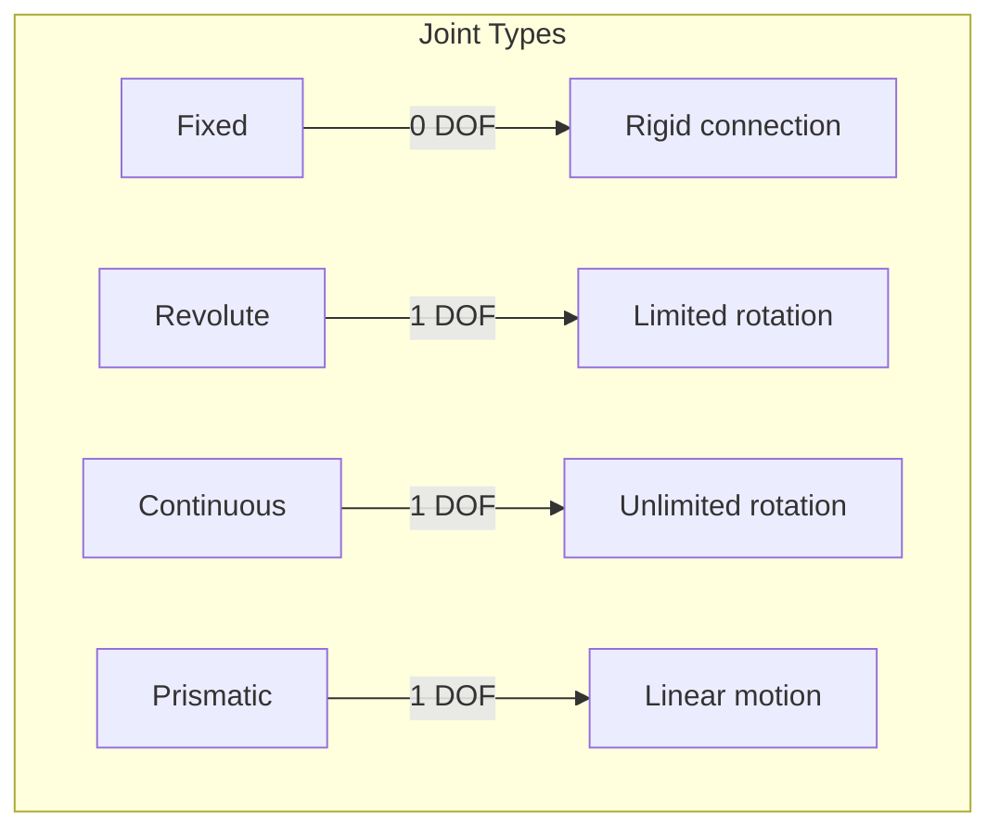
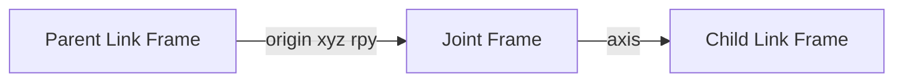
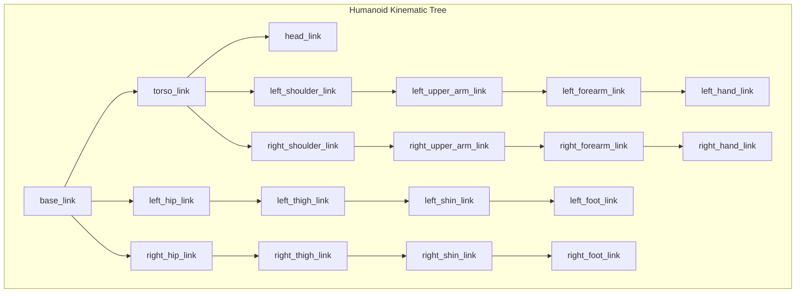

import { ChapterPersonalizeButton } from '@site/src/components/PersonalizationControls';
import { ChapterTranslateButton } from '@site/src/components/TranslationControls';
import BrowserOnly from '@docusaurus/BrowserOnly';

<div style={{display: 'flex', gap: '10px', marginBottom: '20px'}}>
  <ChapterPersonalizeButton chapterId="ros2-urdf-robot-description" />
  <ChapterTranslateButton chapterId="ros2-urdf-robot-description" />
</div>

# URDF and Robot Description

Every robot in ROS 2 needs a description—a formal specification of its physical structure, joints, sensors, and visual appearance. The Unified Robot Description Format (URDF) is the standard XML format for describing robots. In this chapter, you'll learn how to create URDF models for humanoid robots, enabling simulation, visualization, and motion planning.

## Learning Objectives

By the end of this chapter, you will be able to:
- Understand the structure and components of URDF files
- Create links and joints to model robot kinematics
- Add visual and collision geometries
- Define inertial properties for physics simulation
- Model sensors in URDF
- Use xacro for modular, maintainable robot descriptions
- Visualize and debug URDF models

## What is URDF?

URDF (Unified Robot Description Format) is an XML specification that describes:
- The physical structure of a robot (links and joints)
- Visual appearance (meshes, colors)
- Collision geometry (for physics simulation)
- Inertial properties (mass, center of mass, inertia tensor)
- Sensor attachments

```mermaid
graph TB
    subgraph "URDF Components"
        A[Robot] --> B[Links]
        A --> C[Joints]
        A --> D[Materials]
        A --> E[Transmissions]

        B --> B1[Visual]
        B --> B2[Collision]
        B --> B3[Inertial]

        C -->Link]
        C --> C2[Child Link]
        C --> C3[Joint Type]
        C --> C4[Limits]
    end
```

### Interactive Robot Viewer with Code

Before diving into the details, let's explore a real URDF model interactively. This 4-DOF robot arm demonstrates the concepts we'll cover in this chapter. Use the sliders to manipulate each joint and see the corresponding URDF code:

<BrowserOnly fallback={<div style={{padding: '40px', background: '#1a1a2e', borderRadius: '8px', textAlign: 'center', color: '#64ffda'}}>Loading 3D Robot Viewer...</div>}>
  {() => {
    const { RobotPlayground } = require('@site/src/components/RobotViewer');
    return (
      <RobotPlayground
        urdfPath="/physical-ai-textbook/urdf/robot_arm/robot_arm.urdf"
        height={400}
        defaultTab="urdf"
      />
    );
  }}
</BrowserOnly>

:::tip Try It Out
Drag to rotate the view, scroll to zoom, and use the joint sliders to see how each joint affects the robot's pose. The code panel on the right shows the URDF definition for the joint you're manipulating. Switch to the Python tab to see how you would control this joint programmatically!
:::

## URDF Structure Overview

```xml
<?xml version="1.0"?>
<robot name="my_humanoid">
  <!-- Materials (colors) -->
  <material name="blue">
    <color rgba="0.0 0.0 0.8 1.0"/>
  </material>

  <!-- Links (rigid bodies) -->
  <link name="base_link">
    <!-- Visual, collision, inertial -->
  </link>

  <!-- Joints (connections between links) -->
  <joint name="joint1" type="revolute">
    <!-- Parent, child, axis, limits -->
  </joint>
</robot>
```

## Links: The Building Blocks

Links represent the rigid bodies of your robot. Each link can have visual, collision, and inertial properties.

### Basic Link Structure

```xml
<link name="torso_link">
  <!-- Visual: What you see in visualization -->
  <visual>
    <origin xyz="0 0 0" rpy="0 0 0"/>
    <geometry>
      <box size="0.3 0.2 0.5"/>
    </geometry>
    <material name="blue"/>
  </visual>

  <!-- Collision: Used for physics simulation -->
  <collision>
    <origin xyz="0 0 0" rpy="0 0 0"/>
    <geometry>
      <box size="0.3 0.2 0.5"/>
    </geometry>
  </collision>

  <!-- Inertial: Mass and inertia for dynamics -->
  <inertial>
    <origin xyz="0 0 0" rpy="0 0 0"/>
    <mass value="10.0"/>
    <inertia ixx="0.1" ixy="0" ixz="0"
             iyy="0.1" iyz="0" izz="0.1"/>
  </inertial>
</link>
```

### Geometry Types



```xml
<!-- Box -->
<geometry>
  <box size="0.3 0.2 0.5"/>
</geometry>

<!-- Cylinder -->
<geometry>
  <cylinder radius="0.05" length="0.3"/>
</geometry>

<!-- Sphere -->
<geometry>
  <sphere radius="0.1"/>
</geometry>

<!-- Mesh (STL or DAE file) -->
<geometry>
  <mesh filename="package://my_robot/meshes/torso.stl" scale="1 1 1"/>
</geometry>
```

### Calculating Inertial Properties

For accurate physics simulation, you need correct inertial properties:

```python
"""Calculate inertial properties for common shapes."""
import numpy as np


def box_inertia(mass: float, x: float, y: float, z: float) -> dict:
    """Calculate inertia tensor for a box."""
    ixx = (1/12) * mass * (y**2 + z**2)
    iyy = (1/12) * mass * (x**2 + z**2)
    izz = (1/12) * mass * (x**2 + y**2)
    return {'ixx': ixx, 'iyy': iyy, 'izz': izz, 'ixy': 0, 'ixz': 0, 'iyz': 0}


def cylinder_inertia(mass: float, radius: float, length: float) -> dict:
    """Calculate inertia tensor for a cylinder (along z-axis)."""
    ixx = (1/12) * mass * (3 * radius**2 + length**2)
    iyy = ixx
    izz = (1/2) * mass * radius**2
    return {'ixx': ixx, 'iyy': iyy, 'izz': izz, 'ixy': 0, 'ixz': 0, 'iyz': 0}


def sphere_inertia(mass: float, radius: float) ->dict:
    """Calculate inertia tensor for a sphere."""
    i = (2/5) * mass * radius**2
    return {'ixx': i, 'iyy': i, 'izz': i, 'ixy': 0, 'ixz': 0, 'iyz': 0}


# Example: Calculate for humanoid torso
torso_mass = 10.0  # kg
torso_dims = (0.3, 0.2, 0.5)  # meters (x, y, z)
inertia = box_inertia(torso_mass, *torso_dims)
print(f"Torso inertia: {inertia}")
```

## Joints: Connecting Links

Joints define how links are connected and how they can move relative to each other.

### Joint Types

| Type | DOF | Description | Use Case |
|------|-----|-------------|----------|
| `fixed` | 0 | No relative motion | Sensor mounts |
| `revolute` | 1 | Rotation with limits | Elbow, knee |
| `continuous` | 1 | Unlimited rotation | Wheels |
| `prismatic` | 1 | Linear sliding | Linear actuators |
| `floating` | 6 | Free in space | Mobile base |
| `planar` | 3 | Motion in a plane | Rarely used |



### Joint Definition

```xml
<!-- Revolute joint (e.g., elbow) -->
<joint name="left_elbow_joint" type="revolute">
  <parent link="left_upper_arm_link"/>
  <child link="left_forearm_link"/>

  <!-- Position of joint relative to parent -->
  <origin xyz="0 0 -0.3" rpy="0 0 0"/>

  <!-- Axis of rotation -->
  <axis xyz="0 1 0"/>

  <!-- Joint limits -->
  <limit lower="0" upper="2.5"
         effort="100" velocity="2.0"/>

  <!-- Dynamics (optional) -->
  <dynamics damping="0.5" friction="0.1"/>
</joint>

<!-- Fixed joint (e.g., sensor mount) -->
<joint name="camera_mount_joint" type="fixed">
  <parent link="head_link"/>
  <child link="camera_link"/>
  <origin xyz="0.05 0 0.02" rpy="0 0 0"/>
</joint>

<!-- Continuous joint (e.g., wheel) -->
<joint name="left_wheel_joint" type="continuous">
  <parent link="base_link"/>
  <child link="left_wheel_link"/>
  <origin xyz="0 0.2 0" rpy="-1.5708 0 0"/>
  <axis xyz="0 0 1"/>
  <limit effort="10" velocity="10"/>
</joint>
```

### Understanding Joint Transforms



The `origin` tag specifies the transform from the parent link frame to the joint frame. The `axis` defines the direction of motion.


## Building a Humanoid Robot URDF

Let's build a simplified humanoid robot step by step.

### Humanoid Structure



### Complete Humanoid URDF Example

```xml
<?xml version="1.0"?>
<robot name="simple_humanoid" xmlns:xacro="http://www.ros.org/wiki/xacro">

  <!-- Materials -->
  <material name="white">
    <color rgba="1.0 1.0 1.0 1.0"/>
  </material>
  <material name="blue">
    <color rgba="0.2 0.2 0.8 1.0"/>
  </material>
  <material name="gray">
    <color rgba="0.5 0.5 0.5 1.0"/>
  </material>

  <!-- Base Link (pelvis) -->
  <link name="base_link">
    <visual>
      <geometry>
        <box size="0.2 0.3 0.15"/>
      </geometry>
      <material name="blue"/>
    </visual>
    <collision>
      <geometry>
        <box size="0.2 0.3 0.15"/>
      </geometry>
    </collision>
    <inertial>
      <mass value="5.0"/>
      <inertia ixx="0.05" ixy="0" ixz="0"
               iyy="0.03" iyz="0" izz="0.05"/>
    </inertial>
  </link>

  <!-- Torso -->
  <link name="torso_link">
    <visual>
      <origin xyz="0 0 0.2"/>
      <geometry>
        <box size="0.25 0.35 0.4"/>
      </geometry>
      <material name="white"/>
    </visual>
    <collision>
      <origin xyz="0 0 0.2"/>
      <geometry>
        <box size="0.25 0.35 0.4"/>
      </geometry>
    </collision>
    <inertial>
      <origin xyz="0 0 0.2"/>
      <mass value="15.0"/>
      <inertia ixx="0.3" ixy="0" ixz="0"
               iyy="0.2" iyz="0" izz="0.2"/>
    </inertial>
  </link>

  <joint name="torso_joint" type="fixed">
    <parent link="base_link"/>
    <child link="torso_link"/>
    <origin xyz="0 0 0.075"/>
  </joint>

  <!-- Head -->
  <link name="head_link">
    <visual>
      <geometry>
        <sphere radius="0.1"/>
      </geometry>
      <material name="white"/>
    </visual>
    <collision>
      <geometry>
        <sphere radius="0.1"/>
      </geometry>
    </collision>
    <inertial>
      <mass value="3.0"/>
      <inertia ixx="0.012" ixy="0" ixz="0"
               iyy="0.012" iyz="0" izz="0.012"/>
    </inertial>
  </link>

  <joint n_joint" type="revolute">
    <parent link="torso_link"/>
    <child link="head_link"/>
    <origin xyz="0 0 0.5" rpy="0 0 0"/>
    <axis xyz="0 0 1"/>
    <limit lower="-1.57" upper="1.57" effort="50" velocity="2"/>
  </joint>

  <!-- Left Arm -->
  <link name="left_upper_arm_link">
    <visual>
      <origin xyz="0 0 -0.15"/>
      <geometry>
        <cylinder radius="0.04" length="0.3"/>
      </geometry>
      <material name="white"/>
    </visual>
    <collision>
      <origin xyz="0 0 -0.15"/>
      <geometry>
        <cylinder radius="0.04" length="0.3"/>
      </geometry>
    <lision>
    <inertial>
      <origin xyz="0 0 -0.15"/>
      <mass value="2.0"/>
      <inertia ixx="0.015" ixy="0" ixz="0"
               iyy="0.015" iyz="0" izz="0.002"/>
    </inertial>
  </link>

  <joint name="left_shoulder_pitch_joint" type="revolute">
    <parent link="torso_link"/>
    <child link="left_upper_arm_link"/>
    <origin xyz="0 0.2 0.35" rpy="0 0 0"/>
    <axis xyz="0 1 0"/>
    <limit lower="-3.14" upper="3.14" effort="100" velocity="3"/>
  </joint>

  <link name="left_forearm_link">
    <visual>
      <origin xyz="0 0 -0.125"/>
      <geometry>
        <cylinder radius="0.035" length="0.25"/>
      </geometry>
      <material name="white"/>
    </visual>
    <collision>
      <origin xyz="0 0 -0.125"/>
      <geometry>
        <cylinder radius="0.035" length="0.25"/>
      </geometry>
    </collision>
    <inertial>
      <origin xyz="0 0 -0.125"/>
      <mass value="1.5"/>
      <inertia ixx="0.008" ixy="0" ixz="0"
               iyy="0.008" iyz="0" izz="0.001"/>
    </inertial>
  </link>

  <joint name="left_elbow_joint" type="revolute">
    <parent link="left_upper_arm_link"/>
    <child link="left_forearm_link"/>
    <origin xyz="0 0 -0.3" rpy="0 0 0"/>
    <axis xyz="0 1 0"/>
    <limit lower="0" upper="2.5" effort="80" velocity="3"/>
  </joint>

  <!-- Left Leg -->
  <link name="left_thigh_link">
    <visual>
      <origin xyz="0 0 -0.2"/>
      <geometry>
        <cylinder radius="0.05" length="0.4"/>
      </geometry>
      <material name="blue"/>
    </visual>
    <collision>
      <origin xyz="0 0 -0.2"/>
      <geometry>
        <cylinder radius="0.05" length="0.4"/>
      </geometry>
    </collision>
    <inertial>
      <origin xyz="0 0 -0.2"/>
      <mass value="5.0"/>
      <inertia ixx="0.07" ixy="0" ixz="0"
               iyy="0.07" iyz="0" izz="0.01"/>
    </inertial>
  </link>

  <joint name="left_hip_pitch_joint" type="revolute">
    <parent link="base_link"/>
    <child link="left_thigh_link"/>
    <origin xyz="0 0.1 -0.075" rpy="0 0 0"/>
    <axis xyz="0 1 0"/>
    <limit lower="-1.57" upper="1.57" effort="200" velocity="2"/>
  </joint>

  <link name="left_shin_link">
    <visual>
      <origin xyz="0 0 -0.2"/>
      <geometry>
        <cylinder radius="0.04" length="0.4     </geometry>
      <material name="blue"/>
    </visual>
    <collision>
      <origin xyz="0 0 -0.2"/>
      <geometry>
        <cylinder radius="0.04" length="0.4"/>
      </geometry>
    </collision>
    <inertial>
      <origin xyz="0 0 -0.2"/>
      <mass value="3.0"/>
      <inertia ixx="0.04" ixy="0" ixz="0"
               iyy="0.04" iyz="0" izz="0.005"/>
    </inertial>
  </link>

  <joint name="left_knee_joint" type="revolute">
    <parent link="left_thigh_link"/>
    <child li="left_shin_link"/>
    <origin xyz="0 0 -0.4" rpy="0 0 0"/>
    <axis xyz="0 1 0"/>
    <limit lower="0" upper="2.5" effort="150" velocity="2"/>
  </joint>

  <link name="left_foot_link">
    <visual>
      <origin xyz="0.05 0 -0.025"/>
      <geometry>
        <box size="0.2 0.1 0.05"/>
      </geometry>
      <material name="gray"/>
    </visual>
    <collision>
      <origin xyz="0.05 0 -0.025"/>
      <geometry>
        <box size="0.2 0.1 0.05"/>
      </geometry>
    </collision>
    <inertial>
      <origin xyz="0.05 0 -0.025"/>
      <mass value="1.0"/>
      <inertia ixx="0.001" ixy="0" ixz="0"
               iyy="0.003" iyz="0" izz="0.003"/>
    </inertial>
  </link>

  <joint name="left_ankle_joint" type="revolute">
    <parent link="left_shin_link"/>
    <child link="left_foot_link"/>
    <origin xyz="0 0 -0.4" rpy="0 0 0"/>
    <axis xyz="0 1 0"/>
    <limit lower="-0.8" upper="0.8" effort="100" velocity="2"/>
  </joint>

  <!-- Note: Right arm and leg would be similar, mirrored -->

</robot>
```

## Adding Sensors to URDF

Sensors are typically added as links with fixed joints, plus Gazebo plugins for simulation.

### Camera Sensor

```xml
<!-- Camera Link -->
<link name="camera_link">
  <visual>
    <geometry>
      <box size="0.02 0.05 0.02"/>
    </geometry>
    <material name="gray"/>
  </visual>
  <collision>
    <geometry>
      <box size="0.02 0.05 0.02"/>
    </geometry>
  </collision>
  <inertial>
    <mass value="0.1"/>
    <inertia ixx="0.0001" ixy="0" ixz="0"
             iyy="0.0001" iyz="0" izz="0.0001"/>
  </inertial>
</link>

<joint name="camera_joint" type="fixed">
  <parent link="head_link"/>
  <child link="camera_link"/>
  <origin xyz="0.1 0 0" rpy="0 0 0"/>
</joint>

<!-- Camera optical frame (Z forward, X right, Y down) -->
<link name="camera_optical_frame"/>

<joint name="camera_optical_joint" type="fixed">
  <parent link="camera_link"/>
  <child link="camera_optical_frame"/>
  <origin xyz="0 0 0" rpy="-1.5708 0 -1.5708"/>
</joint>
```

### IMU Sensor

```xml
<!-- IMU Link -->
<link name="imu_link">
  <visual>
    <geometry>
      <box size="0.02 0.02 0.01"/>
    </geometry>
    <material name="gray"/>
  </visual>
  <inertial>
    <mass value="0.01"/>
    <inertia ixx="0.00001" ixy="0" ixz="0"
             iyy="0.00001" iyz="0" izz="0.00001"/>
  </inertial>
</link>

<joint name="imu_joint" type="fixed">
  <parent link="torso_link"/>
  <child link="imu_link"/>
  <origin xyz="0 0 0.3" rpy="0 0 0"/>
</joint>
```

### LiDAR Sensor

```xml
<!-- LiDAR Link -->
<link name="lidar_link">
  <visual>
    <geometry>
      <cylinder radius="0.04" length="0.05"/>
    </geometry>
    <material name="gray"/>
  </visual>
  <collision>
    <geometry>
      <cylinder radius="0.04" length="0.05"/>
    </geometry>
  </collision>
  <inertial>
    <mass value="0.2"/>
    <inertia ixx="0.0002" ixy="0" ixz="0"
             iyy="0.0002" iyz="0" izz="0.0003"/>
  </inertial>
</link>

<joint name="lidar_joint" type="fixed">
  <parent link="head_link"/>
  <child link="lidar_link"/>
  <origin xyz="0 0 0.12" rpy="0 0 0"/>
</joint>
```


## Using Xacro for Modular URDFs

Xacro (XML Macros) makes URDF files more maintainable by adding variables, macros, and includes.

### Xacro Basics

```xml
<?xml version="1.0"?>
<robot name="humanoid" xmlns:xacro="http://www.ros.org/wiki/xacro">

  <!-- Properties (variables) -->
  <xacro:property name="torso_mass" value="15.0"/>
  <xacro:property name="arm_length" value="0.3"/>
  <xacro:property name="leg_length" value="0.4"/>

  <!-- Math expressions -->
  <xacro:property name="half_arm" value="${arm_length / 2}"/>
  <xacro:property name="arm_inertia" value="${torso_mass * arm_length * arm_length / 12}"/>

  <!-- Conditional -->
  <xacro:if value="${use_sensors}">
    <xacro:include filename="sensors.urdf.xacro"/>
  </xacro:if>

</robot>
```

### Creating Reusable Macros

```xml
<?xml version="1.0"?>
<robot xmlns:xacro="http://www.ros.org/wiki/xacro">

  <!-- Macro for a limb segment -->
  <xacro:macro name="limb_segment" params="name length radius mass parent *origin">

    <link name="${name}_link">
      <visual>
        <origin xyz="0 0 ${-length/2}"/>
        <geometry>
          <cylinder radius="${radius}" length="${length}"/>
        </geometry>
        <material name="white"/>
      </visual>
      <collision>
        <origin xyz="0 0 ${-length/2}"/>
        <geometry>
          <cylinder radius="${radius}" length="${length}"/>
        </geometry>
      </collision>
      <inertial>
        <origin xyz="0 0 ${-length/2}"/>
        <mass value="${mass}"/>
        <xacro:cylinder_inertia mass="${mass}" radius="${radius}" length="${length}"/>
      </inertial>
    </link>

    <joint name="${name}_joint" type="revolute">
      <parent link="${parent}"/>
      <child link="${name}_link"/>
      <xacro:insert_block name="origin"/>
      <axis xyz="0 1 0"/>
      <limit lower="-3.14" upper="3.14" effort="100" velocity="3"/>
    </joint>

  </xacro:macro>

  <!-- Macro for inertia calculation -->
  <xacro:macro name="cylinder_inertia" params="mass radius length">
    <inertia
      ixx="${(1/12) * mass * (3 * radius * radius + length * length)}"
      ixy="0" ixz="0"
      iyy="${(1/12) * mass * (3 * radius * radius + length * length)}"
      iyz="0"
      izz="${(1/2) * mass * radius * radius}"/>
  </xacro:macro>

  <!-- Use the macro -->
  <xacro:limb_segment name="left_upper_arm" length="0.3" radius="0.04"
                      mass="2.0" parent="torso_link">
    <origin xyz="0 0.2 0.35" rpy="0 0 0"/>
  </xacro:limb_segment>

  <xacro:limb_segment name="left_forearm" length="0.25" radius="0.035"
                      mass="1.5" parent="left_upper_arm_link">
    <origin xyz="0 0 -0.3" rpy="0 0 0"/>
  </xacro:limb_segment>

</robot>
```

### Modular File Organization

```
my_humanoid_description/
├── urdf/
│   ├── humanoid.urdf.xacro      # Main file
│   ├── materials.xacro          # Colors and materials
│   ├── macros.xacro             # Reusable macros
│   ├── torso.xacro              # Torso definition
│   ├── arm.xacro                # Arm definition
│   ├── leg.xacro                # Leg definition
│   ├── head.xacro               # Head definition
│   └── sensors.xacro            # Sensor definitions
├── meshes/
│   ├── torso.stl
│   ├── head.stl
│   └── ...
├── config/
│   └── joint_limits.yaml
├── launch/
│   └── display.launch.py
└── package.xml
```

### Main Xacro File with Includes

```xml
<?xml version="1.0"?>
<robot name="humanoid" xmlns:xacro="http://www.ros.org/wiki/xacro">

  <!-- Arguments -->
  <xacro:arg name="use_sim" default="true"/>
  <xacro:arg name="use_sensors" default="true"/>

  <!-- Include common definitions -->
  <xacro:include filename="$(find my_humanoid_description)/urdf/materials.xacro"/>
  <xacro:include filename="$(find my_humanoid_description)/urdf/macros.xacro"/>

  <!-- Include body parts -->
  <xacro:include filename="$(find my_humanoid_description)/urdf/torso.xacro"/>
  <xacro:include filename="$(find my_humanoid_description)/urdf/head.xacro"/>
  <xacro:include filename="$(find my_humanoid_description)/urdf/arm.xacro"/>
  <xacro:include filename="$(find my_humanoid_description)/urdf/leg.xacro"/>

  <!-- Conditionally include sensors -->
  <xacro:if value="$(arg use_sensors)">
    <xacro:include filename="$(find my_humanoid_description)/urdf/sensors.xacro"/>
  </xacro:if>

  <!-- Build the robot -->
  <xacro:torso/>
  <xacro:head parent="torso_link"/>
  <xacro:arm side="left" parent="torso_link" reflect="1"/>
  <xacro:arm side="right" parent="torso_link" reflect="-1"/>
  <xacro:leg side="left" parent="base_link" reflect="1"/>
  <xacro:leg side="right" parent="base_link" reflect="-1"/>

</robot>
```

## Visualizing and Debugging URDF

### Using RViz

```bash
# Process xacro and launch RViz
ros2 launch my_humanoid_description display.launch.py

# Or manually:
# 1. Process xacro to URDF
xacro humanoid.urdf.xacro > humanoid.urdf

# 2. Check URDF validity
check_urdf humanoid.urdf

# 3. View in RViz
ros2 run rviz2 rviz2
```

### Launch File for Visualization

```python
# launch/display.launch.py
from launch import LaunchDescription
from launch.actions import DeclareLaunchArgument
from launch.substitutions import LaunchConfiguration, Command
from launch_ros.actions import Node
from launch_ros.parameter_descriptions import ParameterValue
import os
from ament_index_python.packages import get_package_share_directory


def generate_launch_description():
    pkg_path = get_package_share_directory('my_humanoid_description')
    urdf_path = os.path.join(pkg_path, 'urdf', 'humanoid.urdf.xacro')
    rviz_config = os.path.join(pkg_path, 'config', 'display.rviz')

    # Process xacro
    robot_description = ParameterValue(
        Command(['xacro ', urdf_path]),
        value_type=str
    )

    return LaunchDescription([
        # Robot State Publisher
        Node(
            package='robot_state_publisher',
            executable='robot_state_publisher',
            parameters=[{'robot_description': robot_description}]
        ),

        # Joint State Publisher GUI
        Node(
            package='joint_state_publisher_gui',
            executable='joint_state_publisher_gui'
        ),

        # RViz
        Node(
            package='rviz2',
            executable='rviz2',
            arguments=['-d', rviz_config]
        )
    ])
```

### Common URDF Errors and Fixes

| Error | Cause | Fix |
|-------|-------|-----|
| "Link has no parent" | Missing joint | Add joint connecting to parent |
| "Multiple roots" | Disconnected links | Ensure single kinematic tree |
| "Inertia not positive definite" | Invalid inertia values | Check inertia calculations |
| "Joint axis is zero" | Missing or zero axis | Define non-zero axis vector |
| "Mesh not found" | Wrong path | Use `package://` prefix |

```bash
# Validate URDF
check_urdf humanoid.urdf

# Visualize kinematic tree
urdf_to_graphviz humanoid.urdf
```

## Summary

In this chapter, you learned how to:

- Structure URDF files with links, joints, and materials
- Define visual, collision, and inertial properties
- Choose appropriate joint types for different motions
- Model a complete humanoid robot
- Add sensors to your robot description
- Use xacro for modular, maintainable URDFs
- Visualize and debug your robot models

<div className="key-takeaway">

A well-designed URDF is the foundation for simulation, visualization, and motion planning. Invest time in accurate inertial properties and clean kinematic structure—it will pay off in realistic simulations and reliable control.

</div>

:::note Looking Ahead
In the next chapter, we'll learn how to build ROS 2 packages, create launch files, and manage parameters for deploying your humanoid robot applications.
:::

## Further Reading

- [URDF Specification](http://wiki.ros.org/urdf/XML)
- [Xacro Documentation](http://wiki.ros.org/xacro)
- [ROS 2 Robot State Publisher](https://github.com/ros/robot_state_publisher)
- [MoveIt URDF Tutorial](https://moveit.picknik.ai/main/doc/tutorials/urdf_srdf/urdf_srdf_tutorial.html)

---

**Next Chapter:** [ROS 2 Package Development](/ros2/package-development)
